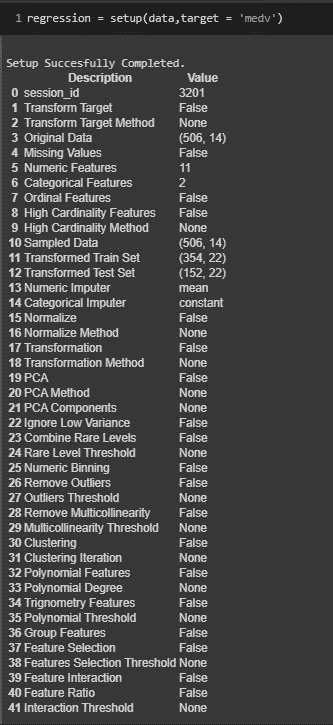

# PyRapidML 完全指南

> 原文：<https://medium.com/analytics-vidhya/a-complete-guide-to-pyrapidml-fd075ac69c54?source=collection_archive---------3----------------------->

# **PyRapidML 简介**

点击下面的链接阅读更多关于 PyRapidML 的内容

使用革命性 Python 库 PyRapidML 的数据科学解决方案:【https://medium.com/@zainbalouch3?p=80ce8be1a7c7 

# PyRapidML 是什么？

*   PyRapidML 是由 **Zain Ali** 于 2021 年 6 月开发的 python 库，由于其清晰的文档和易用性，几个月内就成为顶级机器学习库中的特色。
*   PyRapidML 是一个**开源 Python 库**，它不仅有助于自动化机器学习工作流程，还有助于构建端到端的 ML 算法
*   PyRapidML 是一个**低代码库**，这意味着编写基本的和更少的代码行，人们可以在他们的机器学习模型中实现高精度。没有必要写很多行代码，因为 PyRapidML 会比较所有可能的机器学习算法，只用一行代码就能解决你的问题。
*   它有助于数据科学家快速高效地进行端到端的实验。
*   PyRapidML 是许多 ML 模型和框架的包装器，比如 PyCaret、XGBoost、Scikit-learn 等等。

> ***PyRapidML 提供了什么？***

PyRapidML 具有一系列功能，用于:

*   数据准备
*   探索性数据分析
*   数据挖掘
*   比较多种机器学习模型并给出最佳模型
*   模特培训
*   超参数调谐
*   自然语言处理
*   深度学习(正在建设中)

> 【PyRapidML 入门

使用 PIP 在终端/命令提示符下安装 PyRapidML

```
pip install PyRapidML
```

检查您的 PyRapidML 版本

```
import PyRapidML
PyRapidML.__version__
```

检查 PyRapidML 中的预加载数据

```
from PyRapidML.datasets import extract_data
extract_data('index')
```

# 设置 PyRapidML 环境

在使用 PyRapidML 进行任何实验之前，我们需要设置环境。

*   设置环境的第一步**是导入一个模块。
    取决于需要进行的实验类型。**

```
#For Regression
from PyRapidML.regression import *
#For Classification
from PyRapidML.classification import *
#For Clustering
from PyRapidML.clustering import *
#For Anomaly Detection
from PyRapidML.anomaly import *
#For NLP
from PyRapidML.nlp import *
```

*   **第二步**是初始化设置:
    这是在任何机器学习实验之前必须完成的步骤。

```
reg = initializer(data = DataFrame_name, target = 'target_variable_name')
```

如你所知，PyRapidML 也有助于模型部署，所以所有的实验都保存在一个管道中，这个管道可以很容易地部署到生产中。


> 之后，按下回车键，你将得到如下所示的结果。



初始化步骤涵盖了广泛的预处理任务，如:

**数据类型推断:
-** 帮助确定所有特征的正确数据类型。

**数据清理和准备:
-** 自动对数据中存在的缺失值进行插补。
-默认情况下，数值用平均值估算，分类数据用模式估算。
-分类特征的编码也是自动执行的。

**训练测试拆分:**
-自动将数据拆分为训练和测试进行建模。在分类问题的情况下，它使用分层分裂。
-默认情况下，分割比例为 70%培训和 30%测试。然而，这可以通过使用设置中的参数来改变。**“火车 _ 大小”。
-** 使用 K-Fold 交叉验证对每个 ML 模型和超参数优化进行评估。

**分配会话 id 作为种子:
-** 如果没有传递 ***session_id*** 参数，会话 ID 是默认生成的伪随机数。
- PyRapidML 将此 id 作为种子分配到所有函数中，以隔离随机化的影响。
-这允许日后在相同或不同环境下的再现性。

> *现在，在我们为训练设置好环境之后。我们可以继续我们的人工智能实验。*

# 创建模型

在 PyRapidML 中创建模型是最简单的任务之一。

**"creating_model"** 函数只接受模型 ID 作为字符串，并执行任务。

```
creating_model('model_ID')
```

为了在训练期间使用交叉验证，我们可以在 create_model 函数中再包含一个参数**“fold”**。
默认情况下，折叠设置为 10。

```
creating_model('model_ID',fold = n)
```

> n 是需要折叠的次数。

执行此操作后，我们得到一个包含所有四舍五入到 4 位小数的指标的表格作为输出。
**分类:**准确率、AUC、召回率、精度、F1、Kappa、MCC
**回归:** MAE、MSE、RMSE、R2、RMSLE、MAPE

**→分类:**

```
+------------+---------------------------------+
|     ID     |              Name               |
+------------+---------------------------------+
| ‘lr’       | Logistic Regression             |
| ‘knn’      | K Nearest Neighbour             |
| ‘nb’       | Naives Bayes                    |
| ‘dt’       | Decision Tree Classifier        |
| ‘svm’      | SVM – Linear Kernel             |
| ‘rbfsvm’   | SVM – Radial Kernel             |
| ‘gpc’      | Gaussian Process Classifier     |
| ‘mlp’      | Multi Level Perceptron          |
| ‘ridge’    | Ridge Classifier                |
| ‘rf’       | Random Forest Classifier        |
| ‘qda’      | Quadratic Discriminant Analysis |
| ‘ada’      | Ada Boost Classifier            |
| ‘gbc’      | Gradient Boosting Classifier    |
| ‘lda’      | Linear Discriminant Analysis    |
| ‘et’       | Extra Trees Classifier          |
| ‘xgboost’  | Extreme Gradient Boosting       |
| ‘lightgbm’ | Light Gradient Boosting         |
| ‘catboost’ | CatBoost Classifier             |
+------------+---------------------------------+
```

**→回归:**

```
+------------+-----------------------------------+
|     ID     |               Name                |
+------------+-----------------------------------+
| ‘lr’       | Linear Regression                 |
| ‘lasso’    | Lasso Regression                  |
| ‘ridge’    | Ridge Regression                  |
| ‘en’       | Elastic Net                       |
| ‘lar’      | Least Angle Regression            |
| ‘llar’     | Lasso Least Angle Regression      |
| ‘omp’      | Orthogonal Matching Pursuit       |
| ‘br’       | Bayesian Ridge                    |
| ‘ard’      | Automatic Relevance Determination |
| ‘par’      | Passive Aggressive Regressor      |
| ‘ransac’   | Random Sample Consensus           |
| ‘tr’       | TheilSen Regressor                |
| ‘huber’    | Huber Regressor                   |
| ‘kr’       | Kernel Ridge                      |
| ‘svm’      | Support Vector Machine            |
| ‘knn’      | K Neighbors Regressor             |
| ‘dt’       | Decision Tree                     |
| ‘rf’       | Random Forest                     |
| ‘et’       | Extra Trees Regressor             |
| ‘ada’      | AdaBoost Regressor                |
| ‘gbr’      | Gradient Boosting Regressor       |
| ‘mlp’      | Multi Level Perceptron            |
| ‘xgboost’  | Extreme Gradient Boosting         |
| ‘lightgbm’ | Light Gradient Boosting           |
| ‘catboost’ | CatBoost Regressor                |
+------------+-----------------------------------+
```

**→聚类:**

```
+-------------+----------------------------------+
|     ID      |               Name               |
+-------------+----------------------------------+
| ‘kmeans’    | K-Means Clustering               |
| ‘ap’        | Affinity Propagation             |
| ‘meanshift’ | Mean shift Clustering            |
| ‘sc’        | Spectral Clustering              |
| ‘hclust’    | Agglomerative Clustering         |
| ‘dbscan’    | Density-Based Spatial Clustering |
| ‘optics’    | OPTICS Clustering                |
| ‘birch’     | Birch Clustering                 |
| ‘kmodes’    | K-Modes Clustering               |
+-------------+----------------------------------+
```

**→异常检测:**

```
+-------------+-----------------------------------+
|     ID      |               Name                |
+-------------+-----------------------------------+
| ‘abod’      | Angle-base Outlier Detection      |
| ‘iforest’   | Isolation Forest                  |
| ‘cluster’   | Clustering-Based Local Outlier    |
| ‘cof’       | Connectivity-Based Outlier Factor |
| ‘histogram’ | Histogram-based Outlier Detection |
| ‘knn’       | k-Nearest Neighbors Detector      |
| ‘lof’       | Local Outlier Factor              |
| ‘svm’       | One-class SVM detector            |
| ‘pca’       | Principal Component Analysis      |
| ‘mcd’       | Minimum Covariance Determinant    |
| ‘sod’       | Subspace Outlier Detection        |
| ‘sos        | Stochastic Outlier Selection      |
+-------------+-----------------------------------+
```

**→ NLP:**

```
+-------+-----------------------------------+
|  ID   |               Model               |
+-------+-----------------------------------+
| ‘lda’ | Latent Dirichlet Allocation       |
| ‘lsi’ | Latent Semantic Indexing          |
| ‘hdp’ | Hierarchical Dirichlet Process    |
| ‘rp’  | Random Projections                |
| ‘nmf’ | Non-Negative Matrix Factorization |
+-------+-----------------------------------+
```

# 比较模型

该函数根据问题陈述比较 PyRapidML 中的每个模型。
使用默认超参数完成每个模型的训练，并使用交叉验证评估性能指标。

```
comparing_models()
```

该函数的输出是一个表格，显示了所有模型在褶皱中的平均得分。可以使用**比较 _ 模型**功能中的 ***折叠*** 参数定义折叠次数。默认情况下， ***折叠*** 设置为 **10** 。表格按选择的度量标准排序(从最高到最低),并可使用 ***排序*** 参数*进行定义。*默认情况下，分类实验按照**精度**排序，回归实验按照 **R2** 排序。某些模型由于运行时间较长而无法进行比较。要绕过这一预防措施，可将 ***涡轮*** 参数设置为**假**。

要选择模型的前 n 个数字，请在 compare_models 函数中包含 n_select 超参数。

```
comparing_models(n_select = n)
```

我们甚至可以使用指标对其进行排序。

```
comparing_models(n_select = n, sort ‘ AUC’)
```

# 调整模型

它只提供了一个行函数来对 PyRapidML 库中的任何模型执行超参数调优。

它使用随机网格搜索来调整作为估计器传递的模型的超参数，该随机网格搜索具有完全可定制的预定义网格。

*   首先，创建一个模型

```
dt = creating_model('dt') #dt stands for the Decision Tree
```

*   调整模型

```
tuned = tuning_model(dt, n_iter = 50)
```

# 绘制模型

它有助于在一行代码中用不同的图形检查模型的性能。

```
model = creating_model('Model_name')plot_model(model)
```

**→分类:**

```
+-----------------------------+--------------------+
|            Name             |        Plot        |
+-----------------------------+--------------------+
| Area Under the Curve        | ‘auc’              |
| Discrimination Threshold    | ‘threshold’        |
| Precision Recall Curve      | ‘pr’               |
| Confusion Matrix            | ‘confusion_matrix’ |
| Class Prediction Error      | ‘error’            |
| Classification Report       | ‘class_report’     |
| Decision Boundary           | ‘boundary’         |
| Recursive Feature Selection | ‘rfe’              |
| Learning Curve              | ‘learning’         |
| Manifold Learning           | ‘manifold’         |
| Calibration Curve           | ‘calibration’      |
| Validation Curve            | ‘vc’               |
| Dimension Learning          | ‘dimension’        |
| Feature Importance          | ‘feature’          |
| Model Hyperparameter        | ‘parameter’        |
+-----------------------------+--------------------+
```

**→回归:**

```
+-----------------------------+-------------+
|            Name             |    Plot     |
+-----------------------------+-------------+
| Residuals Plot              | ‘residuals’ |
| Prediction Error Plot       | ‘error’     |
| Cooks Distance Plot         | ‘cooks’     |
| Recursive Feature Selection | ‘rfe’       |
| Learning Curve              | ‘learning’  |
| Validation Curve            | ‘vc’        |
| Manifold Learning           | ‘manifold’  |
| Feature Importance          | ‘feature’   |
| Model Hyperparameter        | ‘parameter’ |
+-----------------------------+-------------+
```

**→聚类:**

```
+-----------------------+----------------+
| Cluster PCA Plot (2d) |   ‘cluster’    |
+-----------------------+----------------+
| Cluster TSnE (3d)     | ‘tsne’         |
| Elbow Plot            | ‘elbow’        |
| Silhouette Plot       | ‘silhouette’   |
| Distance Plot         | ‘distance’     |
| Distribution Plot     | ‘distribution’ |
+-----------------------+----------------+
```

**→异常检测:**

```
+---------------------------+--------+
| t-SNE (3d) Dimension Plot | ‘tsne’ |
+---------------------------+--------+
| UMAP Dimensionality Plot  | ‘umap’ |
+---------------------------+--------+
```

**→自然语言处理:**

```
+---------------------------+----------------------+
|           Name            |         Plot         |
+---------------------------+----------------------+
| Word Token Frequency      | ‘frequency’          |
| Word Distribution Plot    | ‘distribution’       |
| Bigram Frequency Plot     | ‘bigram’             |
| Trigram Frequency Plot    | ‘trigram’            |
| Sentiment Polarity Plot   | ‘sentiment’          |
| Part of Speech Frequency  | ‘pos’                |
| t-SNE (3d) Dimension Plot | ‘tsne’               |
| Topic Model (pyLDAvis)    | ‘topic_model’        |
| Topic Infer Distribution  | ‘topic_distribution’ |
| Word cloud                | ‘wordcloud’          |
| UMAP Dimensionality Plot  | ‘umap                |
+---------------------------+----------------------+
```

# 解释模型

建立模型后，最重要的任务之一是解释结果。

模型可解释性通过分析模型真正认为重要的东西来帮助调试模型。

```
model = creating_model('Model_name')
interpret_model(model)
```

# 最终确定模型

这是在 PyRapidML 中建立模型的最后一步。

此函数接受一个已训练的模型对象，并返回一个已在整个数据集上训练的模型。

```
model = creating_model('Model_name')
finalize_model(model)
```

# PyRapidML 文档

> ***文档和 Github 链接***

PyRapidML 的文档可在以下位置找到:

*   文件:【https://pyrapidml.readthedocs.io/en/latest/】T42
*   Github 链接:[https://github.com/Zainali5/PyRapidML](https://github.com/Zainali5/PyRapidML)
*   Pypi 链接:[https://pypi.org/project/PyRapidML/1.0.13/](https://pypi.org/project/PyRapidML/1.0.13/)

# PyRapidML 的更多链接:

使用革命性 Python 库 PyRapidML 的数据科学解决方案:[https://medium.com/@zainbalouch3?p=80ce8be1a7c7](/@zainbalouch3?p=80ce8be1a7c7)