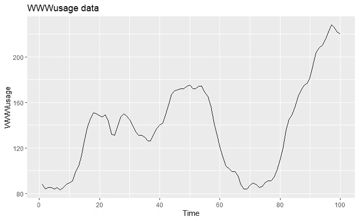

# 时间序列分析完全介绍(附 R):ARIMA 模型

> 原文：<https://medium.com/analytics-vidhya/a-complete-introduction-to-time-series-analysis-with-r-arima-and-sarima-models-1da14b382f1?source=collection_archive---------11----------------------->

在最后一节中，我们通过使用 AIC、AICc、BIC 讨论了 ARMA(p，q)模型的模型选择，这些是基于似然和参数的度量函数，提供了可用于在相同数据上相互比较模型的某种度量。在这篇文章中，我们现在将重新讨论我们以前…