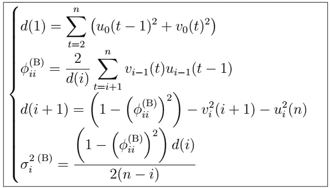

# 时间序列分析导论(R):ARMA(p，q)系数的估计(上)

> 原文：<https://medium.com/analytics-vidhya/a-complete-introduction-to-time-series-analysis-with-r-estimation-of-arma-p-q-coefficients-5f8261fd9e27?source=collection_archive---------15----------------------->

伯格算法估计公式

在上一篇文章中，我们讨论了新息算法对更一般的 ARMA(p，q)过程的扩展，这使我们能够对未来任意数量的时间步长进行预测。但是，我们仍然没有看到如何估计实际的 ARMA(p，q)模型系数。在本文中，我们…