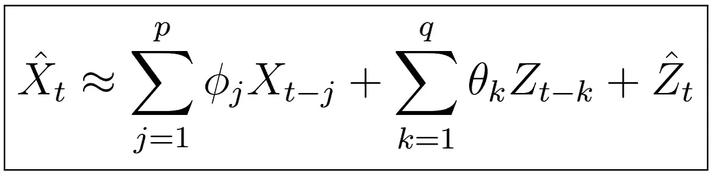

# 时间序列分析完全介绍(附 R):ARMA(p，q)系数的估计(第二部分)

> 原文：<https://medium.com/analytics-vidhya/a-complete-introduction-to-time-series-analysis-with-r-estimation-of-arma-p-q-coefficients-728176749315?source=collection_archive---------21----------------------->

ARMA(p，q)模型意味着 X_{t}可以用上面的形式表示。

在上一篇文章中，我们学习了两种估计 AR(p)过程系数的算法:Yale-Walker 方程方法和 Burg 算法。在本文中，我们将看到一种非常简单的方法来确定 MA(q)过程系数，以及联合估计 ARMA(p，q)的第一种方法。让我们…