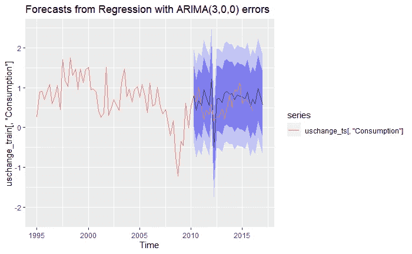

# 时间序列分析完全介绍(附 R):外生模型

> 原文：<https://medium.com/analytics-vidhya/a-complete-introduction-to-time-series-analysis-with-r-exogenous-models-4f009b770104?source=collection_archive---------2----------------------->

我们已经深入分析了单变量时间序列。到目前为止，我们已经考虑了某种基于时间的随机过程 *X_{t}，*依赖于当前和先前的噪声及其本身。然而，当我们想要将我们的**内生**过程建模为也依赖于外部因素，或者**外生**变量时，会发生什么呢？首先…