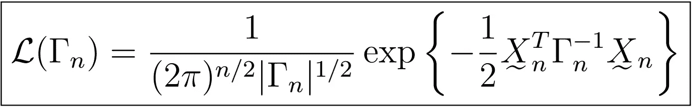

# 时间序列分析完全介绍(附 R)::高斯时间序列

> 原文：<https://medium.com/analytics-vidhya/a-complete-introduction-to-time-series-analysis-with-r-gaussian-time-series-cf5e32c5f4e5?source=collection_archive---------15----------------------->

高斯时间序列的似然性

在前两篇文章中，我们看到了许多独立估计 AR(p)和 MA(q)系数的方法，即 Yule-Walker 方法、Burg 算法和新息算法，以及 Hannan-Risennan 算法，它们通过使用初始化的 AR(p)和 MA(q)系数和先前的估计值来联合估计 ARMA(p，q)系数。