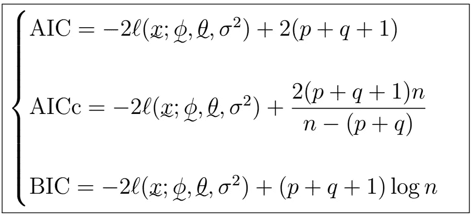

# 时间序列分析完全介绍(附 R):ARMA(p，q)的模型选择

> 原文：<https://medium.com/analytics-vidhya/a-complete-introduction-to-time-series-analysis-with-r-model-selection-for-arma-p-q-ebc338e6d159?source=collection_archive---------6----------------------->

AIC、AICc 和 BIC 指标

在上一节中，我们学习了高斯时间序列，这是一个强大而灵活的 ARMA(p，q)参数估计假设。在本文中，我们将了解如何从众多拟合模型中选择“最佳”模型。

## 最大似然模型选择