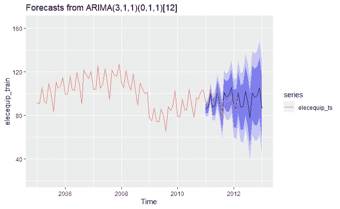

# 时间序列分析完全介绍(附 R):: SARIMA 模型

> 原文：<https://medium.com/analytics-vidhya/a-complete-introduction-to-time-series-analysis-with-r-sarima-models-ff86d526d1d7?source=collection_archive---------2----------------------->

在上一篇文章中，我们看到了 ARMA 模型的一个重要的有用的扩展:自回归综合移动平均或 ARIMA 模型，它将差异因素形式化并集成到模型中。这一次，我们将看到另一个非常有用的扩展:SARIMA 模型的季节性组件。但是在我们进入主题之前，让我们回忆一下…