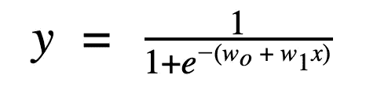

# 逻辑回归综合指南

> 原文：<https://medium.com/analytics-vidhya/a-comprehensive-guide-to-logistic-regression-e0cf04fe738c?source=collection_archive---------4----------------------->

***【逻辑回归】*** *是一种非常流行的人工智能方法，用于分类任务。它在现实生活的机器学习生产环境中被广泛采用。我们将在接下来的几分钟内深入探讨这个问题！*

图片来源:开发者到

## 通俗地说就是逻辑回归

逻辑回归是一种机器学习算法，用于预测观察值属于两个可能类别之一的概率。

***在实践中是什么意思？***

*我们可以使用逻辑回归算法来预测以下内容:*

1.  构建一个电子邮件分类器，告诉我们一封传入的电子邮件是应该标记为 ***【垃圾邮件】*** *还是* ***【非垃圾邮件】。***
2.  检查放射图像以预测肿瘤是良性的还是恶性的。
3.  通过历史银行记录来预测客户是否会拖欠贷款或偿还贷款。

***logistic 回归如何进行预测？***

然后，逻辑回归可以用于模型以前从未见过的新输入数据(在训练期间)。

***我们来看一个具体的例子:***

想象一下，你的任务是预测你的银行 ***的客户是否会拖欠贷款。*** 首先要做的是构建一个历史客户端默认值的数据集。

> 该数据将包含客户人口统计信息(例如，年龄、性别、位置等)。)、他们的财务信息(贷款规模、付款逾期时间等。)，以及他们最终是拖欠贷款还是偿还贷款。

****【否】*** 类别可以重新编码为 ***1*** 和 ***0*** 用于目标变量*(计算机更好地处理数字而不是文字):**

**

*此后，我们将训练一个 ***逻辑回归模型*** ，它将学习*输入变量(年龄、性别、贷款规模)*和预期输出之间的映射，以预测三个新客户的违约概率:*

**

*那么，新专栏*预测违约*告诉我们什么？*

*它说明了每个新客户属于类别 1(拖欠贷款)的概率。我们可以想出一个 ***阈值*** (比如说 ***0.5*** )，任何高于该决策阈值的值都可以是 1，其余的值为 0。*

# *逻辑回归的应用*

## *业务用例*

*   **确认销售线索**
*   **推荐产品**
*   **预测罕见的客户行为**

## *生产部署的优势*

*从工程角度来看，逻辑回归的好处使其比其他更先进的机器学习算法更有利。*

*   **易用性**
*   **可解释性**
*   **可扩展性**
*   **实时预测**

# *逻辑回归:实施*

*逻辑回归是一种有监督的机器学习分类算法。*

> *关于这方面的更多信息，请查看— [**机器学习入门指南**](/analytics-vidhya/a-beginners-guide-for-getting-started-with-machine-learning-7ba2cd5796ae)*

## *模型表示*

**一旦训练完毕，模型采用逻辑回归方程的形式:**

**

****在这个等式中:****

*   *y 是属于默认类别的 ***预测概率*** 。*

> *在二进制分类中，我们用 1 标记默认类，用 0 标记另一个类。y 表示一个实例属于默认类别的概率，范围从 0 到 1。*

*   ***【1/(1+e^-z】**是 ***的乙状结肠功能。****
*   ***wo + w1x** 是 logistic 回归中的线性模型。*

## *线性模型*

*线性模型表示 ***输入特征*** 和 ***预测输出*** 之间的*线性关系。整个模型的线性部分可以用以下等式来概括:**

**

**这里每个组件是什么意思？**

*   ***x** 是*输入变量*。在统计学中，x 被称为*自变量*，而机器学习称之为*特征*。*
*   ****w0*** 是*偏置项*。*
*   ****w1*** 是*输入变量 x* 的*权重*。*
*   *在机器学习中，我们一般称 ***wi*** *权重/参数*。*

> *那么，为什么我们不像线性回归那样，使用线性模型来预测类成员呢？*

1.  **线性回归预测 0-1 范围之外的概率**
2.  *对于一定数量的逾期付款(本例中为两笔)，我们不清楚是否应该将其归类为非违约行为或违约行为。*

> *更好的方法是使用 **sigmoid 函数来模拟违约概率。***

## *Sigmoid 函数*

*sigmoid 函数是产生 ***s 形曲线*** 的函数。它将任何实数值作为参数，并将其映射到 0 和 1 之间的范围。*

**对于上面的问题，sigmoid 曲线应该是这样的:**

**

*它用于映射逻辑回归中的线性模型，以将*线性预测映射到结果概率(介于 0 和 1 之间)*，这对于 ***类成员来说更容易解释。****

> *我们如何将类成员概率映射到预测的类？我们需要一个**决策边界**来消除不同概率之间的歧义。*

## *判别边界*

*一个 ***决策边界*** 是一个阈值，我们用它来将逻辑回归的概率分类成离散类。*

**决策边界可以采取以下形式:**

****y = 0*** *如果* ***预测概率< 0.5****

****y = 1*** *如果* ***预测概率> 0.5****

## *逻辑回归的类型*

1.  ****二元逻辑回归:*** 目标变量取两个可能的分类值之一。*
2.  ****多项逻辑回归:*** 目标变量取三个或三个以上可能的分类值之一。*
3.  ****有序逻辑回归:*** 这类似于多元逻辑回归，只是目标分类变量是有序的。*

> *不管逻辑回归的类型如何，在所有情况下，训练逻辑回归模型都遵循类似的过程。*

## *培养*

*训练逻辑回归模型的目的是为逻辑回归中的线性模型 计算出 ***的最佳权重。****

> *在机器学习中，我们通过优化成本函数来计算最佳权重。*

## *价值函数*

****成本函数 J(θ)***是算法试图实现的目标的正式表示。*

*在逻辑回归的情况下，成本函数称为对数损失(或交叉熵),目标是最小化以下成本函数方程:*

**

**你只需要明白背后的原理:**

*   *成本函数检查实际类成员和预测类成员之间的平均误差。*

> *这是由我们的线性模型中权重的特定选择造成的。*

*   *成本函数不仅惩罚大的错误，而且惩罚过于自信的错误(过于接近 0 或 1)。*

> *这保证了我们的预测保持在 0-1 范围内，不包括 0-1。*

*那么，我们如何为我们的成本函数*(又名，具有良好预测的模型)*实现一个低值呢？我们用 ***渐变下降。****

## *梯度下降*

*梯度下降是一种根据每个数据点的损失函数改变权重的方法。我们在*每个输入-输出数据点计算 ***LogLoss*** 成本函数。**

*   *我们对权重和偏差进行偏导数，以获得每个点的成本函数的斜率。*
*   *基于斜率，梯度下降更新偏差和权重集的值，然后在新值上重复训练循环。*
*   *重复这种迭代方法，直到达到最小误差，并且梯度下降不能进一步最小化成本函数。*
*   *我们可以通过调整学习率来改变我们达到最优最小值的速度。*

> *高学习率会更剧烈地改变权重，而低学习率会更缓慢地改变权重。*
> 
> *学习率的大小是有权衡的。太低，您可能会永远等待您的模型收敛到最佳的权重集；太高，您可能会错过最佳的权重集，因为模型不会收敛。*

# *模型评估*

**在我们对模型进行训练之后，有两个主要的指标可以用来评估我们的模型运行得有多好:**

*   ****准确率:*** 代表正确分类样本的百分比。*

> *90%的准确度分数将告诉我们，我们的逻辑回归模型正确地分类了所有示例的 90%。*

*   ****ROC AUC:****受试者操作特征曲线(ROC AUC)* 下的面积描述了*真阳性率(TRP)*——即我们正确预测属于正确类别的样本比率——与*假阳性率(FPR)*——即我们错误预测其类别成员的样本比率——之间的关系。*

> *ROC AUC 优于准确性，特别是在多类别预测设置中或当我们有类别不平衡问题时。*

## *改进我们的模型*

*有多种方法可以改进你的逻辑回归模型。*

*有一些技术(在预处理中)用于线性回归中的模型改进，如— [***关于线性回归你需要知道的一切***](/analytics-vidhya/everything-you-need-to-know-about-linear-regression-750a69a0ea50) 中所述*

****Logistic 回归有额外的假设和清洗需求:****

1.  ****二进制输出变量:*** 将你的输出变量转换成 0 或 1。*
2.  ****无法收敛:*** 逻辑回归背后的*最大似然估计*模型(即“数学”)假设没有一个单一变量会完美地预测类成员。如果您有一个可以完美预测目标类的特征，算法将尝试为其分配无限的权重(因为它非常重要)，从而无法收敛到一个解决方案。*

> *如果您有一个完美的预测器，只需将其从特征集中移除…或者干脆不要对您的数据建模。*

## *特征缩放*

*特征可以有不同的数量级。随着梯度下降，不同比例的要素转换较慢(或根本不转换)。*

*[***正常化、标准化***](https://www.kdnuggets.com/2020/04/data-transformation-standardization-normalization.html) 您的特征加快和改善模型训练。*

## *正规化*

> *关于正则化的更多信息— [**关于线性回归你需要知道的一切**](/analytics-vidhya/everything-you-need-to-know-about-linear-regression-750a69a0ea50)*

****从零开始实现逻辑回归，参见—****

* [## tanvipenumudy/Winter-实习-实习

### 此时您不能执行该操作。您已使用另一个标签页或窗口登录。您已在另一个选项卡中注销，或者…

github.com](https://github.com/tanvipenumudy/Winter-Internship-Internity/tree/main/Day%2010%20-%20Logistic%20Regression) 

> 希望你喜欢并充分利用这篇文章！
> 
> 如果你觉得这篇文章有帮助/有启发性，请确保**鼓掌**和**跟随***