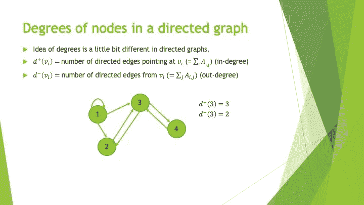
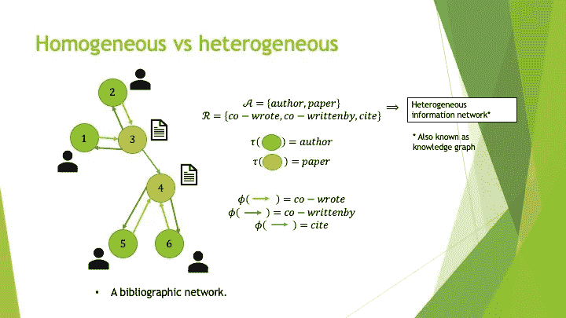

# GNNs 综合介绍—第 1 部分

> 原文：<https://medium.com/analytics-vidhya/a-comprehensive-introduction-to-gnns-part-1-c07396fa3b91?source=collection_archive---------4----------------------->

# 我为什么要看这个？

当你阅读这篇文章时，你可能会想知道什么是图形神经网络(gnn)，它们是如何工作的，或者这些深度学习模型在什么背景下自然适合。如果不是这样，我不知道你怎么会在这里，但你仍然被邀请阅读整个事情！这一系列出版物的目的是以图文并茂的方式全面介绍 GNNs。

# 我需要事先知道什么？

这个介绍将从一个简单图形的定义开始，并通过 GNNs 的功能慢慢地进行。然而，我希望你能理解矩阵乘法，掌握 GNNs 架构背后的数学本质，并对前馈神经网络(FNNs)有一个基本的了解，因为我将使用它们进行一些比较。不要对你最终会遇到的一些数字中的数学符号感到不知所措，我会确保用全面的语言总结它们背后的思想。

# 整个介绍的内容

该系列出版物旨在涵盖以下主题:

*   [图形](/p/c07396fa3b91#0bb7)
*   [有向图](/p/c07396fa3b91#1529)
*   [信息网络](/p/c07396fa3b91#13de)
*   GNNs 背后的动机
*   节点嵌入
*   香草 GNN
*   图形卷积网络
*   图形注意网络
*   异构图上的学习

不过这一部分只对前 **3** 题目进行阐述。

# 图表

因为 GNN 的 G 代表图表 T8，所以这个主题可能值得你花一点时间阅读。更不用说，这将给我一个机会来介绍一些将在整个介绍中使用的符号。我会不时提醒你，不要担心！

如下图所示，就其最简单的数学形式而言，一个图(准确地说是简单无向图)就是两个集合的一对。第一组包含称为**顶点(或节点)**的元素。第二个包含**边**，其中是**顶点**的无序对。

图的定义。

但是，老实说，很少看到图形以这种形式在它们的自然栖息地徘徊。有更常见和方便的方法来表示它们。例如，当一个图只有很少的顶点和边时，一个小小的绘图就能达到目的！

图表插图。

另一种对计算机更友好的表示图的方式是使用它的**邻接矩阵** **(A)** 。要建立一个有 n 个顶点的图的邻接矩阵，你必须做的是:

*   用从 1 到 **n** 的不同数字来标识每个顶点。
*   创建一个用零填充的 **n** x **n** 矩阵。
*   如果第 *i* 个顶点和第 *j* 个顶点之间存在边，则将第 *i* 行和第 *j* 列的 0 替换为 1。这里， *i* 和 *j* 是在第一步分配给顶点的任意数。

图的邻接矩阵。

关于邻接矩阵的一个有趣的事实是，如果你将它乘以自身的 **k** 倍，你将在结果矩阵的第 *i* 行和第 *j* 列找到的数字是从第 *i* 顶点到第 *j* 顶点的不同路径的数量，正好是第 **k** 步。

邻接矩阵的幂。

最后，如果你过去已经遇到过图的主题，你可能听说过或读到过图中节点的度。一个节点的**度**简单来说就是指连接到它的边的数量。在一些图形应用中，例如图形卷积网络(GCNs)，将节点的度数存储在一个称为**度数矩阵(D)** 的矩阵中是有用的。如下图所示，它只是一个矩阵，其中唯一的非零项位于对角线上。

图中节点的度数。

# 有向图

你已经见过这个图了，现在让我向你介绍它最接近但有时“尖锐”的亲戚，即**有向图**(或者更准确地说是简单有向图)。两者都长得很像，但却独立存在。如下图所示，有向图也是由一对两个集合组成的。尽管如此，在这种情况下，第二组由**有向边**组成，它们是**有序的**顶点对。因此，一对中的第一顶点和第二顶点可以分别解释为具有连接两个顶点的箭头的起点和终点。

有向图的定义。

正如您可能已经预料到的，前面讨论的图的表示方法对于有向图仍然有效。只是画边的方式有点不同。

有向图的表示。

关于节点度的概念，在有向图的情况下有一个小的调整，因为边的方向现在很重要。与其说一个节点的度，不如说它的**入度**(指向自身的箭头数)和**出度**(离开自身的箭头数)。

有向图中节点的度数。

注意，关于邻接矩阵和 k 跳邻居的幂的结果仍然适用于有向图！

# 信息网络

现在我们对有向图有了更多的了解，让我们在它们的基础上更进一步，使它们不仅漂亮，而且有用！各种类型的数据自然可以通过图表来表达。

以图表形式表示的数据。

使用图表表达真实世界数据的正确方式是使用**信息网络**。信息网络是简单的图形，具有分别描述顶点类型(**对象**)和边类型(**链接**)的**对象映射函数**和**链接映射函数**。换句话说，当一个图的每个顶点和每条边都与特定的意义相关联时，它就是一个信息网络。在下面的图中，对于每个信息网络，对象的可能类型的集合用**草书“A”**表示，而边缘的可能类型的集合用**草书“R”**表示。

信息网络的定义。

当一个信息网络有多种类型的顶点或多种类型的边时，它被称为**异构信息网络**。否则称为**同构信息网络。**两种类型的网络如下图所示。

同质信息网络的例子。

异构信息网络的例子。

以多层方式表达的异构图。

在信息网络中使用不同类型的链接，可以在对象之间建立更复杂的关系。这些更复杂的关系被标识为**元路径**。一个**元路径**简单地由一系列节点和边的类型定义。如果序列由不需要区分的 **n** 种类型的边组成，则元路径的长度为 **n** 。

元路径的定义。

由于元路径的概念一开始可能很难理解，我将向您展示几个例子！如果我们回头看前面显示的书目网络，我们可以看到作者并没有直接连接在一起。然而，我们仍然可以使用元路径开发它们之间的关系。例如，使用**绿色**和**红色**有向边，我们可以使用以下节点和边类型序列连接两个作者:

*   作者->论文->作者(长度为 2 的元路径)

当描述的元路径很明显时，通常只使用序列中节点类型的首字母来标识它(例如 APA)。

书目网络的元路径示例。

这是另一个更复杂的元路径的例子。

更复杂的元路径示例。

# 我们要带着这些去哪里？

“我想了解 GNNs，而你给我看的只是一些彩色数字和关于图形的随机材料，我们要去哪里？”你可能在想。相信我，我们不是在浪费时间。我们可以看到地平线上的巨人，我一定会把他们带给你。我只是觉得在适当地介绍图形之前就开始谈论图形卷积是一种犯罪。

然而，在下一张图中，我会给你一些提示，告诉你下一期出版物会有什么内容，以及它是如何与你今天读到的内容联系起来的！回头见！

# 在你走之前

感谢您的阅读！随时访问我的 [**LinkedIn**](https://www.linkedin.com/in/nicolas-raymond-002950b6/) 页面。

# 参考

组学数据整合与分析的异质多层网络模型。*遗传学前沿*，第 10 卷，2020 年 1 月，doi:10.3389/fgene.2019.01381

史，川，等。异构信息网络分析综述。 *ArXiv:1511.04854【物理】【2015 年 11 月[http://arxiv.org/abs/1511.04854.](http://arxiv.org/abs/1511.04854.)*