# GNNs 综合介绍—第 2 部分

> 原文：<https://medium.com/analytics-vidhya/a-comprehensive-introduction-to-gnns-part-2-8d8941a39b44?source=collection_archive---------1----------------------->

为什么是 GNNs？

# 在你开始阅读之前

如标题所示，这是旨在向您介绍 GNNs 的系列出版物的第二部分。因此，我强烈推荐你看一下[的第一部分](https://nicolasraymond.medium.com/a-comprehensive-introduction-to-gnns-part-1-c07396fa3b91)，其中我讨论了关于**图**、**有向图**和**信息网络**。

# 我们在哪里？

该系列出版物旨在涵盖以下主题:

*   图表
*   有向图
*   信息网络
*   【GNNs 背后的动机
*   节点嵌入
*   香草 GNN
*   图形卷积网络
*   图形注意网络
*   异构图上的学习

这部分将完全集中于第四个主题，GNNs 背后的**动机。**

# GNNs 背后的动机

为什么是 GNNs？我认为没有比用动机案例来介绍他们的目的更好的方法了！一旦动机案例成立，我将向你介绍解决问题的不同方法，并分析它们的优缺点。剧透警报！第一种方法可能有 GNNs 解决的缺点。

下面列出了将要讨论的方法:

*   [基于特征的方法](/p/8d8941a39b44#86a0)
*   [基于图形的方法](/p/8d8941a39b44#6c4e)
*   [表象学习方法](/p/8d8941a39b44#6df9)
*   [GNNs](/p/8d8941a39b44#d8d2)

# 动机案例

你在这里，做一些关于社交网络的分析。这个网络非常简单，因为它只由通过友谊链接互相联系的用户组成。换句话说，它是一个**同质信息网络**，其中可能的对象类型(**草书 A** )的集合中的唯一元素是“**用户”**，可能的链接类型(**草书 R** ) 的集合中的唯一元素是“**友谊”**。除此之外，您知道每个用户有两个数字事实描述他们(一个**向量**和两个数字**特征**)。

你的一个讨厌的同事正在同一个社交网络上做分析，当你喝咖啡的时候，他过来打断你，说:“我刚刚给所有用户发了一份调查，问他们是否喜欢狗。除了第四个，大家都回答了。你知道我们如何预测他的答案吗？”。出于对狗的热爱和对研究的热情，你决定开始新的探索，回答你同事的问题。

知道图的结构、用户的特征以及用户 **1** 和 **5** 不喜欢狗( **t1 = t5 = 0** )而用户 **3** 和 **2** 喜欢狗( **t3 = t2 = 1** )的事实，有什么可能的方法来解决这个问题？

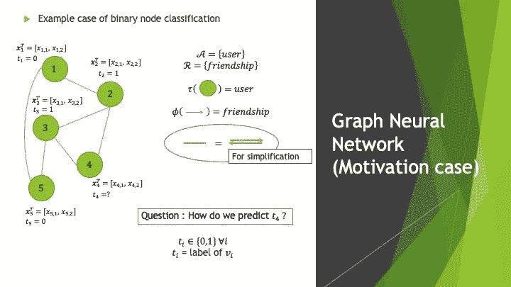

动机案例。

## 基于特征的方法

这种情况的一个选择是考虑我称之为“基于**特征的** **方法**”。对于基于特征的方法，我的意思是只考虑与图中对象相关的特征，从而抽象出它们之间的联系的解决方案。

仅列举其中一些，您可以考虑以下方法:

*   K-最近邻算法( **KNN** )
*   训练前馈神经网络( **FNN** )

在动机的情况下，使用 KNN 算法，你可以简单地找到与用户 **4** 最近的 k 个用户，这是根据你使用他们的数字特征和你喜欢的度量(例如欧几里德距离、马氏距离、余弦相似性等)计算出的他们之间的距离。).然后，你可以让这些回答调查的 k 个最近的用户投票决定这个用户是否喜欢狗。在 0 和 1 的计数中的大多数将会赢！

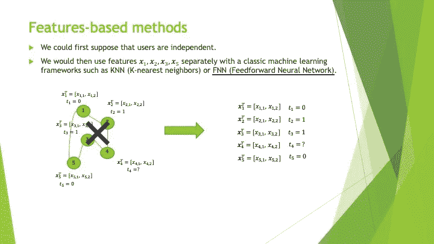

基于特征的方法的思想。

现在，如果你熟悉神经网络的主题，你可能会想为什么我建议训练一个 FNN 作为我们问题的潜在解决方案，因为考虑到缺乏训练数据，这样的模型(例如多层感知器)在我们的玩具问题中不是一个真正方便的选择。

因为这个解决方案在有更多用户的环境中是可行的，我想花一点时间从一个你可能从未见过的角度向你展示 FNN 的想法。后面和 GNNs 做更深层次的比较也会有帮助。

我喜欢把 FNN 分成两部分。第一部分是一个函数( **f** )，它将原始特征( **x** )作为输入，并通过一系列线性和非线性变换层对其进行处理。第二部分是另一个函数( **g** )，它采用处理后的特征( **f** ( **x** ))，并使用它们来预测与原始输入特征相关联的**标签**。这里，**标签**指的是与输入相关联的**目标**。

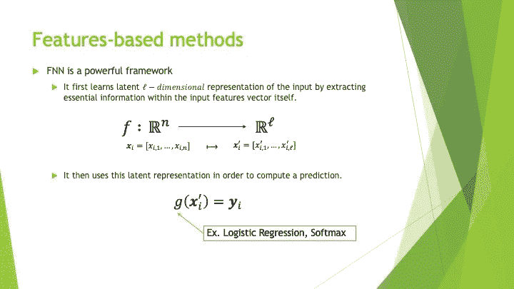

组成 FNN 的函数的定义。

最后，两个部分一起训练和工作，以便做出最好的预测。函数 **f** 将努力对输入的**丰富版本进行编码，而函数 **g** 将尽最大努力使用它们来做出最准确的预测。**

例如，在当前上下文中， **f** 将学习如何获取每个用户的两个特征向量(2D 向量),并将其转换为对描述用户可能更有意义的另一个向量(不一定具有相同的长度)。从这个新的表示中， **g** 将学习如何预测 0 和 1 之间的值，该值表示用户喜欢狗的概率。

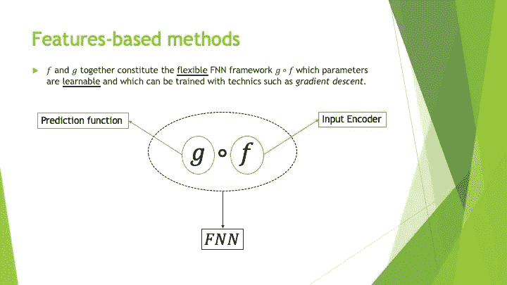

将 FNN 可视化为函数的组合。

如果你对数学领域不感兴趣，你可以看看下图，我在一个只有一个隐层的简单神经网络中指出了编码函数 **f** 和预测函数 **g** 。

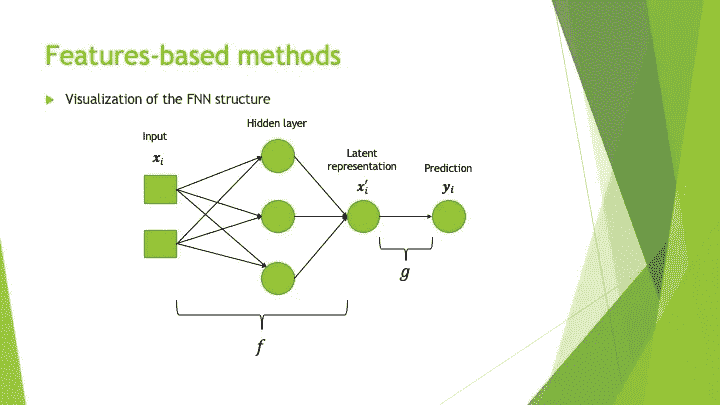

简单 FNN 结构的可视化。

作为本节的总结，让我们来看看当我们将基于特征的方法应用于数据采用信息网络形式的问题时，其中每个对象/节点都具有特征的主要优点和缺点。

优势:

*   它们在网上有很好的记录。您可以很容易地找到代码片段来帮助您完成您想要的任务。
*   当需要推断与新输入相关联的标签时，它们是有效的。如果我们有狗的特征，我们可以很快预测第 6 个用户是否喜欢狗。

缺点:

*   它们不考虑图中对象之间的现有关系。

## 基于图形的方法

我们动机案例的第二个选项是采用**“基于图表的方法”**。这意味着，我们可以假设连接的用户更可能有相同的标签，并且只关心我们网络背后的图形结构。

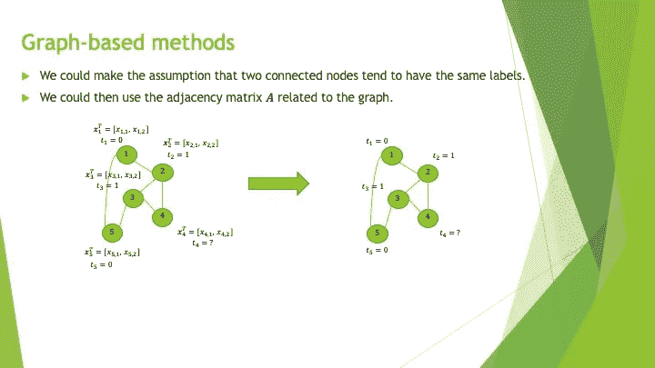

基于图的方法的思想。

在这一节中，我们将完全专注于一种叫做**标签传播**的技术。这种技术背后的思想是简单地通过传播周围带标签邻居的标签来推断图中缺失的标签。在当前的动机案例中，我们有很多方法可以做到这一点。然而，由于标签传播不是这篇文章的主题，我将只关注一个食谱。

假设社交网络中每个用户关联的标签代表了其喜欢狗的概率。这是有意义的，因为我们用 0 来标识不喜欢狗的人，否则用 1。我们的第一步可以是为所有没有回答调查的用户设置相同的**临时标签** ( **delta** )。例如，在这里，我们会说，没有回答调查的每个人都有同样多的机会不喜欢或喜欢狗，并给他们 0.5 分。尽管如此，如果您有先验知识，认为不同的数字更准确，您可以在 0 和 1 之间设置另一个值。

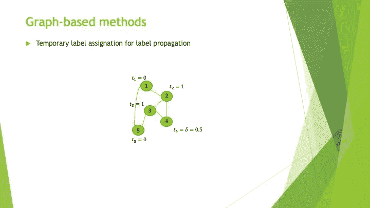

临时标签分配。

然后，从这个图我们可以计算出**转移矩阵** ( **M** )。

如下图所示，有向图的**转移矩阵**是**出度矩阵**和**邻接矩阵**的逆的乘积。换句话说，转移矩阵就像邻接矩阵，我们将每一行标准化，使它们的元素总和为 1。

为了更好地理解其含义，您可以将转移矩阵的第 I 行和第 j 列的每个元素解释为在节点 I 的邻居中随机选取节点 j 的概率。

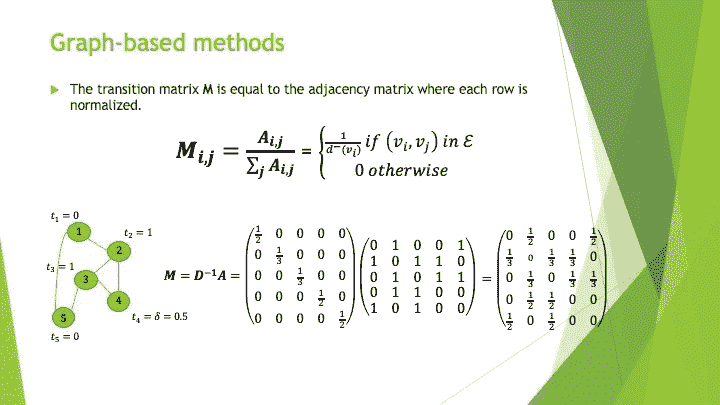

转移矩阵的定义和可视化。

现在，有了所有这些要素，我们可以继续下面的迭代标签传播过程。该算法的思想是通过对**他们自己的原始标签**和**他们邻居标签**的当前平均进行加权平均来连续更新用户的标签。当来自两次连续迭代的标签之间的绝对差低于某个阈值时，可以预先定义迭代的次数，或者可以停止该过程。对于加权平均，也可以使用不同的**α**值来增加或减少原始标签的重要性。

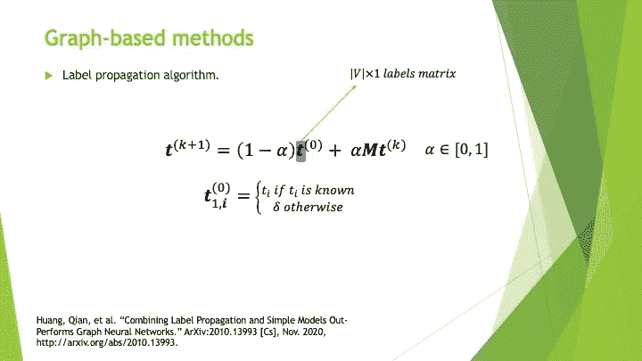

标签传播算法的一个例子。

一旦算法完成，您将能够在生成的列矩阵中找到您正在寻找的丢失的标签。

这里你可以看到两次迭代后得到的结果。在这种情况下，我们期望第 4 个用户喜欢狗，因为 29/50 > 0.5。

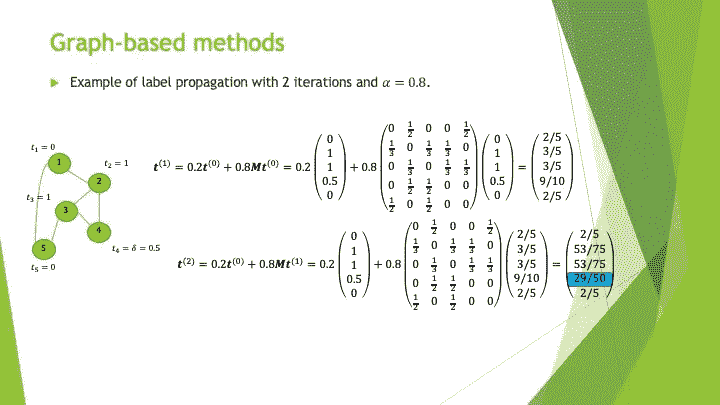

标签传播执行。

为了总结这一节，让我来指出基于图的方法的主要优点和缺点。

优势:

*   他们考虑图的结构属性。

缺点:

*   他们不考虑与图形中的对象相关的特征。
*   如果以后有新的不可见节点加入图中，标签传播模型将不再可用。我们将不得不再次运行整个事情。

## 表征学习方法

解决动机案例问题和回答你同事问题的第三种方法是使用**表征学习方法**。

这种方法背后的思想是，对于每个节点，学习一个低维矢量表示(一个嵌入的 **z** )，它同时捕获图形的结构属性和来自特征的信息。换句话说，这些方法旨在找到一种用一系列数字(嵌入的 **z** )来表示每个用户的方式，这些数字结合了关于其特征及其在图中位置的有意义的信息。

我喜欢将表征学习方法分为两大类:

1 图自动编码器

基于 2-skip 程序的算法

第一类包含专注于学习节点表示(**θ**)的策略，只考虑图形结构。然后，这些表示可以连接到原始特征，以便最终嵌入( **z** )，可以使用我们前面介绍过的基于特征的方法进行管理。

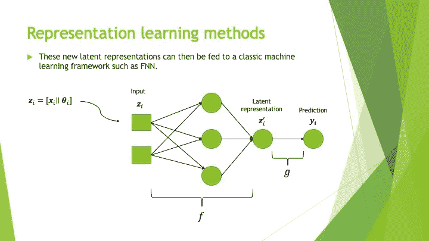

FNN 嵌入的用法。

第二类包含使用名为 Skipgram 的语言模型改编的策略，以便同时考虑图形结构和特性来产生节点的表示。

尽管最后一类真的很有趣，我强烈建议您阅读 DeepWalk 和 Node2Vec 之类的方法，但在本节的剩余部分，我将只解释**图形自动编码器**的功能。

图形自动编码器由两部分组成，分别是**编码器**和**解码器**。编码器是一种功能，其目的是将每个节点映射到矢量表示。解码器是一种功能，其目的是从节点的矢量表示中恢复图形的邻接矩阵中最初与其相关联的完整行。

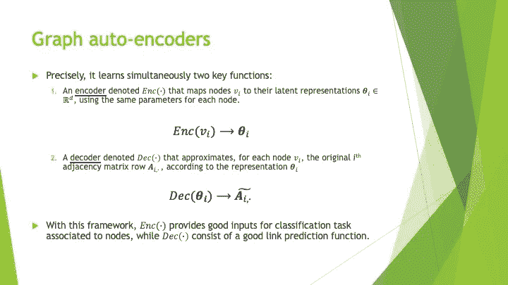

图形自动编码器的编码器和解码器。

图形自动编码器的一个很好的例子是结构化深度网络嵌入(SDNE ),其中编码器和解码器是神经网络。

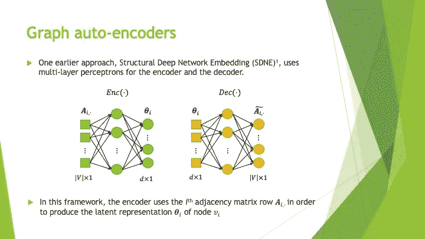

SDNE 编解码器的可视化。

为了一起训练两个神经网络，损失函数由下面给出的两部分构成。

第一部分允许模型以**两个连接的节点必须从编码器**给出相似的输出为目标进行训练。第二部分允许模型以**解码器必须能够从编码中找到最准确的邻接矩阵行**为目标进行训练。

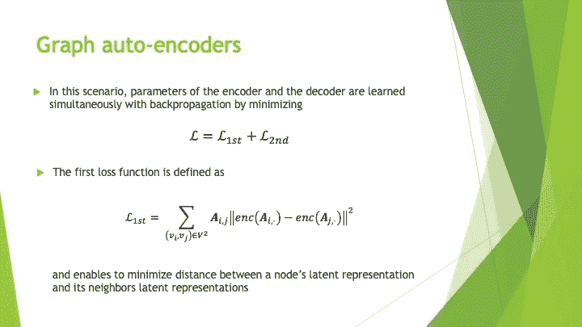

SDNE 损失函数的第一部分。

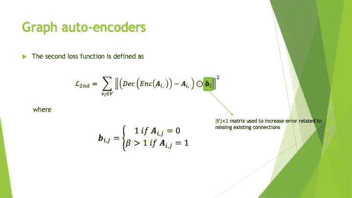

SDNE 损失函数的第二部分。

在这里，正如我对其他方法所做的一样，我将展示表征学习方法的优点和缺点。

优势:

*   结合原始特征和网络结构信息。
*   生成潜在表示的函数的训练独立于任务，并且新的嵌入( **z** )可以被重新用于不同的目的。

缺点:

*   他们没有学习到一种嵌入方法，这种方法可以推广到加入图中的新的看不见的节点。
*   如果这些嵌入是为我们的任务而精确学习的，那么它们会更有意义。

## GNNs

既然我们已经看到了许多可以用来处理动机案例的方法，也看到了它们的优缺点，我们现在可以列出一系列我们的梦想模型应该遵守的标准。嗯，也许不是你的梦想，但仍然是你喜欢的模式，让你通过这个旅程！

这些标准是:

*   该模型应该考虑特征和网络，以便当我们预测节点的标签时，我们可以从相似/连接的其他节点的信息中受益。
*   一旦经过训练，模型应该能够推广到其他看不见的节点，而无需再次训练整个系统。
*   模型应该有一个名字，当你在会议上讨论它时，这个名字听起来很酷。

但是我们怎么做呢？如下图所示，我们可以将表征学习方法的嵌入思想提升到另一个层次，从而得到一个完美的配方！

第一步可能是构建一个函数( **q** )，该函数创建节点嵌入，这些嵌入封装了来自它们自己的特征以及它们邻居的特征的信息。因此， **q** 将同时考虑特征和图的结构属性。

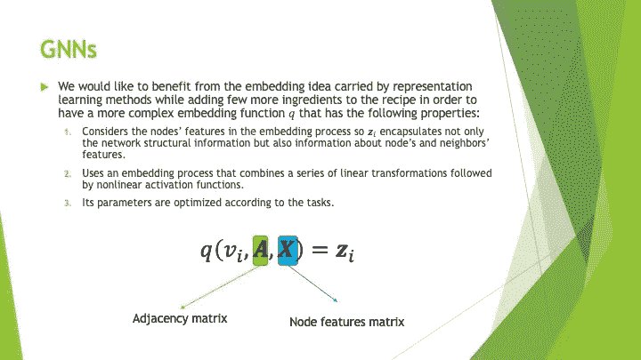

来自 GNN 嵌入函数的期望。

然后，第二步是将这个奇妙的功能连接到前面介绍的原始 FNN 框架，以便可以训练 **q** 来生成特定于任务的嵌入。

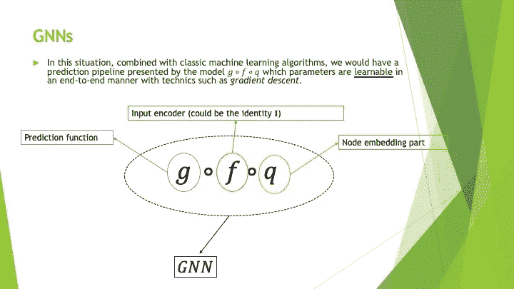

将 GNN 可视化为函数的组合。

嗯，我有个好消息告诉你。这个美味的食谱是存在的，叫做**图形神经网络** ( **GNN** )！

既然你已经意识到 GNNs 背后的动机，我邀请你阅读我的下一篇文章，我们将探索不同的 GNN 模型，从香草 GNN 开始，然后进入图形注意力网络(GAT)。

# 在你走之前

感谢您的阅读！请随意访问我的 LinkedIn 页面。

# 参考

王、、、*。2016.*结构化深层网络嵌入*。第 22 届 ACM SIGKDD 知识发现和数据挖掘国际会议论文集(KDD '16)。*计算机械协会，美国纽约州纽约市，1225–1234。DOI:https://DOI . org/10.1145/29395363637

格罗弗，阿迪亚和朱尔·莱斯科维奇。" Node2vec:网络的可扩展特征学习."*ArXiv:1607.00653【Cs，Stat】*，2016 年 7 月，[http://arxiv.org/abs/1607.00653.](http://arxiv.org/abs/1607.00653.)

结合标签传播和简单模型优于图形神经网络。*ArXiv:2010.13993【Cs】*2020 年 11 月[http://arxiv.org/abs/2010.13993.](http://arxiv.org/abs/2010.13993.)

《深度行走:社会表征的在线学习》第 20 届 ACM SIGKDD 知识发现和数据挖掘国际会议论文集—KDD’14，ACM 出版社，2014 年，第 701–10 页，doi:10.11145/2624063647