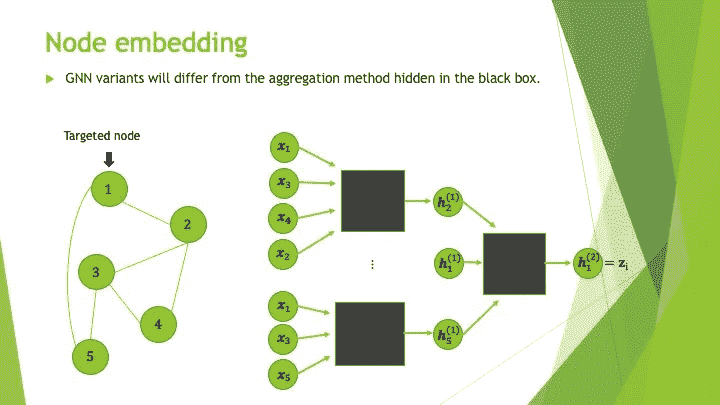
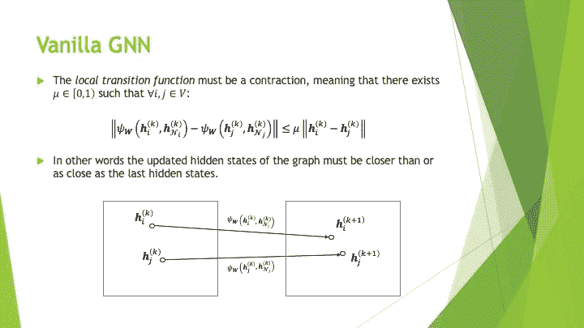

# GNNs 综合介绍—第 3 部分

> 原文：<https://medium.com/analytics-vidhya/a-comprehensive-introduction-to-gnns-part-3-954f46b61c04?source=collection_archive---------2----------------------->

从香草 GNN 到图形注意力网络(GAT)

# 在你开始阅读之前

嗨，亲爱的读者！如果你刚刚开始阅读 GNNs 的介绍，我鼓励你看看已经发行的第一部[和第二部](/analytics-vidhya/a-comprehensive-introduction-to-gnns-part-1-c07396fa3b91)[的第一部](/analytics-vidhya/a-comprehensive-introduction-to-gnns-part-2-8d8941a39b44)和第二部部分，充分享受这份激动人心的新出版物。

# 接下来是什么？

该系列出版物旨在涵盖以下主题:

*   图表
*   有向图
*   信息网络
*   GNNs 背后的动机
*   [节点嵌入](/p/954f46b61c04#1cf6)
*   [香草 GNN](/p/954f46b61c04#a0bb)
*   [图卷积网络](/p/954f46b61c04#3f83)
*   [图形注意力网络(GATs)](/p/954f46b61c04#437c)
*   异构图上的学习

本部分将从**节点嵌入**的概念开始，以 **GATs** 的介绍结束。

# 节点嵌入

上一次我们谈到 gnn 时，我描述了它们的架构，使用了下图所示的功能组合。

被视为功能组合的 GNN 建筑。

让我快速提醒你一下他们的目的！让我们想象一下，我们给一个图结构数据集作为节点分类环境中已经训练好的 GNN**的输入。换句话说，我们有一个数据集形成了一个**信息网络**，其中每个节点都有与之相关的特征(一个向量表示),我们希望预测图中一个或几个节点的类别目标。**

以下是图结构数据集通过经过**训练的** GNN 时发生的步骤:

*   ( **q** )图中的每个节点通过聚集来自其自身特征以及其邻居特征的信息来更新其向量表示。在这一点上，我们将节点的矢量表示称为**嵌入** ( **z** ) ，因为它们嵌入了关于其周围环境的丰富信息。
*   (**f**)**嵌入** ( **z** )然后被独立地转换，以获得**编码**，这仅仅是嵌入本身的更有意义的(即提炼的)版本。你可以把嵌入比作一个成分列表，把编码比作一个更复杂的配方。既然我们知道 GNN **已经被训练，**函数 f 应该已经仔细学习了如何组合配料，以便得到一个帮助函数 g 进行良好分类的配方。**注意，这部分是可选的，嵌入可以直接用作下一步的编码。**
*   (**g**)**编码**最终通过一个函数(例如 softmax)得到类预测。

第一步，即**节点嵌入部分** ( **q** )，是 GNN 区别于任何其他前馈神经网络的真正原因。但是节点嵌入实际上是如何创建的呢？我用很少的数字来帮你理解“如何”的部分！

让我们考虑下图中的图形，并假设对于每个节点，我们想要创建一个嵌入，该嵌入从 2 跳距离范围内的邻居捕获信息。

节点嵌入创建概念。

在这个例子中，如果我们观察节点 1，我们将期望它在节点嵌入过程结束时从图中的所有节点接收信息，因为所有节点都不超过 2 跳。然而，我们也希望以一种使直接邻居( **2 & 5** )在新节点表示的创建中更有影响力的方式进行。

因此，实际进行的方式是通过**将它们自己的向量表示与它们的直接邻居的向量表示聚合**来迭代更新节点状态。在每一步中，我们将节点的矢量表示称为它们的**隐藏状态** ( **h** )。对于每个节点，初始隐藏状态( **h(0)** )是具有原始特征的向量，而最后隐藏状态是其嵌入( **h(K) = z** )。在这种特殊情况下， **K = 2** ，因为我们希望每个节点都考虑 2 跳邻域中的邻居。

迭代隐藏状态更新，K=2。

按照这个想法，在隐藏状态更新期间，GNN 架构将主要不同于它们的聚集方法。

被视为黑盒的聚合方法。

# 香草 GNN

各位，做好准备，这可能是最棘手的部分。如果你没有掌握这一节的所有内容，这完全没关系。我认为这里提出的每一个概念都是非常通用的，在图卷积网络(GCNs)一节中会更加清晰。

GNN 的概念来自于将图像中常见的**卷积**操作推广到结构化数据的想法。

应用于图像和图形的卷积的比较。

它首先引入了函数的概念，带有**可学习参数**，由所有节点共享，以允许它们更新它们的隐藏状态。为了更新节点的隐藏状态，这个被称为**局部转移函数(或消息传递函数)**的函数需要节点自身的当前隐藏状态以及其直接邻居的当前隐藏状态。

局部转移函数的定义。

局部转移函数的黑盒可视化。

尽管如此， *Scarselli 等人*增加了一个标准，即**局部转移函数**必须是一个**收缩**，意味着每次更新任意一对节点的隐藏状态时，它们之间的距离应该更短或相等。这个准则保证了某些收敛性质显示得更远一点。

局部转移函数的收缩准则。

第二个引入的概念是一个叫做**全局转换函数**的函数。它是一个带有**可学习参数**的函数，可以一次更新一个图中所有节点的隐藏状态。为此，**全局转换** **函数**需要所有当前隐藏状态和图的**邻接矩阵**。在神经网络的词汇中，我们可以说**全局转移函数**是 GNN 的**层**。你可以在下图中看到，这基本上是一种在单个步骤中将**局部转换函数**应用到所有节点的有效方法。

全局转移函数的定义。

由于我们之前假设**局部转移函数**是一个收缩，如果我们重复应用**全局转移函数**,**Banach 不动点定理**(见下图来源)确保每个隐藏状态都应该收敛到一个固定值。目标是使用这些稳定的隐藏状态作为节点嵌入。然而，在实践中，我们将通过对预定义的迭代次数( **K** )应用**全局转移函数**来使用这些稳定隐藏状态的估计。注意，应用函数 **K** 次将使每个节点嵌入在一个 **K** 跳邻域内携带信息。

全局转移函数的收敛性。

从**全局转移函数**的这种迭代应用中得到的函数组合将表示普通 GNN 框架中的函数 **q** 。

香草 GNN 框架。

# 图形卷积网络

在香草 GNN 的想法之后，图卷积网络(GCNs)提出了两个巨大的变化:

*   仅执行少量的隐藏状态更新(2–3)，以便节点嵌入仅携带来自邻近区域的信息。
*   对每一层使用不同的参数( **W** )，以允许各层之间隐藏状态大小的变化。

在下图中，我们可以看到一种更新节点隐藏状态的简单方法。它包括对节点的当前隐藏状态和其直接邻居的当前隐藏状态取一个平均**，执行该平均与权重参数矩阵的矩阵乘法( **W** )，并对结果应用非线性激活函数(**∑**)。**

****

**平均更新隐藏状态的描述。**

****

**局部转移函数的标识。**

**在下图中，我们可以看到示例图中节点 1 的隐藏状态更新背后的计算步骤。**

****

**用神经网络结构表示的隐藏状态计算。**

****

**隐藏状态更新的黑盒表示。**

**现在您可能想知道如何一次有效地更新所有这些隐藏状态。让我马上用详细的插图给你看！下图定义了与我们刚刚探索的简单的**局部转移函数**相关的**全局转移函数**。可能会有一堆令人困惑的数学符号，但我会在下面的 **4** 图中总结整个概念。**

****

**用基本方法定义整体转移函数。**

**为了高效地计算图中节点的隐藏状态，您需要做的第一件事是稍微修改一下原始图！准确地说，您需要添加一条从每个节点到其自身的有向边。这个动作包括在原始邻接矩阵( **A** )的对角线上添加 **1** s，以便得到修改后的邻接矩阵( **A~** )。从这个矩阵中，我们可以计算入度矩阵的逆矩阵( **D~** )。**

****

**向图中添加自连接。**

**完成这两个步骤后，我们现在可以考虑下面显示的简单权重矩阵( **W** )来执行单个隐藏状态更新。**

****

**权重矩阵的初始化。**

****

**括号中的矩阵乘法。**

****

**将 ReLU 应用于结果。**

**是不是又好看又轻松？使用修改的邻接矩阵及其关联的入度矩阵将我们从低效的“ **for 循环”中解救出来！****

**注意，还有许多其他简单的方法来聚集节点的隐藏状态。例如 *Kipf 和 Welling【2017】*提出了一种加权平均值，它降低了直接邻居的重要性，而直接邻居本身就有许多直接邻居！**

****

**GCN 主建筑的局部过渡功能。**

****

**GCN 主建筑的整体转换功能。**

# **图形注意网络**

**现在我已经向你展示了 GCNs 的基础，你知道我们如何修改它们，以便在没有太多额外参数的情况下获得更高的分数吗？**

**由于大多数聚集函数基于隐藏状态的加权平均，图注意力网络(GATs)提出每个节点应该能够学习如何将权重(即重要性)分配给它们的直接邻居。**

**正如您在下图中所注意到的，我们将根据系数为 **alpha-ij 的节点 **i** 来记录节点 **j** 的重要性。****

****

**注意系数的定义。**

**为了给每个节点提供学习邻居权重的能力，GATs 在每一层都使用了注意机制。但是注意力机制实际上是如何工作的呢？**

**嗯，让我们假设一个节点 **i** 想要了解它的每个邻居的重要性。为此，我们首先需要对邻域中的每个节点 **j** (包括节点 **i** 本身)执行以下步骤:**

*   **对节点 **i** 和节点 **j** 隐藏状态应用相同的线性变换。**
*   **连接两个结果。**
*   **用层的**注意力向量** ( **a** )和连接的结果执行点积。**
*   **涂抹泄漏的润滑油。**
*   **计算结果的指数。**

**然后，我们将所有系数除以它们的总和，以确保它们都在范围[0，1]内，总和为 1。这些系数(alpha-ij)中的每一个现在表示根据节点 **i** 的节点 **j** 的权重。**

****

**用注意机制定义 GAT 层。**

**在接下来的图中，您可以看到一个简单示例中所需的计算，其中节点 1 的隐藏状态被更新。**

****

**注意力机制的可视化(LR = Leaky ReLU)。**

****

**隐藏状态更新的可视化。**

# **在你走之前**

**感谢您的阅读！欢迎访问我的 [LinkedIn](https://www.linkedin.com/in/nicolas-raymond-002950b6/) 页面。**

# **特别感谢**

**我想特别提一下斯坦福大学的[cs 224 w:带图的机器学习讲座](https://www.youtube.com/watch?v=JAB_plj2rbA)可以在网上免费获得。他们帮助我理解 GNNs，同时也启发我设计一些图形。**

# **参考**

## **文章**

*   **基普夫，托马斯 n，和马克斯韦林。"图卷积网络的半监督分类."*ArXiv:1609.02907【Cs，Stat】*2017 年 2 月[http://arxiv.org/abs/1609.02907.](http://arxiv.org/abs/1609.02907.)**
*   **《图形神经网络模型》 *IEEE 神经网络汇刊*，第 20 卷第 1 期，2009 年 1 月，第 61–80 页，doi:10.1109/TNN.2008.2005605。**
*   **一个广义的巴拿赫不动点定理。*马来西亚数学科学学会公报*，第 39 卷第 4 期，2016 年 10 月，第 1529–39 页，doi:10.1007/s 40840–015–0255–5。**
*   **《图形注意网络》*ArXiv:1710.10903【Cs，Stat】*2018 年 2 月[http://arxiv.org/abs/1710.10903.](http://arxiv.org/abs/1710.10903.)**

## **网站**

*   **[* http://deep learning . net/software/the ano/tutorial/conv _ 算术. html](http://deeplearning.net/software/theano/tutorial/conv_arithmetic.html)**