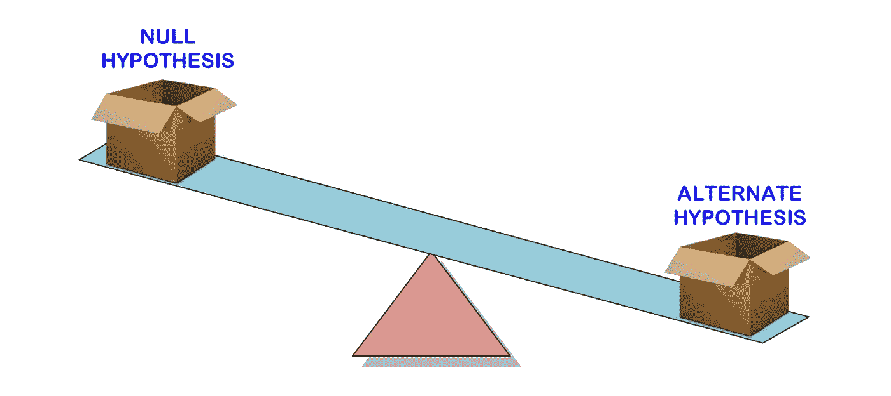
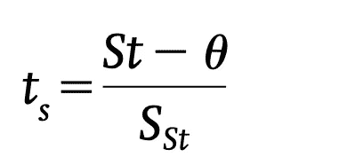
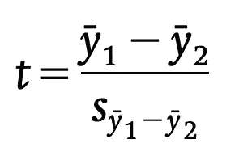
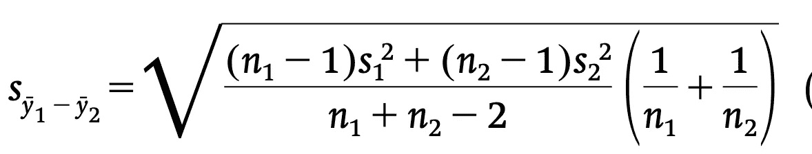
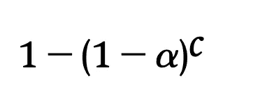
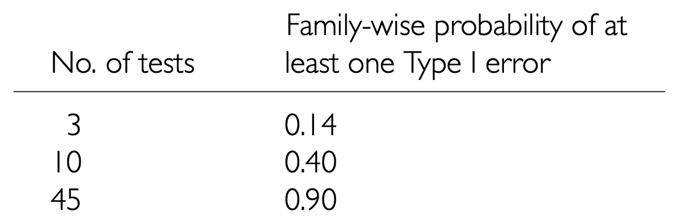

# 假设检验速成班—数据科学方法

> 原文：<https://medium.com/analytics-vidhya/a-crash-course-on-hypothesis-testing-a-data-science-approach-4b1222b461f3?source=collection_archive---------1----------------------->

假设检验是数据科学背景下统计推断的精髓部分。

在[上一篇文章](https://vnaghshin.medium.com/a-crash-course-on-estimation-a-data-science-approach-f70489cc57dd)中，我们讨论了估计总体参数，如均值或方差，并概述了实现这一目标的一些方法。参数估计是统计推断的基本组成部分之一。另一个部分是测试关于这些参数的假设。在这篇文章中，我将向您简要介绍假设检验的基本原理。

[测试](https://www.unilever.com/planet-and-society/responsible-business/alternatives-to-animal-testing/)

# 哲学辩护

继续使用统计假设检验的许多哲学理由似乎是基于波普尔对假设的证伪检验的提议。据说“波普尔提供了哲学，费希尔、皮尔逊和他的同事提供了统计学”。

# 经典统计假设检验

经典假设检验基于两个基本概念。第一，统计零假设(H0)，这通常是(尽管不是必须的)人口参数之间没有差异或没有关系的假设，例如，两个人口的平均值之间没有差异。这种差异通常被称为没有影响。所以，无效假设围绕着无效应关系。这主要是因为科学是通过严格检验和证伪假说而进步的。这只是表明，拒绝假设检验为替代假设或研究假设提供了支持/佐证。然而，一些人认为，拒绝零假设并不能提供真正的确证和统计检验，正如目前所实行的那样。

其次，我们必须选择检验统计量来检验零假设。测试统计是一个随机变量，因此，它有一个概率分布。最常见的统计是抽样平均值或观察值的平均值。在零假设下，抽样分布，代表从总体中重复抽样下检验统计量的概率分布。

**基本假设检验**

罗纳德·费雪爵士提出的基本假设检验只包括零假设，由以下步骤组成:

*   构建一个无效假设(H0)。
*   选择测量与原假设的偏差并且具有众所周知的抽样分布的检验统计量。
*   从总体的抽样分布中收集一个或多个数据，并将样本的检验统计值与其抽样分布进行比较。
*   确定 P 值，即获得观察值的概率，或者如果 H0 为真，则确定一个更极端的值。
*   如果 P 值很小，则拒绝 H0，如果足够大，则保留。

P 值通常被认为是对 H0 不利的证据。费希尔还提出了拒绝 H0 的常规概率:这被称为显著性水平。他建议将二十分之一(0.05 或 5%)的概率作为一个方便的水平，各种统计数据的抽样分布表的出版通过仅包括超出这些常规水平(例如 0.05、0.01、0.001)的尾部概率来加强这一点。

**现代假设检验**

显著性水平被解释为当实验重复多次且 H0 实际上为真时，使用该判定规则 H0 被错误拒绝的次数的比例。

尼曼-皮尔逊假设检验

Fisher 提出的传统假设检验方法与 Neyman 和 Pearson 提出的现代假设检验方法的主要区别在于 Neyman 和 Pearson 明确引入了一个替代假设(HA)。HA 是另一个假设，如果零假设是假的，那么它应该是真的。例如，如果 H0 是两个人口平均数相等，那么 HA 是它们有一些差异。相比之下，费希尔强烈反对在显著性检验中使用 HA 的想法。

Neyman 和 Pearson 假设检验引入了第一类误差的概念，即当 H0 为真时拒绝它的长期概率，用`alpha,`表示；第二类误差，即当它为假时不拒绝它的长期概率，用`beta`表示。

重申一下，经典统计检验的解释是基于概率的长期频率解释，即长期相同“试验”或“实验”的概率。这意味着我们有一个或多个明确定义的总体，我们从这些总体中取样并对其进行推断。如果没有可定义的随机样本总体，这里讨论的推断统计更难解释，因为它们是基于重复抽样的长期出现频率。随机化检验(第 3.3.2 节)不要求从人群中随机取样，可能更适用。

# 相关概率和 I 型误差

*P* 值可以表示为 *P* (数据|H0)，如果 H0 为真，则在重复的相同实验下，观察到我们的样本数据或更极端的数据的概率。这和给定观测数据的情况下，H0 为真的概率不一样—*P*(H0 |数据)。如果我们希望知道 H0 为真的概率，我们需要从贝叶斯的角度来处理假设检验

# 单一总体的假设检验

单总体检验是关于单总体参数或两个总体参数之间差异的检验假设，前提是关于变量的某些假设成立。有时，测试平均值等于零的 H0 是相关的，例如，从治疗前到治疗后的平均值变化等于零，以及测试其他参数是否等于零。为此，我们通常使用 t 统计量，其一般形式为:

t —统计

其中 St 是我们样本的统计值，θ是样本统计值的总体值，按照 H0 的规定，样本统计值将根据该总体值进行检验，S_st 是样本统计值的估计标准误差。这里有一个简单的例子:

*   指定 H0(例如，平均值=0)和 HA(例如，平均值**不等于** 0)
*   从明确定义的人群中随机抽取样本
*   根据样本计算 t = (y-0)/sy，其中 sy 是样本平均值的估计标准误差。请注意，如果 H0 为真，我们将期望 *t* 接近于零，也就是说，当我们从均值为零的总体中取样时，大多数样本的均值将接近于零。如果 H0 为真，则远离零的采样均值不太可能出现。
*   用 *n* -1 df 将 *t* 与 *t* 在 0.05(或 0.01 或您选择的任何显著性水平*先验*)的采样分布进行比较。这个 t 值有时被称为临界值。如果获得我们的样本 *t* 值或更大值的概率( *P* 值)小于 0.05 (our)，那么我们拒绝 H0。

如果我们将我们的 t-统计量与抽样分布两端的临界值进行比较，则称之为**双尾检验**，否则称之为**单尾检验**。

对单个值的假设检验等同于检查置信区间(具有给定的显著性水平)是否与零值重叠。

# 两个总体的假设检验

存在两个总体中的等效参数的检验。如果我们从两个独立总体的每一个中有两个随机样本，即总体代表不同的观察集合。例如，对于 H0，mean1=mean2(比较两个独立的总体平均值):

双总体 t 检验

其中混合标准偏差为

两个平均值之差的标准偏差

如果我们有两组相互配对的观察值(配对样本)，那么我们实际上处理的是单一假设检验。

# 关键假设

所有的统计检验都有一些假设，如果这些假设不满足，那么假设检验就是不可靠的。

第一个假设是样本来自正态分布的总体。然而，来自模拟研究的合理证据表明，基于 *t* 检验的显著性检验通常对违反这一假设的行为是稳健的，除非分布非常不对称，例如偏斜或多模态。将变量转换到不同的测量尺度通常可以提高其正态性。

第二个假设是样本来自方差相等的总体。同样，证据表明 t 检验足够稳健，足以违反这一假设。

> 应该谨慎使用统计假设检验，最好是在已经考虑了功效和效应大小的情况下

# 随机化(排列)测试

这些测试对原始数据进行多次重采样和重排，以直接生成测试统计的采样分布。进行随机化测试的一般步骤是

*   计算两个样本的平均值之差
*   随机抽取 n1 个观察值，标为样本 1，其余标为样本 2。
*   多次重复第二步，每次计算平均差值，称之为 Di。
*   计算所有大于或等于 *D* 0 的 *Di* 的比例(我们样本中的平均值之差)。这是“ *P* 值”，它可以与一个*先验*显著性水平(如 0.05)进行比较，以决定是否拒绝 H0(尼曼-皮尔逊传统)，或用作针对 H0 的“证据强度”的衡量标准。

随机化检验背后的基本原则是，如果零假设是真的，那么对观察值进行任何随机分组都是可能的。

# 多重测试

在多重测试中，顾名思义，有多重比较。多重测试的问题是，随着测试数量的增加，测试集合中至少有一个 I 型错误的概率也会增加。在独立多重测试的情况下，至少 I 类错误的概率如下所示:

其中`alpha`是每个测试的显著性水平(例如 0.05)，而 *c* 是测试的次数。在下表中，显示了一种类型 I 概率。

换句话说，如果你一直问不同的问题(多重假设检验)，就有更多的机会得出一个可能偶然发生的模式存在的结论！

有一些控制炎症α的方法被推荐。一些建议的解决方案是 Bonferroni 程序、Dun-Sidak 程序和顺序 Bonferroni 程序。

# **统计假设检验批判**

统计假设检验受到许多统计学家的批评。假设检验的第一个也是主要的限制是它取决于样本大小，即在其他条件相同的情况下，较大的样本量更有可能产生具有统计意义的结果，而在样本量非常大的情况下，微小的影响也可能产生显著的结果。出于这个原因，基于*先验*功率考虑来设计实验在这里是至关重要的。我们的样本量不是任意选择样本大小，而是应该基于检测预期效应(如果它发生在人群中)所需的样本量。请记住，解释显著性检验应始终结合效应大小的测量(如均值之间的差异)和某种形式的置信区间来进行。