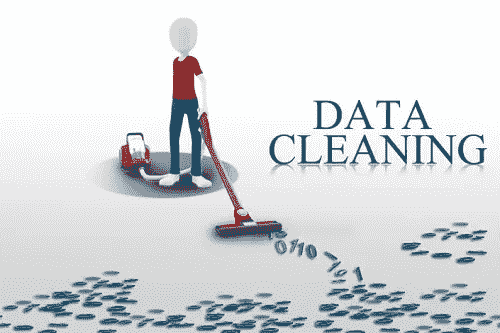
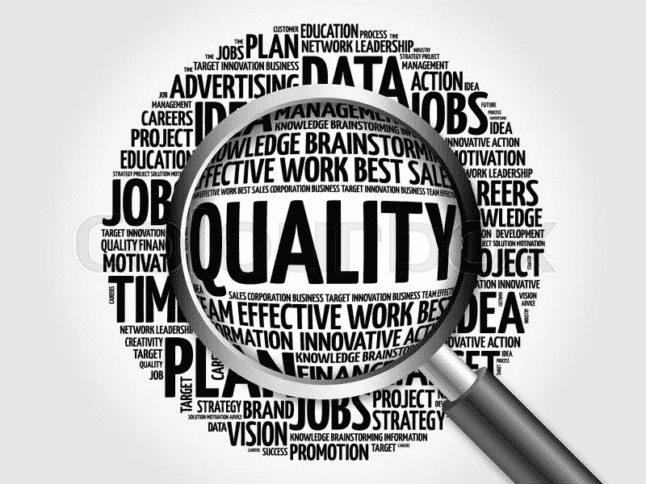
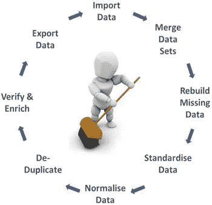

# 数据清理之旅

> 原文：<https://medium.com/analytics-vidhya/a-data-cleaning-journey-2b0146407e44?source=collection_archive---------6----------------------->

*无论你是数据工程师还是数据科学家，大部分时间都会花在清理数据上！据估计，数据科学家花费大约 80%的时间清理数据。这意味着只有 20%的时间将用于从数据科学流程中分析和创造见解。数据清理提高了数据质量。*

图片来自[https://www . bizprospex . com/four-reasons-clean-your-CRM-data/](https://www.bizprospex.com/four-reasons-clean-your-crm-data/)

数据清理的概念确保数据的质量得到保持和提高，以满足业务需求。从高质量数据中获得的见解有助于做出最佳商业决策。

# 数据质量

数据质量是衡量数据在解决组织特定需求方面的充分性和适用性的标准。可信的决策只能来自高质量的数据。

因此，如果数据符合您的组织的需求或您的业务问题，则被认为是高质量的。以下是质量数据的一些特征:

1.  一致性-
2.  准确(性)
3.  有效期
4.  完全
5.  同样

> 数据清理确保数据的**质量得到保持和增强，以满足**业务需求**。从高质量数据中获得的见解有助于做出最佳商业决策。**

# 注意:*数据清洗不同于数据转换。*

数据转换的目的是将数据从一种格式转换为另一种格式，而数据清理的重点是通过删除或填充数据集中缺失的值来保持或提高数据的质量。

数据清理是数据科学过程中的重要步骤之一。做好数据清理的一些好处包括:

*   它增强了人们从他们的分析中得到的结果。

拥有一个干净的数据集意味着您有足够的资源(数据)来帮助创建分析所需的洞察力。这提高了工作效率，减少了获得见解所需的时间。

*   数据清理从数据集中删除错误。

处理有错误的数据集将产生不一致的结果，这将影响作为数据科学家的您的洞察力。因此，清理数据可以确保你的洞察力与你的目标一致。

*   数据清理过程可用于帮助解决不正确或损坏的数据收集。

一旦确定了数据集中的常见错误，就可以很容易地建议或解决错误数据收集的问题。这将随后为您的企业节省可解决的常见问题的数据清理成本。

*   干净的数据使决策变得容易。

拥有干净的数据意味着快速的分析和模型创建。这在决策过程中节省了时间。

# **数据清理过程**

有多种技术可以清理数据。这些是基于需求和组织的。

数据清理遵循一般概念，包括:

1.  [处理缺失值](/analytics-vidhya/dealing-with-missing-values-432d06ab4049)
2.  [处理离群值](/afritech-blurbs/outliers-and-how-to-handle-them-11c26ebc809c)
3.  [删除重复的&不需要的观察值](/afritech-blurbs/dealing-with-unwanted-observations-duplicates-irrelevant-observations-7b6a1e50a93b)
4.  [分类变量和编码](/afritech-blurbs/dealing-with-categorical-variables-9da4e3c24e41)

在接下来的几天里，我将处理好以上每一个步骤。加入我的旅程，我们一起学习如何清理我们的数据，并获得干净数据集的好处！

从这里开始: [**处理缺失值**](https://3liud.medium.com/dealing-with-missing-values-432d06ab4049)