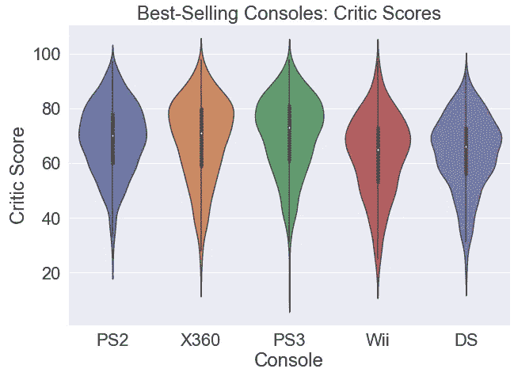

# 视频游戏的数据驱动探索——销售和分数

> 原文：<https://medium.com/analytics-vidhya/a-data-driven-exploration-of-video-games-sales-and-scores-3c77f1c6573c?source=collection_archive---------10----------------------->

视频游戏现象始于 20 世纪 70 年代初的“乒乓”游戏，并已成为现代时代的主要部分。[专家报告](https://www.reuters.com/article/esports-business-gaming-revenues-idUSFLM8jkJMl)视频游戏行业在 2020 年带来了高达 1500 亿美元的收入[据估计](https://www.statista.com/statistics/293304/number-video-gamers/)全球有 27 亿游戏玩家(超过地球人口的三分之一！).那么人们都在玩什么类型的电子游戏呢？

图片来源:[索尼娅·阿特丽在媒体上](/@soniaatre/evolution-of-mario-a-staple-for-classic-and-modern-graphics-7acec3a6b914)

在这篇文章中，我将尝试回答这个问题以及其他关于视频游戏销售、趋势和世界各地分数的问题。我将使用 Python 和 Tableau 创建的可视化效果，基于来自 Kaggle 的数据集。该数据集包含了从 20 世纪 80 年代到 2016 年超过 16，000 种不同主机视频游戏的信息。

数据集属性

上面列出了数据集的属性。不幸的是，如左图所示，有相当多的数据点缺失，尤其是关于评论家和用户的分数。为了解决这个问题，我创建了两个新的数据框架:一个用于分析*销售额*，另一个用于分析*分数*。所以，澄清一下，我在整篇文章中谈论的“分数”并不是游戏中的高分，而是游戏被评论家和用户评价的好坏。

上面的代码为我们提供了以下文件以供进一步分析:

*   *vgsales.csv* : 16，416 个条目，在名称、平台、年份、流派、出版商或销售方面没有缺失数据。缺少一些分数数据。
*   *VG scores . CSV*:6825 个条目，没有任何缺失数据。

## 随着时间的推移，电子游戏的销售有了怎样的变化？

既然我们已经完成了预处理，我们可以开始可视化地研究数据来回答一些问题。随着时间的推移，我们能看到销售数据的任何趋势吗？

毫不奇怪，数据显示自 20 世纪 80 年代以来有了巨大的增长，多年来多次销售高峰通常伴随着新游戏机的发布。例如，索尼的 PlayStation 2 在 2000 年发布，任天堂和微软在 2001 年底发布了他们的 GameCube 和最初的 Xbox。这三种主要游戏机的上市使得 2002 年成为视频游戏销量最大的一年，售出了近 4 亿台游戏。稍后，我们将深入挖掘最受欢迎的游戏机及其最畅销的游戏。

始于 2009 年的大幅下跌可能有多种解释。一些专家认为这是经济不确定的结果，2007-2008 年的金融危机导致消费者减少不必要的支出。[其他人](https://www.marketwatch.com/story/video-game-sales-expected-to-show-more-weakness-2010-01-13)归咎于游戏行业的饱和，缺乏新鲜的新游戏和游戏机来保持客户的兴趣。我还认为，通过 Steam 和 Epic Games 等平台引入数字游戏销售，在很大程度上导致了我们看到的实体副本销售的下降。

## 最受欢迎的视频游戏机及其畅销游戏有哪些？

左边的图表显示了卖出的*游戏*总数中最受欢迎的五个视频游戏控制台(即，不是控制台的数量)。索尼占据榜首，截至 2016 年，他们非常受欢迎的 PlayStation 2 游戏机已经售出超过 12 亿款游戏。微软的 Xbox 360 排在第二位，但任天堂也表现出色，他们的两个系统进入了前五名。现在我们知道了最受欢迎的游戏机，让我们来看看每一个最受欢迎的游戏。

上面可以看到三款最受欢迎的游戏机中每一款最畅销的五款游戏。有趣的是，这三款游戏的发行版都很相似，每款游戏的销量都徘徊在 1000 万到 2000 万份之间。我们还可以看到，PS2、Xbox 360 和 PS3 的最畅销游戏列表完全由三个视频游戏特许经营商占据，即*侠盗猎车手*、*赛车* o 和*使命召唤*。

对于第四大最受欢迎的游戏机任天堂 Wii，数据讲述了一个非常不同的故事。首先，它是最畅销的游戏 *Wii Sports* 销量高达 8200 万份，是 PS2 最受欢迎的游戏 *GTA: San Andreas* 销量的四倍。这在一定程度上是因为在大多数地区,[游戏是与游戏机捆绑销售的。事实上，这帮助巩固了 Wii Sports 成为世界上最畅销的视频游戏(当时；](https://happymag.tv/how-wii-sports-became-nintendos-best-selling-game-ever/)[后来被*《我的世界》*废黜](https://www.ign.com/articles/2019/04/19/top-10-best-selling-video-games-of-all-time)。它仍然是任天堂有史以来最畅销的游戏。

此外，在我们的其他前五名名单中看到的三个巨头特许经营权在 Wii 的名单中找不到，而是完全由任天堂自己的发行和 Wii 独占组成。类似的情况发生在下面的任天堂 DS 列表中:前五名中的每一款游戏都是掌机独占的。

索尼和微软的游戏机看起来很相似，它们都依赖于大型游戏特许经营权的普及。也就是说，它们不是依赖于独占游戏，而是在处理速度和性能方面相互竞争，并倾向于用于玩相同的游戏。另一方面，任天堂游戏机自成一派，尽管[的性能通常比另外两款要弱](https://venturebeat.com/2012/11/29/the-wii-us-processor-and-graphics-speeds-are-slower-than-xbox-360-and-ps-3/)。相反，他们因其独特的游戏和系列的成功而茁壮成长，如*马里奥*和*口袋妖怪*以及像 Wii 的运动感应控制器和 DS 的双屏这样的新颖想法。

## 评论家和用户评分与主机受欢迎程度一致吗？

这个 violinplot 显示了五个最受欢迎的主机的用户分数在所有游戏中的分布。我们知道 PS2 是最受欢迎的，也许这是理所应当的，因为它也往往从用户那里得到最好的分数！当谈到评论家的分数时(见下图)，PS3 独占鳌头，两款任天堂游戏机垫底。

请注意，虽然看起来有些分数可能超过了 100(或用户分数为 10)的上限，但数据已被清理，以确保在创建这些图时没有使用无效的分数。

## 现在我们已经看到了最受欢迎的主机的分数，那么最受欢迎的游戏呢？

左边的十本书按受欢迎程度排序(从上到下)，并根据它们的评论家评分制成图表。这向我们表明，一款游戏的受欢迎程度并不一定是其质量的标志: *Wii Sports* 和 *Wii Play* 尽管都是有史以来最畅销的游戏，但它们的得分都很一般。

## 评论家和普通用户更喜欢不同的游戏吗？

评论家和用户都倾向于给策略游戏打高分，但他们的相似之处也就到此为止了。虽然用户更喜欢角色扮演和平台游戏，但批评者更可能喜欢体育和射击游戏。这里看到的另一个有趣的结论是，评论家们对他们玩的游戏更加挑剔(没有双关语的意思)，因为即使是他们的三个顶级流派也在 70 年代中期徘徊在较低的分数附近。另一方面，对于用户来说，前三种类型的评分通常在 8 分左右(例如，80 分，作为比较)。

为了结束我们的探索，我留给你最后一个形象化的东西，它巩固了我们迄今为止看到的几点:流行不一定意味着质量，评论家和用户往往对游戏有不同的品味。以下分别是用户和评论家评价最高的五款游戏。请注意，这五大列表中的游戏彼此之间没有共同点，而且在我们研究流行度时，这些高评分的游戏都没有出现。

使用 Tableau 或 Python 创建的所有可视化。上面看到的所有四个 violinplots 的 Python 代码:

## 参考

*   *用户希德 _TWR。*“视频游戏销售数据集。”*卡格尔，*[https://www.kaggle.com/sidtwr/videogames-sales-dataset?select = Video _ Games _ Sales _ as _ at _ 22 _ Dec _ 2016 . CSV](https://www.kaggle.com/sidtwr/videogames-sales-dataset?select=Video_Games_Sales_as_at_22_Dec_2016.csv)。于 2021 年 2 月 1 日访问。
*   *场级媒体。*“报告:2020 年游戏收入将突破 1590 亿美元。”*路透，*[https://www . Reuters . com/article/esports-business-gaming-incomes-idusflm 8 JK XML](https://www.reuters.com/article/esports-business-gaming-revenues-idUSFLM8jkJMl)。于 2021 年 2 月 3 日访问。
*   *j . Clement*“2020 年全球视频游戏玩家数量，按地区划分。” *Statista* ，[https://www . Statista . com/statistics/293304/number-video-gamers/](https://www.statista.com/statistics/293304/number-video-gamers/)。于 2021 年 2 月 3 日访问。
*   *Vu，Duong。*“用 Python 生成单词云” *Datacamp，*[https://www . data camp . com/community/tutorials/word cloud-python](https://www.datacamp.com/community/tutorials/wordcloud-python)。于 2021 年 2 月 4 日访问。
*   *法姆，亚历克斯。随着玩家缩减开支，视频游戏在 2010 年遭遇第二次低迷。*洛杉矶时报，*[https://latimes blogs . latimes . com/entertainment news buzz/2011/01/2010-video-game-sales-from-NPD . html](https://latimesblogs.latimes.com/entertainmentnewsbuzz/2011/01/2010-video-game-sales-from-npd.html)。于 2021 年 2 月 8 日访问。*
*   *丹·加拉格尔。*“预计 2009 年视频游戏销售额将下降。” *MarketWatch，*[https://www . market watch . com/story/video-game-sales-expected-to-show-more-weak-2010-01-13](https://www.marketwatch.com/story/video-game-sales-expected-to-show-more-weakness-2010-01-13)。于 2021 年 2 月 8 日访问。
*   *肖尔丹。*“Wii Sports 如何成为任天堂有史以来最畅销的游戏。”*快乐杂志，*[https://Happy mag . TV/how-Wii-sports-been-nintendos-best-selling-game-ever/](https://happymag.tv/how-wii-sports-became-nintendos-best-selling-game-ever/)。于 2021 年 2 月 9 日访问。
*   *约旦西拉尼。“有史以来最畅销的十大电子游戏” *IGN，*[https://www . IGN . com/articles/2019/04/19/top-10-best-selling-video-games-of-all-time](https://www.ign.com/articles/2019/04/19/top-10-best-selling-video-games-of-all-time)。于 2021 年 2 月 9 日访问。*
*   *高桥汀。*“Wii U 的处理器速度比 Xbox 360 和 PS3 慢。” *VentureBeat，*[https://VentureBeat . com/2012/11/29/the-Wii-us-processor-and-graphics-speeds-比 xbox-360-and-ps-3/](https://venturebeat.com/2012/11/29/the-wii-us-processor-and-graphics-speeds-are-slower-than-xbox-360-and-ps-3/) 慢。于 2021 年 2 月 9 日访问。
*   阿特雷，索尼娅。《马里奥的进化:经典和现代图形的主要元素》 *Medium* ，[https://Medium . com/@ soniaatre/evolution-of-Mario-a-staple-for-classic-and-modern-graphics-7 acec 3 a6b 914](/@soniaatre/evolution-of-mario-a-staple-for-classic-and-modern-graphics-7acec3a6b914)。2021 年 2 月 10 日访问。