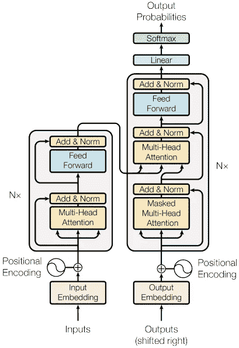
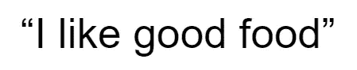
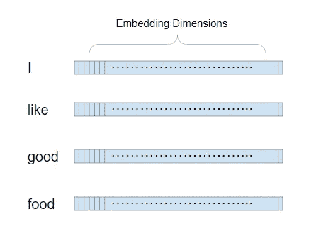
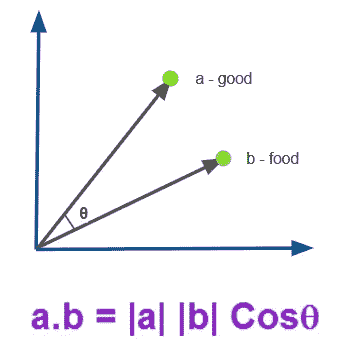
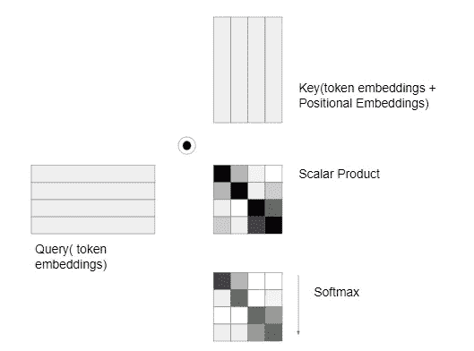
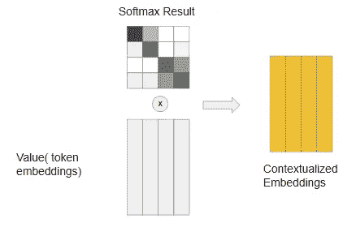
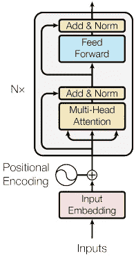
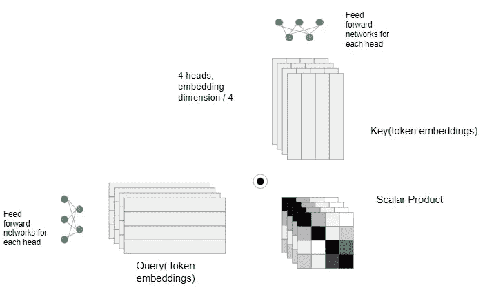
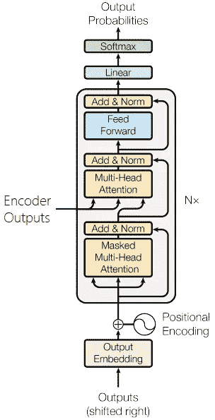
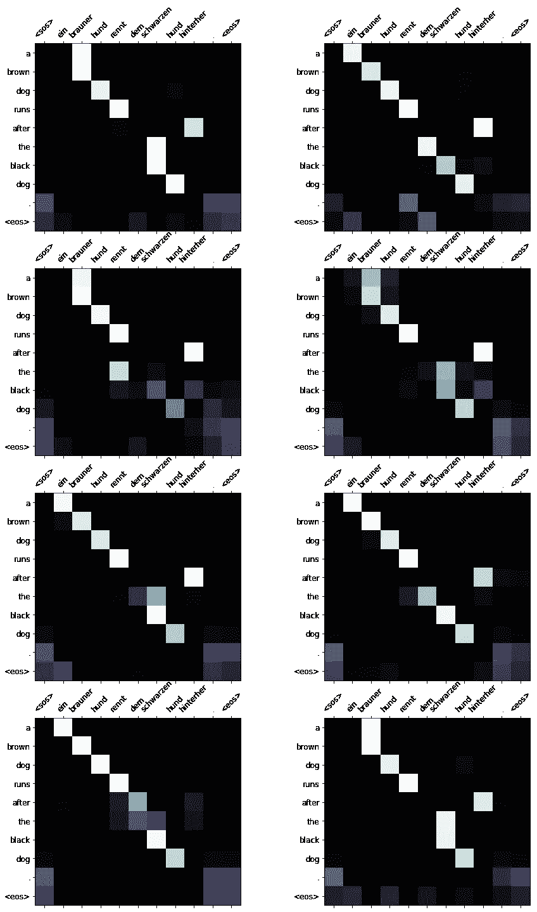

# 深入了解变形金刚

> 原文：<https://medium.com/analytics-vidhya/a-deep-dive-into-transformers-cdad59bf4260?source=collection_archive---------23----------------------->

如果你最近没有听说过 NLP(自然语言处理)或人工智能领域的变形金刚，那么你很可能生活在一块岩石下。在过去的几年里，有一系列基于 Transformer 的架构频繁发布，如 BERT、SpanBERT、Transformer-XL、XLNet、GPT-2 等。OpenAI 的 GPT-3 因其在问答、理解甚至编程等任务上表现出色的能力而风靡互联网(最棒的部分是它添加了评论)。点击这里查看所有 GPT-3 能做什么。

但这一切都始于早在 2017 年发布的一篇研究论文“ [*注意力是你所需要的全部*](https://arxiv.org/abs/1706.03762) ”。本文提出了一种新的深度学习架构来处理序列数据，而不使用 RNNs 和 CNN。

变压器架构

该架构看起来相当简单，并声称与基于 CNN / RNN 的模型相比，可以用更少的训练时间在语言任务中实现更高的准确性。该架构解释了注意力机制，这是该架构的基石。我们将试着理解注意力。

让我们考虑下面的句子。

一般来说，我们会将这个句子中的单词转换成令牌嵌入，并将这些嵌入发送到网络中。

令牌嵌入

与基于 RNN 的模型不同，变压器需要同时看到所有的令牌，因为它没有递归。注意机制根据位置(顺序)和上下文告诉模型关注或注意哪个标记。嵌入之间的相关性是通过在它们内部做内积来计算的。如果我们在 n 维空间中投影这些嵌入，如果向量之间的角度较小，点积将导致高标量值。例如

点积和上下文

如果 **θ** 更接近 0，则点积产生更高的值(cos 0 = 1)。您可以将嵌入向量中的每个维度视为一个上下文。如果任何两个单词在上下文空间中更接近，那么它们的相关性将更高。现在，我们取所有的嵌入，做点积。

计算注意力

这里，我们复制了两个令牌嵌入，分别称为 Key 和 Query。我们在键和查询之间做点积，得到标量值作为结果。方块越黑，产品的价值越高。由于这些值在数量上可能很大，我们将这个标量输出除以矢量大小的平方根，这将给出很好的缩放效果。现在我们沿着 y 轴应用 softmax 来计算注意力。

语境化向量

现在，我们在注意力和原始令牌嵌入(值)之间进行标量乘法，以获得**上下文化嵌入**。这种嵌入中的每个标记都将具有从其他标记扩散的一定量的上下文。量级由注意力图给出。花一点时间想象这是如何发生的。

现在让我们看看编码器部分，即变压器架构的左侧。

编码器

现在，一旦我们理解了注意力机制，架构中的其余组件就相当简单了；等一下！你注意到编码器中有一种叫做“多头注意力”的东西吗？它仅仅是沿着嵌入维度分割注意力过程，以增加网络的多功能性。

多头注意力

注意，在嵌入头之前存在前馈网络，这些网络学习根据上下文将嵌入混合和匹配到多头中。最后，计算出的上下文化嵌入头被连接回去。

好了，现在我们已经准备好编码编码器部分了！

现在多头注意了。

编码器部分的输出(潜在向量)进入解码器部分。

解码器

解码器部分非常简单，因为它获取目标序列并完成所有位置、标记嵌入和多头关注。但是多头注意力层利用编码器输出和目标嵌入来计算注意力。对目标序列的自我关注由“屏蔽多头关注”层完成，该层简单地屏蔽了应该由网络预测的单词。

请注意，编码器和解码器部分都有高速/跳跃连接。这负责位置信息在整个网络中的流动(记住这里没有递归的概念)。

让我们编码解码器部分！

我使用上述编码器和解码器设计，用 Seq2Seq 变压器网络训练了一个德语-英语翻译。结果如下所示

下面是一些翻译和它们各自的注意力地图

德-英翻译的注意力地图

有关完整的代码，请参考本 colab 笔记本。[https://colab . research . Google . com/drive/1pA-MAF hwx 6 jh4xzeakqk 1 oi 2 rsx 1 VO 7 l？usp =共享](https://colab.research.google.com/drive/1pA-mafHWx6Jh4xzEAKqk1Oi2RsX1vO7l?usp=sharing)

你可以为你自己的目的训练转换器，比如问答、聊天机器人、理解、机器翻译等等，通过相应地设计输入和输出序列。

干杯！