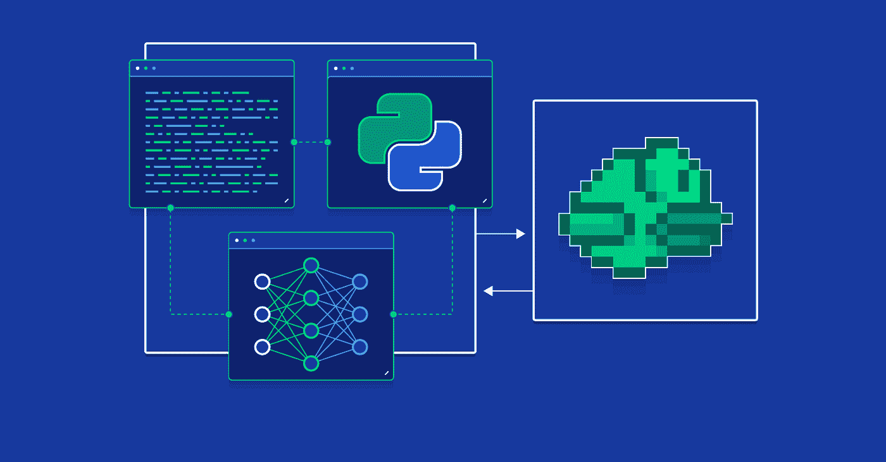

# 对普通政策梯度的深入探究

> 原文：<https://medium.com/analytics-vidhya/a-deep-dive-into-vanilla-policy-gradients-3a79a95f3334?source=collection_archive---------5----------------------->

电脑征服了人类——当然是在游戏中。

很难相信计算机能像人类一样玩游戏，通过动作推理，并与游戏中的物体互动。但是电脑在游戏中的威力已经被证明了；AI 已经掌握了像[围棋](https://deepmind.com/research/case-studies/alphago-the-story-so-far)和 [Dota 2](https://openai.com/projects/five/) 这样的游戏，在这两个游戏中击败了顶级职业选手。

观察这些系统的工作留下了许多问题。这些系统实际上是如何运作的？他们是如何在没有任何人类帮助的情况下学会玩电子游戏的？要回答这样的问题，我们需要一头扎进**强化学习这个领域。**

**强化学习**是什么让这个 AI 把雅达利突围打得这么好！[来源](https://gsurma.medium.com/atari-reinforcement-learning-in-depth-part-1-ddqn-ceaa762a546f)

# **什么是强化学习？**

强化学习允许计算机通过*强化*积极行为来自主学习执行任务。

通用强化学习框架。[来源](https://www.kdnuggets.com/2018/03/5-things-reinforcement-learning.html)

强化学习包括两个项目，一个**代理**和一个**环境。**继续玩视频游戏的运行示例，代理是玩游戏的模型的一部分，而环境是游戏本身。

代理通过**动作**与环境交互。在游戏中向前移动角色或发射武器都是代理可以采取的可能行动。

为了决定采取什么行动，代理被给予环境的状态。我们的视频游戏代理从游戏中以单个帧的形式接收状态，分析它们以确定响应给定状态的理想动作。如果行动产生了积极的结果(如分数增加)，则给予代理**奖励**，鼓励类似于产生奖励的行动。导致负面结果的行为通常会受到惩罚。

强化学习模型中的代理是一个被称为**策略网络**的神经网络。一个状态被输入到一个策略网络中，该网络输出给定该状态下要采取的理想动作。

*注意:如果你不熟悉神经网络，就把它们想象成一个数学函数，可以被训练来执行某些任务。在这里阅读更多关于他们的***。**

# ***培训政策网络***

*像其他神经网络一样，策略网络必须经过训练才能决定适当的行动。*

*网络开始时是随机初始化的，这意味着模型没有经过训练。因为未经训练，网络产生随机动作。例如，一个未经训练的视频游戏代理可能漫无目的地移动它的角色而得不到分数。*

*然而，经过多次博弈后，代理人最终选择了一系列导致积极结果的行动。这些行动得到积极的强化，推动网络选择产生类似积极结果的行动。相反，导致负回报的行为会被消极地强化，阻止算法采取这样的行为。*

*这种强化框架引导网络执行更明智的行动，从而使策略获得更多回报。在不断重复这一过程后，政策获得了对什么样的行动序列导致高回报的理解。*

*这个过程被称为**标准政策梯度** **算法**。该策略被训练来采取培养更高回报的行动，并避免减少回报的行动。*

# ***普通策略梯度算法内部***

*普通策略梯度算法背后的思想相当简单，但它需要许多数学组件才能正常工作。深入研究这些组件有助于理解算法。*

*训练策略总是从代理在环境中运行并接收一系列状态开始，为每个状态决定适当的动作。这一系列的状态和动作存储在一个名为**轨迹**的列表中。*

*轨迹中的信息是计算策略需要学习的其余组件的基础。其中一个组成部分是奖励函数。*

## ***奖励功能***

***奖励函数**计算从轨迹中的动作获得的奖励。因为代理人的表现完全依赖于从其行为中获得的报酬，所以拥有尽可能好的报酬函数是必不可少的。*

*对于可能的奖励函数，存在一些选择。*

***有限期限未贴现回报**简单地总结了一系列行动的回报。因为它只是简单的奖励相加，所以实现起来非常简单和容易，但是替代的奖励函数可能更有效。*

**

*有限期未贴现回报函数公式。[来源](https://spinningup.openai.com/en/latest/algorithms/vpg.html)*

***无限期贴现回报**与有限期未贴现回报非常相似，但有一个新的系数，称为**贴现因子。**折扣系数对应于这些奖励在未来多长时间收集，是一个介于 0 和 1 之间的数字。*

**

*无限期贴现收益函数公式。[来源](https://spinningup.openai.com/en/latest/algorithms/vpg.html)*

*这两种奖励函数，尽管差别很大，但计算的是同一件事——从一系列行动中获得的总奖励。*

## ***价值函数***

*算法使用**值函数**来预测一组动作产生的奖励。*

*普通策略梯度算法使用一个 **on-policy value 函数**，这实质上意味着使用从与代理的最新交互中收集的经验来更新策略网络。*

**

*普通策略梯度算法中使用的主值函数。[来源](https://spinningup.openai.com/en/latest/algorithms/vpg.html)*

*“E”对应的是预期回报，括号内的“s”项对应的是开始状态。将这些放在一起，价值函数试图找到如果代理人从一个特定的状态(s0)开始并遵循一个给定的策略时的期望回报(E)。*

*普通政策梯度还需要第二个函数来计算优势(我们很快会谈到这一点)。该功能被称为**政策动作值功能。**类似于保单价值函数，它计算预期回报，但也利用其等式中的行动。*

**

*普通策略梯度算法使用的第二个 Q 函数。[来源](https://spinningup.openai.com/en/latest/algorithms/vpg.html)*

*同样,“E”对应于预期的奖励,“s0”对应于开始状态。然而,‘A0’项对应于一个随机的开始动作，从而使该函数能够使用来自动作的信息。*

*这两个函数构成了普通保单梯度计算的必要值方程。*

## ***优势功能***

*出门买车，往往不是心血来潮做的决定。你比较不同的汽车，试图找出买一辆车比买另一辆车的优点。*

*强化学习利用了一个非常相似的概念，只是该算法不是汽车，而是比较不同的动作。为此，该算法采用了一个**优势函数。***

*算法无法像人类一样比较和对比想法；它必须找到一种量化优势的方法。advantage 函数使用一个相当简单的公式来实现这一点。*

**

*优势函数公式。[来源](https://spinningup.openai.com/en/latest/algorithms/vpg.html)*

*通过从政策价值函数中减去政策行动价值函数，可以简单地计算出这种优势。*

*优势、价值和回报函数是理解普通策略梯度算法的内部机制所必需的主要拼图。让我们把这些碎片拼在一起。*

## ***拼起来***

**

*在使用前面讨论的功能之前，一些基本步骤是必要的。*

*策略和值函数需要**参数**才能起作用，这些参数以随机数开始。然而，随着策略和值被训练，这些参数被逐渐调整以允许两个网络更好地执行。*

*定义参数后，算法开始训练。*

*该策略在环境中运行，并收集一系列状态和动作，将其存储在轨迹中。奖励函数然后使用这个轨迹来计算奖励。advantage 函数使用 value 和 action-value 函数来估计报酬。*

*下一步计算策略梯度，然后在后续步骤中使用该梯度来调整策略网络的参数。只需将这两个步骤视为算法的“学习步骤”，策略网络在其中学习做出更好的决策。*

*最后一步涉及更新价值函数的参数，允许它创建更好的回报预期。在该步骤之后，模型返回到收集轨迹的初始步骤，并且该过程再次开始，**不断重复，直到策略网络能够在其环境中做出好的决策。***

*普通策略梯度算法只是强化学习的广泛范围中的一种算法。其他算法如 [Q-Learning](https://blog.floydhub.com/an-introduction-to-q-learning-reinforcement-learning/) 和 [Deep Q-Networks](/ai³-theory-practice-business/reinforcement-learning-part-7-a-brief-introduction-to-deep-q-networks-aa45314a2ae) 也取得了显著的成就！然而，不管各种算法的特性如何，有一点是肯定的；强化学习将继续存在，并且随着它的改进，无疑将进一步改变人工智能领域。*

**查看* [*OpenAI 的 Spinning Up 网站*](https://spinningup.openai.com/en/latest/spinningup/rl_intro.html) *了解更多关于数学函数及其推导的详细解释。这些信息大部分来自他们的网页；它提供了强化学习概念的详细解释，如果你想深入研究强化学习，我强烈推荐你访问他们的网站！**

**谢谢你看完！别忘了留下👏也是！**

**简单介绍一下我——我今年 17 岁，非常喜欢颠覆性技术，主要是人工智能。如果你喜欢这篇文章或者想谈论有趣的深度学习/机器学习项目、研究论文或想法，请通过我的*[*LinkedIn*](https://www.linkedin.com/in/ayan-nair-31388a1b7/)*，*[*insta gram*](https://www.instagram.com/nair.030/)*或电子邮件(ayan.aji.nair@gmail.com)给我发消息！你也可以通过我的每月简讯获得我的酷项目的更新和我写的新文章——在这里订阅***！***