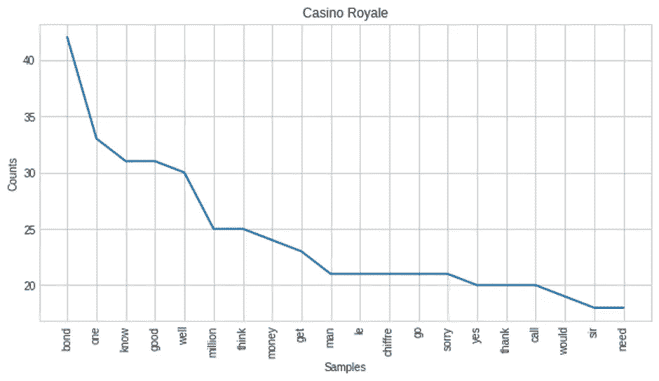
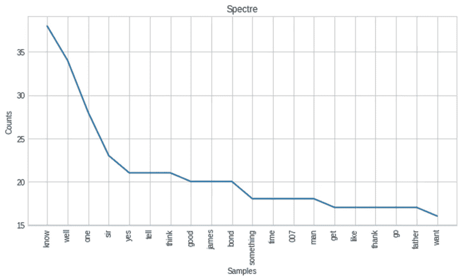

# 《詹姆斯·邦德:丹尼尔·克雷格时代》的对话分析

> 原文：<https://medium.com/analytics-vidhya/a-dialogue-analysis-on-the-james-bond-daniel-craig-era-bdefe37dabdc?source=collection_archive---------2----------------------->

詹姆斯·邦德电影是有史以来最好的间谍电影之一。随着电影技术和预算的普遍提高，“丹尼尔·克雷格时代”与之前的詹姆斯·邦德时代截然不同。

丹尼尔·克雷格一共出演了五部电影——《皇家赌场》(2006)、《量子危机》(2008)、《天崩地裂》(2012)、《幽灵党》(2015)和《死亡时间》(2021)。在此期间，他与多位导演合作，包括萨姆·门德斯和卡里·福永。

有很多关于这些电影的影评，所以我想到了一些仅仅基于电影对白的观察，并绘制一些可以帮助收集信息的图表。让我们从一个不同的角度来探究“丹尼尔·克雷格时代”。

[来源](https://i.pinimg.com/originals/73/29/31/732931a71184fc37b219edd35a94566e.jpg)

# **第一部分:对话 Vs 运行时**

在思考如何进行基于对话的分析时，我遇到了多种想法。我开始计算五部电影中每一部的用词数量。(我找不到它的对话数据集，所以我转换了字幕文件(。srt)转换为文本格式)

经过几个步骤的预处理后，我计算了每部电影的字数，并与相应电影的运行时间进行了比较。

快速分析后，我意识到我在标记不必要的符号(比如'.'或者呢？).这样的符号，虽然是句子标点所必需的，但并不是电影中的任何一个角色真正会说的！这意味着“口语单词”的计数比之前绘制的值高一点，因为这些不必要的符号被添加到总计数中。

因此，在删除这些符号并只保留数据中的口语对话后，图表看起来是这样的:

在这里，黄色三角形包含之前未处理的“口语单词”计数，而蓝色正方形仅包含电影中的口语单词(如“？”)或者“.”不是由字符发音的，它们已被删除)。

在观察图表时，我们可以看到数据点发生了平行移动，这意味着每个电影剧本中出现的符号在数量上或多或少是相同的！这里要注意的另一点(虽然很明显)是，电影持续时间越长，说话的字数就越高。

每部电影的最终总字数如下:

> 皇家赌场:6715 字
> 
> 安慰量子:6426 字
> 
> Skyfall: 7417 字
> 
> 厉鬼:7108 字
> 
> 没时间去死:9477 字

# **第二部分:常用词**

最常用的词可以帮助我们识别和分析给定上下文的模式。出于识别“丹尼尔·克雷格时代”模式的类似目的，我绘制了五部电影中最频繁出现的单词。

但是我没有搜索普通对话的频率列表，而是从输入文本中删除了“停用词”。停用词是最常见的词，通常不会给最终分析增加价值(例如，“the”、“is”、“in”、“for”、“where”、“when”、“to”、“at”等)。).

> **皇家赌场**

皇家赌场一词云

> **量子的慰藉**

量子安慰词云

> **天崩地裂**

天降词云

> **厉鬼**

幽灵词云

> **没时间去死**

来不及死字云

仔细观察，我们可能会发现这些图表中的每一个都有相似的模式，并且都呈指数下降！此外，看看 x 轴，我们可能会发现其中的一些常用词。

# **第三部分:常用词**

之前图表的 x 轴确实有一些常用词。这一观察促使我检查这五部电影中常见和频繁出现的词是否形成了一种有趣的模式。

在下面的图表中，我从每部电影对白脚本中出现次数最多的单词中提取了所有五部电影的常用单词数。简单来说，如果['嗯'，'知道'，'邦德']出现在所有五部电影中，同时考虑每部电影中出现频率最高的 10 个词，(10，3)将是图上的一个点。

有趣的是，这个图本质上是线性的！这意味着所有电影中常见单词的数量与“最频繁出现的单词”的数量成正比！

以下是五部电影中出现频率最高的 100 个常用词:['来'，'仍然'，'我们'，'人'，'名字'，'看'，'哦'，'可能'，'让'，'喜欢'，'寻找'，'回来'，'对'，'告诉'，'得到'，'去'，'时间'，'先生'，'需要'，'感谢'，'是'，'去'，'人'，'得到'，'想'，'好'，'知道'，'一个'，'债券']

如果你最近看了这五部电影中的任何一部，你可能会意识到上面的话在整部电影中不断被提及。

[来源](https://images.immediate.co.uk/production/volatile/sites/3/2020/12/daniel-craig-bond-1d24ba1.jpg?quality=90&resize=620,413)

对我来说，研究和分析“丹尼尔·克雷格时代”的对话是一个有趣的项目。仅仅基于电影的对话，我就发现了一些有趣的模式。

你可以在 [Github](https://github.com/SohamBhure/Dialogue-Analysis-James-Bond-Daniel-Craig-Era) 查看我的作品

感谢阅读:)