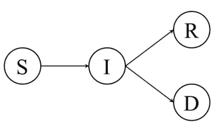
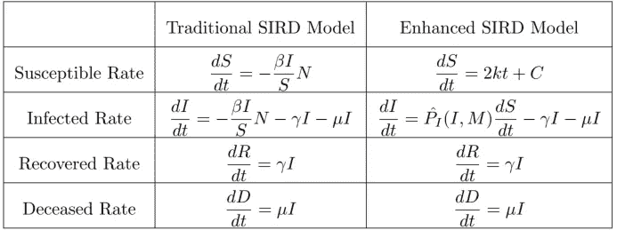

# COVID 的数据增强 SIRD 模型简介

> 原文：<https://medium.com/analytics-vidhya/a-gentle-introduction-on-data-enhanced-sird-model-of-covid-49f8216d4746?source=collection_archive---------29----------------------->

估计疾病的传播是流行病学中的一个重要课题，随机过程模型受到数学家和(生物)统计学家的青睐。在这些随机过程模型中，SIRD(易感-感染-康复-死亡)模型是一个受欢迎的选择，因为它具有一般但表达性的定义来捕捉病人状态的主要转变。SIRD 模型的演变需要一组预定义的参数，这些参数测量患者状态转变的可能性。传统上，这些参数可以使用流行病学知识根据经验得出，或者使用一些数学模型根据数字推断。如今，鉴于我们生活在数据时代，一个自然的方法是让数据驱动。

在这一系列博客中，我将分析 COVID 患者及其人口统计学信息之间的可能关系，并基于可用的美国 COVID 数据集提出一个增强的 SIRD 模型。然后，我将引入流动性数据作为 SIRD 模型参数的预测变量，并比较 COVID 的预测趋势和实际趋势。

在博客中生成结果的代码可在[https://github.com/zl3311/COVID_prediction_US](https://github.com/zl3311/COVID_prediction_US)获得。

照片由[联合国新冠肺炎回应](https://unsplash.com/@unitednations?utm_source=medium&utm_medium=referral)在 [Unsplash](https://unsplash.com?utm_source=medium&utm_medium=referral)

传统上，SIRD 模型假设整个人群有四种可能的疾病状态:

*   易感:潜在被感染的患者人数；
*   感染者:检测呈阳性的患者人数；
*   痊愈:被感染后恢复为阴性状态的感染者人数；
*   死者:被感染后死亡的感染者人数。

如图所示，SIRD 模型定义了患者的状态转换。

SIRD 患者状态转换

此外，SIRD 模型假设患者转变为其他状态的速率由微分方程系统控制，如本表左栏所示。

传统 SIRD 模型与增强型 SIRD 模型的比较

这里，N 是整个人口的数量，M 是流动性数据，这将在后面介绍。鉴于现有的和可观察的数据，我提出了一个增强的 SIRD 模型，如上表右栏所示。

具体来说，

*   对于易感人群，传统的 SIRD 模型假设每天新增易感病例与感染率(I/S)成正比，这意味着新增易感患者的数量与疾病的严重程度成线性比例。这种假设隐含地要求我有权了解每个人的真实状况，就医疗资源而言，要确切了解这一点过于昂贵。事实上，约翰·霍普斯金大学(JHU)公开提供的 [COVID 数据集](https://coronavirus.jhu.edu/data)只包含参加 COVID 测试的人数，可以是来自整个人群的一批有偏或无偏样本。鉴于这些样本的记录，我温和地将接受 COVID 测试的人群重新定义为易感人群。事实上，据观察，无论疾病的严重程度如何，这种新定义的易感人群在几乎所有州的增长几乎都是二次的。因此，我简单地用一个二次函数来拟合每个州的累计易感病例数，自然地，易感病例的每日增加与时间成线性关系。这一过程的结果将在后面的博客中介绍。
*   对于感染人群，在传统的 SIRD 模型中假设了相同的不可识别成分。然而，JHU COVID 数据集中有测试阳性病例的数量。同样，我重新定义了接受 COVID 检测和被检测为阳性的人群为感染人群。再加上记录的参加检测的人数，感染比例(或感染率)， ***P_I*** ，用每天的检测阳性病例除以每天的检测病例就可以估算出来。此外，鉴于尚未部署 COVID 疫苗，人们普遍认为主要的 COVID 控制政策是隔离。隔离水平的一个衡量标准是流动性，人们认为隔离会降低感染率。因此，我提出了一个回归模型，在给定所有州的当前感染数据和流动性数据的情况下，预测每日感染率，希望找出一些一般模式。该模型的细节将在后面的博客中介绍。
*   对于恢复和死亡人口，我使用与传统 SIRD 模型相同的固定比率。具体地说，我使用最新的累积恢复和死亡案例除以累积测试阳性案例作为恢复率和死亡率。

请注意，在传统的 SIRD 模型中，四个利率之和为零的性质成立。然而，对于提出的模型，这个性质不成立，这意味着整个人口的数量不是常数。尽管根据[世卫组织仪表板](https://covid19.who.int/)显示，美国拥有全球最多的 COVID 患者，并以可观的优势超过第二名(巴西),但死亡病例的绝对数量与美国总人口数量相比被认为是不可忽视的，我选择忽略这种不一致。

在接下来的两篇博客中，我将分别介绍相关数据集的[探索性分析](https://zl3311.medium.com/exploring-the-relationships-among-demography-mobility-and-covid-infection-bd465f12bb6c)和增强 SIRD 模型的[细节和结果](https://zl3311.medium.com/incorporating-machine-learning-into-traditional-sird-epidemic-model-8b9f97ec9449)。