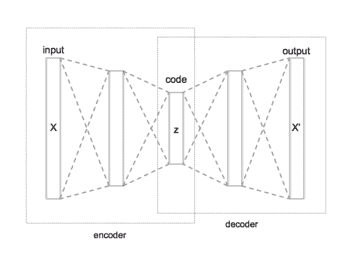
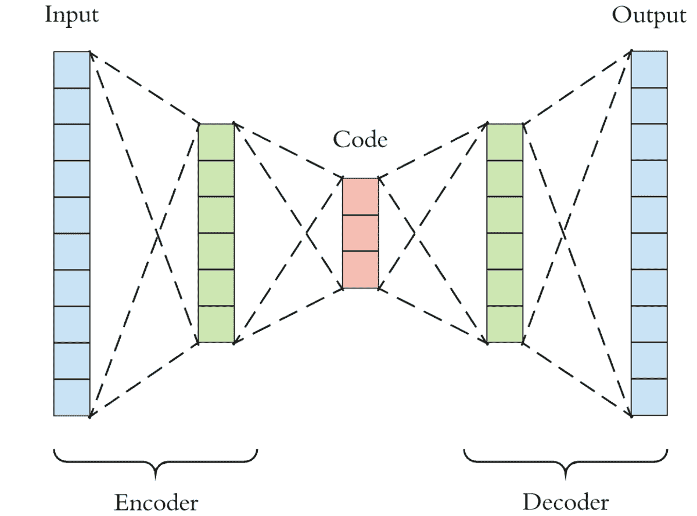

# 自动编码器简介

> 原文：<https://medium.com/analytics-vidhya/a-gentle-introduction-to-autoencoders-b456f407a337?source=collection_archive---------12----------------------->

定义:Autoencoder 是一种无监督学习方法，它使用神经网络来学习任务。

但仍然质疑到底什么是自动编码器，神经网络是如何用于无监督学习的？让我们在这里解决问题。

自动编码器模型包括三个部分，即:

1.  编码器
2.  代码层
3.  解码器

自动编码器

编码器接收图像，将其降级并以编码层的编码格式存储，然后由解码器解码。想象一下这样一种情况，我们使用一个具有较高内存值的图像，在给定的有限带宽内进行传输，这可能需要很长时间。将其编码成图像被转换成相对较小的存储器大小的格式，那么在这种情况下，时间和资源将逐渐减少。

关于在网络训练期间使用神经网络的无监督学习方法，我们给出相同的输入和目标数据，并使用该模式训练编码器、代码层和解码器，该模式在测试数据上充当无监督模型，其中解码器给出作为原始图像的输入编码图像作为输出。

现在让我们来理解它背后的数学概述:

让输入层表示为‘X’，代码层(编码层)表示为‘f(X)’,输出层表示为‘g(f(X))。输入层和输出层的尺寸是相同的。

为了从输入层到达编码层，对其应用非线性和线性函数的组合。函数“f(X)”可以表示为:f(X) = σ(wX + b)，其中 w 是权重，b 是偏差。

类似地，为了从编码层到达输出层，应用线性和非线性函数的组合。为了让网络学习，需要损失函数。为此，主要使用两个损失函数:

1.  二元交叉熵；

方程:Z =-[∑x ln(g(f(x)))+(1-x)ln(1-g(f(x)))]/m

1.  MSE(均方差):

等式:Z = ∑(x-g(f(x)))/2m