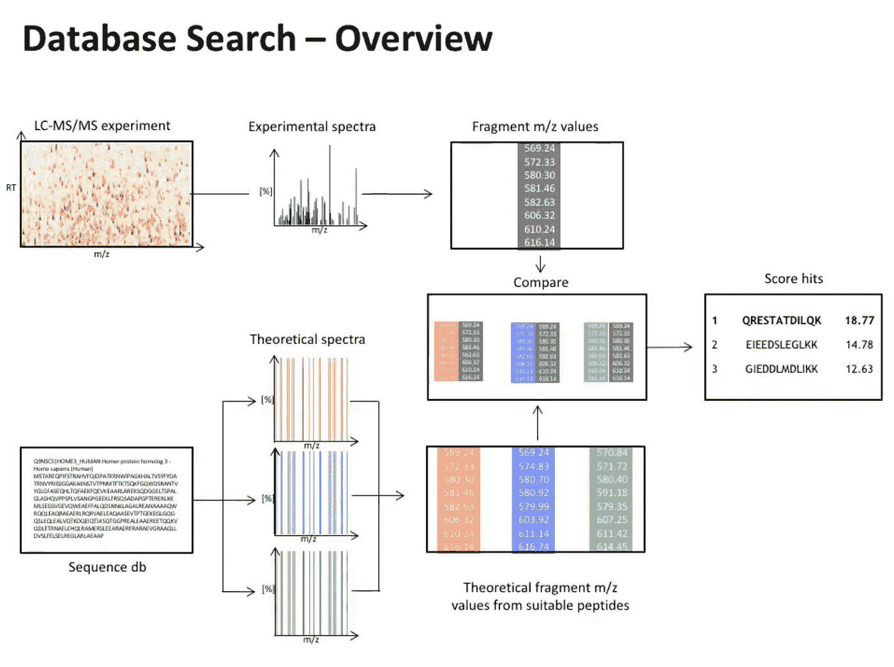
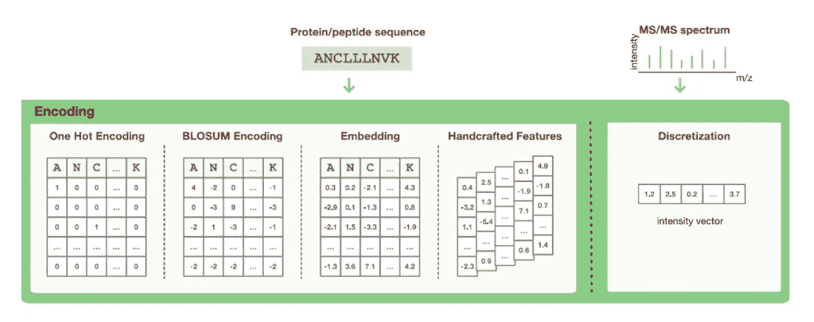
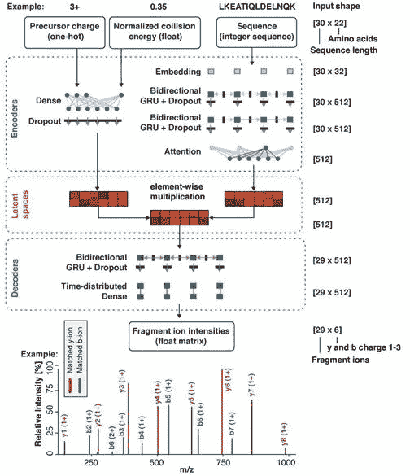
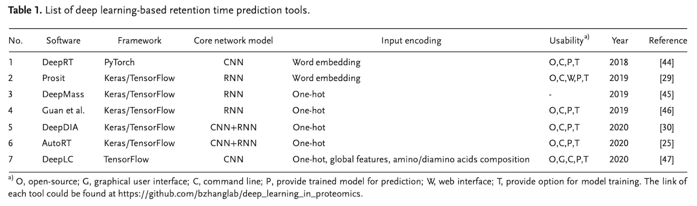
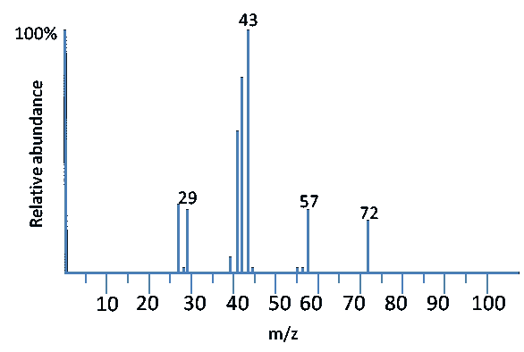
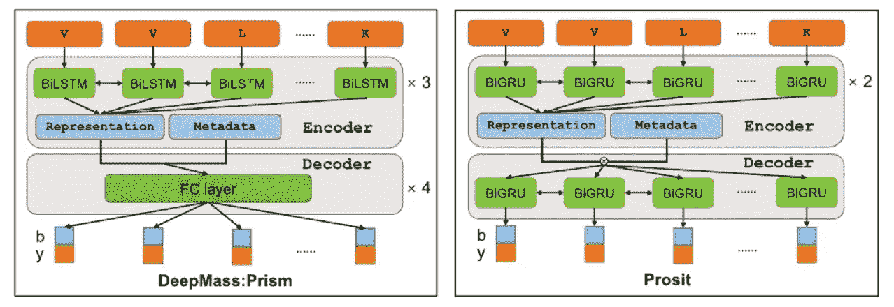
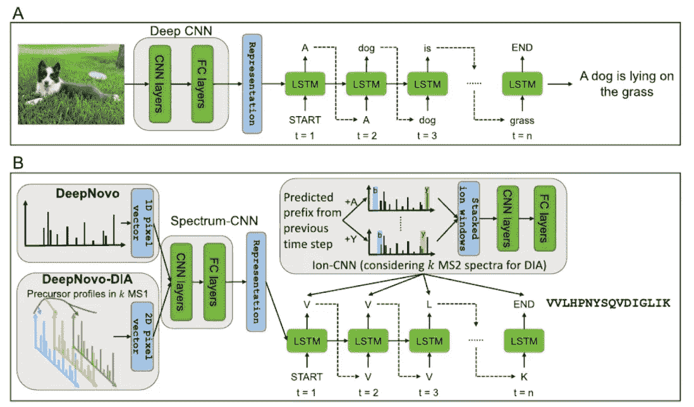

# 蛋白质组学中深度学习的温和介绍

> 原文：<https://medium.com/analytics-vidhya/a-gentle-introduction-to-deep-learning-in-proteomics-264cf8d7437d?source=collection_archive---------7----------------------->

micha Parzuchowski 在 [Unsplash](https://unsplash.com/photos/7TWRwDjfGew) 上的照片

在蛋白质研究中使用深度学习对于蛋白质组学领域的人来说并不陌生。然而，对于那些没有生物化学背景的人来说，准确把握机器学习在药物发现过程中扮演的角色可能是一个压倒性的话题。科学杂志 *Proteomics* 在 2020 年发表的论文“[蛋白质组学中的深度学习](https://analyticalsciencejournals.onlinelibrary.wiley.com/doi/epdf/10.1002/pmic.201900335)”向他们的读者——蛋白质组学社区——介绍了深度学习是什么以及它如何应用于蛋白质数据分析的全面概述。同样，本文旨在介绍数据科学领域的人员，以了解我们如何利用我们在蛋白质组学领域的知识。我将讨论生物信息学中的三个深度学习应用，并提供一些关于它们的基本背景。这些主题是:

*   保留时间预测
*   质谱光谱预测
*   从头肽测序

# 了解基本的

## **什么是肽，为什么它们很重要？**

**蛋白质**由氨基酸链组成，身体以各种方式将它们结合起来，以执行正常的身体功能。**肽**和蛋白质之间的区别在于肽的大小，肽包含两个或更多个氨基酸(一些生物化学家认为肽和蛋白质之间的界限约为 50-100 个氨基酸)。在药物发现和开发方面，[研究表明，肽可以帮助设计新的酶、药物和疫苗](https://www.thermofisher.com/us/en/home/life-science/protein-biology/protein-biology-learning-center/protein-biology-resource-library/pierce-protein-methods/peptide-synthesis.html)，并被认为是[癌症治疗的理想候选药物](https://pubmed.ncbi.nlm.nih.gov/29332577/)。另一方面，也存在导致遗传疾病且有害的突变蛋白。因此，准确识别蛋白质是蛋白质组学研究的主要目标之一。

## **什么是质谱(MS)？**

**质谱**是利用质量来鉴定蛋白质的技术。蛋白质被消化(分解)成肽，然后(以液化形式)注入一台名为**液相色谱-串联质谱(LC-MS/MS)** 的仪器中。该系统将检测并量化蛋白质样本中的分子，并产生包含两个主要特征的光谱图:**质荷比(m/z)** 和**强度**(有时称为相对丰度)。

## 什么是序列数据库和光谱库？

使用 LC-MS/MS 生成的质谱(标记为实验谱)，鉴定肽的工作流程的下一步是通过**序列数据库**将质量与肽联系起来(图 1)。该数据库搜索从基于具有给定误差容限的质量相似性从序列数据库中查询所有可能的肽候选物开始。对于每个候选序列，产生理论光谱(强度等于 1)并与实验光谱进行比较。搜索结束时，会报告相关分数高于某个阈值的所有肽谱。另一方面，**谱库**包含 LC-MS/MS 肽谱及其相应蛋白质序列的精选集合。

[图 1]来自视频的序列数据库搜索概述[数据库搜索和肽谱匹配](https://www.youtube.com/watch?v=q1Kdb8RjTh0&ab_channel=MayInstituteNEU)

**为了改善数据质量控制和缩短计算工作量，深度学习模型被集成到数据库搜索管道中，并用于帮助优化搜索效率。**这包括为未分类的肽序列生成光谱，以扩展光谱库和预测特征，如保留时间，从而在数据库搜索过程中获得更准确的鉴定(更多信息=更好的鉴定)。

# **编码方式**

在我们进入蛋白质组应用的逻辑和使用的模型类型之前，所有深度学习过程都需要数据预处理阶段。在这种情况下，我们如何将基于序列的数据转换和编码为数字形式。

[图 2]来自论文[蛋白质组学中的深度学习](https://analyticalsciencejournals.onlinelibrary.wiley.com/doi/epdf/10.1002/pmic.201900335)的用不同方法编码的蛋白质序列的例子

肽和蛋白质序列通常以一串字母给出，每个字母代表一种 21 个氨基酸(图 2)。转化这些氨基酸的最基本的方法是执行一键编码，并在不使用任何先验知识的情况下平等对待所有这些氨基酸。NLP 社区中另一个众所周知的方法是对由不同氨基酸的唯一整数组成的向量所表示的每个蛋白质序列进行**单词嵌入**。如果我们想要利用关于氨基酸对的进化信息，**块替换矩阵(BLOSUM)编码**方法通过 BLOSUM 矩阵中相应的行来表示每个氨基酸，这提供了关于在进化过程中氨基酸可互换程度的替换概率。

# 保留时间预测

## 基本想法

如上所述，LC-MS/MS 仪器用于提取肽混合物的单个组分。肽段在固定相和流动相中停留的时间称为**保留时间**。简而言之，我们可以把它想成检测蛋白质样本中一个分子所需的时间。准确预测保留时间是在数据库搜索过程中提高和评估肽段鉴定质量的一种方法。

## 深度学习方面

CNN、RNN 和混合网络是用于保留时间预测的最流行的深度学习架构。值得注意的是， [**Prosit**](https://pubmed.ncbi.nlm.nih.gov/31133760/) 是一款基于 RNN 的软件，具有编码器-解码器架构。RNN 能够捕捉序列中长程相互作用的过程使其成为模拟序列蛋白质数据的完美候选。Prosit 将肽序列的输入表示为长度为 30 的整数向量(较短的序列用零填充),并将数据编码为潜在表示，以捕捉不同氨基酸的内在关系。Prosit 的编码器流程包含一个嵌入层、一个双 GRU 层、一个递归 GRU 层和一个关注层(图 3)。为了避免来自 RNN 的消失和爆炸梯度问题，GRU 之门有助于调节信息流，并学会按顺序保存重要数据。然后，解码器将通过密集层对该表示进行解码，并做出保留时间预测。

[图 3]文章 [Prosit 的 Prosit 网络架构概述:通过深度学习进行肽串联质谱的蛋白质组范围预测](https://www.researchgate.net/publication/333406613_Prosit_proteome-wide_prediction_of_peptide_tandem_mass_spectra_by_deep_learning)

另一个值得注意的结合了 CNN 和 RNN 的软件是 [**AutoRT**](https://github.com/bzhanglab/AutoRT) 模型。独一无二的编码肽序列被输入 CNN 网络，然后是 GRU 网络。该软件还支持基于在 100，000 大小的公共肽数据集上训练的模型的迁移学习。研究人员可以对经过训练的模型进行微调，以开发特定于实验的模型。

[图 4]论文[蛋白质组学中的深度学习](https://analyticalsciencejournals.onlinelibrary.wiley.com/doi/epdf/10.1002/pmic.201900335)中近年来基于 DL 的保留时间预测工具列表

# MS/MS 光谱预测

## 基本想法

如上所述，为了收集质量信息，通过质谱或 MS/MS(两个质量分析器)将肽片段化并检测。下图是戊烷(CH3CH2CH2CH2CH3)的质谱图。我们可以将峰解释为对分子(或肽片段)的检测，并且假设检测的强度与零相关。同时，质荷比[通常等于分子的质量](https://bitesizebio.com/6016/how-does-mass-spec-work/)，因为大多数离子的电荷为 1。

[图 5]文章[中的戊烷光谱图示例质谱如何工作](https://bitesizebio.com/6016/how-does-mass-spec-work/)

## 深度学习方面

生成用于肽鉴定的谱库在计算上是昂贵且耗时的。因此，深度学习被用于预测肽序列的光谱，以帮助建立和扩展蛋白质数据库的覆盖范围。

一般而言，MS/MS 光谱预测模型输入一个热编码的肽序列，并输出沿着输入肽序列的每个位置的不同碎片离子类型的强度。有时，相关的元数据(如仪器类型、蛋白质消化方法)与肽序列一起被编码为输入。前面提到的软件 Prosit 使用相同的保留时间网络结构来预测 MS/MS 谱图。另一个基于 BiRNN 的模型调用[**deep mass:Prism**](https://www.youtube.com/watch?v=rSEZPt-e8J0&ab_channel=MaxQuant)使用的是 BiLSTM 网络，而不是 BiGRU 网络。两个软件都有一个限制，需要注意的是这两个模型需要固定长度的肽编码，因此它们不能预测长度过长的肽。

[图 6]论文[蛋白质组学中的深度学习](https://analyticalsciencejournals.onlinelibrary.wiley.com/doi/epdf/10.1002/pmic.201900335)中用于 MS/MS 谱预测的 DeepMass 和 Prosit 的简要网络架构

# 从头肽测序

之前，我讨论了深度学习的用例，以预测可以帮助改进使用蛋白质数据库识别肽的工作流程的特征(保留时间、肽谱)。但是如果我们想只从 MS/MS 谱中直接鉴定肽序列呢？这个概念被称为**从头肽测序**，它非常类似于深度学习中的图像字幕流程。在从头肽测序中，MS/MS 谱被视为图像，肽序列反映了我们想要预测的标题(图 7)。

[图 7] A)图像字幕的典型神经网络，DeepNovo 背后的神经网络架构，来自论文[蛋白质组学中的深度学习](https://analyticalsciencejournals.onlinelibrary.wiley.com/doi/epdf/10.1002/pmic.201900335)

从头肽测序的想法首先由软件 [DeepNovo](https://www.pnas.org/content/114/31/8247) 引入。DeepNovo 将 MS/MS 光谱转换为强度向量，对于高分辨率数据，长度为 500，000；对于低分辨率数据，长度为 50，000。该向量由 spectrum-CNN 处理以提取高级表示，然后用于初始化 LSTM 网络。对于每次迭代，LSTM 模型预测一个氨基酸。它通过使用来自先前测序步骤的信息来计算所有被考虑的氨基酸是下一个序列的概率。

# **结论**

在模型开发和应用方面还有很多工作和改进的空间。虽然已有大量基于 DL 的工具用于预测保留时间和 MS/MS 谱图，但它们仅适用于线性肽段，无法预测结构更复杂的肽段(如交联肽段)。对于肽从头测序，在迁移学习中存在一般化的问题。由于物种具有不同的蛋白质序列模式，用于在一个模型上训练的 MS/MS 数据可能无法很好地扩展到具有不同序列模式的物种。因此，如果数据科学界能够更好地理解蛋白质组问题的机制，我们就有更好的机会来帮助并提供关于如何改进现有深度学习模型的新见解。

## 参考

阅读更多关于深度学习在蛋白质组学中的其他主要应用的文章:

*   **蛋白质组学深度学习**[https://analyticsciencejournals . online library . Wiley . com/doi/epdf/10.1002/pmic . 2019 00 335](https://analyticalsciencejournals.onlinelibrary.wiley.com/doi/epdf/10.1002/pmic.201900335)

为了更深入地理解基本原理:

*   **生物质谱与蛋白质组学基础**[https://www . broadinstitute . org/files/shared/Proteomics/Fundamentals _ of _ Biological _ MS _ and _ Proteomics _ Carr _ 5 _ 15 . pdf](https://www.broadinstitute.org/files/shared/proteomics/Fundamentals_of_Biological_MS_and_Proteomics_Carr_5_15.pdf)
*   **质谱是如何工作的？**https://bitesizebio.com/6016/how-does-mass-spec-work/