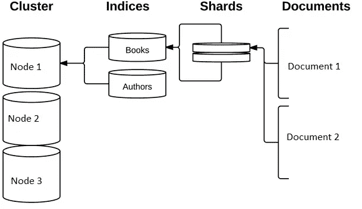
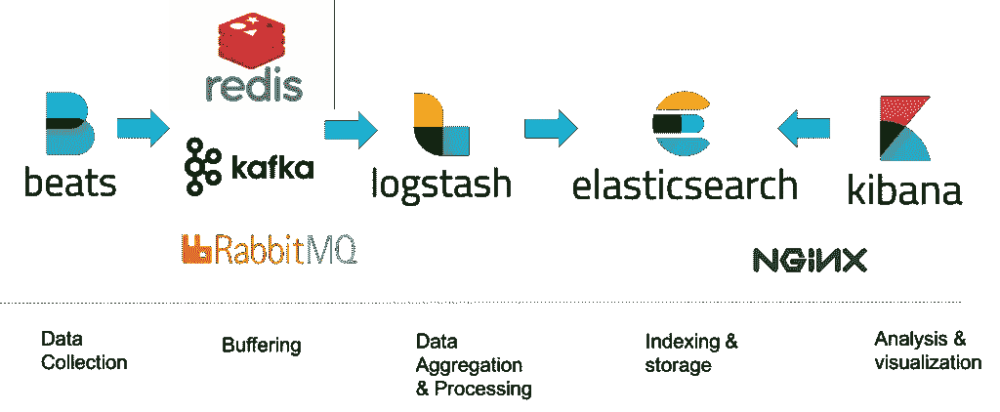

# 分析和机器学习时代的弹性搜索一瞥:

> 原文：<https://medium.com/analytics-vidhya/a-glance-to-elasticsearch-in-the-era-of-analytics-and-machine-learning-541d5c95c250?source=collection_archive---------4----------------------->

**什么是弹性搜索？**

想象一下这样一种情况，我有大量万亿字节大小的数据，我需要在其中搜索一个特定的术语。

当然，我必须为此使用工具。但遗憾的是，市面上的搜索引擎大多不是开源的。

这里弹性搜索开始出现。

弹性搜索是一个全文搜索、易于扩展的企业级分析引擎，适用于所有类型的数据，如文本、数字、地理空间、结构化和非结构化数据。它可以通过 RESTful web 服务接口访问，并使用无模式 JSON (JavaScript 对象符号)文档来存储数据。它是独立于平台的，这使得用户能够以非常高效的方式和非常高的速度从非常大量的数据中进行搜索。它支持各种用例，如允许用户轻松搜索任何门户网站，收集和分析日志数据，构建商业智能仪表板以快速分析和可视化数据。

**概念和组成:**

*图 1:弹性搜索概念(来源:W3 学校)*

**集群:**集群是一个或多个节点(服务器)的集合，这些节点一起保存全部数据，并提供跨所有节点的联合索引和搜索功能，这些节点应该用唯一的名称来标识。默认情况下，它是“elasticsearch”。“集群命名”是强制性的，因为通过其名称可以将节点设置为加入集群。我们不应该在不同的环境中重用相同的集群名称，否则我们可能会以节点加入错误的集群而告终。例如，我们可以将各个集群分别命名为 logging-dev、logging-stage 和 logging-prod，分别用于开发、登台和生产集群。

**节点:**节点是我们集群中的一个单独的服务器，数据可以存储在这里，它参与了集群的索引和搜索功能，这也应该用一个名称来标识。如果我们不想要默认的，我们可以定义任何我们想要的节点名。独特的“节点命名”对于管理非常重要，我们需要确定网络中的哪些服务器对应于 Elasticsearch 集群中的哪些节点。主节点管理整个集群。

**索引:**索引是具有某种相似特征的文档的集合。在单个集群中，我们可以根据需要定义任意多的索引。索引相当于关系数据库的模式。Elasticsearch 不是直接搜索文本，而是搜索索引。所以，它支持快速搜索响应。与检索类似，通过扫描书籍后面的索引，书籍中的页面与关键字相关，而不是搜索书籍每页的每个单词。这种类型的索引称为“倒排索引”，因为它将以页面为中心的数据结构(page- > words)转换为以关键字为中心的数据结构(word- > pages)。Elasticsearch 支持倒排索引，为此它使用 Apache Lucene 来创建和管理这个倒排索引。

**类型:**类型是存储索引映射的 Elasticsearch 元对象。

**别名:**别名是对一个 Elasticsearch 索引的引用，它可以映射到多个索引。

**文档:**文档是可以被索引的基本信息单元，可以用 JavaScript Object Notation (JSON)格式表示。连接查询返回父行和子行。

**碎片和副本:** Elasticsearch 提供了将索引细分为多个碎片的能力。当我们创建一个索引时，我们必须定义我们想要的碎片数量。每个碎片都是一个全功能的独立“索引”，可以驻留在集群中的任何节点上。Elasticsearch 允许我们将索引碎片的一个或多个副本制作成所谓的副本碎片，简称副本。创建索引后，我们可以随时动态地更改副本的数量，但是一旦配置好，就不能更改碎片的数量。

**REST API:** 客户端使用 REST API 通过 http 方法(GET、POST、PUT、DELETE)与 Elasticsearch 进行交互。

**NRT(近实时):** Elasticsearch 是近实时搜索平台之一。文档一旦被编入索引，就可以在不到 1 秒的时间内进行搜索。

**elastic search 如何表示数据？**

在 Elasticsearch 中，我们搜索一个文档，一个索引由一个或多个文档组成，一个文档由一个或多个字段组成，其中我们需要在索引文档之前指定一个模式，如果我们需要除了最基本的字段和操作之外的任何东西，就有必要添加映射声明。在数据库术语中，文档对应于一个表行，字段对应于一个表列。

映射是定义如何存储和索引文档及其字段的过程。当映射我们的数据时，我们创建一个映射定义，它包含一个与文档相关的字段列表。在 Elasticsearch 中，一个索引可能存储不同“映射类型”的文档。映射类型描述了将索引中的文档分成逻辑组的方式。要创建映射，我们需要“Put Mapping API”，或者您可以在创建索引时添加多个映射。

**什么是麋鹿栈及其组件？**

“ELK”是三个开源项目的缩写:Elasticsearch、Logstash 和 Kibana。Elasticsearch 是一个搜索和分析引擎。Logstash 是一个服务器端数据处理管道，它同时从多个来源获取数据，对其进行转换，然后将其发送到像 Elasticsearch 这样的“stash”。Kibana 允许用户通过 Elasticsearch 中的图表和图形来可视化数据。

*   **日志:**需要分析的服务器日志。
*   **Logstash:** 收集日志和事件数据。它甚至解析和转换数据
*   **ElasticSearch:** 来自 Logstash 的转换数据被存储、搜索和索引。
*   **Kibana:** Kibana 使用 Elasticsearch DB 来探索、可视化和共享存储的数据。Kibana 中的可视化可以分为以下五种不同类型:

o 基本图表(面积图、热图、水平条形图、折线图、饼图、垂直条形图)

o 数据(数据表、量表、目标、指标)

o 地图(坐标地图、区域地图)

o 时间序列(Timelion，可视化构建器)

o 其他(控制、降价、标签云)

**Beats:** 现代架构中最重要的是轻量级代理，安装在边缘主机上，收集不同类型的数据转发到堆栈中。不同 beat 收集的数据各不相同 Filebeat 收集日志文件，metricbeat 收集系统和服务指标，Packetbeat 收集网络数据，Winlogbeat 收集 Windows 事件日志等。一旦收集到数据，我们可以配置我们的 beat，将数据直接发送到 Elasticsearch 或 Logstash 进行进一步处理。

总之，这些不同的组件最常用于监控、故障排除和保护 IT 环境。Beats 和 Logstash 负责数据收集和处理，Elasticsearch 索引和存储数据，Kibana 提供了查询数据和可视化数据的用户界面。

**Kibana 仪表板:**一旦我们准备好了一组可视化工具，我们就可以将它们全部添加到一个称为仪表板的综合可视化工具中，这使我们能够以更简单的事件关联和趋势分析来监控环境。仪表板是高度动态的，可以编辑、共享、摆弄、以不同的显示模式打开等等。

日志管理和分析包括以下关键功能:

聚合—从多个数据源收集和发送日志。

处理—将日志消息转换成有意义的数据，以便于分析。

存储—长期存储数据，并支持监控、趋势分析和安全使用情形。

分析—通过查询数据并在此基础上创建可视化和仪表板来剖析数据。

如何使用 ELK 堆栈进行日志分析

**麋鹿栈的架构。**

对于小型开发环境，ELK 堆栈管道如下所示:

Beats(数据收集)->Redis，Kafka，Rabbit MQ(缓冲)-> Logstash(数据聚合和处理)->Elasticsearch(索引和存储)->Kibana(分析和可视化)

但是对于复杂的场景，管道如下所示:

Beats(数据收集)->Logstash(数据聚合和处理)->Elasticsearch(索引和存储)->Kibana(分析和可视化)

*图-2:有卡夫卡的麋鹿栈建筑(来源:*[*https://elastic-stack . readthedocs . io*](https://elastic-stack.readthedocs.io)*)*

通常，无限扩展的生产环境存在一个瓶颈:

Logstash 需要用管道和过滤器处理日志，这需要相当长的时间，如果存在日志突发，这可能会成为瓶颈；

Elasticsearch 需要对日志进行索引，这非常耗时，当日志突发时，这成为一个瓶颈。

上面提到的瓶颈可以通过添加更多的 Logstash 部署和扩展 Elasticsearch 集群来解决，也可以像所有其他 IT 解决方案一样通过在中间引入缓存层来解决。利用缓存层的最流行的解决方案之一是将 Kafka 集成到 ELK 堆栈中。

**工艺流程:**

数据通过 beats 收集并处理到 kafka，Kafka 可以作为一个数据中心，Beats 可以保存到 Kafka，Logstash 节点可以从 Kafka 消费日志，Logstash 从 Kafka 消费日志以进行日志处理。将数据输入 Logstash 的常见方式是通过 HTTP、TCP 和 UDP 协议。Logstash 可以使用各自的 [TCP](https://www.elastic.co/guide/en/logstash/current/plugins-inputs-tcp.html) 、 [UDP](https://www.elastic.co/guide/en/logstash/current/plugins-inputs-udp.html) 和 [HTTP](https://www.elastic.co/guide/en/logstash/current/plugins-inputs-http.html) 输入插件来公开端点监听器。经过处理后，处理后的日志存储在 Elasticsearch 中，并由 Kibana 用于度量可视化。

**实时用途:**

除了日志分析之外，下面是一些实时用例，在这些用例中，Elasticsearch 得到了广泛的应用:

1.**文本挖掘和自然语言处理(NLP):** Elasticsearch 作为搜索和分析引擎被广泛使用。以下是一些使用案例:

大多数 NLP 任务从标准预处理管道开始，例如:

1.收集数据

2.提取原始文本

3.句子分割

4.标记化

5.规范化(词干化和词汇化等..)

6.停用词删除

7.词性标注

A.预处理(标准化)

你用过' _analyze '端点吗？ElasticSearch 内置了 20 多个语言分析器。“分析器”是干什么的？标记化、词干化和停用词移除。对于更高级的任务，如机器学习、语言建模等，这通常是我们所需要的全部预处理。我们基本上只需要一个运行的 ElasticSearch 实例，不需要任何配置或设置。然后,‘analyze-endpoint’可以用作 NLP 预处理的 Rest-API。更多信息请访问:[https://www . elastic . co/guide/en/elastic search/reference/current/indexes-analyze . html](https://www.elastic.co/guide/en/elasticsearch/reference/current/indices-analyze.html)。

B.语言检测

“语言检测”是自然语言处理问题中的一个主要挑战。这可以通过安装 Elasticsearch 的另一个插件“langdetect”来解决。更多信息请访问:【https://github.com/jprante/elasticsearch-langdetect[。它使用 3-gram 字符和支持各种标准化和特征采样技术的贝叶斯过滤器。对 53 种语言的准确率超过 99%。是不是挺好的？该插件提供了一个“映射类型”来指定我们想要启用语言检测的字段。该插件提供了一个 REST 端点，我们可以在这里发布一个 UTF 8 格式的短文本，插件用一个可识别的语言列表来响应。当该查询被触发时会发生什么？](https://github.com/jprante/elasticsearch-langdetect)

它将分析我们的输入文本，这些文本要么来自索引中的文档，要么直接来自类似的文本。它将从该文本中提取最重要的关键字，并使用所有这些关键字运行“布尔”查询。

它怎么知道什么是关键字？

可以用公式来确定关键词，该公式将应用于一组文档，并且可以用于基于单词概率将文档的子集与所有文档进行比较。它被称为 Tf-Idf，这是一个非常重要的文本挖掘公式。与整个文档集相比，它为子集中的每个术语分配一个分数。高分表示一个术语更有可能标识或表征当前文档子集，并将其与所有其他文档清楚地区分开。

C.推荐引擎

基本上，推荐引擎可以分为两种类型:社会化和基于内容的。像亚马逊电子商务网站这样的社交推荐引擎被称为“协同过滤”,其中推荐发生在购买了该产品的人身上……另一种类型的推荐引擎被称为“基于项目的推荐引擎”,它试图根据条目的属性对数据集进行分组，用于回答“任何与我最近阅读的论文相似的小说或科学论文”

有了 Elasticsearch，我们可以轻松构建一个基于项目的推荐引擎。

我们只是根据我们的数据配置“MLT”查询模板。我们将使用实际的项目 ID 作为起点，并从您的索引中推荐最相似的文档。我们可以通过运行一个 bool 查询来添加自定义逻辑，该查询结合了一个函数 score 查询，以便在类似的查询之上增加流行度或最近度。“更像这样”(MLT)查询查找与给定文档集“相似”的文档。为此，MLT 选择这些输入文档的一组代表性术语，使用这些术语形成查询，执行查询并返回结果。用户控制输入文档、如何选择术语以及如何形成查询。更多信息请访问:[https://www . elastic . co/guide/en/elastic search/reference/current/query-DSL-MLT-query . html](https://www.elastic.co/guide/en/elasticsearch/reference/current/query-dsl-mlt-query.html)。

D.重复检测

如果我们有几个来源的数据(新闻、联盟广告等。)可能存在这样的可能性，我们正在将我们的模型运行到具有许多副本的数据集中，这对于大多数终端用户应用程序来说是不希望的行为。

它是如何工作的？

重复检测面临一个挑战:

我们需要成对地比较所有的文件。目标是保留第一个被检查的元素并丢弃所有其他元素。所以我们需要很多自定义逻辑来选择要查看的第一个文档。由于复杂性非常高，离线检测重复是非常困难的，但是的，在线工具非常需要这样做。用于重复检测的行业标准的通用算法是 Simhash 和 Minhash(由 Google 和 Twitter 使用)。它们为所有文档生成哈希，将它们存储在一个额外的数据存储中，并使用相似度函数，超过某个阈值的文档被视为重复。对于非常短的文档，我们可以使用 Levenshtein 距离或最小编辑距离。但是对于较长的文档，我们可能希望依靠基于令牌的解决方案。[https://www . elastic . co/blog/how-to-find-and-remove-duplicate-documents-in-elastic search](https://www.elastic.co/blog/how-to-find-and-remove-duplicate-documents-in-elasticsearch)。

**2。** **图像处理:**

你能想象如果有一个带有图像搜索功能的工具该有多好吗？

这可以通过 deep detect(【https://www.deepdetect.com/】)来解决。我们将图像发送到 Deepdetect，对图像进行注释，然后注释和图像 URL 被索引到 Elastic-search 中，无需任何粘合代码。Deepdetect 是一种分类服务，可以区分 1000 种不同的图像类别，从“救护车”到“挂锁”到“刺猬”，并将图像及其类别索引到弹性搜索的实例中。对于每个图像，Deepdetect 服务器通过避免深度学习服务器和弹性搜索之间的粘合代码，直接将预测的类别索引到弹性搜索中。DeepDetect 支持[输出模板](http://www.deepdetect.com/api/?shell#output-templates)，它允许将 DeepDetect 服务器的标准输出转换为任何自定义格式，这提供了搜索带文本的图像的功能，即使没有标题。它也是可扩展的，因为预测在批量图像上工作，并且多个预测服务器可以被设置为并行工作。以下是一些可以通过使用 deepdetect 解决的使用案例:

从二进制文件中检测无签名恶意软件

从原始流量日志中检测异常

从 SOC 警报中过滤误报

域生成算法检测

GPU 上的 URL 过滤和聚类

**3。** **附加应用:**

Elastic Stack 以及定制的弹性搜索插件有助于推动以下内容搜索体验:

基于计算机视觉和元数据的搜索

深度文本和混合内容搜索

视频和更丰富的格式搜索

企业搜索

发现和建议

**4。** **抓取和文档处理:**

StormCrawler 是一个流行且成熟的开源网络爬虫，它用来为搜索引擎提供文档索引，而 Elastic 是一个用于搜索和分析的开源工具，我们需要 StormCrawler 中的资源来实现这一点。弹性搜索模块中的 IndexBolt 获取由 StormCrawler 获取并解析的网页，并将其发送给弹性搜索进行索引。它构建一个文档表示，其中包含 URL、解析器提取的文本以及解析期间提取的任何相关元数据，如页面标题、关键字、摘要、语言、主机名等。StormCrawler 附带了各种用于数据提取的资源，可以很容易地进行配置或扩展。

StormCrawler 与其他网络爬虫的区别在于，它也使用弹性搜索作为存储的后端。弹性搜索是实现这一目标的绝佳资源，它提供了数据的可见性和出色的性能。弹性搜索模块包含许多 spout 实现，它们查询状态索引以获取供 StormCrawler 获取的 URL。更多信息请访问:[https://www . elastic . co/blog/storm crawler-open-source-we B- crawler-strengthed-by-elastic search-ki Bana](https://www.elastic.co/blog/stormcrawler-open-source-web-crawler-strengthened-by-elasticsearch-kibana)。

5.**多重租赁**:

通常，我们有多个客户或用户拥有不同的文档集合，一个用户永远不能搜索不属于他的文档。然后我们最终得到一个设计，每个用户都有自己的索引。通常，这导致了太多的索引。几乎在每种情况下，我们都看到实现了每用户索引，而我们可以有一个更大的弹性搜索索引来解决拥有大量小索引的以下缺点:

内存开销是可以控制的，因为成千上万的小索引会消耗大量的堆空间。

可能会有很多重复。

**结论:**

使用弹性搜索可以学到很多东西，有时很难知道自己需要学习什么。在本文中，我介绍了相当多的常见用例，以及所有这些用例需要注意的一些重要事项。