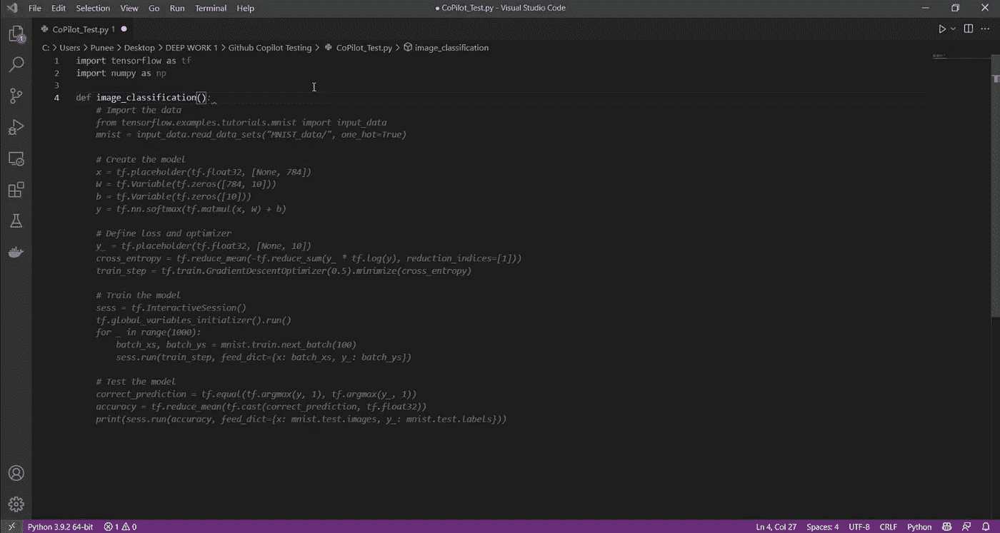

# 编程未来一瞥:GitHub CoPilot

> 原文：<https://medium.com/analytics-vidhya/a-glimpse-into-the-future-of-programming-github-copilot-eebb46eb2a01?source=collection_archive---------0----------------------->

# 介绍

> 为什么需要副驾驶？我以为你是软件开发员？？

是的，你说得对。我是。但是每个人都可以在人生的某个时刻使用副驾驶。公平地说，自从 OpenAI 宣布他们正在与 GitHub 合作一个“产品”以来，这种情况就注定会发生。

GitHub 的 CoPilot 是一个代码自动完成工具，由一个语言模型提供支持，该模型在 GitHub 上所有免费的公共代码库中进行了训练。这是非常强大的，因为我们将看到以后，似乎是非常抛光的第一次尝试。这是因为它不是。

代码自动完成是一个非常流行的挑战，过去有相当多的团队尝试过——基于研究的、商业的以及介于两者之间的。CoPilot 只是 GitHub 和 OpenAI 的一种尝试，旨在制造一种在现实世界用例中作为工具有点可行性的产品，即，用它来帮助你编写代码，而不是让它自己编写代码。

# 获取访问权限

毫不奇怪，每个对深度学习、NLP、机器学习、软件开发感兴趣的人，甚至只是对人工智能普遍好奇的人，都想尝试一下 CoPilot。不幸的是，这是不可能的…但有可能的是排队等候。我向 copilot 发送了一个测试访问请求，并加入了非常拥挤的等待名单。

我耐心地等待着，阅读人们正在尝试使用 CoPilot 的东西，观看人们以视频、应用程序和博客的形式发布的各种内容，讲述这种体验是多么令人惊叹，他们期待着这款产品，直到有一天-

GitHub 非常友好，允许我在不到一个月的等待时间内使用它(不，这不是/s，有些人甚至在 2-3 个月后仍在等待)。我兴高采烈，马上就开始写了(因此，由于过去一个月缺乏内容，我没有写太多，主要是因为我在空闲时间测试 CoPilot)。

# 一些锅炉板信息，然后我们再进一步

所以 CoPilot 目前作为 Visual Studio 代码的一个插件。您需要使用您的 GitHub 凭证登录，一旦您同意使用 copilot 的一些条款和条件，一个小的 CoPilot 图标就会出现在您状态栏的右下角。您可以使用此图标打开或关闭 CoPilot，并且您已经准备好使用它。

当你用 https://copilot.github.com/上提到的任何一种受支持的语言启动一个脚本时，你会看到代码建议。您可以通过按 Tab 键或使用 Alt+](下一个)和 Alt+[(上一个)在多个建议(如果有多个建议)之间滚动来选择接受建议。

现在，正如 GitHub 和 OpenAI 自己所提到的——CoPilot 最好作为你自己编程的补充工具。是的——这是一个全功能的多行多语言代码自动完成功能，但它远非完美——说真的，差得很远。

我使用 python 测试它，主要是因为我使用 Python、Java 和 C 语言最多，并且有这方面的经验，但它支持 JavaScript、Go、TypeScript、Ruby、C++和 C#等。最近，增加了对 JetBrains 的 IntelliJ 的支持。

# 测试

所以使用副驾驶的最好方法是将你的大程序分解成小函数，然后编写函数存根——等待副驾驶的建议。

下面是当我将 numpy 和 tensorflow 导入测试脚本并声明一个单一的图像分类函数时，它是如何处理图像分类的:

建议 1

当然，代码并不完美——但是它能够一次性处理这么大的函数。只有当前脚本和函数名“image_classification ”,它生成了用于导入 mnist 数据集和执行分类和评估的代码。

我又试了一次:

建议 2

这一次，我再次得到一个建议，加载 mnist 数据集并对其执行分类——但不使用 sequential model 类。这次使用了交叉熵损失，还打印了精度和预测结果。

我又试了一次:

建议 3

这一次，我又回到了第一个建议上，只是做了一点小小的改变——也做了预测。

任何这些建议，实际上都不坏。事实上，只需稍加编辑，您就可以使用这段代码制作一个实际的图像分类脚本。

根据它可以在文件中收集的上下文，建议可能会变得疯狂。然而，决不会无法使用。

现在，如果我把这个函数分解成更小的函数:

不仅代码内部保持了连续性——而且可读性、可重用性和通用性更强。

# 一些总结性的想法

正如广告所说，在大约 10 次左右的尝试中，CoPilot 似乎完成了任务。它不会给你答案，但它产生的结果似乎足够接近了。

我自己的经验让我相信，随着 Codex(后端的模型)看到更多的版本和改进，它会变得更好。目前，它在 43%的情况下提供正确的结果。

如果允许尝试 10 次左右，这个数字会上升到 57%。如果你把为一个给定的问题建立解决方案的原型所节省的时间考虑在内，那就太疯狂了。将这些建议串联在一起可能会给你想要的结果——然而，这在我脑海中浮现出三个重要的问题，我觉得值得分享:

1.  如果你所做的只是使用 CoPilot 的建议并对其进行编辑，你真的能解决问题吗？
2.  谁真正拥有生成的代码？
3.  这基本上不就是，出轨吗？我的意思是，未来使用 CoPilot 或 like-wise 产品会有哪些更道德/哲学的含义？

到目前为止，我还没有答案。如果这个演示看起来相当唐突和简短，我很抱歉，但这就是我现在所知道的。我确实计划制作几个更有血有肉的副驾驶用法的例子，但在大多数情况下，我已经迟到了。

为了节省时间和减少冗余，我已经包含了一个到 OpenAI Codex 演示的链接。如果你有兴趣看它的运行。

这就是我现在的大部分内容。从 12 月份开始，我会每个月发两次帖子。敬请关注，还有更多精彩。

## 链接:

由 Károly Zsolnai-Fehér 博士进行的开放法典演示:([https://www.youtube.com/watch?v=81rBzfbFLiE&ab _ channel = two minutes papers](https://www.youtube.com/watch?v=81rBzfbFLiE&ab_channel=TwoMinutePapers)