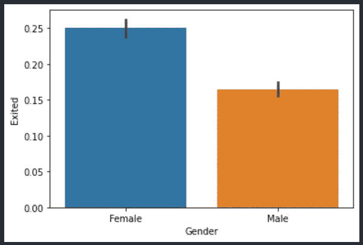
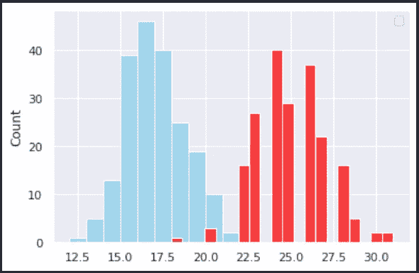
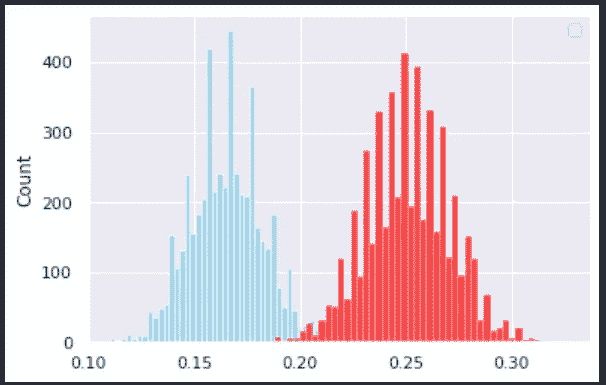

# 如何使用 Python 代码模拟和可视化假设检验的指南

> 原文：<https://medium.com/analytics-vidhya/a-guide-on-how-to-simulate-and-visualize-hypothesis-tests-using-python-code-66861e0d0f74?source=collection_archive---------10----------------------->

我们将使用信用卡流失数据集来演示蒙特卡罗模拟的使用

假设检验，如果操作得当，有助于从数据中分离信号和噪声。然而，为假设检验计算度量标准可能是相当枯燥的。在线工具和电子表格让我们能够轻松地进行假设检验。然而，它们隐藏了为了计算结果而发生的计算。鉴于此，数据科学学习者很容易放弃假设测试，特别是在机器学习和深度学习中更酷更花哨的统计建模技术面前。

在这篇博客中，我将展示一种替代假设检验的方法，这种方法相对来说更容易理解，实施起来更有趣，并且可以适用于多种多样的场景。

**蒙特卡洛模拟**

蒙特卡罗模拟用于模拟各种概率事件。它希望通过以概率模拟的方式重复一个事件来捕捉众多可能的结果，直到获得许多观察结果。这种方法的优点是能够以简单得多的方式解决复杂的问题，并且结果容易解释。

这种方法是以摩纳哥一个受欢迎的赌博目的地命名的。巧合的是(或者不是)，当斯坦尼斯劳·乌拉姆发现蒙特卡罗方法时，他正试图描绘出一场纸牌游戏的可能结果。

蒙特卡洛方法是斯坦尼斯劳·乌拉姆在试图模拟单人纸牌游戏的可能结果时发现的

你会发现蒙特卡洛模拟在广泛的领域得到应用，包括但不限于金融、供应链、项目管理、工程等等。

在这篇博客中，我将谈论我们如何在推理分析的背景下使用这种方法来更好地理解、解释和呈现结论。

**数据和问题陈述**

在这个实验中，我们使用来自 Kaggle 的[流失建模数据集。客户流失建模是一个问题陈述，我们试图预测客户在给定的时间内是否会取消订阅某项服务(在这种情况下，是他们的信用卡)。流失也称为损耗。](https://www.kaggle.com/shubh0799/churn-modelling)

然而，知道一个独立变量是否对响应变量有任何影响通常是有用的。假设检验是检验独立变量是否对响应有任何影响的常用方法。例如，一家公司的主管可能想知道折扣(独立变量)是否对销售(响应变量)有任何影响。

为了解释假设检验是如何工作的，我们将使用客户流失模型数据，看看我们是否发现客户的性别(独立变量)对他们是否会选择在一年内离开信用卡公司(响应变量)有任何影响。

**假设**

这个假设构成了我们实验的基础，其余的步骤都是在这个基础上进行的。在这里，我们为我们的实验定义零假设和替代假设。

胡先生:男性和女性呕吐的比例没有显著差异。或者 p1 = p2。

H1:搅拌的男性比例和搅拌的女性比例之间存在显著差异。还是 p1！= p2。

我们假设 alpha 值为 0.05(如果你不知道 alpha 值是什么意思，不用担心，我们会在博客后面讨论这个问题)。

我们的目的是检查是否有足够的证据来拒绝零假设。请注意，我将在本博客的不同地方称之为比例，作为样本统计。我们使用这个术语是因为我们不知道离开的男女顾客的实际比例。相反，我们不得不利用从人口中提取的样本数据。

**数据**

为了找出特定性别是否有更高的流失可能性，我们从可视化数据集开始。

女性的比例显然更高，但是足够高吗？

在上面的图表中，我们直观地显示了停止使用信用卡的男女比例。数据显示，在 5457 名男性中，约有 900 人离开了信用卡公司。女性的这一数值分别约为 4 543 和 1 140。

尽管很明显，妇女的比例更高，但在没有进一步分析的情况下，很难说比例上的差异是否显著。

自然，问题就出现了，什么样的统计技术可以用来检查显著性。

**自举**

Bootstrapping 或 bootstrap 抽样是统计中的一种(重采样)技术，在估计人口指标时使用。

为了执行引导，我们用替换从样本数据集中选取数据点。选择的数据点将形成我们的新数据集。作为在引导期间使用替换进行采样的结果，相同的观察结果可能在我们的新数据集中出现多次(这不会产生关于统计分析的任何问题)。

如果你仍然感到困惑，那么请参考我在下面添加的链接，参考更多关于自举的材料。

我们也为女性顾客做同样的事情。对于这样创建的每个数据集(每个数据集包含来自原始数据集的 500 个样本)，我们计算离开服务的人的比例。因此，我们现在可以使用获得的样本比例创建一个抽样分布(使用 200 个样本统计)。

我们现在有两个抽样分布。一个面向女性顾客，另一个面向男性顾客。如果我们假设每个比例都是随机变量(因为它们符合定义，所以我们可以这样做)，我们可以将抽样分布视为一个直方图，表示它可以取的值以及这些值出现的频率。

如果为两种性别绘制的直方图明显重叠，我们可以确信这两个比例之间没有显著差异(反之亦然)。

说了这么多，还是来看看结果吧…

退出的男性(蓝色)和女性的比例分布

下面的几段可能需要一些时间来理解，所以如果你没有马上理解也不要担心…

上述结果是在我们创建 200 个数据集时获得的，每个数据集有 500 个自举样本(换句话说，我们重新创建了随机变化 200 次的实验，每次在我们的数据中获得 500 个样本)。换句话说，我们创建了一个概率分布来说明样本比例的潜在可变性。因此，我们试图看到*样本比例可以采用的所有值*(通过考虑随机变化)以及每个值的可能性。

这导致了两个潜在的结果。首先，可变性可能无法解释观察到的比例差异。在这种情况下，何可以拒绝。或者，在考虑可变性之后，我们可以观察到样本比例的值有很大的重叠。在这种情况下，我们可以宣布，我们没有找到足够的证据来拒绝 Ho。

我们可以看到，这两个样本中重叠的比例非常小。因此，即使没有进一步的计算，我们也可以得出结论，这两个比例之间存在显著差异。然而，如果结果不是那么明显呢？或者，如果我们想要将我们的结果量化为一个数字，以便将其添加到报告中，该怎么办？

**P 值**

p 值是观察到的值等于或大于假设零假设为真时观察到的值的概率。因此，在我们的案例中，我们预计两种性别的采样分布中的大量重叠对应于高 P 值，反之亦然。

**P 值=相交样本数/观察样本统计总数**

通常，阈值设置为 0.05。在大多数情况下，如果 P 值低于 0.05，我们可以声称我们的数据不支持零假设。

现在是强调该阈值(也称为α值)在统计分析之前陈述的好时机，即在陈述无效假设和替代假设时。这种做法确保了在获得 p 值以获得有利的结果(在大多数情况下恰好是拒绝 Ho)之后，alpha 不会被调整。

你会问，我们在实验中获得的 p 值是多少？嗯，原来是 **0.0018** 。这意味着如果我们假设这两个比例相等，那么我们得到样本分布的几率只有万分之十八。换句话说，我们的数据表明，客户的性别对他们是否会离开公司有重大影响。

这个结果是有意义的，因为它与我们绘制的图表一致。

**替代的、计算效率更高的方法**

自举需要很长时间，而且计算量很大。相反，我们可以通过给每个结果分配加权概率来实现蒙特卡罗模拟。加权概率决定了一个结果的可能性。例如，如果我们假设在一个不公平的硬币中，反面的结果的权重是正面的两倍，那么从长远来看，我们将期望正面出现的次数是反面的两倍。在我们的例子中，在 python 模拟过程中得到 1(表示退出的人)的权重相当于原始数据集中退出信用卡服务的人的比例(参考第一个条形图)。

在这种方法中，我们可以生成一个由 1 和 0 组成的字符串(表示客户是否退出)，其出现的概率根据其在原始数据集中的出现情况进行加权。如果你仔细考虑一下，你会发现这种方法的结果相当于自举。接下来，一旦我们有了几个相同的样本，我们就可以计算每个数据集里退出的人的比例。

然后，我们在单个样本中生成 1000 个观察值，并将该过程重复 10，000 次。这就像我们有 10，000 个不同的可能数据集，每个数据集有 1000 个观察值！这比我们在以前的方法中实现的要多得多，但只是时间的一小部分。这都归功于 numpy 的效率！

从那里，我们可以遵循与前面类似的步骤。我们找到每个统计的样本比例，并作出概率分布(见下文)。

然后，我们可以使用 p 值并将其与我们的显著性水平进行比较，从而得出最终结论。

这种方法比允许我们增加样本大小的自举法更有效；如果你学过 STATS101 课程，你会知道更大的样本量意味着更小的误差幅度，从而导致更大的确定性。现在，不需要天才就能明白，更多的确定性总是好的！

从第二种方法获得的直方图

另一种方法给出的 p 值为 0.0022，这与我们的可视化以及之前的结果一致。

**总结**

我们进行了假设检验，以发现退出的男性比例与同样退出的女性比例是否存在显著差异。

为了进行分析，我们使用了自助抽样方法。我们还用另一种等效但更有效的技术重复了这个实验。这两种方法对应的是实现技术上完全相同的实验设置的不同方式。

我们学习了 p 值以及如何在我们的使用案例中计算它。根据给定的数据，我们能够得出结论，然后将这些结论报告给相关部门，这些部门可以使用这些数据进行决策或进一步分析。

**附加资源**

1.  [用蒙特卡罗模拟计算圆周率的值。](https://www.youtube.com/watch?v=VJTFfIqO4TU)
2.  简单解释传统假设检验的工作原理。https://www.youtube.com/watch?v=2tuBREK_mgE[https://www.youtube.com/watch?v=VJTFfIqO4TU](https://www.youtube.com/watch?v=2tuBREK_mgE)
3.  [自举方法简介(machinelearningmastery.com)](https://machinelearningmastery.com/a-gentle-introduction-to-the-bootstrap-method/)
4.  [通过模拟进行假设检验(duke.edu)](https://www2.stat.duke.edu/courses/Fall19/sta199.001/slides/lec-slides/10b-sim-test-pt2.html#1)
5.  [模拟和排列(R)](http://faculty.washington.edu/kenrice/sisg/sisg-lie11-05.pdf)
6.  [假设检验基础知识](https://www.khanacademy.org/math/statistics-probability/significance-tests-one-sample)