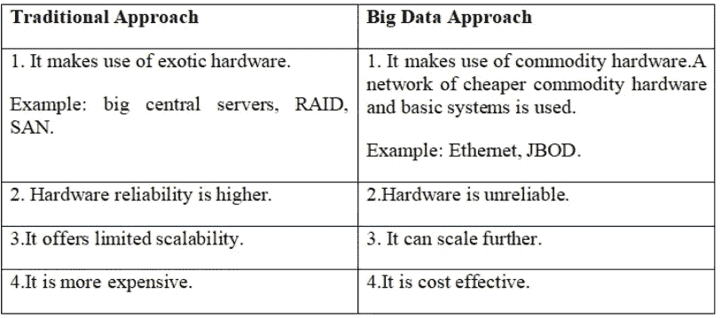
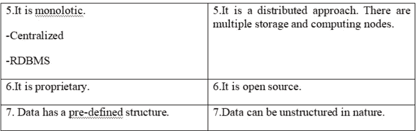

# 大数据分析指南

> 原文：<https://medium.com/analytics-vidhya/a-guide-to-big-data-analytics-734fad1d9e5?source=collection_archive---------16----------------------->

随着超过 37 亿人使用互联网，每秒钟超过 40，000 次谷歌搜索，每分钟发送 1，600 万条短信，产生的数据量呈指数级增长。大数据是指从各种来源收集的海量数据集，用于满足业务需求，揭示优化决策的洞察力。例如，与人类行为和互动相关的社交媒体数据被用于情感分析，以帮助推动业务发展、预测政治等。

想知道是什么导致了大数据分析吗？以下是其背后的计算趋势。

> 网络社交
> 
> 云计算
> 
> 移动计算机处理技术

为了更深入地了解这种大数据，让我们来看看大数据的特征，也就是俗称的 7 V。

*   体量:这个特性指的是大数据应用过程中产生的海量数据。生成的数据量和存储容量都非常庞大，通常以 Pb 为单位。例如，企业收集大量数据，包括从商业交易、交易和投资、社交媒体帖子等收集的数据。通过分析这些数据，我们可以获得切实可行的见解，并帮助企业在市场中获得竞争优势。
*   多样性:这是指数据的类型和性质。大数据可以是结构化的、非结构化的或半结构化的。

1.结构化数据——可以以固定的格式存储、处理和访问。它包括以有序方式存储在行和列中的数据。结构化数据的例子:数据库中的数据。

2.非结构化数据-具有未知的格式。数据量巨大，从中获取价值并不容易。数据可以包含文本文件、视频和图像的混合。非结构化数据的示例:音频、视频文件。

3.半结构化数据——包含结构化和非结构化数据。半结构化数据的例子:电子邮件和博客。

*   速度——指数据生成的高速度。这些数据也需要以更高的速度进行处理。例如:Twitter 消息或脸书帖子；GPS 数据和行为数据用于向公众推荐附近的餐馆。
*   准确性:指被分析数据的质量。数据必须准确真实。准确性在大数据处理中非常重要，因为任何不准确、虚假和无意义的数据都会产生不利后果。例如，使用过时的销售数据来推出新的营销/销售活动将毫无意义，也不能提供有用的预测。
*   价值:洞察力必须从可用的数据中获得，这样它才是有用的。例如:员工年龄、经验、资格等数据。可以被分析以确定工资。
*   可视化——使用图表和图形来可视化大量复杂的数据比电子表格和报告更能有效地传达意思。它有助于数据的可读性、可理解性和可访问性。示例:使用条形图来表示销售额的增长。
*   可变性:指持续不断变化的数据。它侧重于理解和解释原始数据的正确含义。如果数据不断变化，那么它会对您的数据质量产生影响。例如，一家汽水商店可能提供 6 种不同的混合汽水，但如果你每天都买同一种混合汽水，而且每天的味道都不一样，这就是可变性。

现在我们知道了大数据的属性，但很明显，传统系统不足以处理它。这些大数据需要以不同的方式处理。让我们看一下传统和大数据分析方法在硬件和软件方面的比较。

在硬件的基础上:

在软件的基础上:

## 大数据挑战

1.数据集成——组合不同来源的数据并生成有意义的报告可能是一项复杂的任务。

2.数据复杂性——输入原始数据变得越来越复杂。复杂的数据结构和架构，并需要处理它。

3.数据安全性—大数据分析流程容易受到各种安全威胁和攻击。防火墙、访问控制、加密等安全措施也用于处理同样的问题。

4.数据采集也可能是一项复杂的任务。今天需要各种数据捕获技术。

5.数据移动性和可扩展性

## Hadoop

Hadoop 是一种基于 java 的大数据分析工具，用于在存在海量数据时填补传统方法中的空白和陷阱。它是一个开源框架，用于在商用硬件集群上存储数据和运行应用程序。它提供了海量存储和处理数据的巨大能力。它基于硬件故障是可能的并且必须由框架处理的假设。其核心组件包括:

> HDFS (Hadoop 分布式文件系统)
> 
> MapReduce

Hadoop 将大型数据文件分割成块或片段，在集群中的节点间分发，并将代码转换为数据以实现并行处理。数据是本地可用的，并且更少的进程间通信时间允许更快的处理。Hadoop 的另一个重要特性是数据冗余，因此可以轻松管理节点故障。

## Hadoop 环境

*   Hadoop Common——包括 Hadoop 模块所需的库
*   HDFS——模仿 Google 文件系统(GFS)论文的分布式文件系统。它是 Hadoop 的存储组件，支持数据复制和容错。
*   map Reduce——模仿 GFS 论文的分布式框架。它是 Hadoop 中的计算组件，允许并行处理大量原始数据。
*   Hadoop YARN-资源管理平台，用于管理集群中的计算资源，并使用它们来调度用户的应用程序。

在我的下一篇博客中，我们将进一步探讨 HDFS、MapReduce 和 Hadoop 生态系统。