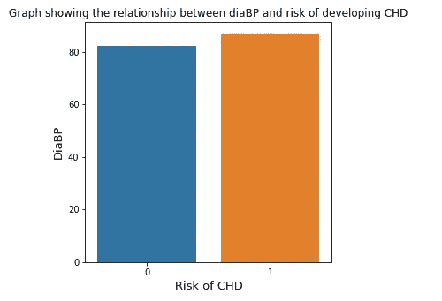
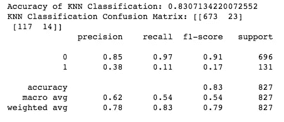

# 构建首个数据科学项目的指南

> 原文：<https://medium.com/analytics-vidhya/a-guide-to-building-your-first-data-science-project-e5f814b098a7?source=collection_archive---------1----------------------->

## 从头到尾


“步入”数据科学领域

我们听说过一些流行词汇:*数据科学、机器学习、预测建模*但是它们是什么意思呢？我们如何在现实世界中使用这项技术来做出有影响力的决策？

这个端到端项目就是为了展示这一点而创建的。

[数据科学](https://www.ibm.com/cloud/learn/data-science-introduction)可以定义为科学方法、数学、专业编程、高级分析、人工智能和讲故事的结合，以揭示隐藏在数据中的商业洞察力。让我们简化这个定义:我将数据科学描述为从更大的数据源中获取有用信息的过程。

那么，我们如何知道哪些信息是有用的呢？这就是机器学习的用武之地。机器学习为系统和用户(像我们一样)提供了使用*算法根据我们的数据捕捉隐藏见解的能力。*算法通过接受输入数据，使用统计建模来预测输出值。

有两种机器学习任务，它们是根据输入数据的类型来区分的。*监督学习*在开发模型时使用标记输出来显示输入和输出数据之间的关系。*无监督学习*没有明确标记的输出，因此只使用给定的数据点集开发模型。

我们可以根据结果类型进一步分割监督学习:*分类*，其中我们的预测结果是二元的(0/1)或*回归*，其中我们的预测结果是连续的。当处理机器学习问题时，理解结果的类型很重要——两种问题类型之间的思维过程和方法是不同的。

***本文将使用弗雷明汉心脏研究[数据集](https://www.kaggle.com/amanajmera1/framingham-heart-study-dataset)详细介绍端到端项目*** 的步骤。该数据来自一项正在进行的对马萨诸塞州弗雷明汉个人的心血管研究，研究参与者根据 15 个不同的变量监测冠心病(CHD)的风险。利用这个数据集，我们将确定与结果最相关的变量，并预测被诊断为冠心病的总体风险。

让我们开始吧。

> 注意:本文假设您具备 Python IDE 的工作知识。这篇文章的所有代码和可视化都是在 Jupyter 笔记本上创建的，可以在我的 [GitHub](https://github.com/Hpanuganty/Heart_Disease_Classification) 上找到

## **第一步:定义问题**

由于输出标签是提供给我们的(TenYearCHD)，我们知道这是一个*监督的*问题。我们希望将个人分为两类:患冠心病的人(1)和不患冠心病的人(0)，因此这是一个*分类*问题。

## **第二步:数据加载**

我们将使用 Python 库 NumPy、Pandas 和 Seaborn 进行数据加载、探索和可视化。Seaborn library 建立在 Matplotlib 的基础上，产生了清晰易读的可视化效果。

```
*#Data loading and visualization* 
import numpy as np 
import pandas as pd
import matplotlib.pyplot as plt
import seaborn as sns
```

读入数据后(数据集可以从 Kaggle 下载为 CSV 文件)，下一步是在进入数据清理之前检查数据——我们希望了解数据集的形状、不同的数据类型、包含的变量和目标变量。

```
*#Reading in data*
fhs = pd.read_csv('/Users/harikapanuganty/Desktop/framingham.csv')
fhs.head()*#Shape of data*
fhs.shape*#Information about a DataFrame* fhs.info()
```


数据集中 15 个变量和目标的描述

## **第三步:数据清理**

在现实世界的数据集和项目中，我们不会得到一个整洁干净的 CSV 文件——会有不一致的数据类型、缺失/空值和重复。俗话说，“垃圾进，垃圾出”:机器学习模型只能和它给定的输入数据一样好。

这个 Kaggle 数据集相对干净，但我们将检查和处理空值。

```
*#Looking for null values* fhs.isnull().sum() 
```


我们注意到有几列有一个或多个缺失值。[处理缺失数据](https://towardsdatascience.com/how-to-deal-with-missing-data-in-python-1f74a9112d93)的两种最流行的方法是*删除受影响的行*(或全部列)或*输入缺失值*。基于该列和缺失值的数量，我选择在删除行、用平均值和插值填充空值之间交替进行。

```
fhs = fhs.dropna(subset = ['heartRate'])fhs['cigsPerDay'].fillna(int(fhs['cigsPerDay'].mean()), inplace=True)fhs['totChol'].fillna(int(fhs['totChol'].mean()), inplace=True)fhs['BPMeds'].fillna(int(fhs['BPMeds'].mean()), inplace=True)fhs['BMI'].interpolate(method='pad', direction = 'forward', inplace=True)fhs['glucose'].interpolate(method='pad', direction = 'forward', inplace=True)fhs.dropna(subset = ['education'], inplace=True)
```


## **第四步:探索性数据分析**

之前，我们做了一些简短的探索，以更好地理解我们的数据集。在这一步中，我们将使用 6 种不同的图表深入研究每个变量以及变量与结果之间的关系。

*   **箱线图**

我们可以通过绘制箱线图来识别异常值(T21)。在盒子的上下线之外的任何数据点都是明显的异常值(像在`totChol` 和`sysBP`列中的极端数据点),并且需要被去除。

```
plt.figure(figsize=(20,35))
sns.boxplot(data=fhs)
plt.show()
```


*   **关联热图**

热图显示了所有变量与目标变量之间的*相关性。阅读热图很简单，我们需要做的就是将网格中方块的颜色与边栏上的值进行比较。*

```
fhs_corr = fhs.corr()
plt.figure(figsize=(20,10))
sns.heatmap(fhs_corr)
plt.title("Correlation between features", size=20)
fhs_corr
```

当侧栏上的值为:
接近 0 时，两个变量之间没有线性相关性
接近+1 时，两个变量之间有正相关性
接近-1 时，两个变量之间有负相关性


例如，与 x 轴上的`TenYearCHD`正方形相比，y 轴上的`sysBP` 正方形的颜色是浅粉紫色，对应于侧边栏上的~0.3。这表明`sysBP`与`TenYearCHD`变量正相关。

*   **Distplots**

Displots 显示每个变量的频率分布和潜在偏差，这些信息在以后的步骤中会派上用场。变量分布在我们为最终特征选择的方法类型和特征缩放中起作用。

```
numeric_vars_fhs = ['cigsPerDay', 'totChol', 'sysBP', 'diaBP', 'BMI', 'heartRate', 'glucose']
for var in numeric_vars_fhs:
    plt.figure(figsize=(8,8))
    sns.distplot(fhs[var])
    plt.title('{} Distribution'.format(var))
    plt.show()
```


正态分布变量的一个例子是`sysBP`，而`cigsPerDay`是高度偏斜和向右倾斜的。

*   **柱状图**

柱状图通常用于绘制两个分类变量之间的关系。以变量`gender`和`TenYearCHD`为例，我们可以清楚地看到，与女性相比，男性患冠心病的风险*略高*。

```
plt.figure(figsize=(8,6))
sns.barplot(x=gender_graph["male"], y=gender_graph["TenYearCHD"])
plt.title("Graph showing which gender has more risk of coronary heart disease CHD", size=15)
plt.xlabel("Gender\n0 is female and 1 is male",size=15)
plt.ylabel("TenYearCHD cases", size=15)
```



*   **计数图**

计数图在使用条形显示分类“bin”中数值观察的*计数*时非常有效。这些图可以用来显示数字变量和分类变量之间的关系。

```
plt.figure(figsize=(30,12), facecolor='w')
sns.countplot(x='TenYearCHD', data=fhs, hue='cigsPerDay')
plt.legend(title = 'cigsPerDay', fontsize='large')
plt.title("Graph showing the relationship between cigsPerDay and risk of developing CHD", size=28)
plt.xlabel("Risk of developing, TenYearCHD", size=25)
plt.ylabel("Count, TenYearCHD", size=25)
plt.show()
```


从该图中，我们观察到`cigsPerDay`(数字)与`TenYearCHD`(分类)正相关，即一个人一天吸烟越多，就越有可能患冠心病。

*   **Regplots**

Regplots 用于绘制数据和线性回归模型拟合。这种图包含一个数字变量和一个分类变量，并输出一条趋势线，展示两个变量之间的关系。

```
plt.figure(figsize=(8,8))
sns.regplot(x=sysbp_graph["TenYearCHD"], y=sysbp_graph["sysBP"])
plt.title("Distribution of sysBP in relation to developing CHD", size=15)
```


查看`sysBP`(数值)和`TenYearCHD`(分类)，我们可以看到一条线性增长的线，表示两个变量之间的正相关关系。随着`sysBP`的增加，发展`TenYearCHD`的风险也增加。

## **第五步:特征选择**

既然我们已经探索了我们的变量以及这些变量和结果之间的关系，我们就可以为我们的机器学习模型选择功能了。如上图所示，并非每个变量都会直接影响输出，我们希望确保模型中包含的变量会对模型性能产生积极影响。

我们可以使用各种特征选择[技术](https://machinelearningmastery.com/feature-selection-with-real-and-categorical-data/)，但是对于这个数据集，我们将限制为两种方法:

*   **SelectKBest** :计算 X 和 y 类标签的每个特征之间的 chi 统计量，并返回得分最高的前 k 个特征。

```
from sklearn.feature_selection import SelectKBest, chi2bestfeatures_skb = SelectKBest(score_func=chi2, k=8)fit_skb = bestfeatures_skb.fit(X,y) dfscores = pd.DataFrame(fit_skb.scores_)
dfcolumns = pd.DataFrame(X.columns)featureScores = pd.concat([dfcolumns,dfscores],axis=1)
featureScores.columns = ['Specs','Score'] print(featureScores.nlargest(10,'Score')) 
```


具有最高选择最佳得分的 10 个功能

*   **互信息分类**:衡量特征与目标变量的依赖关系，得分越高表明变量越依赖。

```
from sklearn.feature_selection import mutual_info_classifthreshold = 10  
high_score_features = []feature_scores = mutual_info_classif(X, y, random_state=1)for score, f_name in sorted(zip(feature_scores, X.columns), reverse=True)[:threshold]:
        print(f_name, score)
        high_score_features.append(f_name)feature_scores_mic = X[high_score_features]
```


互信息分类得分最高的 10 个特征

我们模型中的最终特征将是来自选择最佳和互信息分类结果的顶级特征的组合:`sysBP`、`age`、`totChol`、`diaBP`、`prevalentHyp`、`diabetes`、`BPMeds`和`male`。

```
fhs = fhs[['sysBP', 'age', 'totChol', 'diaBP', 'prevalentHyp', 'diabetes', 'BPMeds', 'male','TenYearCHD' ]]fhs.head()
```


最终数据集中包含的列

## **第六步:数据预处理**

这一步骤被称为将数据转换为机器学习模型可读形式的过程，包括将数据集分为训练和测试，缩放特征以及平衡不平衡的变量。

*   **训练-测试分离**:我们将一个数据集分成两个子集，第一个子集(训练数据集)适合模型，第二个子集(测试数据集)用于评估从训练数据到测试数据的预测。如果我们不拆分数据集，模型将“看到”所有数据，并且无法准确预测新数据的性能。

```
from sklearn.model_selection import train_test_splitX = fhs.drop(['TenYearCHD'], axis=1) 
y = fhs['TenYearCHD'] 
X_train, X_test, y_train, y_test = train_test_split(X, y, test_size=0.2, random_state=25)
```

*   **特征缩放**:我们希望特征中的每个数据点具有相同的*权重。*特征缩放方法取决于我们数据的分布，在我们的例子中，分布是正态的，所以我们将使用最小最大缩放器。

```
from sklearn.preprocessing import MinMaxScalerscaler = MinMaxScaler()
X_train = scaler.fit_transform(X_train)
X_test = scaler.transform(X_test)
```

*   **重采样不平衡变量**:在重采样之前看一下数据集的形状，我们看到我们的目标变量`TenYearCHD`高度不平衡。如果我们使用这个变量来预测，我们的模型将偏向多数类而忽略少数类，从而导致模型具有*高准确性但低召回率。*有几种方法可以解决这个问题，但我们将使用 [SMOTE](https://towardsdatascience.com/how-to-effortlessly-handle-class-imbalance-with-python-and-smote-9b715ca8e5a7) 方法，该方法通过从现有样本生成新样本来对少数类进行过采样。

```
from imblearn.over_sampling import SMOTEsm = SMOTE(random_state=1)
X_sm, y_sm = sm.fit_resample(X,y)print(f'''Shape of X before SMOTE: {X.shape}
Shape of X after SMOTE: {X_sm.shape}''')print('\nNumber of positive and negative instances in both classes (%):')
y_sm.value_counts(normalize=True) * 100
```


到目前为止，我们已经探索了数据集，确定并删除了异常值，深入分析了我们的分类和数值变量，选择了我们的特征，将我们的数据适当地划分为测试和训练数据集，调整了我们的特征，并平衡了我们的目标变量。

我们现在已经为机器学习算法做好了准备。

## **第七步:预测建模**

有几种算法非常适合分类问题。这个项目将实现这些算法中的四个(和它们的超调对应物):逻辑回归、随机森林、K-最近邻和支持向量机。

*   **Logistic 回归:**期望输出为二进制(是/否或 0/1)时广泛使用的分类算法。当理解一个或多个独立变量对单个结果变量的影响时，该算法被证明是有帮助的。

```
from sklearn.linear_model import Logistic Regression
from sklearn.metrics import confusion_matrix, accuracy_score, roc_curve, classification_reportlr = LogisticRegression(random_state=25, max_iter=100)
lr_model = fhs_lr.fit(X_train, y_train) 
lr_predict = fhs_lr.predict(X_test)lr_accuracy = accuracy_score(y_test, lr_predict) 
lr_cm = confusion_matrix(y_test, lr_predict)print("Accuracy of Logistic Regression:", lr_accuracy)
print("Logistic Regression Confusion Matrix:", lr_cm)
print(classification_report(y_test, lr_predict))
```


*   **随机森林:**对分类和回归问题都有效，随机森林是几个决策树放在一起。什么是决策树？类似于流程图，决策树将数据分解成更小的子集，直到算法找到适合数据的最小的树。尽管单个树易于很好地解释和处理数据，但它们容易过度拟合，产生的结果准确度较低。将多个树组合到一个模型中，即随机森林，增强了每个单独的树模型到一个强树模型中的性能。

```
from sklearn.ensemble import RandomForestClassifier
from sklearn.metrics import confusion_matrix, accuracy_score, roc_curve, classification_reportrf = RandomForestClassifier(n_estimators=100, random_state=25, max_depth=12)
rf.fit(X_train, y_train)
rf_predict = rf.predict(X_test)rf_accuracy = accuracy_score(y_test, rf_predict)
rf_cm = confusion_matrix(y_test, rf_predict)print("Accuracy of Random Forest:", rf_accuracy)
print("Random Forest Confusion Matrix:", rf_cm)
print(classification_report(y_test, rf_predict))
```


*   **K-最近邻:**该算法在相似数据点彼此靠近的假设下运行。KNN 结合了“接近”的概念来计算数据点之间的距离。取 K 的一个特定值，例如 K = 5，我们将考虑离未知数据点最近的 5 个数据点，并且这些点之间的多数标记将被分配给未知数据点。

```
from sklearn.neighbors import KNeighborsClassifier
from sklearn.metrics import confusion_matrix, accuracy_score, roc_curve, classification_reportknn = KNeighborsClassifier(n_neighbors=5)
knn_model = knn.fit(X_train, y_train)
knn_predict = knn.predict(X_test)knn_cm = confusion_matrix(y_test, knn_predict)
knn_accuracy = accuracy_score(y_test, knn_predict)print("Accuracy of KNN Classification:", knn_accuracy)
print("KNN Classification Confusion Matrix:", knn_cm)
print(classification_report(y_test, knn_predict))
```



*   **支持向量机:**该算法创建一个线性分隔符，将一组数据点分成两类(用于分类)，将每个数据点归入两类中的一类。

```
from sklearn.svm import SVC
from sklearn.metrics import confusion_matrix, accuracy_score, roc_curve, classification_reportsvm = SVC()
svm_model = svm.fit(X_train, y_train)
svm_predict = svm.predict(X_test)svm_cm = confusion_matrix(y_test, svm_predict)
svm_accuracy = accuracy_score(y_test, svm_predict)print("Accuracy of SVM Classification:", svm_accuracy)
print("SVM Classification Confusion Matrix:", svm_cm)
print(classification_report(y_test, svm_predict))
```


## **步骤 8:超参数调整**

对于大多数模型，我们还可以[调整超参数](https://towardsdatascience.com/hyperparameter-tuning-the-random-forest-in-python-using-scikit-learn-28d2aa77dd74)(把它想象成算法的设置)来优化模型性能。Scikit-learn 包括一组适用于所有模型的默认超参数，但这些值不能保证产生最佳结果。GridSearch 和 RandomizedSearch 是用于寻找最优值的常用调优方法；这个项目中的所有超调模型都使用了随机搜索(使用这种方法，我们根据一系列值随机选择超参数组合)

**超调随机森林**:

调整后的超参数:

*   *n_estimators* :森林中的树木数量
*   *max_features* :每次分割前需要的最大特征数
*   *max_depth* :每棵树的最大层数
*   *min_samples_split* :分割一个节点所需的最小样本数
*   *min_samples_leaf* :每个节点需要的最小样本数
*   *bootstrap* :为训练每棵树选择样本的方法

```
from sklearn.model_selection import RandomizedSearchCV
from sklearn.metrics import confusion_matrix, accuracy_score, roc_curve, classification_report# Number of trees in forest 
n_estimators = [int(x) for x in np.linspace(start= 100, stop = 1000, num = 10)]# Max number of features needed before each split
max_features = ["auto", "sqrt"]# Max no. of levels in each tree
max_depth = [int(x) for x in np.linspace(start=10, stop=100, num = 10)] 
max_depth.append(None)# Min no. of samples needed to split a node  
min_samples_split = [2, 5, 10]# Min no. of samples needed at each node 
min_samples_leaf = [1, 2, 4]# Method of choosing samples for training each tree
bootstrap = [True, False]# Create the random grid to sample from during fitting
rf_grid = {'n_estimators': n_estimators,
               'max_features': max_features,
               'max_depth': max_depth,
               'min_samples_split': min_samples_split,
               'min_samples_leaf': min_samples_leaf,
               'bootstrap': bootstrap}print(rf_grid)
```

一旦我们创建了网格，我们就可以实例化对象，并像其他 scikit-learn 模型一样拟合。

```
#instantiating object 
rf_hyp = RandomForestClassifier()#Random search of parameters through 3-Fold cross-validation 
rf_hyp_rs = RandomizedSearchCV(estimator=rf_hyp, param_distributions = rf_grid, n_iter=100, cv=3, verbose=2, random_state=25, n_jobs=-1)#Fit model
rf_hyp_rs.fit(X_train, y_train)rf_hyp_model = rf_hyp_rs.best_estimator_
rf_hyp_model.fit(X_train, y_train)
rf_hyp_predict = rf_hyp_model.predict(X_test)
rf_hyp_cm = confusion_matrix(y_test, rf_hyp_predict)
rf_hyp_accuracy = accuracy_score(y_test, rf_hyp_predict)print("Accuracy of Hypertuned Random Forest:", rf_hyp_accuracy)
print("Hypertuned Random Forest:", rf_hyp_cm)
print(classification_report(y_test, rf_hyp_predict))
```


**超调 K 近邻**

调整后的超参数:

*   *leaf_size* :影响查询的速度和内存，传递给算法(本例中为 balltree)
*   *n _ 邻居*:邻居数量
*   *p* :闵可夫斯基度规功率参数

```
from sklearn.neighbors import KNeighborsClassifier
from sklearn.metrics import confusion_matrix, accuracy_score, roc_curve, classification_report# affects speed and memory of query, passed on to algorithm (balltree or kdtree)
leaf_size= list(range(1,50))# Number of neighbors 
n_neighbors= list(range(1,30))# minkowski metric power parameter 
p= [1,2]#creating the dict 'grid'
knn_hyperparameters = dict(leaf_size=leaf_size, n_neighbors=n_neighbors, p=p)
```

一旦我们创建了网格，我们就可以实例化对象，并像其他 scikit-learn 模型一样拟合。

```
#Create base model to tune and use grid to find best hyperparameters 
knn_hyp_obj = KNeighborsClassifier()#Random search of parameters through 3-Fold cross-validation 
knn_hyp_grid = RandomizedSearchCV(knn_hyp_obj, knn_hyperparameters, random_state = 25, cv=3, n_jobs=-1)#Fit random search model
knn_hyp_model = knn_hyp_grid.fit(X_train, y_train)knn_hyp = KNeighborsClassifier(n_neighbors=28, leaf_size=20, p=1)
knn_model_hyp = knn_hyp.fit(X_train, y_train)
knn_predict_hyp = knn_hyp.predict(X_test)
knn_cm_hyp = confusion_matrix(y_test, knn_predict_hyp)
knn_hyp_accuracy = accuracy_score(y_test, knn_predict_hyp)print("Accuracy of Hypertuned KNN Classification:", knn_hyp_accuracy)
print("Hypertuned KNN Classification Confusion Matrix:", knn_cm_hyp)
print(classification_report(y_test, knn_predict_hyp))
```


**超调支持向量机**

调整后的超参数:

*   *C* :正则化参数
*   *内核*:内核类型(可以是线性、多边形、rbf、sigmoid、预计算或可调用)
*   *伽玛*:核系数(rbf，poly，sigmoid)

```
from sklearn.svm import SVC
from sklearn.metrics import confusion_matrix, accuracy_score, roc_curve, classification_reportsvm_param_grid = {'C': [0.1, 1, 10, 100], 
                 'gamma': [1, 0.1, 0.01, 0.001, 0.0001],
                 'kernel': ['rbf']}svm_hyp_rs = RandomizedSearchCV(SVC(), svm_param_grid, refit=True, verbose=1, n_jobs=-1)svm_hyp_rs.fit(X_train, y_train)svm_hyp_model = svm_hyp_rs.best_estimator_
svm_hyp_model.fit(X_train, y_train)
svm_hyp_predict = svm_hyp_model.predict(X_test)
svm_hyp_cm = confusion_matrix(y_test, svm_hyp_predict)
svm_hyp_accuracy = accuracy_score(y_test, svm_hyp_predict)print("Accuracy of Hypertuned Support Vector Machine:", svm_hyp_accuracy)
print("Hypertuned Support Vector Machine:", svm_hyp_cm)
print(classification_report(y_test, svm_hyp_predict))
```


## **第九步:模型评估**

为了评估我们的模型，我们将使用精确度和混淆矩阵。[分类准确度](https://towardsdatascience.com/metrics-to-evaluate-your-machine-learning-algorithm-f10ba6e38234)，是正确预测的数量与输入样本总数的比率，当每个类别具有相同数量的样本时效果最佳(我们的两个类别都是如此，因为我们在前面的步骤中重新采样以达到平衡)。最终目标是获得尽可能高的准确率，罕见的 100% —我们所有模型的准确率都在 83%到 84%之间。乍一看，这看起来不错。

准确性的一个问题是，它不能清楚地表明样本的错误分类，根据项目的类型和目标，这可能会成为一个问题。以我们的数据集为例，我们试图根据几个变量来预测一个人患冠心病的可能性。有两个[错误分类错误](https://www.scribbr.com/statistics/type-i-and-type-ii-errors/)可能会发生:

*   1 型/假阳性:模型表明个体将发展为冠心病，而实际上他们不会。当无效假设实际上是真的时，我们拒绝它。
*   2 型/假阴性:模型表明个体不会发展为冠心病，而实际上他们会发展为冠心病。当零假设实际上是错误的时候，我们不能拒绝它。

回到我们的案例，哪个错误更糟糕？他们都很坏，但可能是 2 型。我们不想告诉研究参与者他们没有冠心病，只是为了让他们几年后再次患有晚期冠心病。

*混淆矩阵*是对机器学习分类问题的性能测量，它(与准确性不同)考虑了真阳性(TP)、假阳性(FP/1 型错误)、假阴性(FN/2 型错误)和真阴性(TN)值。


来源:Sarang Narkhede 在《走向数据科学》中的《理解困惑矩阵》

通过我们的数据集来看看上面的混淆矩阵，我们希望我们的模型输出大量的真阳性(TP)和真阴性(TN)以及少量的假阴性(FN)和假阳性(FP)。

以下是我们对每个模型的准确度和混淆矩阵[[TP，FP] [FN，TN]]的结果。尽管所有模型在总体准确性和假阴性数量方面产生了类似的结果，但我认为 ***超调随机森林*** 是代表我们数据集和结果最好的模型。


## ***最终想法***

将我们的超调随机森林模型应用于该数据集，我们可以 84%确定该模型正确预测了结果。相对较低的假阴性增加了我们的信心。像这样的模型当然可以投入生产，并在现实世界中使用，以帮助心脏专家根据输出做出健康决策。

有一些提高模型精度的方法。由于弗雷明汉心脏研究仍在进行中，我们可以在收到数据时向机器学习模型提供更多数据——我们知道模型可以通过增加数据来做出更好的预测。从技术角度来看，我们可以尝试使用更先进的机器学习技术和算法，如集成和深度学习。这就是我最喜欢机器学习的地方，可能性是无穷无尽的:)

感谢您的阅读！