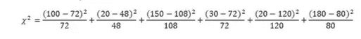

# 假设检验指南

> 原文：<https://medium.com/analytics-vidhya/a-guide-to-hypothesis-testing-aa5c3d29e989?source=collection_archive---------22----------------------->

假设测试是一种从我们可获得的大量数据中获得洞察力的方法。它包括使用样本数据对给定人群的陈述进行评估。想象一个法庭案件，律师需要证明他的委托人是无辜的。这就是我们所说的零假设，一个在一开始就做出的假设。现在我们在那里工作。下一步，律师将收集他在犯罪时的行踪、不在场证明等数据，并将其作为证明其委托人清白的证据。假设被告被证明有罪，那么我们的无效假设就被驳回了。万一他被证明是无辜的，我们的无效假设就会被接受。另一个重要术语是替代假设，它本质上与我们的零假设相反。在我们举的例子中，另一个假设被认为是正确的。

这个博客将涵盖在哪里使用下面的测试，它们的数学表达式以及在 Python 中的实现。

*   单样本比例检验
*   卡方检验(独立性和拟合优度)
*   T 检验(一个样本、两个样本和配对 T 检验)
*   相关性检验
*   z 检验

我们将零假设称为 H0，替代假设称为 H1。

假设我们的委托人是无辜的，但缺乏证据导致他被监禁。这种错误的指控是第一类错误或假阴性的一个例子。这种情况可能会造成极大的误导，并产生有害的后果。同样，让一个罪犯自由意味着我们接受了 H1，因为缺乏证据支持 H0(没有足够的证据支持被告无罪)，即使 H0 是真实的。这意味着第二类错误。我们可以使用一些技术来决定零假设是真的还是替代假设，我们将在这个博客中讨论。

考虑一个样本数据集。它由各种特征和一个输出变量组成，该变量将人们分为糖尿病患者和非糖尿病患者。

让我们从零假设开始，即与没有患病的人相比，被检测出患有糖尿病的人数没有差异。与这一假设相反，我们的 H1 将是这两个值之间存在差异。这里需要注意的是，我们只考虑一个分类变量，即结果。在这种情况下，**一个样本比例测试**将是正确的选择。在这个检验的帮助下，我们必须找到另一个假设为真的可能性，假设零假设为真。显著性值或 P 值小于或等于 0.5 意味着零假设不成立，必须拒绝，从而接受替代假设。另一方面，P 值> 0.05 意味着接受零假设。

必须根据所涉及的特征的类型和数量来决定要执行的测试。

在两个分类特征的情况下，使用**卡方检验**。当我们有两个分类变量并希望找到它们之间的关联时，就使用它。根据年龄组(H0)，发现患有糖尿病的人数与未患糖尿病的人数之间没有差异。H1 说这些价值观之间是有区别的。就像在一个样本比例测试的情况下，高于或低于 0.5 的 P 值会产生类似的结果。高于 0.05 的 P 值意味着零假设为真(无差异)，否则零假设将被拒绝(P 值低于或等于 0.05；H1 接受了)。

例如:独立性的卡方检验。考虑以下基于性别和他们最喜欢的颜色的班级学生的数据。

H0:性别和喜欢的颜色没有关系。

H1:它们是有联系的。

自由度:

df=(行-1)(列-1)=(2–1)*(3–1)= 2

检查卡方表，α值=0.05，df=2，我们得到临界卡方值为 5.99。

判定规则:如果卡方>临界值，即 5.99，则拒绝

计算卡方，

我们得到期望值(fe)为:

=276.39

当卡方>临界值，即 5.99 时，我们拒绝零假设。因此，性别和最喜欢的颜色之间存在联系。同样，我们也可以对拟合优度进行卡方检验，以检查未知分布的总体是否符合已知分布。

**T 检验**在涉及一个连续数值时很有用，例如在零假设 H0 的情况下:样本均值和总体均值之间没有差异。这里我们也可以用类似的方式解释我们的显著性值，如前所述。t 检验比较两组的平均值，并根据一些证据进行验证。在单样本 T 检验中，比较样本组和总体组的平均值，而双样本 T 检验比较两个独立组的平均值。配对 T 检验用于比较同一组内的样本。T 检验用于比较两组的平均值，ANOVA(方差分析)可用于三组或更多组。我们将在随后的博客中详细介绍它。

单一样本 T 检验

μ0 =总体均值的建议常数
x =样本均值
n =样本大小

s =样本标准偏差
sx =平均值的估计标准误差( *s* /sqrt( *n* ))

双样本 T 检验

示例 1:

单一样本 T 检验

示例 2:

单一样本 T 检验

双样本 T 检验

配对 T 检验

对于两个连续的特征，一个**相关性测试**是理想的。它常用于特征选择。例如:H0:-随着身体质量指数的增加，胰岛素水平也增加。相比之下，H1 将是:随着身体质量指数增加，胰岛素水平不增加(保持不变或下降)。

**Z 检验** -类似于 T 检验，用于比较总体均值，但样本量更大。17%的人在上一年看过一部戏剧。为了验证这一点，对 90 人进行了调查，结果发现其中 22 人在去年看过一部戏剧。检验所给数字是否正确的说法。(zc=1.96)

α或显著性水平或 p 值=0.05

假设百分比=p=17%=0.17

接受调查的总人数(样本量)=n=90

看戏的人=x=22

比例 p:

=22/90=0.244

零假设 H0: p=0.17

替代假设 H1: p ≠ 0.17

计算 z 统计值:

=(0.244–0.17)/sqrt((0.17 * 0.83))/90)

=1.87

决策规则:如果 Z > Zc(关键 Z 分数)，则拒绝

由于 1.87 不大于 1.96，无法拒绝零假设。

因此，我们可以说给定的数字是正确的。

在我们的样本中，去年观看戏剧的人数比例为 0.244。我们计算的 z 统计值为 1.87，小于临界值 1.96，显著性水平α = 0.05。因此，我们不拒绝零假设，并得出结论，前一年参加戏剧演出的人的患病率为 0.17。