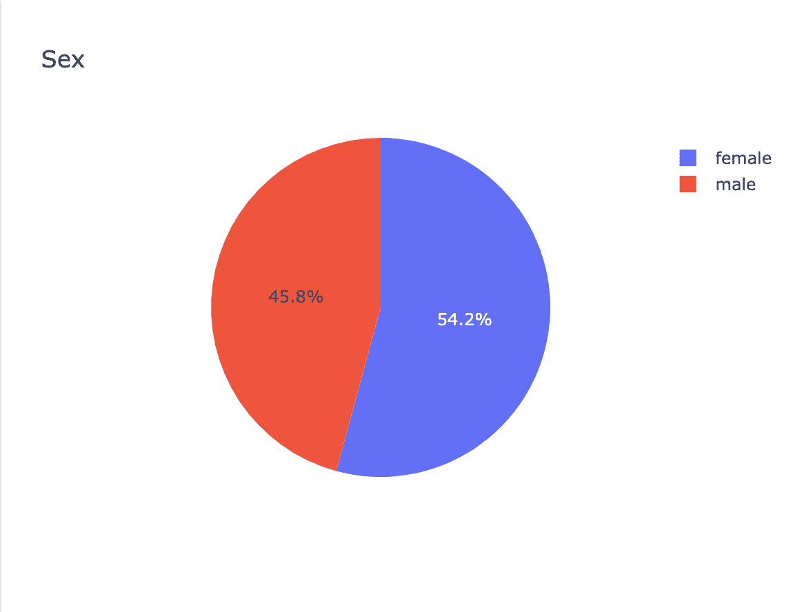
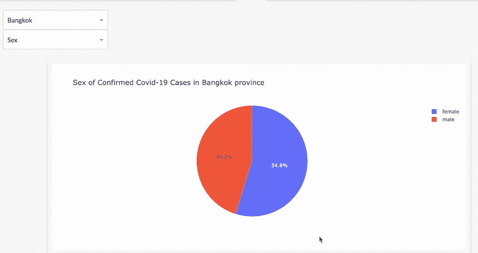
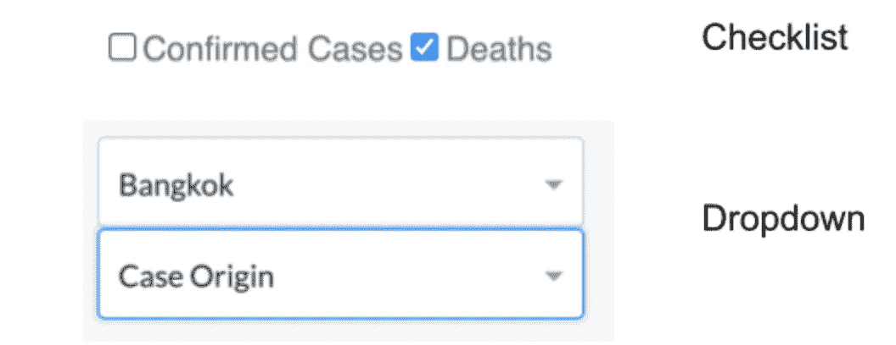
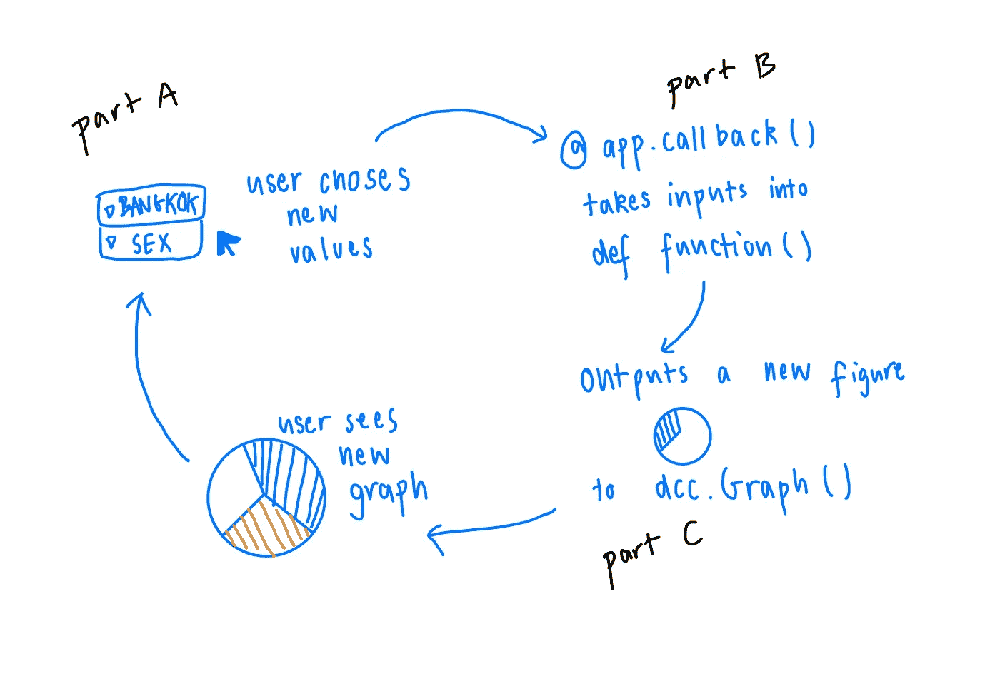

# Python Plotly 交互式数据可视化指南

> 原文：<https://medium.com/analytics-vidhya/a-guide-to-interactive-data-visualizations-with-python-plotly-c1b949eeb1f?source=collection_archive---------2----------------------->


[活动发起人](https://unsplash.com/@campaign_creators?utm_source=medium&utm_medium=referral)在 [Unsplash](https://unsplash.com?utm_source=medium&utm_medium=referral) 上的照片

当您想到数据可视化时，您会想到 Tableau 和 Power BI。当你想到 Tableau 和 Power BI 时，你会想到仪表盘。然而，一个不太常用的制作仪表板和数据可视化的工具是 Python 库 **Plotly** (或 Dash)。

一个好的仪表板可能有交互组件，让观众更好地理解所呈现的数据。在 Plotly 中，这是通过使用回调来实现的。这是一个通过 Plotly 进行交互式数据可视化的快速指南！

# **如何使用 Python Plotly/Dash 创建基本图形**

在我们可以定制我们的图表或者使我们的图表具有交互性之前，我们需要先简要地回顾一下如何创建一个简单的图表。我们可以通过两种方式轻松做到这一点:要么使用 Plotly express，要么使用 Dash。就我个人而言，我发现如果你对小细节不太挑剔并且需要一个快速的数据 viz(因此， *express* )的话，Plotly Express 实现起来更简单。但是，如果您有更多的元素需要定制，Dash 是不错的选择。

让我们尝试用 Dash 绘制一个简单的饼图。

*(提示:Plotly/Dash 也有大量其他图表，从常规的条形图到更有趣的 choropleth 图。一个简单的 google 来找到你想要的图表将会显示出包含大量简洁例子的官方文档。)*

就我们的例子而言，我将重点关注泰国的新冠肺炎病例。我将使用来自泰国政府网站公开数据的新冠肺炎数据(见参考资料),并将它和熊猫一起导入数据框架。

```
import pandas as pd##i already imported the data into a df using pandas (+ cleaned it)import plotly.graph_objects as go # notice not express!fig= go.Figure(data=[go.Pie(labels=[‘female’,’male’],
values=list(df[‘sex’].value_counts()))])
fig.update_layout(title=’Sex’)
```



显示泰国确诊新冠肺炎病例性别的饼图(作者，2021)

一个快速简单的饼图！但是如果我们有其他有趣的特性要展示呢？除了性别之外，我们的数据还包含患者被感染的省份和疑似病例来源(例如，他们因 xyz 的一个群集而被感染，或者他们在医疗保健部门工作)。

让我们制作一个交互式饼图，您可以选择查看感染省份或某些省份的病例来源。我们的目标是:



我们用 Plotly 制作的交互式饼图(作者，2021)

为此，我们需要回调。

# **设计回访—三部分计划**

回调是一个交互式组件。有许多不同类型的回调，但让我来分解一下基本结构。我们的 Plotly 代码应该采用这个基本的三部分结构:A、B、C。

```
import dash
import dash_core_components as dcc
import dash_html_components as htmlapp = dash.Dash(__name__)app.layout = html.Div(## A) our graph and callback components are here)@app.callback(# B) defining the callback and what to return here)def blah():
 # C) create a function to make the graph to return as definedif __name__ == “__main__”:
app.run_server(debug=True)
```

## **A 部分—互动**

我们需要创建一个交互式组件，用户可以改变相应地改变我们的饼状图。我选择了使用下拉菜单，但是你也可以为你的交互元素选择一个清单。



Plotly 中的下拉列表和清单示例(作者，2021)

我们的目标是创建上面显示的下拉列表。这需要我们三部分结构的 A 部分中的两个交互组件。像这样定义 A 部分:

```
html.Div(
            children=[
                html.Div(children=[
                    dcc.Dropdown(id='dropdown1',
                              options=[{'value':x,'label':x} 
                                       for x in df.province_of_onset.unique()],
                              clearable=False,
                              value='Bangkok',
                              ),
                    dcc.Dropdown(id='dropdown2',
                             options=[
                                      {'label':'Sex','value':'sex'},
                                      {'label':'Case Origin','value':'risk'}],
                             clearable=False,
                             value='sex',                   
                             )
                    ], className='menu-l'
                    ),
                dcc.Graph(id='interaction2',
                          config={'displayModeBar':False},
                          className='card')
                ]
            ),
```

我的饼图有两个下拉菜单，一个允许用户更改省份，另一个允许用户更改分类变量——性别和病例来源(这些在 **dcc 中)。Dropdown()** 组件)。最后，我在 **dcc 中定义了我的图。图表()。**

给这些组件赋予 **id** 是很重要的，因为这是我们稍后的回调所要引用的。

## **B 部分— app.callback()**

在 B 部分中，需要注意两件事情:输入**和输出**。****

**在更新/执行回调之后，输出就是我们想要的。在这种情况下，我们想要一个图(饼图)推送到 **dcc。Graph()** 显示在我们的仪表盘上。我们的输入是用户从两个下拉框中选择的值。**

```
from dash.dependencies import Output, Input[@app](http://twitter.com/app).callback(
    Output('interaction2', 'figure'),
    [Input('dropdown1','value'),
     Input('dropdown2','value')]
    )
```

**注意，我们通过这些元素的 id**来引用它们。****

## ****C 部分—功能****

**现在，我们需要编写一个函数来接收这两个输入，相应地过滤数据帧，然后制作一个饼图作为图输出返回。**

```
[@app](http://twitter.com/app).callback(
    Output('interaction2', 'figure'),
    [Input('dropdown1','value'),
     Input('dropdown2','value')]
    )
def update_pie_chart(select_d1,select_d2):
    df3=df.loc[df['province_of_onset']==select_d1] ## using dash to make the pie chart fig1=go.Figure(data=[go.Pie(labels=df3[select_d2].value_counts().index.tolist(),
                         values=list(df3[select_d2].value_counts()))]) ## customizing the title of the pie chart names={'sex':'Sex','risk':'Case Origin'}
    title_att=names.get(select_d2)
    fig1.update_layout(title=
          f"{title_att} of Confirmed Covid-19 Cases in {select_d1}"
                       " province") return fig1 #to be outputted!
```

**简而言之，这里有一个图表来解释我们试图实现的目标:**

****

**(作者，2021)**

# **恭喜你，你有了一个交互式图表！现在怎么办？**

**完成图表和仪表板后，您可以部署应用程序。有许多文章解释了如何做到这一点以及如何开始使用 Plotly，但我将链接一些我提到的内容:**

*   **[https://realpython.com/python-dash/](https://realpython.com/python-dash/)**
*   **https://towards data science . com/deploying-your-dash-app-to-heroku-the-magic-guide-39 BD 6a 0c 586 c**

**仪表板是展示您的投资组合中的数据清理和数据可视化技能以及任何 CSS/HTML 技能的好方法。最后，临别建议:事情可能会变得有点棘手和令人困惑，但网上有很多其他资源可以帮助你！坚持住！**

***参考文献*:**

*   **数据集检索自:[https://data.go.th/](https://data.go.th/)**
*   **[https://realpython.com/python-dash/](https://realpython.com/python-dash/)**
*   **[https://plotly.com/python/pie-charts/](https://plotly.com/python/pie-charts/)**