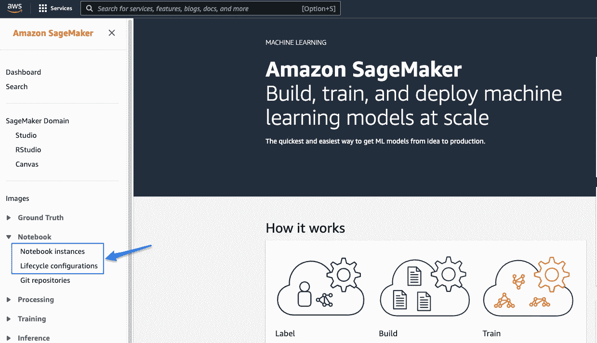
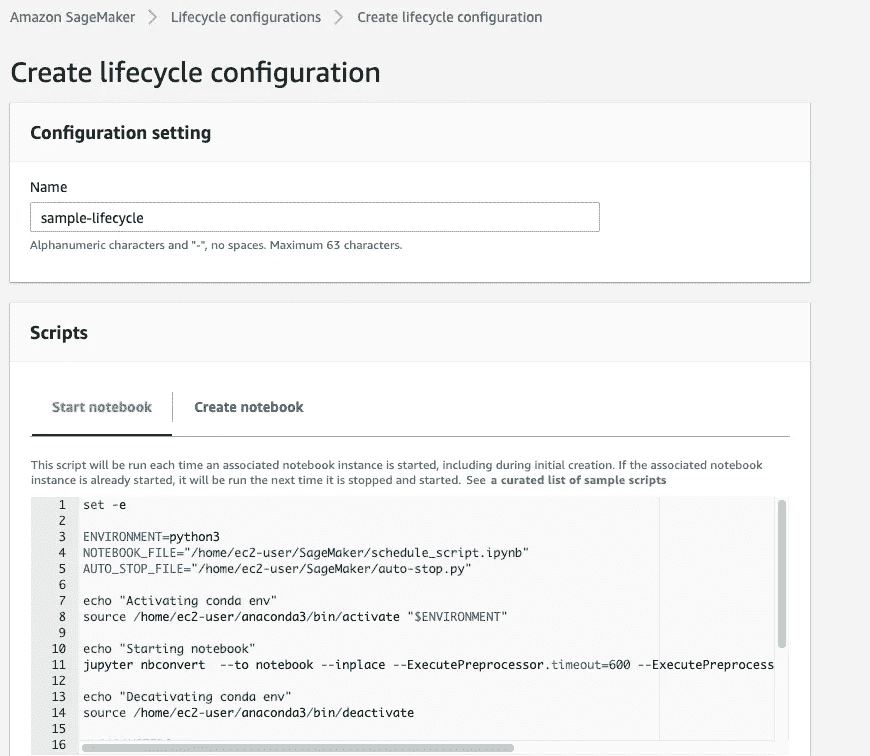
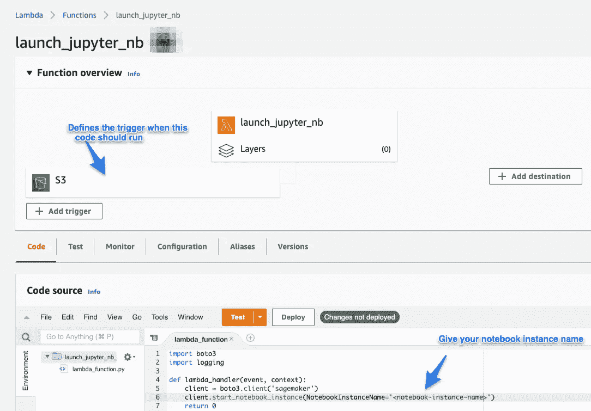

# SageMaker 笔记本计划指南

> 原文：<https://medium.com/analytics-vidhya/a-guide-to-schedule-sagemaker-notebooks-a7a09eb641f6?source=collection_archive---------0----------------------->

亚马逊 [SageMaker](https://aws.amazon.com/sagemaker/) 已经成为机器学习从业者最广泛使用的平台之一。数据科学家经常从 SageMaker 的 notebook 实例或 SageMaker studio(一种构建 ML 应用程序的低代码/无代码方式)启动笔记本，并创建他们的分析。有时，我们希望安排这些笔记本定期运行。

在本文中，我将展示如何安排 SageMaker 笔记本在特定的 s3 位置创建文件时运行。这可以很容易地扩展到安排笔记本在每天给定的时间运行。

在我们开始之前，让我们明确几个概念:

1.  SageMaker notebook 实例:notebook 实例是 SageMaker 中的一个计算实例，您可以在其上运行一个笔记本。基本上，这是实际运行笔记本的远程机器。在 SageMaker 中，我们可以创建多个笔记本实例。每个实例都是独立的远程机器。在每台机器中，我们可以创建多个笔记本。下面是关于一个[笔记本实例](https://docs.aws.amazon.com/sagemaker/latest/dg/nbi.html)的更多细节。
2.  生命周期配置:这些是 shell 脚本，无论何时启动(或创建——但我们不会在这里使用)一个笔记本实例都可以运行。这两个选项都可以在 sagemaker 主页上找到，如这里的截图所示。



3. [AWS Lambda](https://aws.amazon.com/lambda/) :假设你有一些想运行的代码，但不想处理所有底层基础设施。Lambda 是一个很好的地方。

4.IAM 角色:一旦你进入 AWS，IAM 角色无处不在。它们是 aws 中管理权限的方式。角色是策略的集合，而策略定义了您在 aws 中可以(和不可以)做什么。例如，您想要读取 s3 中的数据，您需要一个策略。在 s3 中创建一个 bucket，这是另一个策略。使用新策略 SageMaker。你知道要点了。当我们创建一个 notebook 实例或 lambda 函数时，两者都需要 IAM 角色。

因此，下面是我们安排笔记本电脑作业的方式:

1.  创建一个笔记本实例，我们称之为 *schedule-notebook* 。确保 IAM 角色有一个 [*SageMakerExecution* 策略](https://docs.aws.amazon.com/sagemaker/latest/dg/sagemaker-roles.html#sagemaker-roles-create-execution-role)。启动 Jupyter Lab 并在此实例中上传 Jupyter 笔记本。姑且称之为*schedule _ script . ipynb；*假设笔记本是在主目录下创建的，那么它的完整路径应该是*/home/ec2-user/SageMaker/schedule _ script . ipynb。一旦笔记本被创建并测试运行良好，返回并停止笔记本实例。*
2.  从 SageMaker 主页创建一个生命周期配置(请参考上图中的选项)。下面的截图有助于你可能会看到什么。为配置命名(例如:*样品生命周期*



下面给出了实际的脚本。这个脚本应该在 notebook 实例启动时运行(我们还没有创建这个钩子)。它只是激活 conda 环境，运行 jupyter 笔记本，然后在发现 jupyter 笔记本处于空闲状态超过 5 分钟时停止笔记本实例。它假设名为 *schedule_script.ipynb* 的笔记本在主位置，并且被触发。将变量 NOTEBOOK_FILE 改为指向您的笔记本。理想情况下，*/home/ec2-user/sage maker*部分应该在路径中是公共的。

```
set -eENVIRONMENT=python3
NOTEBOOK_FILE="/home/ec2-user/SageMaker/schedule_script.ipynb"
AUTO_STOP_FILE="/home/ec2-user/SageMaker/auto-stop.py"

echo "Activating conda env"
source /home/ec2-user/anaconda3/bin/activate "$ENVIRONMENT"echo "Starting notebook"
nohup jupyter nbconvert  --to notebook --inplace --ExecutePreprocessor.timeout=600 --ExecutePreprocessor.kernel_name=python3 --execute "$NOTEBOOK_FILE" &echo "Decativating conda env"
source /home/ec2-user/anaconda3/bin/deactivate# PARAMETERS
IDLE_TIME=600 # 10minuteecho "Fetching the autostop script"
wget [https://raw.githubusercontent.com/aws-samples/amazon-sagemaker-notebook-instance-lifecycle-config-samples/master/scripts/auto-stop-idle/autostop.py](https://raw.githubusercontent.com/aws-samples/amazon-sagemaker-notebook-instance-lifecycle-config-samples/master/scripts/auto-stop-idle/autostop.py)echo "Starting the SageMaker autostop script in cron"
(crontab -l 2>/dev/null; echo "*/1 * * * * /usr/bin/python $PWD/autostop.py --time $IDLE_TIME --ignore-connections") | crontab -
```

3.现在我们回到 Jupyter 实例(它处于 *stopped* 状态——允许编辑选项),编辑它的配置并向它添加上面的生命周期配置。这样，每当启动笔记本实例时，生命周期配置都会在后台触发笔记本，并设置一个 cron 来持续检查笔记本实例，以查看其空闲时间是否超过 IDLE_TIME (=此处为 10 分钟)。如果它发现实例处于空闲状态，就会立即停止该实例。这里要注意一点，一个生命周期配置脚本不能运行超过 5 分钟(aws 的限制)。这就是我们使用 nohup 在后台运行笔记本的原因。否则，笔记本可能会运行超过 5 分钟，并且生命周期脚本无法完成，这将导致启动笔记本实例失败。

4.最后，我们需要安排 Jupyter 实例本身的启动。我们为此使用 AWS Lambda。下面的脚本正是这样做的。只需要 6 行代码。为了更容易访问，我也在下面添加了代码。



```
import boto3
import loggingdef lambda_handler(event, context):
 client = boto3.client(‘sagemaker’)
 client.start_notebook_instance(NotebookInstanceName=’*schedule-notebook*’)
 return 0
```

Lambda 使用 [boto3](https://boto3.amazonaws.com/v1/documentation/api/latest/index.html) ，这是一个 aws 专用的 SDK，用于与各种 AWS 服务进行通信。我们不需要这方面的所有细节。我们只需要将 NotebookInstanceName 重命名为我们在第一步中创建的任何实例。一旦我们添加了脚本，我们还需要添加一个触发器，它作为一个触发器来运行脚本。我们可以通过点击*添加触发*按钮创建触发，支持接收特定事件、按时间安排等多种选项。它利用不同的 aws 服务，如 [EventBridge](https://docs.aws.amazon.com/eventbridge/index.html) 、[motis](https://docs.aws.amazon.com/streams/latest/dev/introduction.html)等来实现这一点。我使用的是 s3，在这里我们可以定义不同的事件，比如在给定的 S3 桶中创建一个对象，删除一个对象等等。我们还可以给出前缀和后缀，这样就不需要为触发器提供专用的 s3 桶。

一个重要的步骤是确保 Lambda 配置了正确的 IAM 角色。由于我们希望启动 Sagemaker 实例并访问 S3 存储桶以获取触发器，因此它需要将这两个策略都附加到 IAM 角色。AmazonS3FullAccess 和 AmazonSageMakerFullAccess 由 Amazon 通过 defalt 打包，应该可以满足所有这些需求。

需要注意的几点:

1.  笔记本实例现在无法正常使用，因为生命周期配置会在启动时启动，并在作业完成后终止实例。因此，如果要对笔记本进行任何更改，我们需要删除该配置，并在更改完成后再次附加该配置。
2.  此流程仅在笔记本实例处于停止状态时起作用。如果在 lambda 被触发时它已经处于启动状态，则什么都不会发生。

就是这样。我们刚刚将 SageMaker 笔记本计划为基于在 S3 位置创建文件的时间运行。以下是事件流如何发生的摘要:

1.  某个服务或作业将文件写入给定的 s3 位置
2.  它触发 Lambda 函数，该函数实例化一个 SageMaker Notebook 实例
3.  当笔记本实例启动时，其生命周期配置将启动，并运行给定的 jupyter 笔记本
4.  笔记本运行完成后，生命周期配置将停止实例，从而防止不必要的数据成本