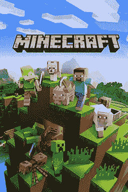
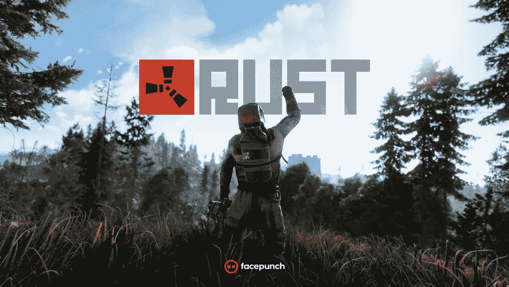

# 阿伊 NDIE

> 原文：<https://medium.com/analytics-vidhya/a-i-ndie-ace715f1497d?source=collection_archive---------18----------------------->

弗洛里安·奥利佛在 [Unsplash](https://unsplash.com?utm_source=medium&utm_medium=referral) 上拍摄的照片

## 知觉

AI 从一开始就是游戏开发行业的代名词。游戏行业更喜欢创建可预测但有趣的人工智能合成系统，这种系统不会让玩家不知所措。

从像 Mario 这样的第一代侧滚游戏到像 Control 和 Resident Evil 这样的当代 AAA 游戏，都是建立在相同的寻路和有限状态机基础之上的。大多数 AAA 工作室都有他们不想失去的专门人群，这些人群是经过几十年的工作建立起来的，因此 AAA 游戏往往只有非常有限的潜在技术进步。

# 独立概念

独立游戏是游戏行业至关重要的一部分。我们现在看到或玩的所有 AAA 游戏都曾经是由独立开发者制作的。许多这样的开发者冒险去创造他们的故事、世界和角色。还有故事。每年我们都会看到大量的独立游戏问世，其中一些打破了这个行业，吸引了成千上万的玩家。

*但是你为什么会说独立呢？因为他们敢于冒险。*

事实一次又一次地证明，独立游戏打破了这个行业赖以建立的界限和标准。由于这种创新和直接的开发方法，独立开发者倾向于使用许多不同的技术。

近年来流行的一种技术是 ***程序内容生成*** 。虽然使用 ***程序内容生成*** 或 ***PCG*** 并不新鲜，但其应用却非常有限。

## 早期历史和发展

已知的第一个拥有这种系统的游戏是*“哨兵”，*由*杰夫·克拉姆蒙德*于 1986 年创作，该游戏使用 PCG 渲染其所有的 3D 级别。另一个例子是。kkrieger，开发于 2004 年，只有 96KB 大小，可以产生各种不同水平的 PCG。

《我的世界》封面

***《我的世界》*** ，一款由独立工作室 Mojang 开发，后被微软收购的非常受欢迎的游戏，就是一个相当显著的例子。这个游戏使用 PCG 来创造完全不同的世界。现在，这些世界有不同的区域，特定区域的 NPC，甚至某些特征的高度、宽度和深度也完全不同。这提供了一个更具沉浸感和挑战性的游戏风格。

继《我的世界》之后，像*和 ***洞穴探险*** 这样的独立游戏席卷了全世界，直到今天它们仍然很强大。所有这些都为一代独立游戏铺平了道路，这些游戏依赖 PCG 为玩家提供更加超现实和身临其境的体验。*

## *火炬手*

*独立游戏一直被认为是 8 位*和 ***16 位*** 图形，但每一种都有自己独特的艺术风格和设计。在那之后，像 ***、*、**等游戏继续与 PCG 一起发展，并反过来赢得了许多赞誉，因为他们创造了真正定义 PCG 已经走了多远的游戏。**

****

## **到目前为止的世界**

**在过去的几年里，我们已经收到了像 ***【无人之天】、深石银河、瓦尔海姆、岛民*** 等游戏，这些游戏已经定义了即使在现代，PCG 也可以提供和适应玩家想要的东西。类似流氓和生存游戏不断增加游戏到他们的花名册中，最大限度地探索和开发 PCG。创造出近乎无限的世界，其中的变化不计其数。**

**因为有这么多的 AAA 工作室已经适应了 PCG 和半 PCG 元素，以适应他们的发展周期。**

****

*****Rust*** ，一款多年来越来越受欢迎的生存工艺游戏，也使用了半 PCG 元素，并因其迄今为止的开发周期而值得一提。Rust 使用定义的地标和某些约束来创建程序生成的地图，该地图每次都不完全不同，但每个种子可以有不同的布局。这种布局会影响地形的形状以及每个地标的放置方式。最酷的因素之一是地图生成时形成的道路、隧道和水体。**

## **接下来会发生什么！！！**

**游戏行业，尤其是独立开发者，正在以惊人的速度前进，同时推出令人惊叹的游戏，这些年来已经获得了多个奖项。PCG 改变了我们看待和感知游戏的方式。它允许开发周期很短，但不是毫无内容的。相反，PCG 的游戏从一开始就能提供更多的东西。现在，越来越多的开发者转向更复杂的生成系统，如 ***【甘斯】*** ，这些系统可以完全改变目前的游戏规则。我们已经可以看到 PCG 在 3D 软件中的应用，这些软件反过来又被用来制作游戏及其资产。我们已经看到了 ***AI 地下城*** 和 ***AI 地下城 2*** 已经用 ***GPT2*** 创造了一个令人惊叹的基于文字的冒险。用不了多久，3D 游戏世界也会取得这样的进步。**

**你玩过上面提到的游戏吗？或者你知道一个 PCG 的游戏吗？请在下面评论。**