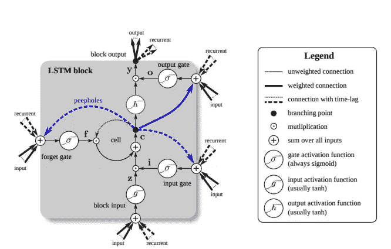

# NLP 竞赛的开端

> 原文：<https://medium.com/analytics-vidhya/a-kickstart-to-nlp-competitions-626557929127?source=collection_archive---------7----------------------->

决定你是想专攻自然语言处理还是计算机视觉的最好方法之一就是两个都试试。从我的个人经验来看，我建议初学者先尝试一下计算机视觉，因为与 NLP 相比，它的概念更简单，也更直观。在我的 NLP 学习旅程中，我经常发现资源不完整，所以我在这里收集了一些基础知识。

在学习基础知识的过程中，我们将并行构建模型，以应对 Kaggle 上的一场竞赛，“[拼图多语言有毒评论分类](https://www.kaggle.com/c/jigsaw-multilingual-toxic-comment-classification)”。如果您不熟悉规则或数据集，请在我们继续之前查看一下。我选择这个是因为，它每年都会发生。

**基础知识**

根据牛津词典，英语中大约有 171，146 个单词在使用。每个都有自己的意思，一组同义词和反义词。我们的模型需要了解每个单词都是唯一的，或者换一种方式说，每个单词都生活在一个单独的维度中。所以，有 171，146 个维度。这些维度中有些是相关或相近的，有些则相距甚远。比如说，“跑”和“爬”离“瓶子”和“树”更近更远。前两个词是动词，其余的是名词。英语中的每个单词都属于八种词类之一，即名词、代词、动词、形容词、副词、介词、连词和感叹词。你甚至可以添加，数词，文章，限定词到这个列表中，甚至更多的组。对于 171，146 个单词，我们至少可以得出 10，000 个类别来唯一地识别每个单词。利用这些信息，我们可以找到单词之间的关系。

每次尝试构建 NLP 应用程序时，训练模型从头开始学习这些关系是不现实的。这就是我们使用迁移学习的地方，其他人已经做了这项工作，训练模型来学习权重，使用它可以找到关系。有很多模型，像 NLTK，spaCy，Glove，Word2Vec，Genism，AllenNLP，FuzzyWuzzy，Fast.ai，TorchText，Flair，Huggingface，OpenNMT，ParlAI，DeepPavlov，openNLP，Amazon understand 等等。，这样的例子不胜枚举。人们可以从他们各自的网站上下载这些预先训练好的模型，并开始使用它们来构建架构。

**余弦相似度 vs 欧几里德距离**

计算两个词之间的接近度的一般概念是通过使用余弦相似度而不是欧几里德距离。下图说明了为什么它更好。

**分词**

它只是把一个句子串分割成一个单词数组。数组中的每个单词或元素称为一个令牌。单词标记化的用途之一是统计单词在注释或数据集中的出现频率。我们还会删除停用词。停用词是最常见的词，如“in”、“the”、“I”、“me”、“you”、“it”、“was”、“was”、“but”、“because”等。你明白了。也看看像词汇化和词干化这样的概念。

**将代币编码成数字**

在将数据分成训练集、验证集和测试集之后，我们对标记进行编码，并将每个唯一的单词映射到一个数字。因此，我们创建了自己的数字索引词典。数据集中的每个注释都有不同的长度。将单个评论作为输入输入到神经网络需要它们都有固定的长度。因此，我们用零填充，并将每个评论的最大长度固定为 1500 个单词。

**创建嵌入向量**

看看[手套](https://nlp.stanford.edu/projects/glove/)。他们有不同的预训练模型，可以下载并用于创建我们的嵌入向量。早些时候，我们讨论了如何提出 10，000 种不同的类别，利用这些类别我们可以在单词之间建立关系。50d、100d、200d、& 300d 规范是我们想要用多少不同的类别/组来定义每个令牌。使用下面的代码，可以从预先训练的权重中提取单词向量。它将加载 400，000 个向量。

每个单词的向量表示是一个长度等于数据集中唯一单词总数的向量。其中当前令牌索引保存值 1，其余全为零。

[……..0,0,0,0,0,0,0,1,0,0,0,0,0…………]

嵌入矩阵的形状为(100，总字数，唯一字数)。这里的行数是 100，因为我们加载了 glove.6B.100d.txt，如果我们加载 glove.6B.300d.txt，它将是 300。人们可以根据方便试验这些模型。下面是为我们的训练目的收集相关单词的手套表示的代码。因为它被训练来保持 4，000，000 个单词之间的关系，所以我们能够使用甚至首先不在我们的数据集中的单词的信息。这是迁移学习的一个例子。

**递归神经网络**

在一个句子中，下一个单词都依赖于前一个单词。下一句话大部分时间也是依赖于上一句话的。这是给定当前单词的下一个单词比从我们的语料库(来自我们的数据集的字典)中随机选择更有可能是正确的概率。这是 RNN 的专长，它将处理过的以前的输出也作为输入来产生新的输出。

这是第一个模型，我们将对其进行试验，以便为性能设定一个基准。

我们称处理下一个令牌为时间步长。X0 是令牌 1，Xx1 是令牌 2，X3 是令牌 3，依此类推。有不同类型的 rnn。

我们的场景要求 RNN 对评论本质上是有毒的还是良性的进行分类。这是一个多对一的 RNN。使用 Keras 实现 RNN 非常容易。训练是在 TPU 的帮助下完成的，所以你会发现 TPU 的相关代码包含了模型定义。在这种情况下，使用镜像策略来优化 TPU 上的培训过程。

在 TensorFlow 的页面上查看如何调整一个 [SimpleRNN](https://www.tensorflow.org/api_docs/python/tf/keras/layers/SimpleRNN) 的超参数。

“单位”参数是隐藏状态的维度或长度或激活向量的长度。简单的线条，任何人都可以做到。但是后台发生了什么呢？我们来探索一下。下面是 RNN 和一个节点的图示。

有 4 个单元的简单网络(右图)

g1 = tanh()

g2 = softmax()

在这里，<t>是前一个时间步的信息如何传递到下一个时间步。y <t>是处理后的当前时间步长的输出。这是 RNN 的一般概念，但是在我们的例子中，我们不需要计算 Wya，因为手头的问题是多对一的问题，情感分类。Wya 在最后计算。</t></t>

> 【learn 学到了什么？
> 
> 它学习魏如萱、瓦克斯、威亚、巴& by

**让我们来讨论形状…**

激活次数 a <t>将等于 Tx，最大长度是我们之前决定的 1500 个时间步长。让“nx”表示批次总数，让“m”表示每个批次的大小(TPU 镜像策略，根据可用的内核，可以仔细计算该值以实现并行处理)。我们有 nx * m 个训练样本，gf(手套单词特征)值为 100，是我们使用 glove.6B.100d.txt 以来的手套特征数，x_train 是 shape (num_of_batches，batch_size，comment_length，each_word_glove_features)。</t>

这是训练数据的形状

第一批形状是[m，Tx，gf]。对于第 I 个训练示例和时间步长‘t’，我们将表示 x(i) <t>，其等于大小为‘gf’的向量。Tx 的值是 1500。</t>

单元数量 n_a = 128

激活向量 a = [n_a]

x 的形状为[1500，100]，因为我们有 1500 个单词用于每个包含填充的注释，每个单词/时间步长的长度为[100]，所以 Xt 为[100]。

魏如萱= [128]*[128]。t =[128128]

Wax = a * x = [ n_a ]*[gf] = [128，100]

g1 = tanh()

a <t>= g1( [128，128] * [128]+[128，100]*[100]+[128])=[128，128]</t>

> 注意魏如萱和 a <t>有着相同的形状！</t>

简单 RNN 的输入格式应该是[batch，timesteps，feature]，这只是 nx 批处理中的一个。指定的单位数就是输出的数量。由于这是一个情感分类任务，所以输出只是一个。

**随时间反向传播**

如果你不想理解这背后的数学原理，就跳过这一部分。

下面是 RNN 的损失函数。在反向传播期间要更新的候选是魏如萱、瓦克斯和巴。从损失函数中，我们可以计算出最终时间步中的 da <t>。我们需要计算魏如萱、瓦克斯和巴的损失，即 dL/dWaa、dL/dWax 和 dL/dba。为什么？这些是 RNN 学习的参数。现在循环反向运行。</t>

> 注:tanh⁡(u 的衍生物)是(1 坦(𝑢))𝑑𝑢.

该循环向后迭代“t”。从头开始实现 RNN 时，必须注意矩阵的形状。上面的等式可能看起来很吓人。但对任何学过微积分的人来说都是非常基础的。这里有一个速成班。

**表现:**

这就是 simpleRNN 在训练过程中的学习方式，以及它在验证集的预测中的表现(不用于训练)。

> SimpleRNN 没做好。

# **长短期记忆(LSTM)**

一个简单的 RNN 或香草 RNN 的问题之一是消失梯度问题。这意味着，在一个长句子中，在句子开始时学习的信息在处理句子结尾的时间步长时可能没有多大用处。这就是记忆进入画面的地方，盖茨决定什么时候记忆，什么时候忘记。在一个简单的 RNN 中，当前时间步长只接收先前的激活输出，但是在 LSTM 中，我们也接收来自存储单元的激活输出。

(右)一系列垂直的蓝框是隐藏层，每个都是一个 LSTM，单位的数量是在定义模型时决定的。这条垂直线重复多次，以显示时间步长的计算。

从上面的比较中可以看出 sigmoid 和 tanh 在 LSTM 中扮演的角色。Sigmoid 压缩 0 和 1 之间的值，即大多数值接近 1 或 0。因此，它的行为就像一个开关，关闭和开启活动。我们有三个 sigmoids 控制的活动，即，忘记，更新和退出。

使用双曲正切函数的优点是梯度计算成本较低，并且允许非正损耗/梯度的误差传播，这是 sigmoid 或 Relu 所不能做到的。这个性质使它能够更快地收敛，即找到损失函数的全局最小值。负值的可能性是它用于确定更新状态的候选值的原因之一。

每个 LSTM 有三个输入和两个输出。为什么他们不平等？内部只传输两种输出，隐藏状态和存储单元状态，每个 LSTM 接收一个时间步长。

> LSTM 学到了什么？
> 
> 它学习 Wf，Wi，Wc，Wo，bf，bi，bc & bo
> 
> 即它学习忘记多少和记住多少的权重矩阵，缩放多少的权重矩阵并在每个时间步更新内存，如何缩放输出的权重矩阵。

在我们深入 LSTM 背后的数学之前。让我们看看它在预测中是如何工作、学习和执行的。这是代码。

> LSTM 做得相当不错，一点也不差！

**让我们在处理一条评论的同时讨论形状…..**

X = [1500，100]，Xt = [100]

h <t-1>= [128，128]，Wxi = [100，128]，Whi = [128，128]，bi = [128]</t-1>

it，ft，ot，gt=[100，128]。T *[100]+[128，128]*[128，128]+[128]=[128，128]

ct = [128，128]*[128，128] + [128，128]*[128，128] = [128，128]

h <t>= [128，128]*[128，128]</t>

以上做 1500 遍。一条评论 1500 个时间步。

**穿越时间的反向传播**

如果你不想理解背后的数学原理，跳过这一部分。

没错。我们对每个评论的时间步长反向执行上述计算，以更新权重。

# 门控循环单元(GRU)

GRU 是 LSTM 的变体。这里有一个 GRU 和 LSTM 的简单比较。正如你所看到的，遗忘门被包含在更新门本身中。计算出的新的细胞状态直接转移到下一个 GRU 的时间步骤，而不执行输出转换，在 LSTM 进一步过滤信息。更多信息可以在[这里](https://stanford.edu/~shervine/teaching/cs-230/cheatsheet-recurrent-neural-networks)找到。

斯坦福小抄递归神经网络

以上是 GRU 在预测中的学习和表现。相比之下，它比 LSTM 表现得更好，时代更少。随着时间的推移，形状和反向传播几乎与 LSTM 相同。其实简单多了。所以，跳过它。

# 双向 RNN

基本单位仍然是 RNN、LSTM、GRU 等。但是学习是双向的。也就是说，一个词的概率和影响力不仅受到评论中它前面的词的影响，还受到它后面的词的影响。因此，在处理评论中的每个单词时，我们有了更多的信息，包括前面和后面。因为我们用时间步长来说话，它可以被描述为使用来自过去和未来的信息来评估现在。

双向 LSTM 还用于更复杂的任务，如填充缺失的单词、实体识别(名称、动词等)、机器翻译。

仅用 5 个纪元就获得了 0.94 的高准确度分数！

最简单的方法之一就是看下面的图片。因为向前和向后 RNN 时间步长都是一次一个阶段。请注意，后向层向下一个前向层提供输出。可以推导出双向 RNN 的梯度方程，除了它多接收了一个额外的输入之外，这与 LSTM 的情况非常相似。

# **BERT** (变压器的双向编码器表示)

既然我们探索了双向 RNN 学习。在进入 BERT 之前，我们仍然需要学习编码器-解码器网络和变压器。

> 要了解变形金刚，请查看杰伊·阿拉玛的博客。他还写了关于[伯特](http://jalammar.github.io/illustrated-bert/)的文章。

BERT 的“编码器”部分涉及 seq2seq 模型、注意力模型和神经机器翻译(NMT)的概念。这类似于计算机视觉任务中的自动编码器和 GANs。NMT 的编码器将句子从“英语”语言转换成一系列数字，然后解码器网络试图预测另一种语言的句子，比如“泰米尔语”。尽管泰米尔语和英语之间的语法差异很大，但 NMT 能够在它们之间架起一座复杂的桥梁，这显然是一种监督学习技术。

注意力模型是 seq2seq 模型的扩展，当要翻译的句子很长时，它的性能更好。关键的改进是注意模型中的编码器不仅向解码器提供最后一个隐藏层的输出序列，而且还提供来自所有隐藏层的输出。注意力模型的解码器接收相对于翻译中的目标单词的计算的上下文向量。

这就是查询和键的概念出现的地方。一个查询只是一个从我们当前试图翻译的时间步长中获得的向量。Keys 是从所有输入时间步长获得的向量。以下是不同上下文向量的图示。通过查询和关键字之间的点积获得上下文向量，然后使用 softmax 进行缩放。这个向量包含关于其他单词的相关性的信息。我们不计算每个单词与所有其他单词的相关性向量来找到翻译，这在计算上是昂贵的。因此，我们使用带参数“B”的波束搜索，这是一个超参数，可以调整。因为我们只为上下文向量选择“B”个标记，所以我们随机进行“n”次，并对结果进行平均以获得上下文向量。这就是多头注意力机制。

查询、键和值是如何生成的？利用自我关注机制。没什么特别的，和注意力一样，但是目标是以这样一种方式产生最佳权重，即查询和关键字的点积提供相似性/相关性。这里价值观的作用有点像一般机器学习中‘偏见’的作用。

人们可以更深入地了解变形金刚和伯特是如何被训练的，并理解为什么他们在各种资源下表现良好。如果你要训练你自己的“伯特”，你需要明白。但是，我们只是将它用于我们的情感分类任务，看看它的表现如何。

在我们的例子中，我们使用变形金刚库中的 DistilBertTokenizer 来代替手套的嵌入矩阵。我们使用来自 DistilBertTokenizer 的预训练砝码。作为输入的每个注释的标记化数组必须以“[CLS]”开始，以“[SEP]”结束。

下面是构建 BERT 模型并训练它的代码。

这是伯特如何通过 50 个时代学习的。

现在，您需要做的就是 model.predict(test_dataset)并创建您的提交文件，然后看看您在竞争中的排名。今后，应用不同的技术从数据中创建 NLP 特征将有助于提高预测性能。格兰特·英格索尔、[托马斯·莫顿](https://www.linkedin.com/in/tom-morton-5248552/)和[德鲁·法里斯](https://www.linkedin.com/in/drewfarris/)的《驯服文本》、本杰明·本福特、[丽贝卡·比尔布罗](https://www.amazon.com/s/ref=dp_byline_sr_book_2?ie=UTF8&text=Rebecca+Bilbro&search-alias=books&field-author=Rebecca+Bilbro&sort=relevancerank)、[托尼·奥赫达](https://www.amazon.com/s/ref=dp_byline_sr_book_3?ie=UTF8&text=Tony+Ojeda&search-alias=books&field-author=Tony+Ojeda&sort=relevancerank)的《用 Python 进行应用文本分析》以及许多其他书籍将有助于提高你在这篇博客中学习上述内容所获得的基础知识。

给你一些掌声来表达你的感激，会鼓励我写更多的博客！！！用以下链接在 Linkedin 上与我联系。

 [## Krishna Kumar S -印度卡纳塔克邦班加卢鲁高等经济学院| LinkedIn

### 我是一名数据科学家，我利用我的技能帮助组织解决棘手的问题并做出明智的决策…

www.linkedin.com](https://www.linkedin.com/in/krispective/) 

你可以在 Kaggle 上找到完整的代码。

 [## NLP 竞赛的 Kickstart

### 使用 Kaggle 笔记本探索和运行机器学习代码|使用来自多个数据源的数据

www.kaggle.com](https://www.kaggle.com/krishnakumarkk/kickstart-to-nlp-competitions) 

*我其他的一些博客！*

 [## 基于深度卷积神经网络迁移学习的多类图像分类

### 图像分类是一个有监督的机器学习问题，它试图将整个图像作为一个整体来理解。它使用了…

medium.com](/analytics-vidhya/multi-class-image-classification-using-transfer-learning-with-deep-convolutional-neural-networks-eab051cde3fb)