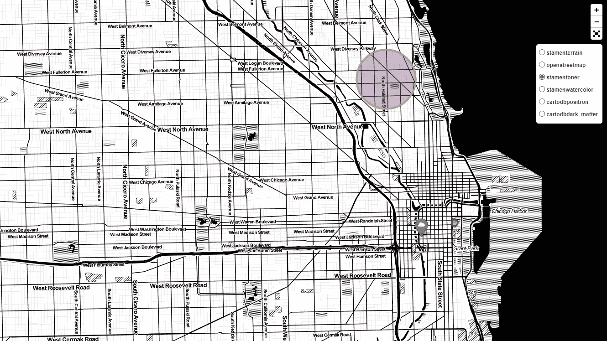

# 看一看叶子

> 原文：<https://medium.com/analytics-vidhya/a-look-at-folium-bf1b4784ca5d?source=collection_archive---------5----------------------->

Folium 是一个功能丰富的库，用于用 Python 创建交互式地图，可视化地理空间数据。follow 构建于 leaflet.js 之上，由于其语法和安装过程简单得多，同时具有所有相同的功能，因此经常被首选。下面我们将在创建芝加哥地图时探索一些特征。


名词，一种薄的叶状结构，例如在一些岩石或大脑的小脑中。

```
!pip install folium
import folium
from folium import plugins
```


只是一张空白地图

开始使用 leav 很容易，只需从 pip 安装和导入 leav 开始。也从叶进口插件，因为我们将需要一些额外的功能后第三方扩展。

```
Chicago = folium.Map(location=[41.878876, -87.635918],
                     zoom_start = 13,
                     control_scale=True)
```


这个看起来更舒服

创建第一个地图所需的全部内容就是上面的代码片段，将十进制格式的坐标、缩放级别(越高越近)和 control_scale 作为 True 传递到地图中，以便覆盖图稍后能够正确运行。

```
Chicago = folium.Map(location=[41.878876, -87.635918],
                     zoom_start = 13,
                     control_scale = True,
                     tiles = "OpenStreetMap")
```


我了解到工具提示会在截图中消失

切片是地图的样式，例如卫星视图或灰度。我们将在下面遇到更多样式的例子。

```
folium.Marker([41.878876, -87.635918], 
              popup="Aka Willis Tower", 
              tooltip='Sears Tower', 
              icon=folium.Icon(icon="cloud",
                               color='green')
             ).add_to(Chicago)
```


绿色的西尔斯大厦，红色的比恩，紫色的林肯公园

最基本的功能之一是创建一个标记，如上所示。当鼠标悬停在固定位置时，可以添加工具提示来显示信息，单击时弹出窗口将在气泡中显示信息。也有不同的图标和颜色内置的标记，以及创建自己的能力。记住不要错过。add_to()来指定要将标记添加到哪个地图。

```
folium.Circle(radius=100,
              location=[41.882638554916284,
                        -87.62330984352772],
              popup="Aka Cloud Gate",
              tooltip="The Bean",
              color="red",
              fill=True).add_to(Chicago)folium.CircleMarker(location=[41.922854499259714,
                              -87.64905956817513],
                    radius=65,
                    popup="Lincoln Park",
                    color="orange",
                    fill=True,
                    fill_color="purple").add_to(Chicago)
```


他们什么时候又改名字了？

标准标记的两个补充是 circlemarker 和 circle，这两个标记大部分相似，但有一些不同。Circlemarker 更多地用作标准标记来指示地图上的小点，而 circle 则用于将注意力吸引到更大的区域。

```
Chicago.add_child(folium.LatLngPopup())
```


点击地图的任何地方，LatLngPopup 都会弹出光标当前所在的经纬度。

```
Chicago.add_child(folium.ClickForMarker(popup="Marked Site"))
```


ClickForMarker 是相当简单的，单击地图将会在该位置放置一个大头针。将它与 LatLngPopup 一起使用可能是；不经常使用，因为弹出窗口的效果覆盖了大头针，迫使你点击其他地方。

```
folium.raster_layers.TileLayer('Open Street Map').add_to(Chicago)
folium.raster_layers.TileLayer('Stamen Terrain').add_to(Chicago)
folium.raster_layers.TileLayer('Stamen Toner').add_to(Chicago)
folium.raster_layers.TileLayer('Stamen Watercolor').add_to(Chicago)
folium.raster_layers.TileLayer('CartoDB Positron').add_to(Chicago)
folium.raster_layers.TileLayer('CartoDB Dark_Matter').add_to(Chicago)folium.LayerControl().add_to(Chicago)
```



两种截然不同的风格

这里我们在地图上添加了一个额外的图层来放置一些交互式的 GUI 元素。每个图层都在下拉列表中添加一个条目，使您可以通过地图界面更轻松地更改地图样式。

```
minimap = plugins.MiniMap(toggle_display=True)
Chicago.add_child(minimap)
```


就像一个游戏

还可以添加一个小地图来显示更大的周围区域的微缩视图，这本身就是一种探索可视化的交互方式

```
plugins.Fullscreen(position='topright').add_to(Chicago)
```

另一个容易实现的功能是全屏模式，以最大化我们目前使用的狭窄观看空间的视图。

```
draw = plugins.Draw(export=True)
draw.add_to(Chicago)
display(Chicago)
```


可能有些过火了

其中一个有趣的功能是 draw 插件，它允许你用点击线、多边形、拖动半径圆和矩形以及其他一些东西来注释地图。

```
zipmap = folium.Map(location=[41.878876, -87.635918],
                     zoom_start = 10)zipcodes = "[https://data.cityofchicago.org/api/geospatial/gdcf-axmw?method=export&format=GeoJSON](https://data.cityofchicago.org/api/geospatial/gdcf-axmw?method=export&format=GeoJSON)"folium.GeoJson(zipcodes, name="Chicago Zipcodes").add_to(zipmap)
```


创建辅助地图由于原始地图变得非常繁忙，我们导入伊利诺伊州提供的公开可用数据来绘制城市中每个邮政编码的边界。每个州通常以多种格式提供这些信息。geojson 是 leav 接受的格式。访问 data.cityofchicago.org 获取更多空间数据，如县或地理边界。

```
schoolmap = folium.Map(location=[41.878876, -87.635918],
                     zoom_start = 13)schools = "[https://data.cityofchicago.org/api/geospatial/2mts-wp7t?method=export&format=GeoJSON](https://data.cityofchicago.org/api/geospatial/2mts-wp7t?method=export&format=GeoJSON)"folium.GeoJson(schools, name="Chicago Public Schools").add_to(schoolmap)plugins.Fullscreen(position='topright').add_to(schoolmap)
```


这比我预料的要多

现在，使用一个同样由芝加哥市提供的新数据集，我们可以在该市每所公立学校的位置添加一个标记。虽然这显示了每所学校在地图上的确切位置，但要一目了然地了解分布情况并不容易。为此，我们可以使用一个名为热图的插件，创建一个易于阅读的密度覆盖。

```
import pandas as pdschools_csv = pd.read_csv("Chicago_Public_Schools.csv")
latitude    = schools_csv['Lat']
longitude   = schools_csv['Long']schoolheatmap = folium.Map(location=[41.878876,-87.635918],
                     zoom_start = 10)folium.plugins.HeatMap(list(zip(latitude,
                                longitude)),
                       radius=30,
                       blur=20).add_to(schoolheatmap)plugins.Fullscreen(position='topright').add_to(schoolheatmap)
```


相同的数据，不同的参数

热图不能理解。geojson 文件，我们将使用。csv 版本托管在。geojson 文件在同一个州政府网站。对于一个简单的热图，所需要的只是坐标。您经常需要试验热图的不同参数，以创建有意义的可视化效果。另一个注意事项是，当前版本的 allow 有一个已知的错误，不允许您禁用动态调整大小，因此必须将参数调整到所需的缩放级别。

```
Chicago.save(“Population-folium-map.html”)
```

最后，叶做一个比截图更好的，你可以保存你的地图。HTML 格式。这允许地图的交互版本被共享，所以你所有的努力没有白费。

请参考 [Chicago Data](https://data.cityofchicago.org/) 了解所使用的数据集和更多信息，以及[flour](https://python-visualization.github.io/folium/)了解关于该库的完整文档。