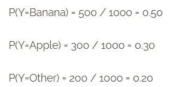

# 朴素贝叶斯的机器学习路线图

> 原文：<https://medium.com/analytics-vidhya/a-machine-learning-roadmap-to-naive-bayes-66437a48d9f3?source=collection_archive---------26----------------------->

***朴素贝叶斯*** *是一种基于* ***贝叶斯定理*** *的概率机器学习算法，用于多种分类任务。*

*在本文中，我们将理解朴素贝叶斯算法及其基本概念，以便在理解中没有怀疑的余地。*


图片来源:Becoming.ai

*朴素贝叶斯是一种简单但惊人强大的概率机器学习算法，用于预测建模和分类任务。*

朴素贝叶斯的一些典型应用有 ***垃圾邮件过滤*******文档分类*** 等。这是一种流行的算法，主要是因为它可以很容易地用代码编写，并且可以很快做出预测，这反过来又增加了解决方案的可扩展性。*

> *传统上，朴素贝叶斯算法被认为是基于实践的应用程序的首选算法，主要用于需要对用户请求做出即时响应的情况。*
> 
> *它是根据托马斯·贝叶斯牧师的作品改编的，因此得名。在开始学习朴素贝叶斯之前，重要的是要了解贝叶斯学习，什么是“条件概率”和“贝叶斯规则”。*

*贝叶斯学习是一种*监督学习技术*，其目标是建立一个具有目标属性具体定义的分类标签分布模型。朴素贝叶斯是基于应用贝叶斯定理和每一对特征之间独立性的 ***朴素*** 假设。*

****让我们通过一些例子从理解条件概率的原语开始:****

## ***例一***

*假设你有一枚硬币和一个骰子。当你掷硬币时，得到正面或反面的机会是均等的。所以你可以说得到正面的概率或者得到反面的概率是 50%。*

*现在如果你掷骰子，从 6 个数字中得到 1 的概率是 1/6 = 0.166。骰子上其他数字的概率也是一样的。*

## *实施例二*

**考虑另一个打牌的例子。你被要求从这副牌中挑选一张牌。给定一张红心牌，你能猜出得到国王的概率吗？**

*这里给定的条件是牌是红心，所以分母必须是 13 *(一副牌有 13 颗红心)*而不是 52。由于红心里面只有一张 k，所以如果这张牌是红心，那么它是 k 的概率是 **1/13 = 0.077** 。*

**所以当你说* ***条件概率*******一个给定 B*** *时，指的是一个给定 B 已经发生的概率。这是典型的* ***条件概率的例子。*****

***数学上*，给定 B 的*条件概率*可以定义为:**

*****P(A 和 B) / P(B)*****

# **贝叶斯定理**

***贝叶斯定理帮助你根据与前一事件有对应关系的任何事件的先验知识来检查一个事件的概率。它的用途主要是在概率论和统计学中。***

> **例如，如果我们有一些先验信息，如房屋周围的设施，与在不知道房屋位置的情况下做出的另一个评估相比，可以更好地计算出房屋价格高的概率。**

```
**P(A|B) = **[**P(B|A)P(A)**]**/**[**P(B)**]****
```

***上面的等式显示了贝叶斯定理的基本表示，其中 A 和 B 是两个事件:***

*****P(A | B)****:*事件 A 发生的条件概率，假定 B 已经发生。这被称为 ***后验概率。*****

*****P(A)和 P(B)****:*A 和 B 彼此没有任何对应关系的概率。**

*****P(B | A)****:*事件 B 发生的条件概率，给定 A 已经发生。**

***对应于机器学习算法，贝叶斯定理可以被重新表述为:***

```
**posterior = (prior x likelihood) / (evidence)**
```

> **考虑一种情况，其中属性的数量是 n，响应是一个布尔值。即**真**或**假**。属性是分类的(本例中有两个类别)。您需要为实例和响应空间中的所有值训练分类器。**

**这个例子在大多数机器学习算法中实际上是不可能的，因为你需要计算 **2∗(2^n-1)** 参数来学习这个模型。这意味着对于 30 个布尔属性，你需要学习超过 30 亿个参数，这是不现实的。**

# **朴素贝叶斯分类器**

**机器学习中的朴素贝叶斯分类器是一类基于贝叶斯定理的简单概率机器学习模型。*简单来说，就是一种假设预测器之间相互独立的分类技术。***

**朴素贝叶斯分类器通过对训练数据集做出 ***条件依赖*** 的假设来降低贝叶斯分类器的复杂性。**

> **假设给定变量 X，Y 和 Z，当且仅当给定 Z，X 的概率分布独立于 Y 的值时，X 将有条件地独立于 Y，这是条件依赖的假设。**
> 
> **换句话说，你也可以说，给定 Z，X 和 Y 是有条件独立的当且仅当，X 出现的知识没有提供关于 Y 出现的可能性的信息，反之亦然，给定 Z 出现。这个假设是朴素贝叶斯中术语**朴素**背后的原因。**

***考虑到 n 个不同的属性，可能性可以写成:***

```
 **n          
P(X₁...Xₙ|Y) = π P(Xᵢ|Y)
              i=1**
```

***数学表达式中:***

*****X*** 代表 ***属性***&***Y***代表 ***响应变量。*****

> **所以， **P(X|Y)** 变成等于给定 Y 的每个属性的概率分布的乘积。**

## ****最大化后验概率****

**如果想求 Y 的多个值的 **P(Y|X)** 的后验概率，需要计算 Y 的所有不同值的表达式。**

> **让我们假设一个新的实例变量 **X_NEW** 。在给定 **X_NEW** 的观察属性和从训练数据集估计的分布 P(Y)和 **P(X|Y)** 的情况下，您需要计算 Y 取任何值的概率。**

**为了根据为 **P(Y|X)** 获得的不同值预测响应变量，您需要考虑一个*可能值*或这些值的*最大值。***

> **因此，这种方法被称为**最大化后验概率**。**

## ****最大化可能性****

**如果您假设响应变量是*均匀分布的*，这意味着它获得任何响应的可能性是相等的，那么您可以简化朴素贝叶斯算法。**

> **这种假设的优点是先验的或 P(Y)变成一个常数值。**

**由于先验和证据变得独立于响应变量，它们可以从等式中移除。**

> **所以，最大化后验概率就变成了最大化似然问题。**

# **如何用朴素贝叶斯模型进行预测？**

> **考虑这样一种情况，你有 1000 种水果，要么是“香蕉”，要么是“苹果”，要么是“其他”。这些将是变量 y 的可能类别。**

***以下 X 个变量的数据均为二进制(0 和 1):***

*   ****长*长*****

*   ******黄色******

***训练数据集将如下所示:***

****

***现在让我们总结训练数据集以形成如下计数表:***

****

**分类器的主要任务是在已知三个属性*(长、甜、黄)*的情况下，预测给定的水果是*【香蕉】*还是*【苹果】*还是*【其他】*。**

**考虑这样一种情况，给你一个又长又甜的黄色水果，你需要预测它是什么类型的水果。**

> **这种情况类似于只有在已知定型数据集中的 X 属性时才需要预测 Y 的情况。使用朴素贝叶斯可以很容易地解决这个问题。**

**你需要做的事情是计算 3 个概率，即成为香蕉或苹果或其他的概率。概率最大的那个会是你的答案。**

*****第一步*****

**首先，您需要计算每个水果类别在所有水果中所占的比例，这是每个水果类别的先验概率。**

***先验概率可以从训练数据集计算:***

****

**训练数据集包含 1000 条记录。其中，你有 500 个香蕉，300 个苹果和 200 个其他的。所以先验分别是 0.5，0.3，0.2。**

*****第二步*****

**其次，你需要计算证据进入分母的概率。它只是所有 X 的 P 与 X 的乘积:**

****

*****第三步:*****

**第三步是计算证据可能性的概率，它只不过是 3 个属性的条件概率的乘积。**

***香蕉的可能性概率:***

****

**因此，香蕉的总体可能性概率将是上述三者的乘积，即 0.8 * 0.7 * 0.9 = 0.504。**

*****第四步:*****

**最后一步是将所有 3 个方程代入朴素贝叶斯的数学表达式，以获得概率。**

****

> **以类似的方式，你也可以计算“苹果”和“其他”的概率。分母在所有情况下都是一样的。**

*****Banana 得到的概率最高，所以那会被认为是预测类。*****

## **朴素贝叶斯分类器的类型**

***下面提到了朴素贝叶斯分类器的主要类型:***

*   ****—这类分类器通常用于文档分类问题。它检查文档是否属于特定的类别，如体育、技术或政治等，然后对它们进行相应的分类。****

> ***在这种技术中用于分类的预测因子是文档中出现的单词的频率。***

*   ******补充朴素贝叶斯*** —这基本上是多项式朴素贝叶斯的改编，特别适合不平衡数据集。***
*   *****伯努利朴素贝叶斯*** —该分类器也类似于多项式朴素贝叶斯，但预测器不是单词，而是布尔值。用于预测类变量的参数只接受 yes 或 no 值，**

> **例如，一个单词是否出现在文本中。**

*   *****核外朴素贝叶斯*** —该分类器用于处理大规模分类问题，对于这些问题，完整的训练数据集可能不适合存储。**
*   *****高斯朴素贝叶斯*** —在高斯朴素贝叶斯中，预测值采用连续值，假设它是从高斯分布中采样的。它也被称为正态分布。**

****

> **更多关于**概率分布** — [**机器学习数学第五部分**](/datadriveninvestor/mathematics-for-machine-learning-part-5-8df72392ec10)**

# **利弊**

**朴素贝叶斯算法有它的优点也有它的缺点**

## **赞成的意见**

*   **预测训练数据集的类别是容易且快速的。**
*   **它在多类预测中表现良好。**
*   **在假设独立变量的情况下，与其他模型(如逻辑回归)相比，它表现得更好。**
*   **它需要较少的训练数据。**
*   **与数字变量相比，它在分类输入变量的情况下表现更好。**

## **骗局**

*   **在分类变量具有未在训练数据集中观察到的类别的情况下，该模型无法做出预测，并为其分配 0(零)概率。**

> **这就是所谓的'**零频率'**。您可以使用**拉普拉斯估计来解决这个问题。****

*   **由于朴素贝叶斯被认为是一个糟糕的估计量，所以概率输出没有被认真对待。**
*   **朴素贝叶斯的工作原理是假设独立的预测因子，但是实际上不可能得到一组完全独立的预测因子。**

## **拉普拉斯校正**

**当您有一个包含许多属性的模型时，整个概率可能会变为零，因为其中一个要素的值为零。**

**为了克服这种情况，您可以将零变量的计数增加到一个小值，就像分子中的值一样，这样整体概率就不会为零。**

> **这种类型的校正被称为**拉普拉斯校正。**通常，所有的朴素贝叶斯模型都使用这个实现作为参数。**

## **应用程序**

*****朴素贝叶斯分类器在现实生活中有很多应用，下面提到一些:*****

*   *****实时预测*** —它是一个快速而热切的机器学习分类器，因此用于实时进行预测。**
*   *****多类预测*** —可以预测目标变量的多类概率。**
*   *****文本分类/垃圾邮件过滤/情感分析*** —因其多类问题和独立性原则，多用于文本分类问题。它们还用于识别垃圾邮件，以及识别社交平台上的负面和正面客户情绪。**
*   *****推荐系统*** —结合朴素贝叶斯分类器和协同过滤构建推荐系统。它过滤看不见的信息，并使用机器学习和数据挖掘技术预测用户是否喜欢给定的资源。**

## **改进模型**

**你可以通过下面的提示来提高朴素贝叶斯模型的能力**

1.  ***使用类似于 BoxCox 和 YeoJohnson 的变换对变量进行变换，以使连续特征符合正态分布。***
2.  ***使用拉普拉斯校正处理 X 变量中的零值，并预测零频率问题的测试数据集类别。***
3.  ***检查相关特征并移除高度相关的特征，因为它们在模型中被投票两次，可能导致过度膨胀。***
4.  ***将不同的功能组合在一起，打造出一款直观的新产品。***
5.  ***根据业务知识，为算法提供更现实的先验概率。使用整体方法，如装袋和增压，以减少差异。***

# **其他资源和参考**

**[](https://tp6145.medium.com/naive-bayes-from-scratch-c0c93ed4b826) [## 从零开始的朴素贝叶斯

### 在统计学中，朴素贝叶斯分类器是一类简单的“概率分类器”,它基于应用贝叶斯分类器

tp6145.medium.com](https://tp6145.medium.com/naive-bayes-from-scratch-c0c93ed4b826) [](https://github.com/tanvipenumudy/Winter-Internship-Internity/blob/main/Day%2013%20-%20Naive%20Bayes/Day-13%20Notebook%20%28Naive%20Bayes%29.ipynb) [## tanvipenumudy/Winter-实习-实习

### 存储库跟踪每天分配的工作-tanvipenumudy/Winter-实习-实习

github.com](https://github.com/tanvipenumudy/Winter-Internship-Internity/blob/main/Day%2013%20-%20Naive%20Bayes/Day-13%20Notebook%20%28Naive%20Bayes%29.ipynb) 

> 希望你喜欢并充分利用这篇文章！敬请关注我即将发布的博客！如果你觉得我的内容有帮助/有帮助，请确保**鼓掌**和**跟随**！**