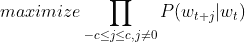
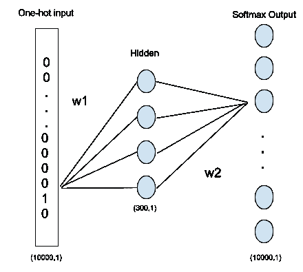
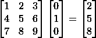
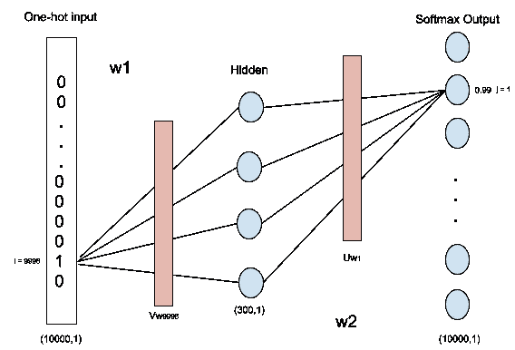
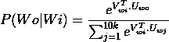
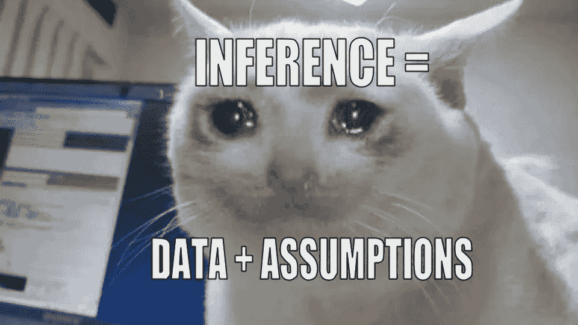
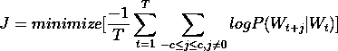

# 对单词嵌入的数学探究(跳格)

> 原文：<https://medium.com/analytics-vidhya/a-mathematical-dive-into-word-embeddings-5c06f2fd9bbe?source=collection_archive---------4----------------------->

# **为什么是单词嵌入？**

让我们考虑我们的 NLP 模型学习短语:

> 那是一幅美丽的画

它很难预测短语中的单词*【绘画】*——那是一个华丽的 ________。
这是因为*漂亮*和*华丽这两个词之间没有直接关系。因此，下一个问题是，我们要为此责备谁呢？*

## **一个热矢量**

以前，每个单词都是由整个单词语料库(称为词汇表)的一个热点向量来描述的。因此，一百万个单词的语料库将导致每个单词有一百万维长。

## **单词嵌入**

正如您可能已经想到的，主要目标是为单词构建一种编码，封装它们之间的某种关系。这些编码被称为单词嵌入。如果您正在寻找相同的直觉，我们的目标是创建嵌入，这样具有相似上下文的单词就聚集在一起(余弦相似性可以用来发现两个单词嵌入有多接近)。
此外，这也有助于减少输入向量的维数。


# **如何生成单词嵌入？**

希望现在你对我们要做的事情有个大概的了解。

现在是时候考虑我们实际上如何生成这些编码了！

先从 ***跳过克*** 说起吧。

## **跳过克**

skip-gram 神经网络模型的最基本形式实际上非常简单。它包括训练一个有一个隐藏层的神经网络。然而，与架构同样重要和有趣的是我们如何使用它来生成单词嵌入。

最初我们试图解决一个完全不同的问题。从一个大的英语文本语料库中，我们不断选择其长度取决于先前选择的窗口大小的短语。从这个窗口中，我们选择一个中心词，并将其称为目标。该短语中的其余单词称为上下文。我们建立一个模型，给定一个目标词，我们预测它的上下文。

> 我想要两份意大利干酪比萨饼
> 
> P(Wo|Wi) ->给定输入单词 Wi，得到上下文单词 Wo 的概率



神经网络的目标—(等式 1)



跳过 gram 模型架构—(图 1)

```
Shape of W1 = (300, 10000)
Shape of W2 = (10000, 300)Hidden = W1.X (300,1)
(Note that no activation function is applied here and neither is a bias term involved)
```

看看这个架构，很容易看出它是如何最大化获得与目标单词相对应的上下文单词的目标的。问题是，它如何帮助我们生成单词嵌入？

答案就在隐藏层权重矩阵 W1 中。

当学习一个目标词的不同上下文时，我们在某种程度上开发了一个模型，它封装了目标词和上下文之间的关系。因此，我们可以得出结论，隐藏层实际上是给定输入单词的单词嵌入。然而，我们需要语料库中所有单词的单词嵌入。因此，我们转向权重矩阵 W1。

W1 的形状为(300，10000)。与形状为(10000，1)的独热输入向量的矩阵乘法将呈现形状为(300，1)的向量。假设输入是一个独热编码向量，只有值为 1 的节点在矩阵乘法中起作用。其他节点为 0，则不会有任何贡献。

因此，我们可以说，对应于独热编码向量中的第 10 个元素的字将具有 W1 矩阵的第 10 列作为其字嵌入。(稍微想想这个)



(图二)

## softmax 层

关于输出 softmax 层的细节故意保持模糊。现在是时候揭开这背后的神秘面纱了。为了理解这一点，有必要理解我们实际上是在学习两个单词的嵌入；一个当单词是目标时，一个当单词是上下文时。前者由权重矩阵 W1 给出，后者由权重矩阵 W2 给出。

```
e1 = W1 . I      [I is the input vector]
e2 = (W2)T . O   [O is the one hot vector of the softmax argmax]
```

对于每个输入向量，隐藏层学习对应于权重矩阵 W1 的 300 个权重(Vwi)。 ***Vwi*** 然后乘以权重矩阵 W2，以便给出 softmax 输出。对于 softmax 输出中的每个节点，我们可以说存在来自 W2 矩阵的 300 (Uwj)个参数(对于每个输出字 j)。根据我们前面看到的，
Vwi = e1 和 Uwj = e2。利用这一点，我们最终可以说点积:
***(Vwi)T . Uwj*** 在计算输出节点 j 处的小数概率中起作用。

**注意:**以上计算是针对一个输入向量 Vwi



Vwi 和 Uwj 可视化示意图(图 3)

利用这一点，我们可以说每个输入的 softmax 函数如下所示:



(等式 2)

## **成本函数**

为了定义成本函数，我们必须回到我们实际定义目标的时候。我们的目标是在给定目标单词的情况下，最大化获得上下文单词的概率，如等式 1 所述。再多说一点吧。

首先，让我们来回答这个问题:*为什么是乘法运算？*
和所有机器学习问题一样，我们假设东西。这里我们假设独立。也就是说，所有的上下文目标对都是相互独立的(就像抛硬币一样！)

这给了我们这样的东西:

> P(w1，w2，w3 | Wi) = P(w1|Wi)。P(w2|Wi)。P(w3|Wi)



此外，你是否发现缺少了什么？

等式 1 仅考虑一个尺寸为 2c+1 的窗口。然而，我们需要考虑整个英语文本语料库中的所有窗口。因此，等式 1 必须扩展到我们遇到的所有 T 窗口。

最后，为了便于微分和防止下溢，我们取目标函数的对数。这给我们留下了:



我们除以 T，使得成本函数不受语料库大小的影响—(等式 3)

概率 P 可以使用等式 2 来计算

## **计算问题**

skip gram 模型适用于较小的词汇量。然而，情况并非总是如此。词汇表的大小很容易扩大到数百万个单词，这对 skip gram 模型构成了严重威胁。

为了更好地理解这一点，我们必须回到等式 2，看看分母中的求和。大约 1000 万的词汇量很容易使计算变得不可行。此外，必须对语料库中存在的每个上下文-目标对进行 1000 万次求和。这导致 skip gram 模型非常慢。

因此，下一个看似合理的问题是:*我们如何解决这个问题？*

有几种方法可以降低这种复杂性。
1。子采样
2。噪声对比估计
3。负采样
4。分层软件最大值

对上述解决方案的深入解释超出了这篇博文的范围。希望我能在不久的将来写下它们，并把它们链接到这里。

# **参考文献**

1.  [https://www.youtube.com/watch?v=Co-YYk0731I&list = plxlkzujlkmq 8 erds 5 vstektmvg-y9 z1dr&index = 7](https://www.youtube.com/watch?v=G5ah0QqkUgE&list=PLxlkzujLkmQ8erDs5VSteKTmVg-y9Z1dR&index=8)
2.  Tomas Mikolov 等人，向量空间中单词表示的有效估计，2013 年
3.  Andrew NG(深度学习. ai 系列课程 5 第 2 周)