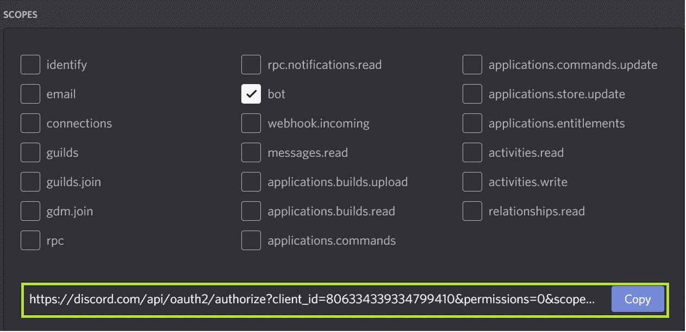
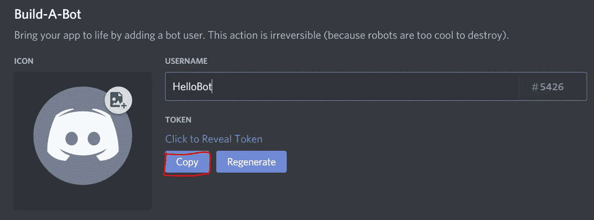

# 中学生不和谐机器人指南——设置

> 原文：<https://medium.com/analytics-vidhya/a-middle-schoolers-guide-to-discord-bots-set-up-aeac563c155b?source=collection_archive---------29----------------------->


Img 资料来源——100logos.net

拥有超过 2.5 亿用户的 Discord 是目前最受欢迎的在线交流应用之一。这款应用原本是为游戏玩家设计的，它允许人们通过语音、视频和文本直接交流。但对我来说，这不是这个应用程序的特别之处，而是它允许你向服务器添加机器人的功能。不和谐机器人是“人工智能”，可以执行许多有用的自动化任务，如禁止违反规则的人，欢迎成员，以及调节内容。对许多人来说，这可能没什么大不了的，但作为一名 8 年级学生，这是一个需要了解的变革性功能。我很快发现自己在试验 discord API，并努力尝试创建自己的多个机器人。我想分享我所获得的知识，并希望能指导其他和我有相似志向的人！

# **先决条件:**

1.  基本的 python 知识(本教程将重点介绍 discord.py，因此掌握一些 Python 知识是有帮助的，但不是必需的)
2.  你必须安装某种代码编辑器(我使用 Visual Studio 代码)。[下载(针对 Visual studio 代码)](https://code.visualstudio.com/download)
3.  一个不和谐的账户(很明显……)。[做账不和谐](https://discord.com/)
4.  您必须安装 Python(Python 3 . 5 . 3 或更高版本)。[下载](https://www.python.org/downloads/)
5.  您必须安装 pip

现在你已经有了这 5 个工具，你已经准备好开始你的 discord API 之旅了！

# 入门指南

**进入开发人员模式—** 开发人员模式只允许您的 Discord 客户端查看用户 ID、服务器 ID、频道 ID 和消息 ID 等信息。您可以通过进入不和谐> >用户设置> >外观> >高级> >打开开发者模式来启用不和谐开发者模式

**创建测试服务器—** 拥有可以测试机器人的空间非常重要。与其在公共服务器上这样做，不如创建一个私有服务器。您可以点击最右侧的“添加服务器”按钮> >为我和我的朋友选择一个模板(或创建自己的模板)> >。请确保为您的服务器选择一个唯一的名称！

**Discord 开发者门户—**Discord 开发者门户也称为 Discord API，是一个允许您将代码连接到 Discord 平台的空间。您可以通过访问[此链接](https://discord.com/login?redirect_to=%2Fdevelopers)并使用您的 discord 证书登录来访问 discord 开发者门户。

这样做之后，单击“新建应用程序”按钮，并将您的机器人命名为！

**将您的机器人添加到您的服务器—** 为了测试您的机器人，您需要将其添加到您的 discord 服务器。为此，请转到 discord 并进入 OAuth2 部分，如果您向下滚动，应该会看到多个复选框。确保你点击了标有“机器人”的方框



下面应该会弹出一个链接。复制链接后，将其粘贴到您首选的网络浏览器中，并选择一个服务器，您就可以开始了！

**下载 Discord.py —** 有几种不同类型的库可以用来创建机器人，但出于本教程的目的，我们将使用 Discord.py

假设您已经安装了 pip 和 python，您所要做的就是运行这个命令

```
pip install discord.py
```

运行此命令后，您应该会立即看到类似如下的成功消息:

```
Installing collected packages: discord.py
Successfully installed discord.py-[version-number]
```

太好了，现在你已经完成了设置，可以开始编码了！

# 创造一个不和谐机器人

现在，让我们开始创建你的第一个不和谐机器人！每当你在各自的不和谐服务器中输入一条信息时，这个机器人就会用一条特定的信息来响应

首先创建一个空白的 python 文档。

许多这样构造的代码可能会让人不知所措——让我们来分解一下

1.  import discord 函数将 discord.py 包导入到代码中
2.  这里我们引入了操作系统库，这使得连接不协调
3.  接下来，我们必须注册一个正在发生的事件。
4.  每次收到消息时，on message 事件都会触发一些事件
5.  现在我们要检查消息内容，例如这里如果消息是“$hello2”，那么 but 将回复“hello”
6.  最后一条消息包含将代码连接到客户端的令牌。

现在，为了让代码实际工作，您需要用一个对您的 bot 来说唯一的实际数字序列来替换最后一行中的单词 TOKEN。您可以通过进入 discord 开发者门户>>然后进入标题为“bot”的页面来获得令牌之后，单击令牌部分下的复制按钮来复制您的令牌。然后将最后一行代码中的单词“TOKEN”替换为您的机器人特有的实际令牌！



注意:记住永远不要共享您的令牌

# **结论**

这就对了。就是这样！你已经能够创建你的第一个不和谐机器人！凭借你对这个机器人的了解，你可以创造很多其他的东西。所以继续吧，探索，找点乐子:)