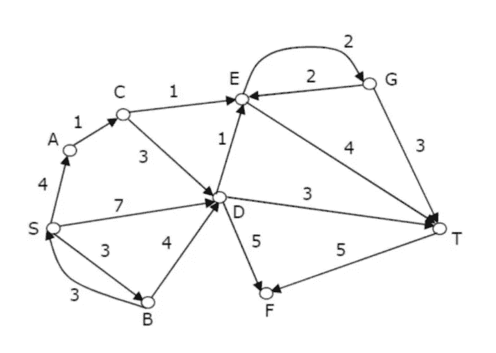

# 一种新的基于链表的最短路径算法

> 原文：<https://medium.com/analytics-vidhya/a-new-shortest-path-algorithm-using-lists-9d0933189bd2?source=collection_archive---------20----------------------->

在图论中，最短路径问题可以被定义为在图中寻找两个顶点(或节点)之间的路径，使得其组成边的权重之和最小化的问题。这是图论领域的一个热门话题，有许多实际应用，包括车辆路由、网络设计等。最短路径问题有几种著名的解决方法，包括 Floyd-Warshall 算法、Bellman-Ford 算法和最著名的 Dijkstra 算法。

当我遇到 Dijkstra 解决加权有向图中最短路径问题的方法背后的算法时(尽管它也可以应用于无向图)，我想知道我是否可以使用 Python 的一种数据结构:Lists 来提出自己的解决问题的算法。

经过一个多月的反复试验，我和我的同事赛义德·阿卜杜勒·阿齐姆想出了一种算法来解决这个问题。出于保密的原因，代码不会被共享，但是，作为读者的您，在我们继续解释我们对给定问题的解决方法时，也可能能够找出代码。

图一。

在上图中，我们观察到一个加权有向图，它将用于解决任意两个顶点之间的最短路径问题。

重要提示:请仔细理解以下列表的含义。如果你忘记了一个特定列表的目的，请回到这里来刷新你的记忆！

fr_list = >由位于特定边的“发送端”的顶点组成。

to_list = >由位于特定边的“接收端”的顶点组成。

co_list = >包含不同边的成本。

ml1 = >作为一个列表，继续努力寻找所选源顶点和目标顶点之间的不同路径。

ml1= >当在列表 ML1 中获得路径时，它将被添加到 ML1，因此，最终，ML1 将包括源和目的地顶点之间的所有路径。

我们开始吧！

将要求用户首先输入图形的边数。因为在我们的例子中，我们有 16 条边，用户将被要求集体输入:一条‘from _ edge’，一条‘to _ edge’和一条‘cost’；16 次。例如，如果您输入值“S”(from _ edge)、“A”(to _ edge)和 4(cost)，3 个列表的内部显示如下:

fr _ list =[' S ']；

to _ list =[' A ']；

co _ list =[4]；

因此，它表示存在从顶点‘S’到顶点‘A’的成本为 4 的边。类似地，如果您以随机方式输入所有 16 条边，假设如下:

(从指数 0 到 15)

fr_list=['S '，' B '，' S '，' G '，' D '，' G '，' C '，' E '，' A '，' C '，' E '，' B '，' T '，' D '，' S '，' D']

to_list=['A '，' S '，' D '，' E '，' E '，' T '，' E '，' G '，' C '，' D '，' T '，' D '，' F '，' F '，' B '，' T']

co_list=[4，3，7，2，1，3，1，2，1，3，4，4，5，5，3，3]

(添加额外的逗号只是为了让您能够完美地对齐所有 16 条边显示的信息)。如果你还不知道这三个列表想要传达的要点，这里有一个例子。在索引 15 处(分别是所有 3 个列表的最后元素)，传达了在 D 和 T 之间存在边，使得该边从 D 指向成本为 3 的 T。类似地，在索引 5 处，传达了在 G 和 T 之间存在从 G 指向 T 的成本为 3 的边。

现在，我们将严格按照 fr_list 元素的升序对所有 3 个列表进行排序。因此，现在将 3 个列表描述为:

索引=0，1，2，3，4，5，6，7，8，9，10，11，12，13，14，15

fr_list=['A '，' B '，' B '，' C '，' C '，' D '，' D '，' E '，' G '，' G '，' S '，' S '，' T']

to_list=['C '，' S '，' D '，' E '，' D '，' E '，' F '，' T '，' T '，' E '，' T '，' A '，' D '，' B '，' F']

co_list=[1，3，4，1，3，1，5，3，2，4，2，3，4，7，3，5]

**请按原样记下以上 3 个列表，因为在解决问题时会经常提到它们。**

我们的源顶点是‘S’，目的顶点是‘T’，因此，我们将‘S’指定为‘keyel’(表示‘关键元素’)，并在 fr_list 中搜索它的第一个出现。我们的 keyel 'S 首先出现在 fr_list 的索引 12 处。我们现在将“S”及其在 to_list 中索引 12 处的对应元素添加到 ml1 中。LKI，如下所示是一个列表，它记录了当一个关键字被找到时我们遇到的索引。我们现在将 keyel 的值更新为‘A’。在由字母(字符串)组成的列表中，不包括单引号。因此，到目前为止:

ml1=[S，A]

LKI=[12]

keyel=A

我们现在搜索 A 在 fr_list 中的第一次出现。它位于索引 0 处。**注意:当我们在 fr_list 中发现一个 keyel 时，我们首先检查这个 keyel 对应的 to_list 元素是否已经出现在 ml1 中。这样做主要是为了避免顶点的重复，从而导致可以缩短的不必要的长路径的形成。例如，如果 ml1 有[S，A，D，A，D，T]，那么在应用上述条件时，路径可以简单地写成=[S，A，D，T]。在本文的后面，每当要检查条件时，将使用关键字“check”。如果写为“check=False”，则表示当前 keyel 所在的 fr_list 中索引的对应 to_list 元素在 ml1 中不存在。如果“check=True”，这意味着相应的元素已经存在，我们需要从下一个索引开始在 fr_list 中搜索 keyel。这听起来可能令人困惑，但是当我们解决这个问题时，你一定会明白它的要点！:)**

在 fr_list 中的索引 0 处找到了 keyel。它在 to_list 中的对应元素(to_list 中索引 0 处的元素)是“C”，这在 ml1 中不存在。因此，check=False。

ml1=[S，A，C]；LKI=[12，0]；new keyel = C；keyel 现在位于索引 3。检查=假。

ml1=[S，A，C，E]；LKI=[12，0，3]；new keyel = E；在索引 8 处找到了 keyel。检查=假。

ml1=[S，A，C，E，G]；LKI=[12，0，3，8]；new keyel = G；在索引 10 处找到了 keyel。检查=真。

我们现在从索引 11 开始在 fr_list 中搜索当前的 keyel。Keyel 在索引 11 本身找到的。检查=假。

ml1=[S，A，C，E，G，T]；LKI=[12，0，3，8，11]；keyel = T；检查=假。

因为我们的新关键点是 T，即目的顶点，我们现在有了从源顶点到目的顶点的第一条路径。此路径现在将被添加到 ML1。

ML1=[S，A，C，E，G，T]。

每当我们找到一个明确的路径，它将被添加到 ML1。最后，当我们穷尽了所有可能的路径后，它们将一起显示在 ML1 中。

既然我们现在获得了第一条路径，我们将对 ml1 进行必要的修改；通过删除列表的最后一个元素，将新的最后一个元素指定为 keyel，并在 fr_list 中搜索它的下一个出现，该元素以前没有被覆盖。在我们删除 LKI 列表的最后一个元素之前，我们必须从大于 LKI 的当前最后一个元素的索引中搜索 fr_list 中的新关键字。更新后的 ml1=[S，A，C，E，G]；keyel = G；目前 LKI=[12，0，3，8，11]。我们现在必须从索引 12 开始在 fr_list 中搜索 keyel G，然后删除 LKI 的最后一个元素。让我们称这种方法为“SIEC”(搜索索引和扩展概念)。

**V. IMP 注意:当我们在寻找 fr_list 中 keyel 的出现的过程中试图寻找一条路径时，我们从索引 0 开始寻找它的出现。SIEC 仅适用于以下两种情况:1 .当在 fr_list 中没有找到 keyel 时；2.当获得一条确定的路径时。**

ml1=[S，A，C，E，G]；keyel = G；LKI=[12，0，3，8]。从 12 开始搜索 G，没有找到 G。我们再次执行上一段提到的相同程序(SIEC)。

ml1=[S，A，C，E]；keyel = E；从 9 开始搜索 E；LKI=[12，0，3]。e 发现于 9。

ml1=[S，A，C，E，T]；keyel = T；LKI=[12，0，3，9]；检查=假。

新的 keyel 是我们的目的顶点，因此我们获得了第二条路径:

ML1=[S，A，C，E，T]。

表演 SIEC:

ml1=[S，A，C，E]；keyel = E；从 10 开始搜索 E；LKI=[12，0，3]；e 从 10 开始就没有了。

SIEC:

ml1=[S，A，C]；keyel = C；从 4 开始搜索 C；LKI=[12，0]；c 在 fr_list 中的索引 4 处找到。

ml1=[S，A，C，D]；keyel = D；LKI=[12，0，4]；检查=假。

从索引 0 开始在 fr_list 中搜索 D。d 发现于 5。

ml1=[S，A，C，D，E]；keyel = E；LKI=[12，0，4，5]；检查=假。e 发现于 8。

ml1=[S，A，C，D，E，G]；keyel = G；LKI=[12，0，4，5，8]；检查=假。g 发现于 10。

ml1=[S，A，C，D，E，G，E]；keyel = T；LKI=[12，0，4，5，8，10]；Check=True，因此，应用 SIEC:

ml1=[S，A，C，D，E，G]；keyel = G；从 11 开始搜索 G；LKI=[12，0，4，5，8]；g 发现于 11 本身。

ml1=[S，A，C，D，E，G，T]；keyel = T；LKI=[12，0，4，5，8，11]；检查=假。获得路径 3。

ML1=[S，A，C，D，E，G，T]。

SIEC:

ml1=[S，A，C，D，E，G]；keyel = G；从 12 开始搜索 G；LKI=[12，0，4，5，8]；g 未找到。SIEC:

ml1=[S，A，C，D，E]；keyel = E；从 9 开始搜索 E；LKI=[12，0，4，5]；e 发现于 9。

ml1=[S，A，C，D，E，T]；keyel = T；LKI=[12，0，4，5，9]；检查=假。获得路径 4。

ML1=[S，A，C，D，E，T]。

SIEC: ml1=[S，A，C，D，E]；keyel = E；从 10 开始搜索 E；LKI=[12，0，4，5]；e 未找到。

SIEC: ml1=[S，A，C，D]；keyel = D；从 6 开始搜索 D；LKI=[12，0，4]；d 发现于 6。

ml1=[S，A，C，D，F]；keyel = F；LKI=[12，0，4，6]；Check = False 从索引 0 开始找不到 f。

SIEC: ml1=[S，A，C，D]；keyel = D；从索引 7 开始搜索 D；LKI=[12，0，4]；d 发现于 7。

ml1=[S，A，C，D，T]；keyel = T；LKI=[12，0，4，7]；Check = False 获得路径 5。

ML1=[S，A，C，D，T]。

SIEC: ml1=[S，A，C，D]；keyel = D；从 8 开始搜索 D；LKI=[12，0，4]；d 未找到。

SIEC: ml1=[S，A，C]；keyel = C；从 5 开始搜索 C；LKI=[12，0]；c 未找到。

SIEC: ml1=[S，A]；keyel = A；从 1 开始搜索 A；LKI =[12]；a 未找到。

SIEC:ml1 =[S]；keyel = S；从 13 开始搜索 S；LKI =[]；发现于 13 岁。

ml1=[S，D]；keyel = D；LKI =[13]；Check = False 从 0 开始搜索，在 5 处找到 D 个。

ml1=[S，D，E]；keyel = E；LKI=[13，5]；Check = False 从 0 开始，在 8 找到 E。

ml1=[S，D，E，G]；keyel = G；LKI=[13，5，8]；Check = False 从 0 开始，G 位于 10。

ml1=[S，D，E，G，E]；keyel = E；LKI=[13，5，8，10]；Check = True

SIEC: ml1=[S，D，E，G]；keyel = G；从 11 开始搜索 G；LKI=[13，5，8]；g 发现于 11。

ml1=[S，D，E，G，T]；keyel = T；LKI=[13，5，8，11]；Check = False 获得路径 6。

ML1=[S，D，E，G，T]

SIEC: ml1=[S，D，E，G]；keyel = G；从 12 开始搜索 G；LKI=[13，5，8]；g 未找到。

SIEC: ml1=[S，D，E]；keyel = E；从 9 开始搜索 E；LKI=[13，5]；e 发现于 9。

ml1=[S，D，E，T]；keyel = T；LKI=[13，5，9]；Check = False 获得路径 7。

ML1=[S，D，E，T]

SIEC: ml1=[S，D，E]；keyel = E；从 10 开始搜索 E；LKI=[13，5]；e 未找到。

SIEC: ml1=[S，D]；keyel = D；从 6 开始搜索 D；LKI =[13]；d 发现于 6。

ml1=[S，D，F]；keyel = F；LKI=[13，6]；Check = Falsef 找不到任何地方。

SIEC: ml1=[S，D]；keyel = D；从 7 开始搜索 D；LKI =[13]；在 7 楼找到的 d。

ml1=[S，D，T]；keyel = T；LKI=[13，7]；获得路径 8。

ML1=[S，D，T]

SIEC: ml1=[S，D]；keyel = D；从 8 开始搜索 D；LKI =[13]；d 未找到。

SIEC:ml1 =[S]；keyel = S；从 14 开始搜索 S；LKI =[]；发现于 14 岁。

ml1=[S，B]；keyel = B；LKI =[14]；Check = False 从 0 开始，B 位于 1。

ml1=[S，B，S]；keyel = S；LKI=[14，1]；Check = True

SIEC: ml1=[S，B]；keyel = B；从 2 开始搜索 B；LKI =[14]；b 发现于 2。

ml1=[S，B，D]；keyel = D；LKI=[14，2]；Check = False 从 0 开始，D 发现于 5。

ml1=[S，B，D，E]；keyel = E；LKI=[14，2，5]；Check = False 从 0 开始，D 发现在 8。

ml1=[S，B，D，E，G]；keyel = G；LKI=[14，2，5，8]；Check = False 从 0 开始，G 找到 10。

ml1=[S，B，D，E，G，E]；keyel = E；LKI=[14，2，5，8，10]；Check = True

SIEC: ml1=[S，B，D，E，G]；keyel = G；从 11 开始搜索 G；LKI=[14，2，5，8]；g 发现于 11。

ml1=[S，B，D，E，G，T]；keyel = T；LKI=[14，2，5，8，11]；Check = False 获得路径 9。

ML1=[S，B，D，E，G，T]

SIEC: ml1=[S，B，D，E，G]；keyel = G；从 12 开始搜索 G；LKI=[14，2，5，8]；g 未找到。

SIEC: ml1=[S，B，D，E]；keyel = E；从 9 开始搜索 E；LKI=[14，2，5]；e 发现于 9。

ml1=[S，B，D，E，T]；keyel = T；LKI=[14，2，5，9]；Check = False 获得路径 10。

ML1=[S，B，D，E，T]

SIEC: ml1=[S，B，D，E]；keyel = E；从 10 开始搜索 E；LKI=[14，2，5]；e 未找到。

SIEC: ml1=[S，B，D]；keyel = D；从 6 开始搜索 D；LKI=[14，2]；d 发现于 6。

ml1=[S，B，D，F]；keyel = F；LKI=[14，2，6]；Check = False 从 0 开始，F 未找到。

SIEC: ml1=[S，B，D]；keyel = D；从 7 开始搜索 D；LKI=[14，2]；d 发现于 7。

ml1=[S，B，D，T]；keyel = T；LKI=[14，2，7]；Check = False 获得路径 11。

ML1=[S，B，D，T]

SIEC: ml1=[S，B，D]；keyel = D；从 8 开始搜索 D；LKI=[14，2]；d 未找到。

SIEC: ml1=[S，B]；keyel = B；从 3 开始搜索 B；LKI =[14]；b 未找到。

SIEC:ml1 =[S]；keyel = S；从 15 开始搜索 S；LKI =[]；没有找到。

SIEC: ml1=[]。

由于现在没有 keyel，这意味着我们已经获得了从源顶点到目的顶点的所有可能的路径。

获得的所有路径及其总成本如下:

1.  s→A→C→E→G→T；成本=11
2.  s→A→C→E→T；成本=10
3.  s→A→C→D→E→G→T；成本=14
4.  s→A→C→D→E→T；成本=13
5.  s→A→C→D→T；成本=11
6.  s→D→E→G→T；成本=13
7.  s→D→E→T；成本=12
8.  s→D→T；成本=10
9.  s→B→D→E→G→T；成本=13
10.  s→B→D→E→T；成本=12
11.  s→B→D→T；成本= 10

因此，从源顶点到目的顶点有 3 条最短路径。它们是路径 2，8，11。

建议自己追踪上述问题，然后将算法应用于其他加权有向图问题！