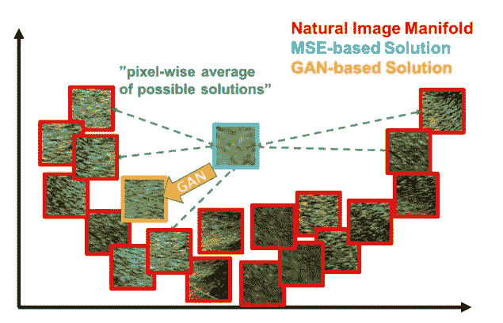
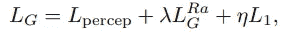
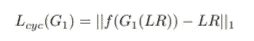
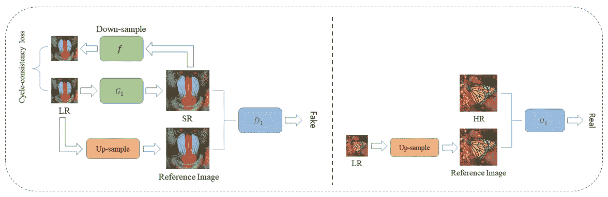
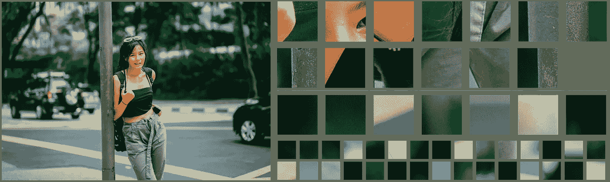

# 一种提高超分辨率的一对多方法

> 原文：<https://medium.com/analytics-vidhya/a-one-to-many-approach-for-improving-super-resolution-a89146df343d?source=collection_archive---------3----------------------->

这篇文章将概述我正在进行的一个项目，该项目旨在改进当前的超分辨率方法。我想读者应该对以前的作品有基本的了解( [SRGAN](/analytics-vidhya/super-resolution-with-srresnet-srgan-2859b87c9c7f) 和 [ESRGAN](/analytics-vidhya/how-esrgan-improves-super-resolution-performance-15de91d77ada) )，但是我相信没有任何这方面的背景不会有太大的问题。

# 一对多超分辨率

在给定 LR 图像的情况下，超分辨率是具有多种可能重建的一对多问题。当在严格的内容损失上进行训练时，当所有似是而非的重建中只有一个解决方案被接受作为基本事实答案时，问题就出现了。在这种情况下，该模型不能选择一个现实的重建，而是倾向于输出可能的解决方案的逐像素平均值。这个一对多的问题是由 SRGAN 引发的，并且通过使用更感性的训练目标*部分*解决了。

SRGAN 的问题情况

SRGAN 认为 SR 是一个一对多的问题，并提出了一个改进的训练目标，但没有提供一个可以生成多个答案的生成器。要真正解决这个问题，生成器必须能够输出真实面片(红色面片)的完整流形，而不是只预测一个样本。

我们试图提出一个完整的一对多流水线来提高超分辨率的感知质量。

# 埃斯甘

自 ESRGAN 的工作以来，大多数基于感知的超分辨率研究都集中在改进模型架构，同时使用 ESRGAN 的训练目标。那么 ESRGAN 的培养目标是什么呢？

ESRGAN 培训目标

如以上公式所述，ESRGAN 将 L1 严格内容损失与感知损失和 GAN 损失相结合。原因是 GAN 损耗在提高感知质量的同时，不能保证超分辨率图像与原始图像完全相同。因此，虽然这两种损失根本不一致，L1 损失会损害感知质量，但为了学会工作，它们需要混合在一起。

可以改善内容损失以确保内容，同时最小化对感知训练目标的负面影响。

我们的主要建议如下:

*   我们提出了一种较弱的内容损失，它不会影响图像中高频细节和随机变化的产生。
*   我们通过在每个 RRDB 模块后添加缩放的逐像素噪声，使发生器能够产生不同的输出。
*   我们使用拉普拉斯激活来过滤训练数据中的模糊区域。
*   我们另外向鉴别器提供 LR 图像，以向发生器提供更好的梯度反馈。

## 循环一致性内容损失

我们将超分辨率问题视为 LR 和 HR 图像空间之间的图像到图像转换任务，并应用 CycleGAN 框架的循环一致性损失。为了简化问题，我们利用 G2:HR > LR 的先验知识。我们可以将下采样操作表示为 f，并将 G2 设置为 f，而不是学习它。因此，我们的管道不需要学习 D2，这是一个学习 G2 的工具。这就只剩下 G1 和 D1 值得学习了。我们的周期一致性损失可以写成下面的等式。这种损失不会以任何方式影响高频细节的生成，同时 SR 图像与 LR 图像保持一致。下图描述了我们方法的图形概览。

## 给发电机带来噪音

为了使生成器能够在给定单个图像的情况下生成一个以上的解，它必须接收并应用随机信息。StyleGAN 通过将逐像素高斯噪声添加到发生器中每个层的输出来实现图像的随机变化。我们采用这种方法，并在生成器的每个 RRDB 层后添加噪声。

然而，每个通道的灵敏度和所需的噪声幅度会有所不同。在每一层之后直接添加相同的噪声可能会损害发生器的能力。例如，检测边缘的通道会受到噪声的严重损害。为了减轻这种可能的问题，我们允许每个通道学习所需的噪声幅度。具体来说，在将噪声添加到每层的输出之前，我们将噪声乘以一个可训练的通道比例因子。

## 鉴别器的参考图像

传统上，鉴别器网络接收单个图像，并被训练来对给定图像是真实图像还是生成图像进行分类。此设置将为生成器提供“任何自然图像”的梯度，而不是朝向相应的 HR 图像。在一个极端的例子中，传统的鉴别器不会因为生成器从 LR 图像生成完全不同但同样真实的图像而惩罚它。鉴别器给出的梯度反馈对于超分辨率来说是次优的。上图也说明了这一点。

## 模糊检测

我们认识到，在来自 DIV2K 和 DIV2K 数据集的图像中经常存在严重模糊的区域。这些模糊区域可能会困扰生成器来学习生成这样的模糊补丁。仅基于 LR 图像，模糊的背景通常无法与更精细的对象区分开来。

我们建议在网络在这些斑块上被训练之前检测并移除模糊的斑块。存在各种用于模糊检测的方法，例如算法方法和基于深度学习的方法。然而，在我们的案例中，算法方法已经足够了，如下图所示。上面两行是分类为清晰的补片，下面的行是模糊的补片，

我们提出了一个超分辨率的一对多流水线和两个额外的改进来提高 SR 的感知质量，你觉得我的想法怎么样？