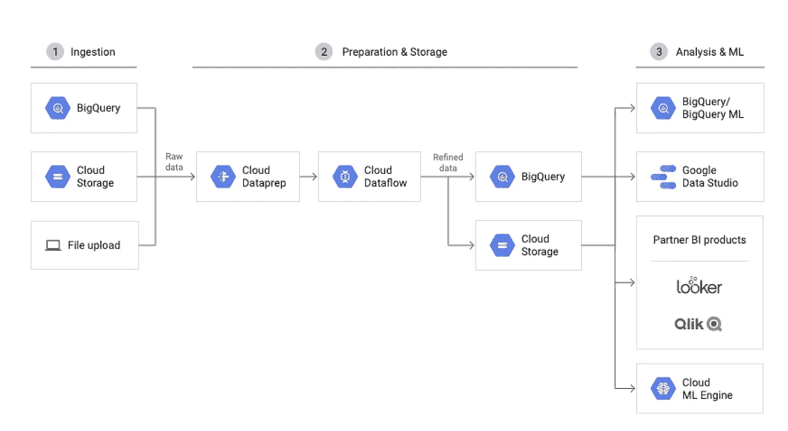

# 使用 Google Cloud Dataprep 进行数据准备的一瞥

> 原文：<https://medium.com/analytics-vidhya/a-peek-into-data-preparation-using-google-cloud-dataprep-725546e0c3a?source=collection_archive---------5----------------------->

云数据准备架构

D 数据准备是进行数据分析和报告前的重要步骤。作为一名数据工程师，通常要占用 80%的开发时间。

然而，它只是一系列探索、清理和修改原始数据的过程。

**Google Cloud Dataprep** 让数据准备变得简单、快速和有趣。