# Python 中探索性数据分析(EDA)的实用指南——如何开始任何数据分析。

> 原文：<https://medium.com/analytics-vidhya/a-practical-guide-to-exploratory-data-analysis-eda-in-python-how-to-start-any-data-analysis-3fd200516553?source=collection_archive---------4----------------------->

## EDA 是任何数据项目的必备工具。这是关键的第一步，可以让您的生活更加轻松，并让您的数据更加清晰。

# **EDA 是什么？**

如果你来看我的文章是为了更多地了解 EDA，在这一点上，我想你可能对我所说的有所了解。对于这些，跳到下一个主题，但对于其他人不知道 EDA 是什么，坚持一点点与我联系。

探索性数据分析是指一种分析和总结数据的方法，通常采用可视化方法。我们希望使用数据作为工具来帮助我们解决问题和做出更好的决策，但当我们使用数据来验证自己的假设时，我们正在朝着错误的方向前进。这背后的想法是理解数据没有偏见的假设。我们只是想看看当时的情况。永远记住:


图片由熊伟·申拍摄，灵感来自 capital.com

这是一个耗时的过程，但是如果处理得当，它会为你节省一些宝贵的时间和精力，并帮助你做出更好的选择。

# **如何表演**

现在你知道什么是 EDA 和它的重要性，我们可以朝着执行它前进。这里有一些步骤将引导你通过。

*   了解数据集-评估数据集的质量
*   数据集的分布—数据看起来如何？
*   相关性-在数据集中查找模式

# **了解数据集**

这第一步将帮助我们描述数据的基本情况，并获得数据的摘要。首先，让我们导入数据集。对于这个例子，我使用的是从 [Kaggle](https://www.kaggle.com/gpreda/covid-world-vaccination-progress) 下载的数据集。

## **加载数据集**

```
**import** pandas **as** pddataset = pd.read_csv("country_vaccinations.csv")
```

然后我想看看数据集是什么样的。head 函数将允许显示前五行。

```
dataset.head()
```

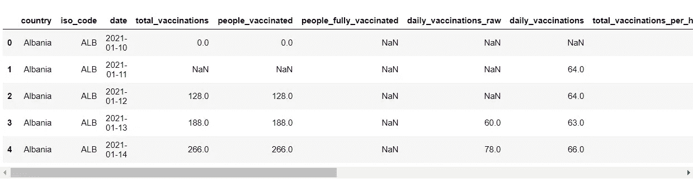

Python 将返回数据集的前五行

## 计算行数

我想看看数据集有多大。有一些方法可以做到这一点，一种方法是使用索引。

```
dataset.index
```

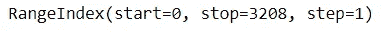

该数据集中有 3208 行

## 删除任何不必要的列

如果你有任何不相关的专栏/专题，可以删除。我将删除“iso_code”、“source_name”和“source_website”列，因为它们对我的分析没有帮助。只要确保它不会干扰你的分析，如果你不确定，就保持原样。

```
columns = ["iso_code", "source_name", "source_website"] #define the columns to be removed
dataset_clean = dataset.drop(columns, axis=1)
```

## **检查空值**

之后，让我们检查每个特性的缺失值的数量。

```
dataset_clean.isnull().sum()
```

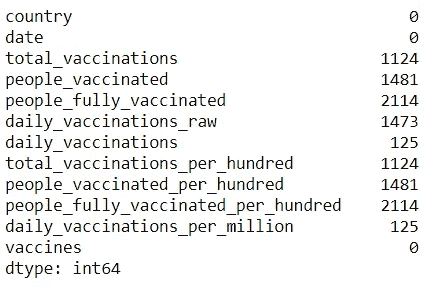

这些数字表示每个列/特征的空值的数量

我们注意到在相应的列中有一些空值。我们可以使用一些方法来处理这个问题:

*   删除缺少的值。
*   替换为平均值、中值或众数。

现在，为了简化，我将删除包含空值的行。

```
dataset_clean = dataset_clean.dropna
```

## **检查数据类型**

现在让我们检查每一列的数据类型。

```
dataset_clean.dtypes
```

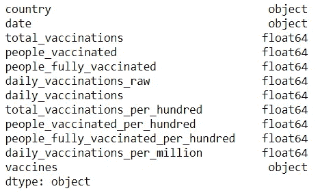

每列的数据类型

我们可以看到数据框中有对象和浮动。现在让我们进入下一步。

# **数据集的分布**

对于这一部分，我有两种方法。一个超级简单的程序，只需要两行代码和一个更费力的代码。我通常两者都做，因为前者很容易，如果我觉得不够，我就做后者。

## **使用 Sweetviz**

Sweetviz 是一个 python 库，可以用很少几行代码进行探索性的数据分析。我会告诉你如何安装和使用它。

**安装:**

使用 pip 安装 Sweetviz 库:

```
pip install sweetviz
```

**生成报告:**

现在让我们生成报告。对于这一部分，我将设置“每日接种疫苗”作为特性目标。当您运行这段代码时，它会将报告生成为 HTML 文件。如果您喜欢在笔记本中生成它，只需从 report.show_html()更改为 report.show_notebook()

```
import sweetviz as svreport = sv.analyze(dataset_clean, target_feat = "daily_vaccinations")
report.show_html()
```

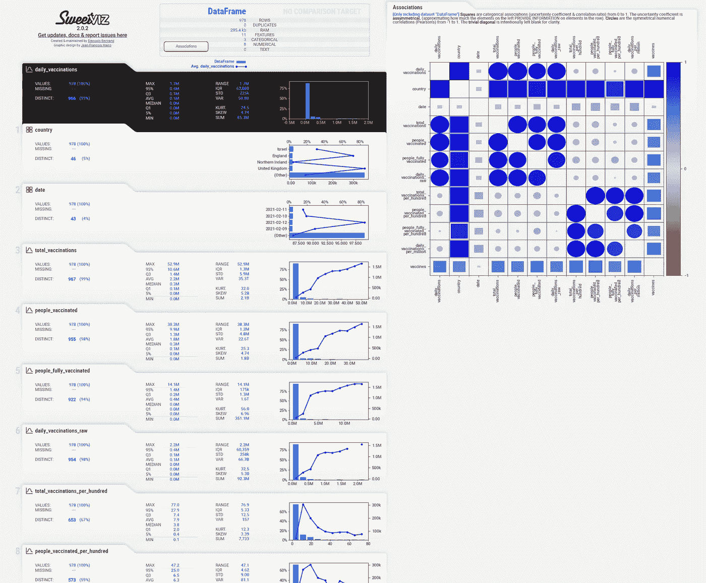

Sweetviz 报告

它将生成一些基本的可视化，如相关矩阵(对于分类和数字变量)和直方图。Sweetviz 是初学者进行探索性数据分析的绝佳方式。

对我们来说，我们希望探索更多的数据，寻找分布，并比较组，为我们的分析提供一些提示和见解。

## 直方图

直方图是可视化数据分布的一种很好的方式。我们可以用它来比较和确认结果，并对数据进行分层。如果你想进行假设检验，这真的很有用。根据您的数据是如何分布的，它将改变您将要运行的测试的类型。如果你想了解更多关于直方图的知识，在 [Youtube](https://www.youtube.com/watch?v=qBigTkBLU6g) 上有一个来自 StatQuest 的很棒的视频。

对于这一分析，我想比较威尔士和以色列之间的每日疫苗接种分布情况。首先，我想过滤数据框，使其仅包含我想分析的国家的数据。

```
# filter the dataframes by countrywales = dataset_clean[dataset_clean["country"] == 'Wales']
israel = dataset_clean[dataset_clean["country"] == 'Israel']
```

然后，我将使用 pandas 的 hist()函数绘制直方图。

```
wales.hist(column="daily_vaccinations")
```

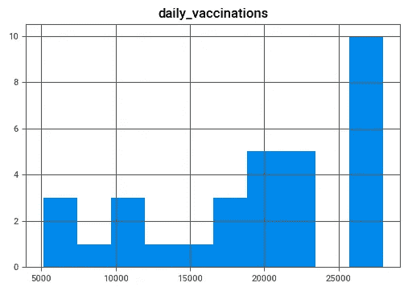

威尔士每日疫苗接种直方图

```
israel.hist(column="daily_vaccinations")
```

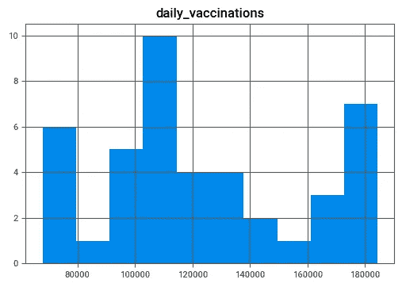

以色列每日疫苗接种直方图

我们在这里观察到，与以色列相比，威尔士的直方图向右倾斜。我们可以假设威尔士每天接种疫苗的人数比以色列多，但如果我们仔细观察 X 轴，威尔士每天接种疫苗的人数范围是 5，000 到 28，000 人，而以色列是 60，000 到 190，000 人，因此，以色列每天接种疫苗的人数比威尔士多得多。

## 箱线图

箱线图对于观察数据集中的异常值及其可变性非常有用。下图解释了箱形图的工作原理。还有另一个来自 [StatQuest](https://www.youtube.com/watch?v=fHLhBnmwUM0) 的精彩视频，解释了什么是盒子情节。

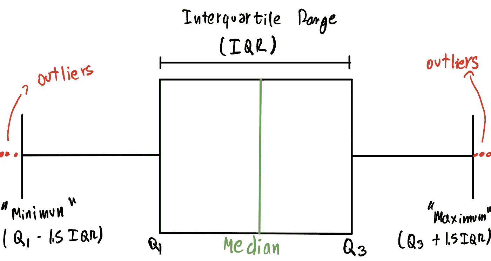

图片由熊伟·申拍摄，灵感来自 leansigmacorporation.com

我们将使用箱线图来分析数据是如何分布的，以及是否有异常值。同样，我们将使用来自威尔士和以色列的数据。

```
wales.boxplot(column=["daily_vaccinations"])
```

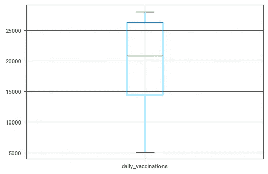

威尔士的每日疫苗接种箱地块

```
israel.boxplot(column=["daily_vaccinations"])
```

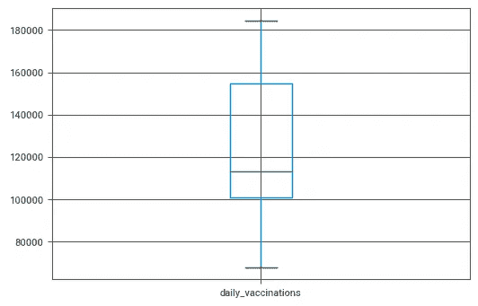

以色列的每日疫苗接种箱地块

我们注意到的第一件事是两个国家都没有异常值。我们注意到的第二件事是，这两个国家之间的中位数(由方框内的绿线表示)非常不同。威尔士的中位数约为 21.000，以色列约为 118.000，几乎是英国的 6 倍。

中值——代表排序后的数字列表中的中间数字——在数据中有大量异常值时特别有用。另一方面，均值对异常值非常敏感。例如，如果有人错误地计算了威尔士每天的疫苗接种数量，并输入了 200，000 而不是 20，000，这将对平均值产生很大影响，但对中位数没有影响。

在出现异常值的情况下，有必要评估这是错误的测量还是独特的情况。离群值并不总是一件坏事，我们可以单独分析它们，并且可以给我们的分析带来一些见解。

# 相关

相关性是分析变量之间是否存在相互依赖关系的一个很好的方法。

> 务必记住，**相关性并不意味着因果关系**。

记住这一点，让我们画出相关矩阵。对于这一部分，我将使用 corr()函数和 seaborn 库来绘制图表。

```
import matplotlib.pyplot as plt
import seaborn as snscorr = dataset_clean.corr()
plt.figure(figsize=(12, 10))sns.heatmap(corr[(corr >= 0.5) | (corr <= -0.4)], 
            cmap='viridis', vmax=1.0, vmin=-1.0, linewidths=0.1,
            annot=True, annot_kws={"size": 8}, square=True);
```

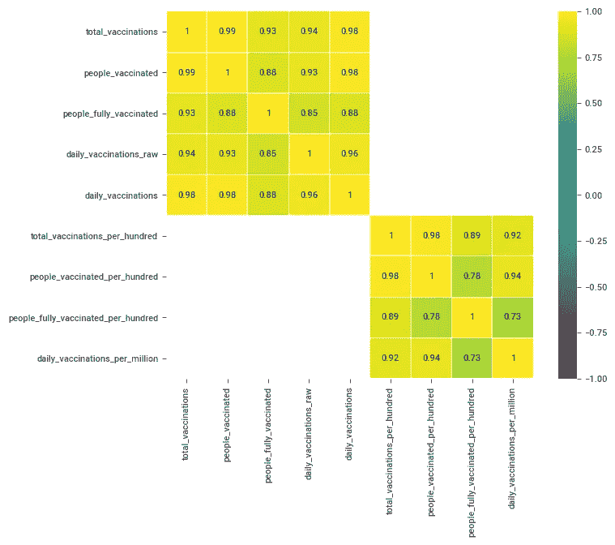

相关矩阵

在分析相关矩阵之前，我先解释一下怎么读。皮尔逊相关系数的值在-1 和 1 之间。

*   0 表示没有线性关系。
*   1 表示完全正线性相关，这意味着如果一个变量上升，相互依赖的变量也会上升。
*   -1 表示完全负线性相关，这意味着如果一个变量上升，相互依赖的变量就会下降。

分析矩阵很有意义。例如，每日疫苗接种和总疫苗接种之间的相关性为 1。意思是每日接种人数越高，总接种人数越高，完全正确。

对于这种情况，相关性非常明显，但对于其他数据集，这可能最终会为您提供有趣的见解来进一步分析。

# 后续步骤

有了这些数据，就有可能将分析推向不同的方向:

*   假设检验
*   收集更多数据
*   因果推理

我们注意到以色列每天接种疫苗的人数比威尔士多得多。这两个国家的平均值相差很大，所以我们可以相当肯定这些差异是显著的。如果这些差异很小，我们可以进行假设检验来检查差异是否显著。

知道了以色列接种疫苗更多，我们可以移动分析以收集更多的数据，并试图找到为什么以色列在新冠肺炎疫苗接种上如此成功的原因。

你可能已经注意到了，我已经尽可能地保持简单。这是我通常如何做我的 EDA，但这绝不是你需要遵循的。没有放之四海而皆准的 EDA。根据你的需要调整它，但是永远记住尽可能不带偏见地分析它。