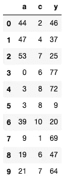
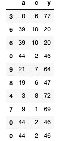

# 随机森林入门

> 原文：<https://medium.com/analytics-vidhya/a-primer-for-random-forests-1019c1d02bcb?source=collection_archive---------16----------------------->

## 第一章


那是随机的。戴维·科瓦连科在 [Unsplash](https://unsplash.com?utm_source=medium&utm_medium=referral) 上拍摄的照片

这是(我希望会是)一系列初级读本中的第一篇，帮助您开始了解重要的数据科学概念和方法。我发现当我学习新东西的时候，阅读相关的方法，然后尝试自己复制它是我最好的方法。

我不知道对你来说最好的方法是什么，但是让我们试一试，你将会离找到答案更近一步。而且，你可能会学到一些关于递归的东西，这非常有趣！

# 入门指南

本指南的目标是向您介绍或再次介绍随机森林的基础知识。为了更好地理解本指南，你应该对 python 中的数据分析、统计和编程有一个基本的了解。你不会找到很多公式或者正式的算法定义。我希望你能对什么是随机森林、它是如何工作的、它为什么工作以及如何用 python 构建一个随机森林有一个简单直观的理解。我还会为那些有兴趣深入研究的人提供一些进一步阅读的链接。

我们将以一个 30 秒的随机森林概述开始，然后将其分解为基本的构建块。一旦我们熟悉了构建模块，我们将更详细地探讨每一个模块。最后，我们将通过在 python 中实现随机森林算法，把我们所学的一切放在一起。准备好了吗？让我们开始吧！

# 30 秒总结

随机森林由决策树组成。决策树包括将预测器空间分割成简单的区域。为了对给定的观察值进行预测，我们取其所属区域中训练观察值的平均值(用于回归)或模式(用于分类)。

用于定义每个区域的规则集可以概括为一棵树，因此得名。与单个决策树相比，随机森林会生成许多这样的树，并采用这些树的平均值或预测模式来实现改进的预测性能。

如果这还没有意义，不要担心，当我们在接下来的章节中更详细地介绍它时，它将变得有意义。今天我们将为回归生长一个随机森林，但是我们将学习的原则也适用于分类。唯一的区别是终端节点计算和成本函数选择。

# 积木

**确定森林的大小:**好的，我们知道一个随机森林是由决策树组成的，我们对决策树有一个大致的概念。森林里有多少棵树？树的数量由用户决定。选择决策树的数量很重要，通常归结为一个简单的成本效益等式:计算更多树的成本与提高性能的可能收益。

**Bagging:** 为了从相同的训练数据中创建多个决策树，我们应用了 Bagging。装袋是机器学习中的常见过程，并且不限于基于树的方法。本质上，bagging 建立了多个模型，每个模型都基于训练数据的随机样本。很简单，对吧？

**自举:**使用自举来生成这些样本。为了理解引导，假设您有一个玩具数据集:

```
import pandas as pd
import numpy as npnp.random.seed(0)
toy_data = pd.DataFrame({
           'a' : np.random.choice(57, 10), 
           'c' : np.random.choice(11, 10),
           'y' : np.random.choice(78, 10)
           })display(toy_data)
```



我们的玩具数据。

要引导这个玩具数据，首先需要随机选择一行。选择的行是我们从`toy_data`采样的第一个观察结果。接下来，您对另一行进行采样，注意您首先采样的行保留在可能要选择的行池中。重复这个过程，直到你有你想要的观察数量。现在您有了一个引导示例！

在生长随机林时，通过引导选择的行数通常等于定型数据中的行数。你需要的自举样本的数量等于你需要生长的决策树的数量。

总而言之，引导就是简单地从训练数据中进行替换采样。每个样本中的行数是训练数据中的行数，样本数是您的林所需的树的数量。简单。

让我们在实践中看到它。

```
def bootstrap(df, random_seed):
    return df.sample(len(df), replace = True, 
                              random_state = random_seed)bootstrap(toy_data, 1)
```



我们的自举样本。

你可以看到我使用了`pandas.DataFrame.sample with replacement = True`,这就是全部内容。

**随机部分:**因此，我们有许多决策树，它们是基于我们的训练数据的自举样本生成的。我们有随机森林了吗？不完全是。我们需要解决随机森林的随机部分！

在生长正常决策树的每个阶段，所有的预测器都被考虑来确定树中的最佳下一步。在随机森林树中，在评估每个决策步骤之前，对可能的预测值进行随机抽样。这就限制了每一步可以选择哪些预测值。为什么这很重要？

想象一下，与用标准方法生长的三棵树相比，用这种改进的方法生长的三棵树。这三个随机森林树很可能彼此不太相似，因为它们都被迫考虑随机选择的一组预测因子。每一棵随机的森林树更有可能考虑其他树忽略的预测因子。

将这与标准流程进行比较——这些树可能彼此非常相似。他们在每个阶段都考虑了相同的预测集，唯一的区别是他们作为训练输入接收的自举样本。**随机森林树过程的结果是减少了树之间的相关性。**

随机林中的预测只是来自林中决策树的预测的汇总。总结多棵树的目的是减少方差，对吗？对一组相关性较低的树进行汇总会进一步降低方差。带回家？

## 在看不见的测试数据上，随机森林通常比单个决策树或一组袋装决策树表现更好。

现在我们已经了解了基本的构建模块，我们准备开始第二章——生成决策树！即将推出…:-)

```
**References**1\. *Gareth James, Daniela Witten, Trevor Hastie, Robert Tibshirani. An Introduction to Statistical Learning : with Applications in R. New York :Springer, 2013.*
```