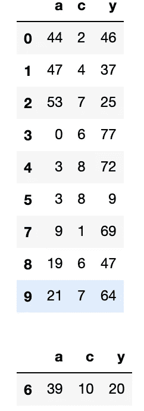

# 随机森林入门

> 原文：<https://medium.com/analytics-vidhya/a-primer-for-random-forests-8c4c0b87d498?source=collection_archive---------11----------------------->

## 第二章


决定，决定。照片由 [Unsplash](https://unsplash.com?utm_source=medium&utm_medium=referral) 上的[延斯·勒列](https://unsplash.com/@leliejens?utm_source=medium&utm_medium=referral)拍摄

# 让我们开始编码吧！

如果你想在阅读的过程中用 python 制作自己的决策树——那就跳进这个 [Colab 笔记本](https://colab.research.google.com/drive/1DtLL7ywM4qm5P-6e_U5nnNggbIisb3Gf?usp=sharing)吧，里面有我们今天要浏览的所有代码。它还有下载 [sklearn 波士顿数据集](https://scikit-learn.org/stable/modules/generated/sklearn.datasets.load_boston.html)的代码，帮助你思考一个真正的问题。在波士顿的数据中，这意味着在给定某些因素的情况下，使用随机森林来预测中值房价。例如，在一个平均每套住宅有 4 个房间、人均犯罪率为 4.8 的地区，房价中位数是多少？都准备好了吗？让我们开始吧！

[*前情提要……随机森林*](/analytics-vidhya/a-primer-for-random-forests-1019c1d02bcb)

# 决策树

随机森林最重要的组成部分是决策树。正如我们之前所讨论的，随机森林只是一个决策树的集合，带有一些关于树如何生长的额外规则。

**节点:**决策树由节点组成。回到我们的 30 秒总结，节点是帮助创建由决策树定义的预测器空间区域的规则。让我们通过一个例子来深入探讨这个问题。还记得我们的玩具数据集吗？

```
**--Code--**
display(toy_data)
```


我们的玩具数据。

想象“a”和“c”是“y”的预测值。要创建一个节点，我们需要选择一个预测值和一个值来定义这个节点的规则。这种规则的一个例子是“a < 44”。具有该规则的节点将在我们的预测器空间中创建两个区域:

```
**--Code--**
display(toy_data[toy_data['a'] < 44])
display(toy_data[toy_data['a'] >= 44])
```


我们的玩具数据，被根节点分成两个分支。

这是我们的根节点，它根据规则将训练数据一分为二。为了创建一个完整的决策树，我们简单地在每个“分支”上重复这个过程，直到我们到达一个终端节点。分支是由拆分创建的两个数据子集。它们是通过将节点规则(在本例中为 a< 44)应用于数据而创建的，为我们提供了上面的两个数据子集。末端节点有时被称为叶子。它们是树的最外层节点，由一组停止标准定义。这些标准确保我们不会试图从训练数据中提取太多信息。还记得我们对决策树的定义吗？

> 决策树包括将预测器空间分割成简单的区域。为了对给定的观察值进行预测，我们取其所属区域中训练观察值的平均值(用于回归)或模式(用于分类)。

想象一下，拆分您的数据，直到没有数据可拆分。用于预测的区域(数据子集)最多包含一个数据点。一个数据点的均值或众数对预测有用吗？不不不是的。因此，我们定义了一些标准，以确保我们定义的数据子集具有最小的方差，但有足够的数据点来进行有用的预测。稍后我们将详细讨论这些标准。

让我们想想在我们的 [sklearn Boston 数据集](https://colab.research.google.com/drive/1DtLL7ywM4qm5P-6e_U5nnNggbIisb3Gf?usp=sharing)中一个节点会是什么样子。打开它，运行上面链接的 collab 笔记本中的“让我们使用一些真实的数据”单元格，如果你想在我们沉思时查看数据。

假设我们评估数据，发现最佳的第一次分裂是< 3 rooms per dwelling on average. This means that separating data with less than 3 rooms per dwelling on average from data with 3 or more rooms per dwelling on average minimises the variance of the median house price within these subsets. Why is this important?

Because if the variance within each subset is reduced, **，这意味着子集之间的方差增加了**。换句话说，这意味着每套住宅的平均房间数量可能会对房价中位数产生影响。我们通过定义节点`average rooms per dwelling < 3.`在我们的决策树中获取这些知识，我们的下一个节点给我们更多关于什么可能影响中值房价的知识，等等，直到我们有了一个使我们能够预测中值房价的树！

但是，我们如何为节点选择正确的规则呢？我们需要一些标准。让我们考虑一下拆分数据的目的。如果我们用树产生的预测是感兴趣的观察值所属的最终子集的平均值，我们希望最终分割中的观察值尽可能相似。也就是说，我们想要低方差。

## 因此，为每个节点选择规则的标准需要最小化 var(y[p < s]) + var(y[p > = s])。

其中 y 是结果变量，p 是预测值，s 是预测值的分割值。这给出了由节点的分割规则定义的两个数据集的组合方差。对于那些不太熟悉统计学的人来说，[方差](https://www.statista.com/statistics-glossary/definition/400/variance/)衡量的是数据在均值周围的分布。更大的方差意味着更大的值范围。因此，我们的成本函数帮助我们确定数据的哪一个分割将在由分割创建的子集中给我们最低的分布。

让我们用我们的`toy_data`来试试这个。首先我们定义一个函数来计算 var(y[p<s)+var(y[p>= s))。

```
**--Code--**
def combined_RSS(y1, y2):

     ‘’’calculate the combined residual sum of squares for y1 and y2‘’’

     return np.sum((y1 - np.mean(y1))**2) + np.sum((y2 -    
         np.mean(y2))**2)
```

很简单，对吧？只需计算每个分支的方差并将它们相加。在我们的波士顿数据集示例中，这意味着我们正在查看平均每个住所少于 3 个房间的房屋的中值房价方差+平均每个住所有 3 个或更多房间的房屋的中值房价方差。我们为什么要这样做？方差之和为我们提供了一个寻找最佳分割的标准，即方差之和最低。这让我们离估算房价中值的模型更近了一步。

现在，我们需要生成所有可能的拆分，以便根据标准进行评估。

```
**--Code--**
def get_feature_splits(y, f):

    '''split the y variable by split s in feature f'''

    return ([{'feature' : f.name, 'split' :  s, 'left': y[f < s],
              'right' :  y[f >= s]} for s in f])
```

这里，我们为每个特征分割组合创建一个字典列表，其中每个条目包含一个特征、一个分割以及由该分割创建的左右分支。例如，要素列表将包括人均犯罪率和每个住所的平均房间数。可能的分割是这些特征的每个值-3 个房间、4 个房间、人均犯罪率 5.4、人均犯罪率 7.6 等。

接下来，我们需要计算每个可能分裂的方差。

```
**--Code--**
def cost_function(feature_split): 

    '''calculate the total RSS for the splits defined by splitting 
       feature f at split s'''

    return ({'feature' : feature_split['feature'],
              'split' : feature_split['split'],
              'cost' : combined_RSS(feature_split['left'], 
               feature_split['right'])
            }
           )
```

您可以看到，我们再次为每个特征分割组合创建了一个字典，但是这次我们通过调用成本函数`combined_RSS`来包含分割的成本。现在我们知道了每个分裂的方差，我们准备选择最好的一个！

**节点选择:**最后我们需要选择方差最小的特征分裂——这是我们的第一个节点。

```
**--Code--**
import math
import random as randdef flatten_list(l):
    return [item for sublist in l for item in sublist]

def get_split_costs(df):

    '''calculate the cost for each split'''

    rand.seed(0)
    return flatten_list(
        [[cost_function(split) for split in get_feature_splits(
            df.iloc[:,-1], df.iloc[:,:-1].loc[:, feature])] for 
            feature in rand.sample(list(df.iloc[:,:-1].columns),
            int(math.sqrt(len(list(df.iloc[:,:-1].columns)))))])def select_node(split_costs): 

    '''select the lowest cost node'''

    rand.seed(0)
    return (rand.choice(
    [{'feature' : split['feature'], 
    'split' : split['split'],
    'cost' : split['cost']} for split in split_costs  
    if split['cost'] == np.min([split['cost'] for split in
                              split_costs])]))
```

这里还有更多的东西，让我们来分析一下。第一个函数只是一个帮助列表扁平化的工具。因为我们正在遍历`get_split_costs`中的列表列表——所有特性的所有分割——我们最终得到了一个难以使用的嵌套列表，所以我们将其展平。第二个函数`get_split_cost`对`get_feature_splits`生成的所有特征分割执行`cost_function`。因为这是一棵随机森林树，所以该函数还将每次分割的合格要素限制为随机样本。您可以看到，我们将特征数量的平方根作为特征随机样本的大小。

限制可选择的特征数量对于降低相关性非常重要。我们之前讨论过选择要素的随机样本作为随机森林的定义属性。但是，想象一下，你取了一个随机样本(没有替换)，样本大小等于特征的总数。你又回到了你从一棵袋装树开始的地方！我们需要限制可以随机选择的特征的数量。这一决定的含义是，最强的预测器甚至可能不被考虑用于许多分裂。正如你可能已经猜到的那样，根据不同的特征种植树木，以不同的方式分割，会导致树木之间的相关性降低——随机森林的秘密武器！

最后，`select_node`扫描所有分割差异并选择差异最小的分割。rand.choice 函数随机选择一个要素如果 2 个或更多要素具有相同的方差，这不太可能随着我们的数据集增长，但在我们的小玩具数据集中会发生。我们有了第一个节点！让我们在`toy_data`上运行它，看看我们会得到什么。

```
**--Code--** root_node = select_node(get_split_costs(toy_data))
display(root_node)**--Output--** {'feature': 'c', 'split': 10, 'cost': 4268.222222222222}
```



由根节点创建的玩具数据的子集。

对于`toy_data`，根节点由规则`c < 10`定义，分支的组合方差为`4268.22`。我们的玩具数据根据规则 c < 10 一分为二。很容易看出这种分割不是非常有用，因为我们的右分支只是一个观察，我们将在下一节讨论如何处理这一点。一旦我们增加样本的规模，并使用真实的数据，我们的分裂将开始看起来更好。为了证明这一点，让我们为我们的 [sklearn 波士顿数据集](https://scikit-learn.org/stable/modules/generated/sklearn.datasets.load_boston.html)找到根节点。

```
**--Code--**# Setup our Boston dataset
from sklearn import datasets
y = datasets.load_boston()['target']
X = datasets.load_boston()['data']
description = datasets.load_boston()['DESCR']
columns = datasets.load_boston()['feature_names']
data = pd.DataFrame(X)
data.columns = columns
data.loc[:, 'y'] = y
train = data.sample(frac = 0.7, random_state = 0)# Find our root node!
root_node_boston = select_node(get_split_costs(train))
display(root_node_boston)**--Output--** {'feature': 'LSTAT', 'split': 9.74, 'cost': 15747.269329572293}
```

由拆分创建的子集太大了，无法在这里显示，但是让我们看看每个子集中有多少个值。

```
**--Code--**
display(len(train[train['LSTAT'] < 9.74]))
display(len(train[train['LSTAT'] >= 9.74]))**--Output--** 148
206Where LSTAT:   % lower status of the population
```

如您所见，148 和 206 值的拆分更加有用。这个根节点告诉我们，在产生的数据子集中，创建中值房价最低方差的特征和分割值是 LSTAT(人口的较低状态)为 5.49%。这就是我们的根节点！

**终端节点:**一旦我们有了根节点，我们只需在每个分支上重复上述过程，直到到达一个终端节点。什么构成了节点终端？我们需要更多的标准！

**停止标准:**原来为一个终端节点定义标准真的很简单。树深度或节点大小。树深度是指训练数据被拆分的次数。节点大小是给定节点中的观察次数。也就是说，满足定义节点的规则的观察值的数量。

**最大树深:**所以为了定义终端节点，首先我们设置一个最大树深，它控制树的复杂度。树越复杂，受训练数据的影响就越大。这可能导致过度拟合。过度拟合会导致高模型方差。一般来说，我们希望保持较低的方差，同时还要管理模型偏差。偏差模型受训练数据的影响不够大。所以我们想要两者的平衡——一个受训练数据影响足够大的模型。但是“刚好够”很难定义！我们希望从训练数据中收集尽可能多的信息，而不损害模型应用于从未见过的数据时的有用性。

**最小节点大小:**接下来我们设置一个最小节点大小。因为我们取的是终端节点的均值(或者分类中的众数)，所以不希望节点大小太小，否则均值/众数用处不大。此外，如果在我们的终端节点中只有一个或两个观察值，我们可能过于密切地跟踪训练数据，并且模型将遭受过度拟合。让我们避免它！

**递归:**好吧，那么现在没有我们如何停止。我们如何有效地重复分支过程？我们使用递归。递归只是重复，但它可能很棘手，因为它是一个重复自身的*过程*。所以逻辑可能会变得很复杂。我不会在这里深入讨论递归，我只想说，如果你想建立一个决策树，它是值得一看的。[这里](/@siddharthgupta555t/finally-understanding-recursion-and-binary-search-trees-857c85e72978)是开始你递归之旅的好地方。为了让它变得更复杂一点，我们将使用基于树的递归，因为我们正在构建一棵树。上面的文章向你介绍了一般的递归和基于树的递归，所以读一读吧，等你读完了我会去看你的。

所以，你已经粉碎了递归(或者已经决定你不关心递归是如何工作的！)，我们来长个决策树。

## 递归过程有两个部分，基本情况和递归情况。

停止标准告诉我们应用哪一个。当满足其中一个停止条件时，返回基本情况，否则，返回递归情况。我们开始吧！

首先，让我们编写一个助手函数来处理基本情况——这非常简单。

```
**--Code--**
def terminal_node(node_y):

    '''return the prediction for the terminal node'''

    return np.mean(node_y)
```

完成了。回归均值。现在，有趣的部分！

```
**--Code--**
def grow_tree(df, node, depth, max_depth = 2, min_size = 3):

    ''' recursively grow a decision tree by applying the function to 
    each node it returns until a stopping criteria is met'''

    left = df.loc[df.loc[:, node['feature']] < node['split']]
    right = df.loc[df.loc[:, node['feature']] >= node['split']]

    if left.empty or right.empty:
        return terminal_node(
            list(left.iloc[:, -1]) + list(right.iloc[:, -1]))

    elif depth >= max_depth:
        return {'node': node, 
                'left': terminal_node(left.iloc[:, -1]), 
                'right': terminal_node(right.iloc[:, -1])}

    else:
        return {'node' : node,

        'left' : (lambda x: terminal_node(list(x.iloc[:, -1])) 
                  if len(x.iloc[:, -1]) <= min_size
                  else grow_tree(x, select_node(get_split_costs(x)),
                                        depth + 1, max_depth,   
                                        min_size))(left),

        'right' : (lambda x: terminal_node(list(x.iloc[:, -1])) 
                   if len(x.iloc[:, -1]) <= min_size 
                   else grow_tree(x,select_node(get_split_costs(x)),
                                        depth + 1, max_depth, 
                                        min_size))(right)
               }
```

**基础案例:**让我们一步步来看这个函数。第一个语句只是命名第一次分割的左右节点(该函数的`node`输入是`select_node`函数的结果)。接下来是我们的第一个基本案例。我说首先是因为我们有 3 个可能的停止条件，这给了我们三个场景，我们返回终端节点，这是我们的基本情况输出。

所以我们的**第一个基本情况标准**是不可能分割的。我们还没有讨论这一点，这很简单——拆分导致一个分支而不是两个分支。这意味着输入的所有值要么满足规则，要么不满足规则。如果发生这种情况，我们返回节点的平均值。完成了。如果你想知道为什么我们将`terminal node`函数应用于左和右的和，它使我们能够在一个 If 语句中完成计算，而不是两个。

第二个基本情况标准**是最大深度。你可以看到我们有深度和最大深度作为输入。如果深度大于或等于最大深度，则返回当前左右节点作为终端节点。**

**第三基本情况标准**嵌入在递归情况中。这是基于树的递归的产物。第三个标准适用于由输入节点单独创建的每个分支。我们简单地检查每个节点的大小，如果它小于或等于`min_size`，则返回该分支的终端节点。

为了理解我们为什么分别应用这些标准，考虑一下左分支小于最小尺寸而右分支不小于最小尺寸的情况。

这就是我们所有的基本情况，然后是递归情况！

**递归情况:**递归情况说的是“如果两个外部停止标准都不满足，内部标准都不满足，则返回自己，深度增加一。”这是针对左分支和右分支分别进行的。就是这样。

为了理解这种方法的工作原理，让我们完成一次递归。如果你读过上面提到的递归文章，回想一下关于调用栈的讨论。这是理解这个函数为什么起作用的关键。反正是给我的！

想象我们在我们的玩具数据(下面)上调用`grow_tree((df = toy_data, node = root_node, depth = 1, max_depth = 2, min_size = 3 )`和我们的根节点`{‘feature’: ‘c’, ‘split’: 10, ‘cost’: 4268.222222222222}`


应用于玩具数据的根节点。

这个函数是我们堆栈的第一层！。让我们来评估停止标准:`if left.empty or right.empty`为假，`depth >= max_depth`为假并且左侧节点有 3 个以上的值，我们需要调用我们左侧分支上的函数。这个函数是我们堆栈的下一层。让我们一起努力吧！

```
**--Code--**
left = toy_data.loc[toy_data.loc[:, root_node['feature']] <    
       root_node['split']]grow_tree(left, select_node(get_split_costs(left)), 2, 2, 3)**--Output--**
{'node': {'feature': 'c', 'split': 2, 'cost': 3842.875},
 'left': 69.0,
 'right': 47.125}
```

第一个基本标准:`if left.empty or right.empty`是假的，但`depth >= max_depth`是真的！我们返回左的最佳分裂，即`select_node(get_split_costs(left))`，其左右终端节点。那一叠弹出来了！

现在，我们进入基本堆栈的下一步——右侧分支。同样的事情发生了，我们添加一个堆栈，并评估标准。

```
**--Code--**
right = toy_data.loc[toy_data.loc[:, root_node['feature']] >= 
        root_node['split']]
grow_tree(right, select_node(get_split_costs(right)), 2, 2, 3)**--Output--** 20.0
```

第一个基本情况条件`if left.empty or right.empty`为真！我们弹出这个堆栈并返回节点的平均值。节点中只有一个值(因为我们的数据非常小)，所以这真的很简单！

现在我们回到了我们的基本堆栈！我们弹出它并返回我们全新的深度 2 决策树。干得好！

让我们一路运行我们的`grow_tree`函数，检查我们的第一个决策树！！

```
**--Code--**
grow_tree(df = toy_data, node = root_node, depth = 1, max_depth = 2, min_size = 3)**--Output--** {'node': {'feature': 'c', 'split': 10, 'cost': 4268.222222222222},
 'left': {'node': {'feature': 'c', 'split': 2, 'cost': 3842.875},
  'left': 69.0,
  'right': 47.125},
 'right': 20.0}
```

现在让我们看看这在真实数据上是怎样的。

```
**--Code--**
root_node_boston = select_node(get_split_costs(train))grow_tree(df = train, node = root_node_boston, depth = 1, max_depth = 2, min_size = 3)**--Output--** {'node': {'feature': 'LSTAT', 'split': 9.74, 'cost': 15747},
 'left': {'node': {'feature': 'LSTAT','split': 4.67,'cost': 6432},
     'left': 39.27,
     'right': 26.19},
 'right': {'node': {'feature': 'LSTAT','split': 16.14,'cost': 3082},
     'left': 20.20,
     'right': 14.35}}
```

现在我们有了它，一个生长决策树的递归函数。我们有了第一块积木！接下来，在第三章中，我们将把这个决策树打包，给我们一个森林…然后我们会让它变得随机…等不及了！

与此同时，试着种植你自己的决策树。写你自己的代码或者使用这个[笔记本](https://colab.research.google.com/drive/1DtLL7ywM4qm5P-6e_U5nnNggbIisb3Gf?usp=sharing)(它包含了我们在这里研究过的所有代码)作为起点。在一些公共数据集上尝试一下。谁知道你会发现什么秘密！

```
**Notes** I have used rand.seed(0) to make sure decision results are re-producible. Try removing it and you'll see that you may get a different decision tree from time to time. As the number of features increases, this variation will increase. I have also used rand.seed(0) when selecting my train set from the Boston data set for the same reason.If you're not able to reproduce the results - please let me know!If you use google collab, note that it seems to re-order the dict outputs by default. That is the dicts don't display in the order intended. I haven't figured out how to fix it yet. If you figure it out, or have come across this before - let me know!**References**1\. *Gareth James, Daniela Witten, Trevor Hastie, Robert Tibshirani. An Introduction to Statistical Learning : with Applications in R. New York :Springer, 2013.*
```