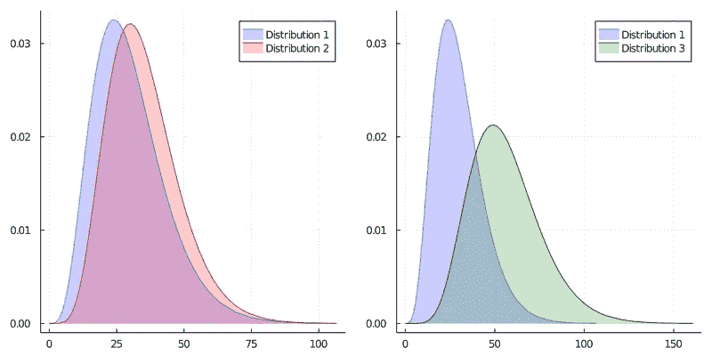
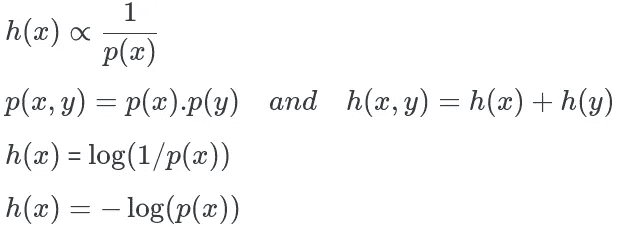
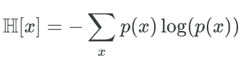
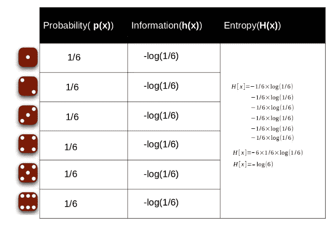
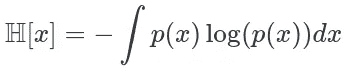
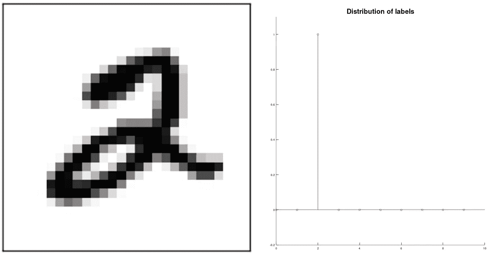
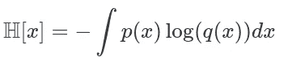
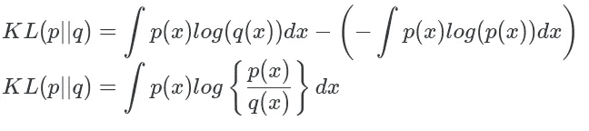

# 熵、信息和 KL 散度入门

> 原文：<https://medium.com/analytics-vidhya/a-primer-of-entropy-information-and-kl-divergence-42290791398f?source=collection_archive---------19----------------------->

直观地了解机器学习的三个重要的相关概念:信息、熵和 Kullback-Leibler 散度。

# 简介:如何测量分布？

在我们深入探讨什么是熵、信息和 KL 散度之前，我们必须首先理解这些术语的必要性以及它们解决了什么问题。

在我们的基础统计/数学课程中，我们遇到了许多不同的分布。其中一些是:高斯，伯努利，贝塔等。概率密度函数(p.d.f .)或概率质量函数(p.m.f .)因分布而异。我们说两种分布相等当且仅当。两者都具有完全相同的概率密度函数或概率平均函数。现在问题来了，如果两个概率分布不同，如何测量两者之间的差异？考虑下面的例子:

我们有 3 个发行版。我们可以定性地说，分布 2 比分布 3 更类似于分布 1。这只是一个定性的估计，我们仍然无法回答“一个分布与另一个分布有多相似/不同？”。我们在这里寻找的是一个数字量，它可以定义一个分布与另一个分布有多大的不同。

事实证明，有很多方法可以发现一个发行版与另一个发行版的不同之处。一些读者可能会想“衡量差异的最佳方式是什么”？事实证明，没有既定的“最佳”方法，最终都归结于它所应用的问题。在这篇文章中，我们探索了其中的一种方式:Kullback -Leiblier 分歧。在我们继续讨论这个听起来奇怪的术语是什么之前，我们需要理解两个基本术语:**熵**和**信息**。

# 分布的熵

早在香农将熵这个术语用于压缩之前，它就已经被用于物理科学了。物理系统中熵的定义如下:

> 熵是系统随机性的一种度量。系统越随机，系统的熵就越大。

与概率相似，分布的熵随着随机性的增加而增加。为了更好地理解它，让我们举一个例子:

有两种硬币:

硬币 1:正面概率= 0.9 的偏向硬币

硬币 2:无偏硬币(正面概率= 0.5)

投掷硬币 1 的结果比投掷硬币 2 的结果更容易预测。换一种说法:**抛硬币 2 的结果不如抛硬币 1 的结果随机。因为投掷硬币 2 给出更随机的结果，所以与投掷硬币 2 相关联的分布具有更大的熵。**

为了更好地理解熵，我们需要理解信息内容。

# **事件的信息内容**

信息可以被认为是事件的惊奇程度。如果我们被告知一个极不可能(更有趣)的事件刚刚发生，我们会比被告知某个非常可能的事件刚刚发生时收到更多的信息，而如果我们知道该事件肯定会发生，我们就不会收到任何信息。

事件的信息取决于事件的概率。如果事件发生的概率较大，即发生的几率较高，则传达的信息会较低。将信息与随机性联系起来似乎有点荒谬，因此让我们举一个简单的例子来帮助我们更好地理解:

有两个事件:

事件一:“太阳从东方升起。”

事件 2:“XYZ 公司的股票价值急剧上升。”

事件 1 是普遍真理。读者非常确定事件将会发生，告诉读者他已经预期/知道的事情是没有意义的。所以事件 1 据说具有非常低/零的信息。另一方面，事件 2 不是很可能发生的事件，它的发生可能会让一些人感到惊讶(尤其是那些预期价格会下跌的人)。所以这个事件有更高的信息含量。

***注:*** 信息是为一个事件定义的。熵是为分布定义的。

# 信息的熵

我们已经为分布中的特定事件定义了信息。由于信息是对事件随机性的一种度量，关于分布中所有事件的知识给了我们一个分布随机性的概念。因此，熵也可以定义为分布的预期信息内容。

**现在我们来看信息的数学表达:**

我们考虑一个离散变量 x，它可以取 n 个不同的值。

这些值的概率由 p(x)定义。

观察一个事件所提供的信息由 h(x)给出。

h()的形式可以通过注意到如果我们有两个不相关的事件 x 和 y，那么从观察这两个事件得到的信息增益应该是分别从它们中的每一个得到的信息之和，所以 h(x，y) = h(x) + h(y)。两个不相关的事件在统计上是独立的，所以 p(x，y) = p(x)p(y)。根据这两个关系，很容易证明 h(x)必须由 p(x)的对数给出

分布的熵可以写成:

我们以骰子为例，

掷骰子的熵

这个结果可以推广到连续分布:

p(x)的自熵

# 库尔贝克-莱布利尔散度

在机器学习中，我们会遇到许多问题，其中给定了具有特定目标分布的数据，我们必须训练模型，以使我们的模型接近给定数据的相似分布。

以下是来自 MNIST 数据集的示例，显示了数据和目标标签分布。

目标/实际分布的概率:p(x)和模拟分布的概率:q(x)。我们注意到，尽管预测的分布是 q(x ),但原始分布仍然是 p(x)。因此，q(x)相对于 p(x)的熵由下式给出:

这也称为 q(x)相对于 p(x)的相对熵。现在要找出相对熵和实际熵的区别:

这叫做 q(x)相对于 p(x)的 KL 散度。我们可以看到，这是一个量化术语，用来回答支持度相同的分布与支持度不同的分布有多大。

注意:Kullback-Leiblier 散度是不对称的，即一般情况下 **KL** (p(x)||q(x))不等于 **KL** (q(x)||p(x))。