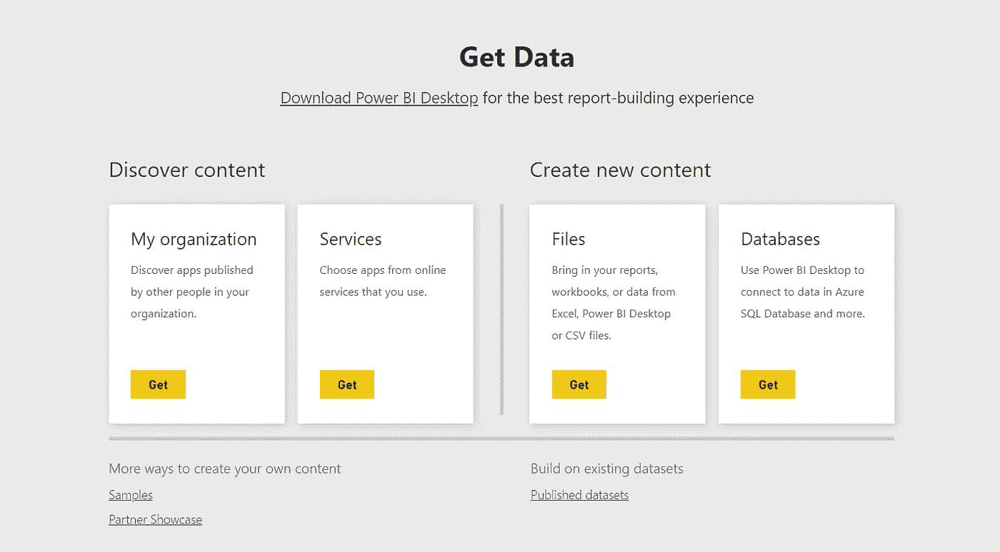
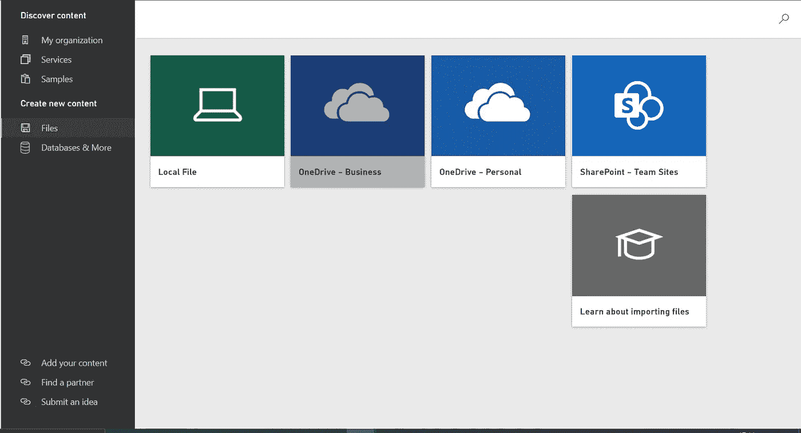

# 快速了解数据更新

> 原文：<https://medium.com/analytics-vidhya/a-quick-dive-into-data-refresh-ceefbabfae1f?source=collection_archive---------4----------------------->

## 第三部分

## Microsoft Power BI 学习系列

> 到目前为止，我们已经了解了 Power BI 以及如何使用它的数据源。在本文中，我们将了解 Power BI 中的**【可刷新】**和**【不可刷新】**数据源。如果你还没有查过之前博客的数据来源，你可以在这里看一下[。](https://hemshree.medium.com/power-bi-data-sources-cc1227443d7)

 [## Power BI 数据源

### Microsoft Power BI 学习系列

hemshree.medium.com](https://hemshree.medium.com/power-bi-data-sources-cc1227443d7) 

当我们单击“获取数据”按钮时，就会出现这种情况

在之前的博客中，我们已经了解了如何在 Power BI 中获取数据。现在，当我们单击**“获取数据”**按钮以连接到已存储在 CSV 文件中的一些数据时，您会注意到我们在这里有一些不同的选择，**本地文件、OneDrive 业务、OneDrive 个人、SharePoint 团队站点**和**了解有关导入文件的信息**。

通过文件创建新内容

**本地文件**与 **OneDrive** 和 **SharePoint** 选择的真正区别在于*刷新*。

*   **不可刷新的数据文件:**当我们从本地计算机上传文件时，我们上传了一个不可刷新的数据文件。这意味着 Power BI 无法访问我们的本地计算机并刷新 CSV 文件。这个东西在网络共享的情况下也是成立的。因此，如果我们连接到存储在网络共享中的本地数据源，它将不可刷新。

如果我们想要刷新此类文件，我们需要删除该文件，并再次开始'**获取数据**'过程，并上传可刷新的数据文件。

*   **可刷新的数据文件**:如果我们希望我们的文件自动刷新，我们需要将我们的数据推送到云存储中。我们有多种选择来创建可刷新文件，包括 **OneDrive for Business、OneDrive personal** 或 **SharePoint 库**。这些文件可以随时刷新，因此数据可以根据需要随时更新。

# 数据刷新的最佳实践

现在我们已经创建了一个可刷新的数据文件，我们需要注意一些要点，这将有助于我们确保我们的报告和仪表板使用刷新的数据。

*   数据刷新应该保持在限制范围内。如果数据量很大，考虑在 Power BI 中使用[聚合。](https://docs.microsoft.com/en-us/power-bi/transform-model/desktop-aggregations)
*   刷新应该安排在不太繁忙的时间，以使该过程简单快捷。
*   数据集应该以这样一种方式进行优化，即您只使用您的报告正在使用的那些表或列。
*   确保数据集刷新时间不超过最大刷新持续时间。为此，可以使用 Power BI Desktop。如果刷新数据需要 120 分钟以上，用户可以选择 Power BI Premium 进行有效的数据刷新。
*   最后，您必须确保通过电子邮件通知您刷新失败。

此外，您可以浏览一下[微软文档](https://docs.microsoft.com/en-us/power-bi/connect-data/refresh-data#best-practices)来了解更多关于 Power BI 中**数据刷新**的概念。

 [## Power BI 中的数据刷新- Power BI

### Power BI 使您能够快速从数据到洞察力再到行动，但您必须确保 Power BI 中的数据…

docs.microsoft.com](https://docs.microsoft.com/en-us/power-bi/connect-data/refresh-data#best-practices) 

希望这篇博客对你有所帮助。这并不是结束，我们将在下一篇文章中再次见面，直到您熟悉使用本文的数据源。

如果你有任何建议，欢迎[与我分享！](https://twitter.com/hemshree_madaan)

快乐学习到那时！