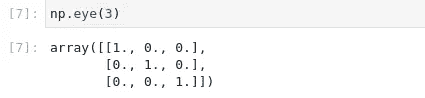
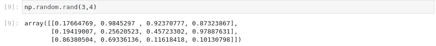

# NumPy 快速入门指南

> 原文：<https://medium.com/analytics-vidhya/a-quick-guide-to-getting-started-with-numpy-f63e319ba5c6?source=collection_archive---------17----------------------->


每当有人决定进入数据科学的世界，他需要学习的一个库就是 NumPy。NumPy 代表数字 Python，这篇文章就像是 NumPy 的速成班。

那么为什么是 Numpy 呢？

NumPy 类似于 python list，可以执行 python list 执行的大多数操作，但 NumPy 有自己的优势，是处理大型数值数据的首选库。其中一些是:

*   与 python 列表不同，NumPy 具有同质的数据类型，因此它可以被密集地打包到内存中，并且它还可以更快地释放内存。这使得它比 python 列表快 10 到 100 倍。
*   Numpy 将任务分解成更小的片段，并可以并行处理这些片段。
*   Numpy 内部使用 Fortran、C 和 C++等语言，与 python 相比，这些语言的执行时间要快得多。

**用一些代码弄脏我们的手**

```
import numpy as np
```

上面的代码行将导入 NumPy 并将其命名为 NP(NumPy 在数据科学社区中的标准别名)。

*   **np.array** :这个 numpy 方法创建一个 numpy 数组。我们可以传入 1 维，2 维或 N 维列表，它会将它转换为 numpy 数组。我们还可以传入数组元素的数据类型。下面的代码将创建一个二维数组，数据类型为 float32)

```
np.array([[1,2],[3,4]],dtype=np.float32)
```

*   这个方法将创建一个 1 的数组，你只需要传入数组的形状。在下面的代码块形状(3，4)表示矩阵的 3 行 4 列。如果在 np.ones 中传递一个整数，它将创建一个包含那么多元素的数组。


numpy 中的 np.ones 方法

*   **np.zeros** :类似于 np.ones，它会创建一个 0 的数组。

```
>>>np.zeros(4)
>>>array([0.,0.,0.])
```

*   **np.eye** :该方法创建一个 m*m 的单位矩阵(由于单位矩阵是对角元素为 1，其他元素为 0 的方阵)。我们只需要传入 m 的值。



m=3 的 np.eye 方法

*   **np.random.rand:** 该方法使用均匀分布生成随机元素。我们只需要传入数组的形状。



(3，4)形状的 NP . rand . rand 表示 3 行 4 列

*   **np.random.randn:** 这类似于 np.random.rand 元素，但是元素是从高斯或正态分布中选取的。


*   **np.random.randint** :该方法返回给定输出数组大小的从低(含)到高(不含)的随机整数。


*   **np.arange** :这个函数类似于 python 的 range 方法。您只需要传入起始值(包括)、结束值(不包括)和间隔值。


**重塑数字阵列**

顾名思义，整形意味着在新形状与旧形状兼容的情况下改变 numpy 数组的形状。例如:假设最初我的 numpy 数组的形状是(3，4)，这意味着它有 12 个元素(3*4)，现在允许的形状应该是它们有 12 的乘积，即允许的形状可以是(1，12)，(2，6)，(3，4)，(4，3)，(6，2)，(12，1)。


重塑 numpy 数组

**索引和选择**

numpy 中的索引和切片与 python 列表中的一样。Numpy 数组遵循 0 索引。


在上面的例子中，我们有一个形状为(2，3)的数组。现在，切片中的第一个参数用于行，第二个参数用于列。在我们的例子中，我们需要所有的行，这就是为什么我们有一个[:]表示所有的行，我们需要索引为 1 的列，直到结束，这就是为什么我们有一个[1:]组合这两个，我们有一个[:，1:]。

## 谨记在心

在 numpy 中切片是按维度应用的，即对于维度 1(行)我们有一个切片逻辑，对于维度 2(列)我们有不同的切片逻辑。同样，我们必须在 NumPy 中处理 N-d 数组的切片。

**绝招问题**

NumPy 对主数组元素的切片对象引用。因此，如果我们在切片数组中进行任何更改，都会反映在主数组中。


为了解决这个问题，我们可以使用 array.copy()方法对数组进行深度复制。

**NumPy 中的条件表达式**

假设您有一个包含正负元素的数组，并且您只想要数组中的正元素。NumPy 提供了一种优雅的方式来执行这些条件操作。参考下面的图片有更好的想法。


条件表达式

# **Numpy 操作**

NumPy 的一个很酷的地方是在数组上执行算术运算的便利性和它提供的数学函数。

## 算术运算

NumPy 中的所有算术运算都是按元素执行的。

```
>>>a = np.array([1,2,3])
>>>b = np.array([4,5,6])
>>>a+b
   array([5,7,9])
>>>a*b
   array([4,10,18])
>>>a/b
   array([0.25,0.4,0.5])
```

## 通用函数

这些是由 numpy 提供的函数，它们是基于元素逐个应用的。

```
>>>a = np.array([1,2,3])
>>>np.sqrt(a) 
    array([1\.        , 1.41421356, 1.73205081])
>>>np.sin(a)
   array([0.84147098, 0.90929743, 0.14112001])
>>>np.exp(a)
   array([ 2.71828183,  7.3890561 , 20.08553692])
```

以上方法只是冰山一角，你可以使用下面的链接参考所有这些方法:[https://numpy.org/doc/stable/reference/routines.math.html](https://numpy.org/doc/stable/reference/routines.math.html)

**给你的作业**

我们只是触及了 NumPy 库的表面。关于 numpy，您需要熟悉的一些主题是:

*   数字广播:[https://numpy.org/doc/stable/user/basics.broadcasting.html](https://numpy.org/doc/stable/user/basics.broadcasting.html)
*   NumPy 中的通用函数:[https://numpy.org/doc/stable/reference/ufuncs.html](https://numpy.org/doc/stable/reference/ufuncs.html)