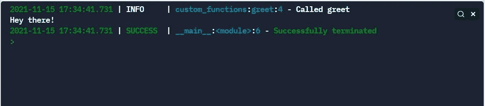
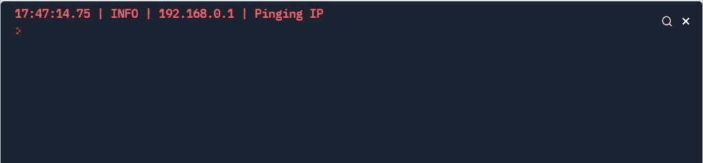
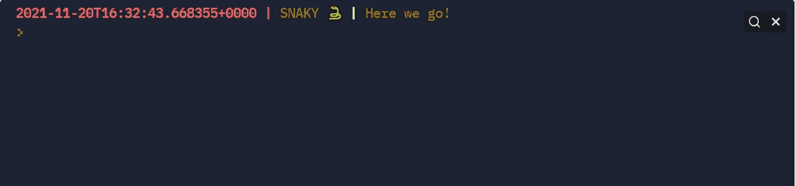

# 使用 Loguru 的快速指南

> 原文：<https://medium.com/analytics-vidhya/a-quick-guide-to-using-loguru-4042dc5437a5?source=collection_archive---------1----------------------->

是时候停止使用 *print("here")* 来调试我们的程序了。

由 [Max Duzij](https://unsplash.com/@max_duz?utm_source=medium&utm_medium=referral) 在 [Unsplash](https://unsplash.com?utm_source=medium&utm_medium=referral) 上拍摄的照片

日志记录在软件开发领域是必不可少的。它帮助程序员和系统管理员了解应用程序的状态，并在出现任何问题时帮助调试。想象一下，一觉醒来，发现你运行了一夜的程序崩溃了，却没有留下任何线索。

在这篇文章中，我想简单介绍一下 Loguru (——这是一个 Python 包，它以让日志记录变得更轻松、更有趣而自豪。

# 洛格鲁 101

让我们直接开始吧！这里有一个简单的例子。

你的第一个使用 Loguru 的程序

我们已经看到我们的日志程序返回了比我们预期的更多的信息。它返回了时间戳、日志级别、调用日志记录器的位置以及我们传递的日志消息。

# 自定义日志消息

## 1.自定义消息格式

上面的片段已经覆盖了 90%用户的需求。但是 Loguru 提供了更多的灵活性，其中之一是定制日志消息格式。

自定义日志消息格式

让我们逐一浏览每一行:

*   logger.remove(0):这一行删除默认的(0ᵗʰ)处理程序。这需要完成，否则我们会收到同一个日志语句的多个日志消息。传递 *None* 删除所有处理程序。
*   logger.add(…):这一行添加新的处理程序。唯一必需的参数是*接收器*，它是一个接收日志消息的对象。format 参数指定日志的自定义格式。我们可以利用关键字(例如*级别*、*时间*、*消息*)来提供更多上下文信息。将 *colorize* 设置为 true 允许使用标记标签给文本着色。着色不仅限于字体颜色，你也可以设置背景和文本样式。

## 2.添加额外信息

除了记录器提供的键，我们可以通过使用 *bind()* 方法添加额外的变量。看看下面的例子。

使用 bind()添加更多信息

像往常一样，我们导入必要的模块并删除默认的处理程序。接下来，我们创建新的处理程序，并通过添加时间(顺便提一下，[也可以格式化为](https://loguru.readthedocs.io/en/stable/api/logger.html#time))、严重性级别、我们的自定义变量和消息来格式化它。我们使用 *bind()* 方法来传递变量，并使用 *extra* 字典来解析变量。

# 写入日志文件

将日志消息重定向到文件非常简单，只需将默认接收器( *sys.stderr* )更改为日志文件的名称。

写入日志文件

处理器还可以配置其他逻辑，例如保持、旋转和压缩。下面是取自文档的另一个示例。

旋转、保持和压缩示例

# 记录和诊断异常

Loguru 允许调试 python 程序容易得多。这可以通过将*回溯*和*诊断*参数设置为*真*来实现。*回溯*显示所有被调用的函数，而*诊断*显示传递给该函数的参数值。以下是取自文档的修改示例。

使用 Loguru 诊断异常

这是生成的日志文件。

out.log 文件

如果您计划在生产环境中使用 Loguru，请小心使用这些设置，因为它们可能会泄漏信息。

# 额外信息

如果您阅读本文是为了快速了解如何使用 Loguru，那么上面所有的例子都足够了。如果您仍然有兴趣了解更多，这里有一些可能有帮助的特性。

1.所有上下文信息都存储在 [*记录*](https://loguru.readthedocs.io/en/stable/api/logger.html#record) 字典中。下面是一个使用*消逝*和*文件*键的例子。另外，请注意我们如何使用 *time* 键来命名日志文件。

其他可能有用的密钥

out.log 文件

2.logger 可以与 python 上下文管理器一起使用，并且可以帮助更容易地添加额外的上下文信息(否则使用 *bind()* 方法完成)。下面的代码片段展示了我们如何重写我们之前的例子，在这里我们使用了 *bind()* 。

通过上下文管理器使用 Loguru

3. *patch()* 方法可用于更新*记录*字典。对*记录["extra"]* 而不是*记录*应用修改总是更好，因为 Loguru 内部使用来自*记录*的值，修改它会导致意想不到的结果。

使用 patch()修改记录字典中的值

4.以下是格式化日志消息的各种其他方法:

格式化消息的各种方式

一个特殊的<level>(缩写为<lvl>)标记对应于日志消息的严重性颜色。</lvl></level>

5.根据您的场景，可以使用多个级别:跟踪、调试、信息、成功、警告、错误、严重。

洛格鲁级别

停下来。跟踪消息在哪里？这是因为默认情况下，记录器捕获的最低严重性是调试级别。为了包含跟踪级别，需要通过将*级别*设置为“跟踪”来修改处理程序。你甚至还可以添加自己的关卡。这里有一个稍加修改的例子，摘自 [Loguru PyPI 页面](https://pypi.org/project/loguru/)。

自定义蛇形关卡

6.最后，Loguru 允许使用 f 字符串格式化消息。

洛格鲁使用 f 弦

# 结论——关于简单性和用法的一句话

就像我写的关于 Colorama ( [无耻插件](/analytics-vidhya/colorama-a-hidden-convinience-6fb22dc00835))的文章一样，我还没有超过一周的使用 Loguru 的经验，我希望它有助于传达为什么 Loguru 是一个可以很容易拿起并且使用起来很有趣的包。

这篇文章并没有涵盖 Loguru 能够实现的所有功能，更不用说它与其他包的集成，如[通知程序](https://pypi.org/project/notifiers/)向您的 Gmail、Telegram 或 Slack 发送日志消息。

房间里还有另一只大象我想坦白——我还没有提到 Python 的内置日志模块。这是经过深思熟虑的，因为我假设你们中的许多人已经熟悉了默认的内置模块，我无法让自己再次复制所有的代码片段😅。我强烈建议你自己尝试感受一下不同之处。

> “我选择一个懒惰的人去做艰苦的工作。因为一个懒惰的人会找到一个简单的方法去做。”
> 
> —比尔·盖茨

尽管 loguru 模块可能看起来比默认的日志模块更方便，但是总有一些情况下使用默认模块是最好的。2021 年 12 月的 Log4j 漏洞突然引起了人们对软件安全，尤其是开源软件的关注。如果你不能完全确定使用 loguru 的优点是否超过了它潜在的缺点，那么最好坚持使用默认包。

日志记录是任何开发人员工作中绝对重要的一部分。它不仅是一个伪文档，也是一个救命稻草。在正确的时间返回正确的日志消息可能是快速修复代码和彻夜不眠找出问题所在的区别。尽管日志记录很重要，但重要的是要强调，经常遵循敏捷开发的开发人员不能花太多时间配置或设置日志记录程序，这就是为什么我觉得 Loguru 是使用的完美包。

我想写这篇文章，因为在媒体上或者一般的网上没有很多关于 Loguru 包的介绍性文章。我强烈建议你查看一下 PyPI 页面和 T2 文档，了解更多信息。