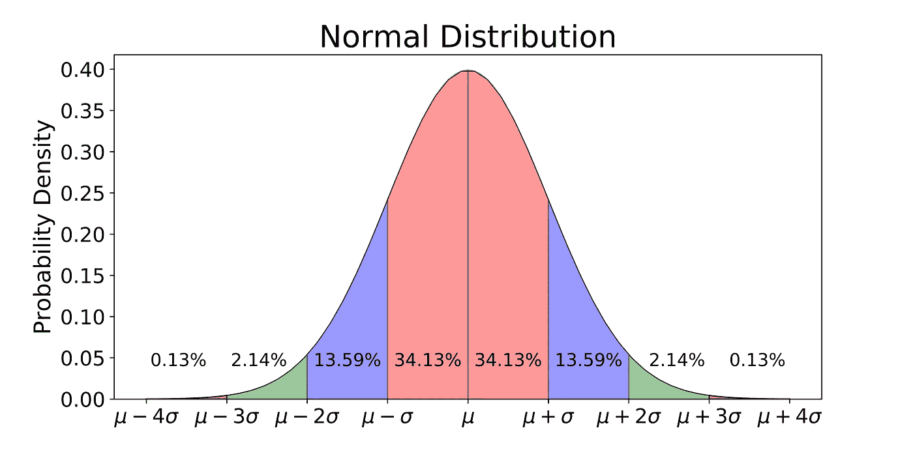

# 快速浏览概率分布

> 原文：<https://medium.com/analytics-vidhya/a-quick-look-into-probability-distributions-690591834c9c?source=collection_archive---------21----------------------->

概率分布缩略图

# 什么是概率分布？

**概率分布:**概率分布显示与离散或连续随机变量的每个值或值范围相关的概率列表。
根据随机变量的类型，概率分布可以分为**连续概率分布**和**离散概率分布**

正态分布(从走向数据科学)

# 不同类型的分布

一些流行的**连续分布**有:

*   常态
*   学生的 T
*   制服
*   卡方检验

一些流行的**离散分布**有:

*   二项式
*   伯努利
*   泊松

在这篇博文中，让我们简单地了解一下离散概率分布，看看它们在哪里被使用。

# 离散分布

**离散分布**是具有**离散**值的统计数据的**分布**。**离散**值是可数的、有限的非负整数。

## 二项分布

列表上的第一个是伯努利分布。这是最简单的离散分布
假设如果我们有一个只有一次试验的事件，这个试验有两种可能的结果(成功或失败)，我们可以说这个事件遵循伯努利分布
例如:掷硬币正面朝上遵循伯努利分布，有 50%的成功机会

二项分布

**X ~ Bern(p)** 表示 **X** 是遵循伯努利分布的随机变量， **P** 是成功的概率

例如，左边的图形表示一个随机变量，它遵循伯努利分布，P = 0.75

对于服从伯努利分布的随机变量，均值= P(成功的概率)，方差= p ( 1 — p)

## 二项分布

接下来是二项式分布，它可以被认为是伯努利分布的扩展
二项式分布用于获得在同一事件的 **n** 次试验中获得成功的概率。它可以被认为是重复多次的单个伯努利分布事件

在这里，我们知道事件成功的概率。我们试图计算事件在第 n 次**次**次**次**次】试验中成功的概率，或者重复 n 次的概率。例子:掷 5 次硬币得到 2 个正面的概率

对于服从二项式分布的随机变量，

> 其中，
> n —试验次数
> p —单次试验的成功概率
> r —计算概率的成功次数

*注意:不要担心这个公式是怎么冒出来的。这只不过是一个简单的推导，但是，不要担心，到目前为止。*

为了更好的理解，计算一下投掷 5 次无偏硬币得到 2 个正面的概率

上图中*的*拼错为 og。*

## 泊松分布

泊松分布可用于获得某一事件在特定时间间隔内发生次数的概率。
可以进行各种测试来找出给定的数据是否遵循泊松分布(*超出了本文的范围*)

泊松分布

对于泊松分布，

服从泊松分布的数据的均值和方差是相同的。

**举例:**
假设某个特定的赛车手通常每分钟可以跑完 4 英里。但是今天，他每分钟跑了 7 英里。假设数据遵循泊松分布，我们可以找出一名赛车手每分钟跑 7 英里的可能性有多大，因为他通常每分钟跑 4 英里

**重要提示**:只有在数据实际遵循毒物分布的情况下才能执行。找出数据是否遵循泊松分布是另一个问题。

# 结论

所以，这篇博文涵盖了一些常见的问题，比如什么是概率分布，以及一些常见的离散概率分布的简要解释。如有疑问，请评论。在下一篇文章中，我将尝试介绍常见的连续分布。

**谢谢！**