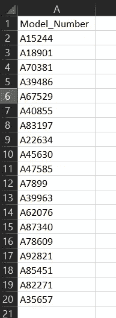
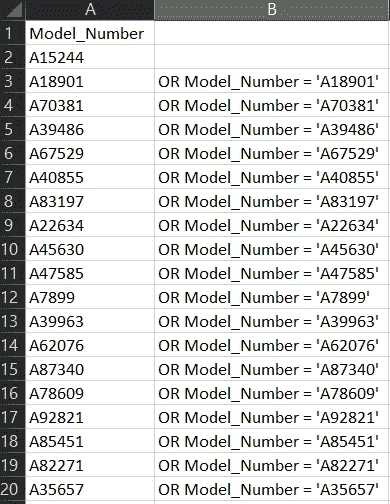

# 一种快速生成每个分析师都应该知道的长代码脚本的方法

> 原文：<https://medium.com/analytics-vidhya/a-quick-method-for-generating-long-code-scripts-that-every-analyst-should-know-15ea38c65e2a?source=collection_archive---------8----------------------->

马库斯·斯皮斯克在 [Unsplash](https://unsplash.com?utm_source=medium&utm_medium=referral) 上的照片

作为一名分析师(或类似人员)，我们都经历过。您的经理要求您为他们稍后参加的会议生成一份最新销售数据的报告。您已经在 SQL 数据库中设置了一个漂亮的表格，显示了按型号细分的最新数字，因此您需要做的就是这样的事情:

简单吧？

所以你给他们发邮件，告诉他们最后出现的号码，然后就什么都不想了。然后在会议开始前 10 分钟，你会收到一封感谢你的电子邮件，但实际上他们只想要“有限”型号的总销量，所需的型号在他们附上的 Excel 电子表格中。您在工作表中查找并找到一个 500 个模型的列表…将所有这些都放入一个 SQL 查询中需要很长时间的格式化！

那你是做什么的？如果幸运的话，可能有一些方法可以轻松地提取这些模型，例如，如果它们属于某一特定类型，并且该类型包含在您的销售表中。但是让我们假设这些型号是随机的，这样对我们没有帮助。

一个解决方案是使用类似 Notepad++的东西，你可以在里面创建一些小的宏来重复选择的动作。这可能很复杂，但是通过练习就足够简单了。或者在你的 IDE 中可能有允许你做这种事情的东西。然而，并不是每个人都可以访问这些，我确实在非常封闭的环境中工作过，在那里我不能下载任何种类的新软件。您也可以使用类似于[的动态 SQL](https://www.sqlservertutorial.net/sql-server-stored-procedures/sql-server-dynamic-sql/) 来生成代码，但是您只有非常有限的时间，并且不是所有的 SQL 版本都可以这样做。

但是每个人都可以使用类似电子表格软件的 Excel，那么为什么不使用它呢？假设这是我们收到的清单中的一小段:

所需型号列表的一个小样本

首先，我们需要手动创建第一个案例，因为它在 WHERE 子句中的语法略有不同:

所以现在我们需要为每个期望的模型准备一堆 OR 语句(注意，使用‘in’语句是更好的 SQL 实践，但是这种格式对于这里的演示来说更清楚)。为此，我们可以在 Excel 的单元格 B3 中使用以下语句:

=CONCAT("OR Model_Number = ' "，A3，"'")

这将在单元格中生成以下内容:

或者 Model_Number = 'A18901 '

它只是把几个字符串放在一起生成我们想要的代码，因为它是对有问题的单元格的动态引用，它会随着我们在列表中的下移而调整。

然后，我们可以将该公式向下拖动(使用单元格 B3 的右下角)到型号列表的末尾，这样我们就有了一整套可以使用的 SQL 语句:

生成 OR 语句

我们现在可以简单地将这些单元格复制并粘贴到我们的代码中，这样我们就有了完整的 WHERE 语句:

显然，这只是一个很小的例子，一点剪切粘贴可能会更有效，但对于较大的情况，这是非常有用的。对于更常规的报告，我不建议使用这种方法，应该使用更复杂和可控的方法。但是对于那些你需要一个快速和肮脏的解决方案的时刻，这是每一个分析师或数据科学家都应该准备好的技巧，显然这可以适用于任何语言和许多情况。这当然比花几个小时手动记录要好！