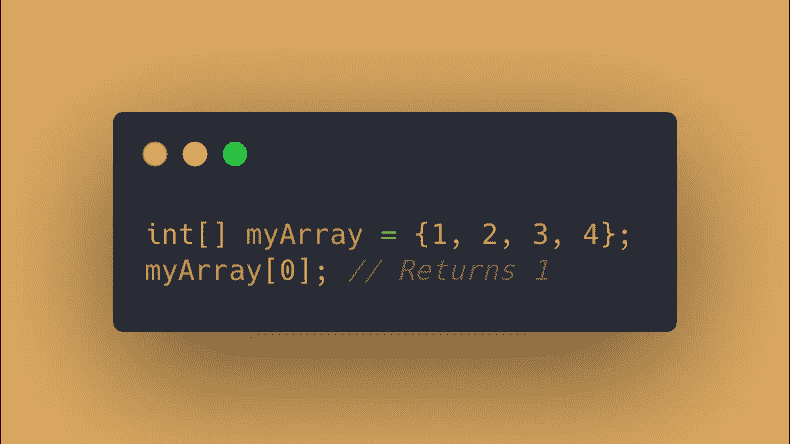
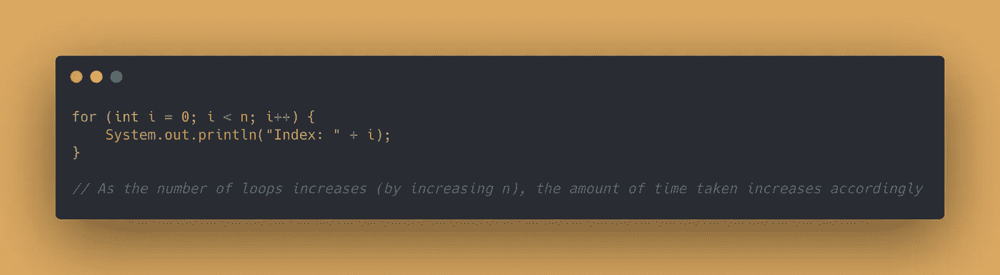
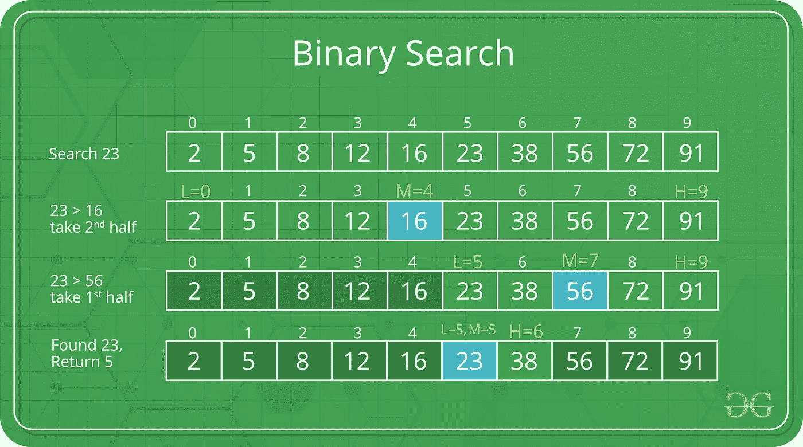
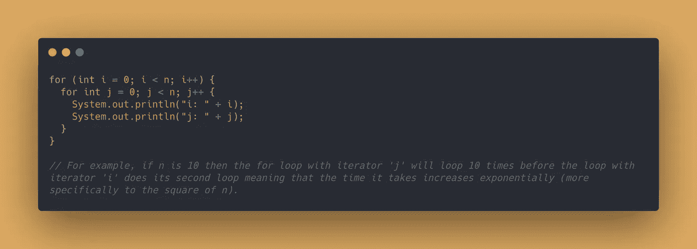
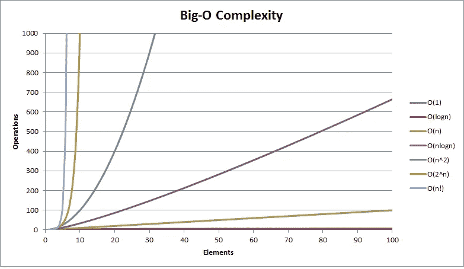

# 大 O 符号的快速概述

> 原文：<https://medium.com/analytics-vidhya/a-quick-overview-of-big-o-notation-6071874007db?source=collection_archive---------17----------------------->

# 介绍

如果你正在学习计算机科学或软件工程，那么毫无疑问，当讨论算法时，你很可能会听到大 O 符号。但是它是什么，为什么你需要知道它？大家讨论一下。

大 O 符号仅仅是一种算法时间复杂度的度量。换句话说，如果我们增加输入算法的数据，会如何影响计算速度？例如，如果我们有一个在**时间内处理*数据量的算法，我们想知道如果我们引入 ***2x*** 、 ***3x*** 、 ***x2*** 等，数据量会增加多少。数据量。这就是大 O 符号的用途，用来估计算法的计算速度相对于输入值的影响。重要的是要注意，大 O 不是用来计算一个计算要花多长时间的绝对值。它只与计算的相对速度有关。这篇文章旨在概述四个最常讨论的时间复杂性。***

# ***O(1) —常数***

******O(1)*** 的一个大 O 记号表示算法的时间复杂度是常数。换句话说，输入数据的大小对算法的速度没有影响。 ***O(1)*** 或恒定时间复杂度的一个例子是访问数组的一个元素。执行所需的时间不取决于输入数据的大小。***

******

# ***O(n) —线性***

******O(n)*** 的大 O 表示算法的时间复杂度是线性的。这意味着执行该算法所需的时间与输入数据成比例。作为一个粗略的例子，如果 n 的值是 3，并且需要 3 毫秒来执行，那么对于 n 的输入值为 5，我们可以预计计算将需要大约 5 毫秒。 ***O(n)*** 或线性时间复杂度的一个例子是一个简单的 for 循环。***

******

# ***O(log (n)) —对数***

***一个很大的 O 符号 ***O(log (n))*** 意味着算法的时间复杂度是对数的，这意味着时间复杂度与 n 的对数成正比。如果你需要重温一下什么是对数，[这里有一个链接，链接到几个讨论对数的可汗学院视频](https://www.khanacademy.org/math/algebra2/x2ec2f6f830c9fb89:logs/x2ec2f6f830c9fb89:log-prop/v/introduction-to-logarithm-properties)。具有对数时间复杂度的算法可以被认为是一种分而治之的方法，例如哈佛 CS50 课程中著名的[电话簿示例。 ***O(log (n))*** 或对数时间复杂度的一个例子将是二分搜索法。](https://www.youtube.com/watch?v=DSffdCT5Cx4)***

******

***来源:[https://www.geeksforgeeks.org/binary-search/](https://www.geeksforgeeks.org/binary-search/)***

# ***O(n^2) —二次***

******【o(n^2)***的大 o 符号表示算法的时间复杂度是二次的，这意味着时间复杂度与 n 的平方成比例。***【o(n^2】***或二次时间复杂度的一个例子是嵌套的 for 循环。如果有更多的嵌套循环*等等，这实际上可以更深入，这取决于嵌套循环的数量。****

********

****为了更好地理解这些时间复杂性，在图表上看到它们通常是有帮助的。下图展示了基于输入元素数量的各种时间复杂度的表现。这张图包含了本文中讨论的四个时间复杂度以及其他一些时间复杂度。****

********

****来源:[https://www . hackere earth . com/practice/notes/big-o-cheat sheet-series-data-structures-and-algorithms-with-thier-complexities-1/](https://www.hackerearth.com/practice/notes/big-o-cheatsheet-series-data-structures-and-algorithms-with-thier-complexities-1/)****

# ****概述****

****快速回顾四种最常见的时间复杂性:****

*   ****O(1)是恒定的时间复杂度****
*   ****O(n)是线性时间复杂度****
*   ****O(log (n))是对数时间复杂度****
*   ****O(n2)是二次时间复杂度****