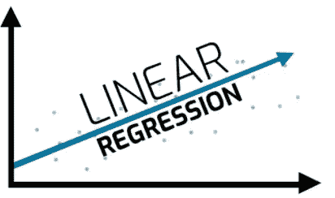
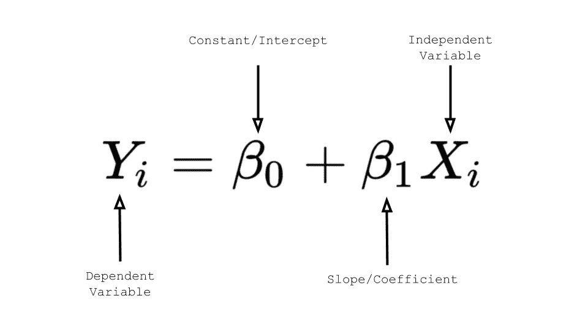
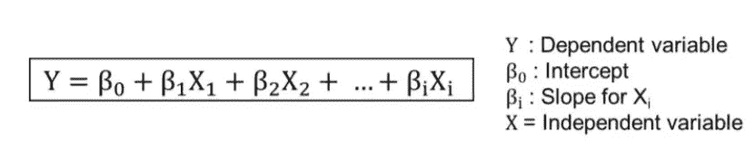

# 线性回归的快速总结。

> 原文：<https://medium.com/analytics-vidhya/a-quick-summary-of-linear-regression-42d1dab85e3e?source=collection_archive---------9----------------------->

监督学习算法综述

**线性回归**

1.  线性回归:最常用的回归方法之一。
2.  如果 X1，X2，X3…Xn 是独立变量，Y 是目标变量。给定 X，我们需要预测 Y
3.  线性回归方法是一种统计模型，它拟合 Y 与 X 的线性关系
4.  这种关系在 X 的系数中是线性的。
5.  在二维空间中，方程是一条直线。
6.  在三维空间中，这个方程是一个平面，在高维空间中，它被称为超平面。

如果一个预测变量(x) →简单线性回归

线性回归

如果多个预测变量(x1，x2，x3，…..xn) →多元线性回归

多元线性回归

**为什么是线性回归？**

*   基于回归的模型可以用作简单的基线模型，可以相对容易地构建。
*   与倾向于黑箱的其他更强大的模型相比，该模型的解释通常非常简单

# 最佳拟合线有多好？

可能有许多可能的线(由上面的等式定义)穿过给定的数据，

但是最佳拟合线是具有最小误差平方和的线。

*   每个数据点都有一个实际的 y 值，根据这个等式，我们可以预测目标ŷ.
*   实际值和预测值之间的差异就是误差。
*   减少所有数据点的 SSE(误差平方和)的线称为最佳拟合线。
*   这个过程称为普通最小二乘法(OLS 法)。

**成本函数**

**拟合优度的基本度量:**

*   相关系数(r)
*   决定系数(R 或 R)

# 线性回归的假设

线条

**线性度:**

*   每个预测值 xi 的响应均值 E(Yi)是 xi 的线性函数

**误差的独立性:**

*   误差εi 是独立的

**误差的正态性:**

*   每个预测值 xi 的误差εi 呈正态分布。

**同方差(恒定方差):**

*   在预测值 xi 的每个值处的误差εi 具有相等的方差(表示为σ),即误差项的方差对于所有的 x 值都是恒定的，并且不依赖于 xi。

**描述上述假设:**

误差 Ei 是独立的正态随机变量，均值为零，方差恒定，σ