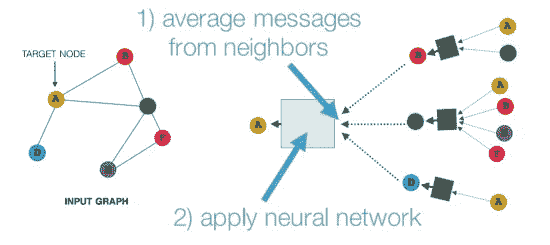
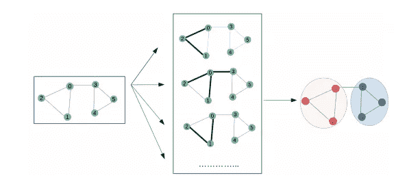
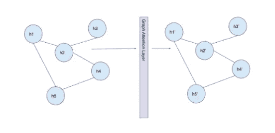
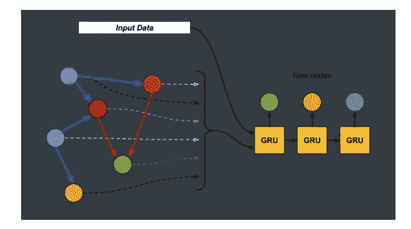

# 图形神经网络(GNN)综述

> 原文：<https://medium.com/analytics-vidhya/a-review-of-graph-neural-networks-gnn-560be37b8bca?source=collection_archive---------7----------------------->

在过去的几年里，图形神经网络已经成为科学和学术界的热门研究领域。由于图形利用的巨大能量，它们通过机器学习技术进行分析的潜力吸引了越来越多的关注。此外，GNN 是在图形域上操作的深度学习方法，其令人信服的分析性能支持社会科学、知识图和蛋白质-蛋白质相互作用网络等领域。总的来说，它们被认为是神经模型，通过一组对象(称为节点)和它们的关系(称为边)之间的消息传递来捕捉图的依赖性。

图形神经网络的图示

# **gnn 的类型**

尽管图形神经网络的基本方法是一种有效的分析方法，但它可能会对期望的研究领域造成限制。这个问题的解决方案是根据所需的图形或数据的类型，使用不同的 GNN 类型。此类 GNN 类型包括:

⦁图卷积网络

⦁图形注意网络

⦁门控图神经网络

下文对上述类型进行了分析。

# **图卷积网络**

它们被认为是另一种 GNN 类型卷积神经网络的有效替代品。在应用方面，他们堆叠了多层学习的一阶光谱滤波器，然后是非线性激活函数来学习图形表示。应该提到的另一个事实是这种网络的结构。它们由多层神经网络组成，构建方式可能会被误解为基本或常规线性图形网络的替代。

图形卷积神经网络示意图

这种网络的应用可以通过在图像分类上的应用来发现。CNN 将图像和图片检测为网格构造和结构。正在使用的软件搜索图像像素和需要构建的图的潜在节点之间的相似性。这样，图像分类问题就变成了图分类问题。

# 图形注意网络

它们用于检查可变大小的输入，同时关注输入中最相关的部分，以完成定义图形的任务。它们也用于计算单个序列的表示，这可以导致机器翻译任务的有效模型的构建。表示 GANs 的一个属性是它们应用于归纳学习问题的能力，包括模型必须推广到完全看不见的图的任务。

图形注意网络图解

已经研究的 GAN 应用的一个例子是基于图形的生成对抗网络，其通过更好地模拟场景中行人的社会交互来生成现实的多模态轨迹预测。开发的解决方案基于 GAN 和递归编码器-解码器架构，GAN 学习对场景中人类之间的社交互动进行编码的可靠特征表示，递归编码器-解码器架构经过对抗性训练，以基于特征预测人类的路径。

# 门控图神经网络

正如多伦多大学所描述的，GGNNs 被认为是固定步数的展开递归，而使用现代优化方法通过时间反向传播。这种模型具有有限的限制，同时可以有特定类型的数据作为问题解决方案的输入。因此，图网络的门控使整个传播成为一个更完整的系统结构。

门控图神经网络示意图

视觉推理是 GGNNs 正在利用的一个应用领域。一个例子是视觉问答问题，通过分别构造图像场景图和问题句法图。GGNN 在这类问题中的作用是对嵌入和注意机制进行编程，以便预测最终答案。

# 摘要

在当前的文章中，我向您介绍了图形神经网络概念背后的一般描述。然而，不同类型的问题或任务需要不同类型的模型和图形系统。为了更好地理解这个主题，给出了三个不同的图模型，每个模型都有一个简短的基本应用示例。

## 参考

[http://snap . Stanford . edu/proj/embeddings-www/files/nrl tutorial-part 2-gnns . pdf](http://snap.stanford.edu/proj/embeddings-www/files/nrltutorial-part2-gnns.pdf)